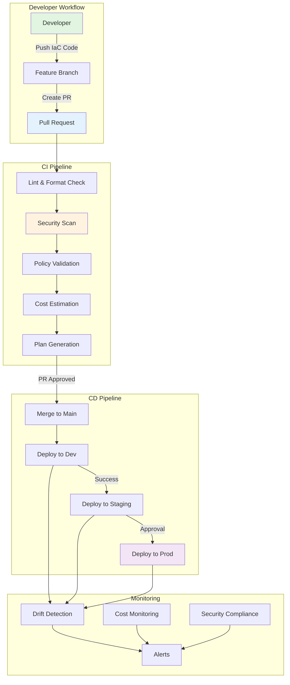

# Exercise 3: Complete GitOps Pipeline (⭐⭐⭐ Hard)

## 🎯 Exercise Overview

In this advanced exercise, you'll implement a complete GitOps pipeline that automatically deploys infrastructure changes through Git commits. You'll integrate Bicep and Terraform with GitHub Actions, implement policy validation, security scanning, and automated rollback capabilities.

**Duration**: 60-90 minutes  
**Difficulty**: ⭐⭐⭐ Hard  
**Success Rate**: 60%

## 🎓 Learning Objectives

By completing this exercise, you will:
- Implement a production-grade GitOps workflow
- Automate infrastructure deployment on Git commits
- Add policy validation and compliance checks
- Implement security scanning for IaC
- Create automated rollback mechanisms
- Monitor infrastructure drift

## 📋 Scenario

Your organization wants to adopt GitOps for all infrastructure management. Requirements:
- All infrastructure changes must go through pull requests
- Automated validation and security scanning
- Environment promotion (dev → staging → prod)
- Automatic rollback on failure
- Drift detection and alerting
- Cost estimation before deployment

## 🏗️ Architecture



## 🛠️ Prerequisites

Ensure you have:
- Completed Exercises 1 and 2
- GitHub repository with Actions enabled
- Azure Service Principal created
- Terraform and Bicep templates from previous exercises

## 📝 Part 1: Repository Structure

### Step 1: Set Up GitOps Repository Structure

Create a well-organized repository structure:

**💡 Copilot Prompt Suggestion:**
```bash
# Create a script that sets up a complete GitOps repository structure:
# - Separate directories for each environment
# - Shared modules directory
# - GitHub Actions workflows
# - Policy definitions
# - Documentation
# Include .gitignore and README files
```

**Expected Copilot Output:**
```bash
#!/bin/bash
# setup-gitops-repo.sh - Initialize GitOps repository structure

echo "🚀 Setting up GitOps repository structure..."

# Create directory structure
directories=(
    ".github/workflows"
    ".github/ISSUE_TEMPLATE"
    ".github/PULL_REQUEST_TEMPLATE"
    "infrastructure/modules/network"
    "infrastructure/modules/compute"
    "infrastructure/modules/data"
    "infrastructure/modules/monitoring"
    "infrastructure/environments/dev"
    "infrastructure/environments/staging"
    "infrastructure/environments/prod"
    "policies/azure"
    "policies/cost"
    "policies/security"
    "scripts/validation"
    "scripts/deployment"
    "docs/architecture"
    "docs/runbooks"
    "tests/unit"
    "tests/integration"
)

for dir in "${directories[@]}"; do
    mkdir -p "$dir"
    echo "📁 Created: $dir"
done

# Create .gitignore
cat > .gitignore << 'EOF'
# Terraform
*.tfstate
*.tfstate.*
*.tfplan
*.tfvars.local
.terraform/
.terraform.lock.hcl
crash.log
override.tf
override.tf.json
*_override.tf
*_override.tf.json

# Bicep
*.azrm.json

# Environment variables
.env
.env.local

# IDE
.vscode/
.idea/
*.swp
*.swo

# OS
.DS_Store
Thumbs.db

# Logs
*.log

# Temporary files
*.tmp
*.temp
EOF

# Create README
cat > README.md << 'EOF'
# Infrastructure as Code - GitOps Repository

This repository implements GitOps for infrastructure management using GitHub Actions, Terraform, and Azure Bicep.

## 🏗️ Repository Structure

```
.
├── .github/                    # GitHub Actions workflows and templates
├── infrastructure/
│   ├── modules/               # Reusable infrastructure modules
│   └── environments/          # Environment-specific configurations
├── policies/                  # Policy as Code definitions
├── scripts/                   # Automation scripts
├── docs/                      # Documentation
└── tests/                     # Infrastructure tests
```

## 🔄 GitOps Workflow

1. Create feature branch from `main`
2. Make infrastructure changes
3. Open pull request
4. Automated validation runs
5. Review and approve
6. Merge triggers deployment

## 🚀 Getting Started

See [docs/getting-started.md](docs/getting-started.md)

## 📋 Environment Promotion

`main` → Dev → Staging → Production

## 🔐 Security

All infrastructure changes are scanned for security issues before deployment.
EOF

# Create PR template
cat > .github/PULL_REQUEST_TEMPLATE/infrastructure.md << 'EOF'
## Description
Brief description of infrastructure changes

## Type of Change
- [ ] New infrastructure
- [ ] Update existing infrastructure
- [ ] Bug fix
- [ ] Configuration change
- [ ] Documentation update

## Testing
- [ ] Validated locally with `terraform plan`
- [ ] Security scan passed
- [ ] Cost estimation reviewed
- [ ] Policy validation passed

## Checklist
- [ ] Code follows style guidelines
- [ ] Self-review completed
- [ ] Documentation updated
- [ ] No secrets in code
- [ ] Tags added appropriately

## Deployment Plan
- [ ] Dev environment
- [ ] Staging environment (requires approval)
- [ ] Production environment (requires approval)

## Rollback Plan
Describe how to rollback these changes if needed
EOF

echo "✅ Repository structure created successfully!"
```

### Step 2: Create Policy Definitions

Set up policy-as-code for compliance:

**💡 Copilot Prompt Suggestion:**
```json
# Create OPA (Open Policy Agent) policies for:
# 1. Resource naming conventions
# 2. Required tags on all resources  
# 3. Allowed resource types
# 4. Cost limits per environment
# 5. Security requirements (HTTPS, encryption)
# Path: policies/azure/resource-policies.rego
```

**Expected Copilot Output:**
```rego
# policies/azure/resource-policies.rego
package azure.resources

import future.keywords.contains
import future.keywords.if
import future.keywords.in

# Required tags for all resources
required_tags := {
    "Environment",
    "ManagedBy",
    "CostCenter",
    "Owner",
    "Module"
}

# Allowed resource types by environment
allowed_resource_types := {
    "dev": [
        "Microsoft.Web/serverfarms",
        "Microsoft.Web/sites",
        "Microsoft.Storage/storageAccounts",
        "Microsoft.Sql/servers",
        "Microsoft.Sql/servers/databases",
        "Microsoft.KeyVault/vaults",
        "Microsoft.Insights/components",
        "Microsoft.Network/virtualNetworks",
        "Microsoft.Network/networkSecurityGroups"
    ],
    "staging": [
        "Microsoft.Web/serverfarms",
        "Microsoft.Web/sites",
        "Microsoft.Storage/storageAccounts",
        "Microsoft.Sql/servers",
        "Microsoft.Sql/servers/databases",
        "Microsoft.KeyVault/vaults",
        "Microsoft.Insights/components",
        "Microsoft.Network/virtualNetworks",
        "Microsoft.Network/networkSecurityGroups",
        "Microsoft.Cdn/profiles"
    ],
    "prod": [
        "Microsoft.Web/serverfarms",
        "Microsoft.Web/sites",
        "Microsoft.Storage/storageAccounts",
        "Microsoft.Sql/servers",
        "Microsoft.Sql/servers/databases",
        "Microsoft.KeyVault/vaults",
        "Microsoft.Insights/components",
        "Microsoft.Network/virtualNetworks",
        "Microsoft.Network/networkSecurityGroups",
        "Microsoft.Cdn/profiles",
        "Microsoft.Network/frontdoors",
        "Microsoft.Network/applicationGateways"
    ]
}

# Cost limits by environment (monthly USD)
cost_limits := {
    "dev": 500,
    "staging": 2000,
    "prod": 10000
}

# Validate resource naming convention
deny[msg] {
    resource := input.resource_changes[_]
    not regex.match("^[a-z0-9-]+$", resource.change.after.name)
    msg := sprintf("Resource '%s' name must contain only lowercase letters, numbers, and hyphens", [resource.address])
}

# Ensure all required tags are present
deny[msg] {
    resource := input.resource_changes[_]
    resource.change.actions[_] == "create"
    missing_tags := required_tags - {tag | tag := resource.change.after.tags[_]}
    count(missing_tags) > 0
    msg := sprintf("Resource '%s' missing required tags: %v", [resource.address, missing_tags])
}

# Validate resource types for environment
deny[msg] {
    resource := input.resource_changes[_]
    env := resource.change.after.tags.Environment
    allowed := allowed_resource_types[env]
    not resource.type in allowed
    msg := sprintf("Resource type '%s' not allowed in %s environment", [resource.type, env])
}

# Enforce HTTPS for web apps
deny[msg] {
    resource := input.resource_changes[_]
    resource.type == "azurerm_linux_web_app"
    resource.change.after.https_only != true
    msg := sprintf("Web app '%s' must have HTTPS only enabled", [resource.address])
}

# Enforce encryption for storage accounts
deny[msg] {
    resource := input.resource_changes[_]
    resource.type == "azurerm_storage_account"
    resource.change.after.min_tls_version != "TLS1_2"
    msg := sprintf("Storage account '%s' must use TLS 1.2 or higher", [resource.address])
}

# Validate estimated costs
deny[msg] {
    env := input.environment
    estimated_cost := to_number(input.cost_estimate)
    limit := cost_limits[env]
    estimated_cost > limit
    msg := sprintf("Estimated monthly cost $%.2f exceeds %s environment limit of $%.2f", [estimated_cost, env, limit])
}
```

## 📝 Part 2: GitHub Actions Workflows

### Step 3: Create Validation Workflow

Create a workflow that runs on pull requests:

**💡 Copilot Prompt Suggestion:**
```yaml
# Create a GitHub Actions workflow that:
# - Triggers on PR to main branch
# - Validates Terraform and Bicep syntax
# - Runs security scanning with Checkov
# - Validates against OPA policies
# - Estimates costs with Infracost
# - Posts results as PR comment
# Path: .github/workflows/validate-infrastructure.yml
```

**Expected Copilot Output:**
```yaml
# .github/workflows/validate-infrastructure.yml
name: Validate Infrastructure

on:
  pull_request:
    branches: [main]
    paths:
      - 'infrastructure/**'
      - 'policies/**'
      - '.github/workflows/validate-infrastructure.yml'

env:
  TERRAFORM_VERSION: '1.6.0'
  CHECKOV_VERSION: '3.0.0'
  OPA_VERSION: '0.58.0'
  
jobs:
  detect-changes:
    runs-on: ubuntu-latest
    outputs:
      environments: ${{ steps.detect.outputs.environments }}
      has-changes: ${{ steps.detect.outputs.has-changes }}
    steps:
      - uses: actions/checkout@v4
        with:
          fetch-depth: 0
      
      - name: Detect changed environments
        id: detect
        run: |
          CHANGED_FILES=$(git diff --name-only origin/main...HEAD)
          ENVIRONMENTS=()
          
          if echo "$CHANGED_FILES" | grep -q "infrastructure/environments/dev/"; then
            ENVIRONMENTS+=("dev")
          fi
          if echo "$CHANGED_FILES" | grep -q "infrastructure/environments/staging/"; then
            ENVIRONMENTS+=("staging")
          fi
          if echo "$CHANGED_FILES" | grep -q "infrastructure/environments/prod/"; then
            ENVIRONMENTS+=("prod")
          fi
          
          if [ ${#ENVIRONMENTS[@]} -eq 0 ]; then
            echo "has-changes=false" >> $GITHUB_OUTPUT
          else
            echo "has-changes=true" >> $GITHUB_OUTPUT
            echo "environments=$(printf '%s\n' "${ENVIRONMENTS[@]}" | jq -R . | jq -s .)" >> $GITHUB_OUTPUT
          fi

  validate-terraform:
    needs: detect-changes
    if: needs.detect-changes.outputs.has-changes == 'true'
    runs-on: ubuntu-latest
    strategy:
      matrix:
        environment: ${{ fromJson(needs.detect-changes.outputs.environments) }}
    steps:
      - uses: actions/checkout@v4
      
      - name: Setup Terraform
        uses: hashicorp/setup-terraform@v3
        with:
          terraform_version: ${{ env.TERRAFORM_VERSION }}
      
      - name: Terraform Format Check
        run: |
          terraform fmt -check -recursive infrastructure/
      
      - name: Terraform Init
        working-directory: infrastructure/environments/${{ matrix.environment }}
        run: |
          terraform init -backend=false
      
      - name: Terraform Validate
        working-directory: infrastructure/environments/${{ matrix.environment }}
        run: |
          terraform validate

  validate-bicep:
    needs: detect-changes
    if: needs.detect-changes.outputs.has-changes == 'true'
    runs-on: ubuntu-latest
    steps:
      - uses: actions/checkout@v4
      
      - name: Azure Login
        uses: azure/login@v1
        with:
          creds: ${{ secrets.AZURE_CREDENTIALS }}
      
      - name: Validate Bicep files
        run: |
          # Find all Bicep files
          find infrastructure/ -name "*.bicep" -type f | while read -r file; do
            echo "Validating: $file"
            az bicep build --file "$file"
          done

  security-scan:
    needs: detect-changes
    if: needs.detect-changes.outputs.has-changes == 'true'
    runs-on: ubuntu-latest
    steps:
      - uses: actions/checkout@v4
      
      - name: Run Checkov
        uses: bridgecrewio/checkov-action@v12
        with:
          directory: infrastructure/
          framework: terraform,bicep
          output_format: sarif
          output_file_path: reports/checkov.sarif
          skip_check: CKV_AZURE_88,CKV_AZURE_89  # Example skips
      
      - name: Upload SARIF file
        uses: github/codeql-action/upload-sarif@v3
        if: always()
        with:
          sarif_file: reports/checkov.sarif

  policy-validation:
    needs: [detect-changes, validate-terraform]
    if: needs.detect-changes.outputs.has-changes == 'true'
    runs-on: ubuntu-latest
    strategy:
      matrix:
        environment: ${{ fromJson(needs.detect-changes.outputs.environments) }}
    steps:
      - uses: actions/checkout@v4
      
      - name: Setup OPA
        run: |
          curl -L -o opa https://openpolicyagent.org/downloads/v${{ env.OPA_VERSION }}/opa_linux_amd64_static
          chmod +x opa
          sudo mv opa /usr/local/bin/
      
      - name: Azure Login
        uses: azure/login@v1
        with:
          creds: ${{ secrets.AZURE_CREDENTIALS }}
      
      - name: Setup Terraform
        uses: hashicorp/setup-terraform@v3
        with:
          terraform_version: ${{ env.TERRAFORM_VERSION }}
      
      - name: Generate Terraform Plan
        working-directory: infrastructure/environments/${{ matrix.environment }}
        run: |
          terraform init -backend=false
          terraform plan -out=tfplan.binary
          terraform show -json tfplan.binary > tfplan.json
      
      - name: Validate with OPA
        run: |
          opa eval -d policies/azure/ -i infrastructure/environments/${{ matrix.environment }}/tfplan.json \
            "data.azure.resources.deny[x]" --format pretty > policy-results.txt
          
          if [ -s policy-results.txt ]; then
            echo "❌ Policy violations found:"
            cat policy-results.txt
            exit 1
          else
            echo "✅ All policies passed"
          fi

  cost-estimation:
    needs: [detect-changes, validate-terraform]
    if: needs.detect-changes.outputs.has-changes == 'true'
    runs-on: ubuntu-latest
    strategy:
      matrix:
        environment: ${{ fromJson(needs.detect-changes.outputs.environments) }}
    steps:
      - uses: actions/checkout@v4
      
      - name: Setup Infracost
        uses: infracost/actions/setup@v2
        with:
          api-key: ${{ secrets.INFRACOST_API_KEY }}
      
      - name: Generate cost estimate
        working-directory: infrastructure/environments/${{ matrix.environment }}
        run: |
          infracost breakdown --path . \
            --format json \
            --out-file /tmp/infracost-${{ matrix.environment }}.json
      
      - name: Post cost estimate to PR
        uses: infracost/actions/comment@v1
        with:
          path: /tmp/infracost-${{ matrix.environment }}.json
          behavior: update

  summary:
    needs: [validate-terraform, validate-bicep, security-scan, policy-validation, cost-estimation]
    if: always()
    runs-on: ubuntu-latest
    steps:
      - name: Summary
        uses: actions/github-script@v7
        with:
          script: |
            const checks = [
              { name: 'Terraform Validation', status: '${{ needs.validate-terraform.result }}' },
              { name: 'Bicep Validation', status: '${{ needs.validate-bicep.result }}' },
              { name: 'Security Scan', status: '${{ needs.security-scan.result }}' },
              { name: 'Policy Validation', status: '${{ needs.policy-validation.result }}' },
              { name: 'Cost Estimation', status: '${{ needs.cost-estimation.result }}' }
            ];
            
            let comment = '## 📋 Infrastructure Validation Summary\n\n';
            comment += '| Check | Status |\n|-------|--------|\n';
            
            checks.forEach(check => {
              const emoji = check.status === 'success' ? '✅' : '❌';
              comment += `| ${check.name} | ${emoji} ${check.status} |\n`;
            });
            
            github.rest.issues.createComment({
              issue_number: context.issue.number,
              owner: context.repo.owner,
              repo: context.repo.repo,
              body: comment
            });
```

## ✅ Checkpoint

You've completed Part 1! You should now have:
- [ ] GitOps repository structure created
- [ ] Policy definitions for compliance
- [ ] Validation workflow configured
- [ ] Security scanning integrated

## ⏭️ Next Steps

Continue to [Part 2: Module Implementation & Deployment](./part2.md) to build the complete enterprise infrastructure.