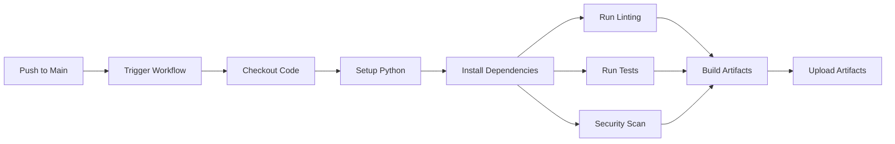

# Exercise 1: Build Your First Pipeline (⭐)

**Duration:** 30-45 minutes  
**Difficulty:** Easy  
**Success Rate:** 95%

## 🎯 Learning Objectives

In this exercise, you will:
- Create your first GitHub Actions workflow
- Use GitHub Copilot to generate workflow configurations
- Implement basic CI steps (build, test, lint)
- Add status badges to your repository
- Understand workflow triggers and job dependencies

## 📋 Scenario

You're joining a development team that currently deploys manually. Your task is to create the team's first automated CI pipeline for a Python web application. The pipeline should run tests, check code quality, and prepare the application for deployment.

## 🏗️ Architecture Overview



## 📝 Part 1: Project Setup and Basic Workflow

### Step 1: Initialize Your Project

First, let's create a new repository and set up the basic project structure:

```bash
# Create a new directory
mkdir cicd-workshop && cd cicd-workshop

# Initialize git repository
git init

# Create project structure
mkdir -p .github/workflows src tests
touch src/__init__.py src/app.py tests/test_app.py
touch requirements.txt requirements-dev.txt
touch README.md .gitignore
```

### Step 2: Create the Application Code

Let's create a simple Flask application. Use GitHub Copilot to help generate the code:

**src/app.py:**

**Copilot Prompt Suggestion:**
```python
# Create a Flask application with:
# - Health check endpoint at /health
# - Welcome endpoint at /
# - API endpoint at /api/data that returns JSON
# - Proper error handling
# - Port configuration from environment variable
# Include logging and type hints
```

**Expected Output:**
```python
import os
import logging
from typing import Dict, Any
from flask import Flask, jsonify

# Configure logging
logging.basicConfig(level=logging.INFO)
logger = logging.getLogger(__name__)

app = Flask(__name__)

@app.route('/health')
def health_check() -> Dict[str, str]:
    """Health check endpoint."""
    logger.info("Health check requested")
    return jsonify({"status": "healthy", "service": "cicd-demo"})

@app.route('/')
def welcome() -> str:
    """Welcome endpoint."""
    return "Welcome to CI/CD Workshop!"

@app.route('/api/data')
def get_data() -> Dict[str, Any]:
    """API endpoint returning sample data."""
    data = {
        "message": "Hello from CI/CD Pipeline!",
        "version": "1.0.0",
        "timestamp": "2024-01-20T10:00:00Z"
    }
    logger.info(f"API data requested: {data}")
    return jsonify(data)

@app.errorhandler(404)
def not_found(error) -> tuple[Dict[str, str], int]:
    """Handle 404 errors."""
    return jsonify({"error": "Not found"}), 404

@app.errorhandler(500)
def internal_error(error) -> tuple[Dict[str, str], int]:
    """Handle 500 errors."""
    logger.error(f"Internal error: {error}")
    return jsonify({"error": "Internal server error"}), 500

if __name__ == '__main__':
    port = int(os.environ.get('PORT', 5000))
    logger.info(f"Starting application on port {port}")
    app.run(host='0.0.0.0', port=port, debug=False)
```

### Step 3: Create Tests

Now let's create tests for our application:

**tests/test_app.py:**

**Copilot Prompt Suggestion:**
```python
# Create comprehensive tests for the Flask app including:
# - Test all endpoints (/, /health, /api/data)
# - Test error handling (404, 500)
# - Use pytest fixtures
# - Include assertions for status codes and response content
# - Add docstrings for each test
```

**Expected Output:**
```python
import pytest
import json
from src.app import app

@pytest.fixture
def client():
    """Create a test client for the Flask app."""
    app.config['TESTING'] = True
    with app.test_client() as client:
        yield client

def test_welcome_endpoint(client):
    """Test the welcome endpoint returns correct message."""
    response = client.get('/')
    assert response.status_code == 200
    assert b'Welcome to CI/CD Workshop!' in response.data

def test_health_check(client):
    """Test the health check endpoint returns healthy status."""
    response = client.get('/health')
    assert response.status_code == 200
    data = json.loads(response.data)
    assert data['status'] == 'healthy'
    assert data['service'] == 'cicd-demo'

def test_api_data_endpoint(client):
    """Test the API data endpoint returns correct JSON."""
    response = client.get('/api/data')
    assert response.status_code == 200
    data = json.loads(response.data)
    assert 'message' in data
    assert 'version' in data
    assert data['version'] == '1.0.0'

def test_404_error(client):
    """Test that 404 errors are handled correctly."""
    response = client.get('/nonexistent')
    assert response.status_code == 404
    data = json.loads(response.data)
    assert data['error'] == 'Not found'

def test_content_type(client):
    """Test that JSON endpoints return correct content type."""
    response = client.get('/api/data')
    assert response.content_type == 'application/json'
```

### Step 4: Create Requirements Files

**requirements.txt:**
```
Flask==3.0.0
gunicorn==21.2.0
```

**requirements-dev.txt:**
```
-r requirements.txt
pytest==7.4.3
pytest-cov==4.1.0
flake8==6.1.0
black==23.11.0
mypy==1.7.1
bandit==1.7.5
```

### Step 5: Create Your First GitHub Actions Workflow

Now, let's create the CI workflow. This is where GitHub Copilot really shines!

**.github/workflows/ci.yml:**

**Copilot Prompt Suggestion:**
```yaml
# Create a GitHub Actions workflow that:
# - Triggers on push to main and pull requests
# - Runs on Ubuntu latest
# - Sets up Python 3.11
# - Caches pip dependencies
# - Installs dependencies from requirements-dev.txt
# - Runs flake8 for linting with max-line-length 88
# - Runs black in check mode
# - Runs pytest with coverage report
# - Runs bandit for security scanning
# - Uploads coverage reports as artifacts
# - Adds job summaries
# Use clear job names and include all best practices
```

**Expected Output:**
```yaml
name: CI Pipeline

on:
  push:
    branches: [ main ]
  pull_request:
    branches: [ main ]

env:
  PYTHON_VERSION: '3.11'

jobs:
  lint:
    name: Code Quality Checks
    runs-on: ubuntu-latest
    
    steps:
    - name: Checkout code
      uses: actions/checkout@v4
    
    - name: Set up Python
      uses: actions/setup-python@v4
      with:
        python-version: ${{ env.PYTHON_VERSION }}
    
    - name: Cache pip packages
      uses: actions/cache@v3
      with:
        path: ~/.cache/pip
        key: ${{ runner.os }}-pip-${{ hashFiles('requirements-dev.txt') }}
        restore-keys: |
          ${{ runner.os }}-pip-
    
    - name: Install dependencies
      run: |
        python -m pip install --upgrade pip
        pip install -r requirements-dev.txt
    
    - name: Run flake8
      run: |
        flake8 src tests --max-line-length=88 --exclude=__pycache__
        echo "✅ Linting passed!" >> $GITHUB_STEP_SUMMARY
    
    - name: Check formatting with black
      run: |
        black --check src tests
        echo "✅ Code formatting check passed!" >> $GITHUB_STEP_SUMMARY
    
    - name: Type checking with mypy
      run: |
        mypy src --ignore-missing-imports
        echo "✅ Type checking passed!" >> $GITHUB_STEP_SUMMARY

  test:
    name: Run Tests
    runs-on: ubuntu-latest
    needs: lint
    
    steps:
    - name: Checkout code
      uses: actions/checkout@v4
    
    - name: Set up Python
      uses: actions/setup-python@v4
      with:
        python-version: ${{ env.PYTHON_VERSION }}
    
    - name: Cache pip packages
      uses: actions/cache@v3
      with:
        path: ~/.cache/pip
        key: ${{ runner.os }}-pip-${{ hashFiles('requirements-dev.txt') }}
        restore-keys: |
          ${{ runner.os }}-pip-
    
    - name: Install dependencies
      run: |
        python -m pip install --upgrade pip
        pip install -r requirements-dev.txt
    
    - name: Run tests with coverage
      run: |
        pytest tests/ -v --cov=src --cov-report=xml --cov-report=html --cov-report=term
    
    - name: Upload coverage reports
      uses: actions/upload-artifact@v3
      with:
        name: coverage-report
        path: htmlcov/
    
    - name: Generate test summary
      if: always()
      run: |
        echo "## Test Results 🧪" >> $GITHUB_STEP_SUMMARY
        echo "Coverage report has been uploaded as an artifact." >> $GITHUB_STEP_SUMMARY

  security:
    name: Security Scanning
    runs-on: ubuntu-latest
    needs: lint
    
    steps:
    - name: Checkout code
      uses: actions/checkout@v4
    
    - name: Set up Python
      uses: actions/setup-python@v4
      with:
        python-version: ${{ env.PYTHON_VERSION }}
    
    - name: Install bandit
      run: |
        python -m pip install --upgrade pip
        pip install bandit
    
    - name: Run security scan
      run: |
        bandit -r src/ -f json -o bandit-report.json || true
        echo "## Security Scan Results 🔒" >> $GITHUB_STEP_SUMMARY
        echo "Security scan completed. Check the logs for details." >> $GITHUB_STEP_SUMMARY
    
    - name: Upload security report
      uses: actions/upload-artifact@v3
      if: always()
      with:
        name: security-report
        path: bandit-report.json

  build:
    name: Build Application
    runs-on: ubuntu-latest
    needs: [test, security]
    
    steps:
    - name: Checkout code
      uses: actions/checkout@v4
    
    - name: Set up Python
      uses: actions/setup-python@v4
      with:
        python-version: ${{ env.PYTHON_VERSION }}
    
    - name: Install dependencies
      run: |
        python -m pip install --upgrade pip
        pip install -r requirements.txt
    
    - name: Create deployment package
      run: |
        mkdir -p dist
        cp -r src dist/
        cp requirements.txt dist/
        tar -czf app-${{ github.sha }}.tar.gz dist/
    
    - name: Upload build artifacts
      uses: actions/upload-artifact@v3
      with:
        name: app-package
        path: app-${{ github.sha }}.tar.gz
        retention-days: 7
    
    - name: Build summary
      run: |
        echo "## Build Complete! 🚀" >> $GITHUB_STEP_SUMMARY
        echo "- **Commit:** ${{ github.sha }}" >> $GITHUB_STEP_SUMMARY
        echo "- **Branch:** ${{ github.ref_name }}" >> $GITHUB_STEP_SUMMARY
        echo "- **Actor:** ${{ github.actor }}" >> $GITHUB_STEP_SUMMARY
```

**Continue to Part 2 for workflow customization and advanced features...**