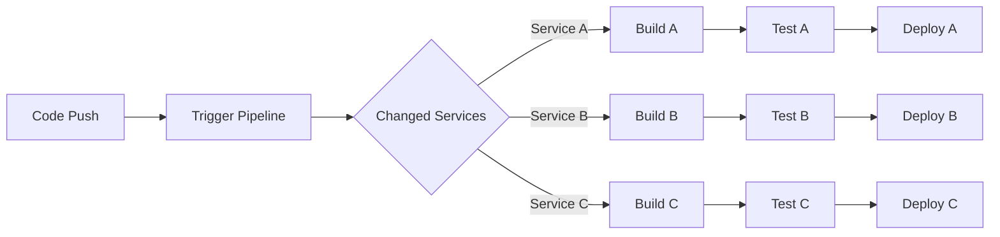
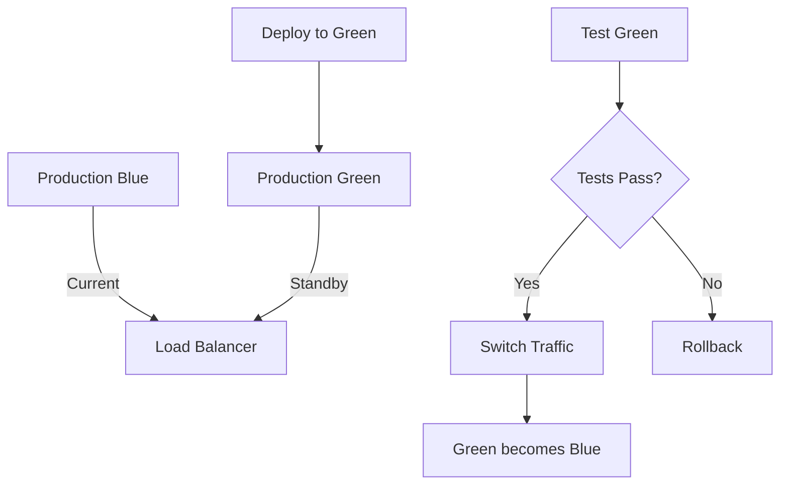

# Module 14: Additional Resources

## 📚 Learning Resources

### Official Documentation
- [GitHub Actions Documentation](https://docs.github.com/actions)
- [GitHub Actions Marketplace](https://github.com/marketplace/actions)
- [Azure DevOps Documentation](https://docs.microsoft.com/azure/devops)
- [GitHub Actions Best Practices](https://docs.github.com/actions/guides/best-practices)

### Video Tutorials
- [GitHub Actions Tutorial Series](https://www.youtube.com/playlist?list=PLArH6NjfKsUhvGHrpag7SuPumMzQRhUKY)
- [CI/CD with GitHub Actions](https://www.youtube.com/watch?v=R8_veQiYBjI)
- [Azure DevOps Pipeline Tutorial](https://www.youtube.com/watch?v=NuYDAs3kNV8)

### Interactive Learning
- [GitHub Skills: GitHub Actions](https://skills.github.com/#automate-workflows-with-github-actions)
- [Microsoft Learn: GitHub Actions](https://learn.microsoft.com/training/modules/github-actions-automate-tasks/)
- [GitHub Actions Hero Game](https://github-actions-hero.vercel.app/)

## 🛠️ Useful Tools

### Local Development
```bash
# act - Run GitHub Actions locally
brew install act  # macOS
choco install act-cli  # Windows

# actionlint - Lint workflow files
go install github.com/rhysd/actionlint/cmd/actionlint@latest

# yamllint - YAML linter
pip install yamllint
```

### VS Code Extensions
- **GitHub Actions** - Official GitHub Actions extension
- **YAML** - Red Hat YAML language support
- **GitHub Copilot** - AI pair programming
- **GitLens** - Git supercharged
- **Azure Tools** - Azure development extensions

### Online Tools
- [GitHub Actions Workflow Visualizer](https://github.com/ZacSweers/github-actions-workflow-visualizer)
- [Crontab Guru](https://crontab.guru/) - Cron schedule expressions
- [Workflow Syntax Generator](https://www.actionsflow.com/workflow-syntax-generator/)

## 📖 Reference Guides

### Common Workflow Patterns

#### 1. Conditional Execution
```yaml
- name: Run only on main branch
  if: github.ref == 'refs/heads/main'
  run: echo "This runs only on main"

- name: Run on specific file changes
  if: contains(github.event.head_commit.modified, 'src/')
  run: echo "Source files changed"
```

#### 2. Matrix Testing
```yaml
strategy:
  matrix:
    os: [ubuntu-latest, windows-latest, macos-latest]
    python: [3.8, 3.9, 3.10, 3.11]
    exclude:
      - os: macos-latest
        python: 3.8
```

#### 3. Reusable Workflows
```yaml
# .github/workflows/reusable.yml
on:
  workflow_call:
    inputs:
      environment:
        required: true
        type: string

# Calling workflow
jobs:
  deploy:
    uses: ./.github/workflows/reusable.yml
    with:
      environment: production
```

#### 4. Caching Strategies
```yaml
# Python dependencies
- uses: actions/cache@v3
  with:
    path: ~/.cache/pip
    key: ${{ runner.os }}-pip-${{ hashFiles('**/requirements.txt') }}

# Node.js dependencies  
- uses: actions/cache@v3
  with:
    path: ~/.npm
    key: ${{ runner.os }}-node-${{ hashFiles('**/package-lock.json') }}

# Docker layers
- uses: docker/build-push-action@v5
  with:
    cache-from: type=gha
    cache-to: type=gha,mode=max
```

## 🎯 Practice Scenarios

### Scenario 1: Emergency Hotfix Pipeline
Create a workflow that:
- Triggers on hotfix branches
- Skips non-critical tests
- Deploys directly to production
- Notifies team via Slack

### Scenario 2: Scheduled Maintenance
Build a workflow that:
- Runs weekly at 2 AM
- Performs database cleanup
- Updates dependencies
- Creates maintenance report

### Scenario 3: Multi-Region Deployment
Design a pipeline that:
- Deploys to 3 regions sequentially
- Runs region-specific tests
- Implements gradual rollout
- Monitors each region

## 💡 Tips & Tricks

### Performance Optimization
```yaml
# Run jobs in parallel when possible
jobs:
  test:
    strategy:
      matrix:
        test-suite: [unit, integration, e2e]

# Use fail-fast to stop on first failure
strategy:
  fail-fast: true

# Limit concurrent workflows
concurrency:
  group: ${{ github.workflow }}-${{ github.ref }}
  cancel-in-progress: true
```

### Security Best Practices
```yaml
# Use environment secrets
env:
  API_KEY: ${{ secrets.API_KEY }}

# Limit permissions
permissions:
  contents: read
  issues: write

# Pin action versions
- uses: actions/checkout@8e5e7e5ab8b370d6c329ec480221332ada57f0ab # v3.5.2
```

### Debugging Techniques
```yaml
# Enable debug logging
- name: Enable debug
  run: |
    echo "::debug::Debug mode enabled"
    echo "ACTIONS_STEP_DEBUG=true" >> $GITHUB_ENV

# Print context information
- name: Dump contexts
  env:
    GITHUB_CONTEXT: ${{ toJson(github) }}
  run: echo "$GITHUB_CONTEXT"

# Interactive debugging
- name: Setup tmate session
  if: ${{ failure() }}
  uses: mxschmitt/action-tmate@v3
```

## 🏗️ Architecture Examples

### Microservices CI/CD


### Blue-Green Deployment


## 🔗 Community Resources

### GitHub Discussions
- [GitHub Community Forum](https://github.community/c/actions)
- [Stack Overflow - GitHub Actions](https://stackoverflow.com/questions/tagged/github-actions)

### Blogs & Articles
- [GitHub Blog - Actions Category](https://github.blog/category/actions/)
- [Dev.to - GitHub Actions](https://dev.to/t/githubactions)
- [Medium - GitHub Actions](https://medium.com/tag/github-actions)

### Sample Repositories
- [actions/starter-workflows](https://github.com/actions/starter-workflows)
- [sdras/awesome-actions](https://github.com/sdras/awesome-actions)
- [GitHubActions/example-workflows](https://github.com/GitHubActions/example-workflows)

## 📊 Metrics & Monitoring

### Key Metrics to Track
- Build duration
- Success rate
- Deployment frequency
- Mean time to recovery
- Test coverage trends
- Cost per deployment

### Monitoring Tools
- GitHub Insights
- Azure Monitor
- Datadog CI Visibility
- New Relic
- Grafana

### Sample Dashboard Query
```sql
-- Average build time by workflow
SELECT 
  workflow_name,
  AVG(duration_seconds) as avg_duration,
  COUNT(*) as total_runs,
  SUM(CASE WHEN status = 'completed' THEN 1 ELSE 0 END) as successful_runs
FROM workflow_runs
WHERE created_at > NOW() - INTERVAL '7 days'
GROUP BY workflow_name
ORDER BY avg_duration DESC;
```

## 🎓 Certification Preparation

### GitHub Actions Certification Topics
1. Workflow syntax and structure
2. Actions marketplace
3. Security and secrets management
4. Self-hosted runners
5. Enterprise features
6. API integration

### Practice Questions
1. How do you share data between jobs?
2. What's the difference between `needs` and `if`?
3. How do you implement a manual approval gate?
4. What are the limitations of GitHub-hosted runners?
5. How do you optimize workflow performance?

## 🚀 Advanced Topics

### Custom Actions Development
```typescript
// action.ts
import * as core from '@actions/core';
import * as github from '@actions/github';

async function run() {
  try {
    const token = core.getInput('github-token');
    const octokit = github.getOctokit(token);
    
    // Your action logic here
    
    core.setOutput('result', 'success');
  } catch (error) {
    core.setFailed(error.message);
  }
}

run();
```

### Self-Hosted Runners
```bash
# Configure runner
./config.sh --url https://github.com/ORG/REPO --token TOKEN

# Run as service
sudo ./svc.sh install
sudo ./svc.sh start
```

### API Integration
```python
import requests

# Trigger workflow via API
url = f"https://api.github.com/repos/{owner}/{repo}/actions/workflows/{workflow_id}/dispatches"
headers = {
    "Authorization": f"token {token}",
    "Accept": "application/vnd.github.v3+json"
}
data = {
    "ref": "main",
    "inputs": {
        "environment": "production"
    }
}
response = requests.post(url, headers=headers, json=data)
```

---

Remember: The best way to learn CI/CD is by doing. Start with simple pipelines and gradually add complexity as you become more comfortable with the concepts.