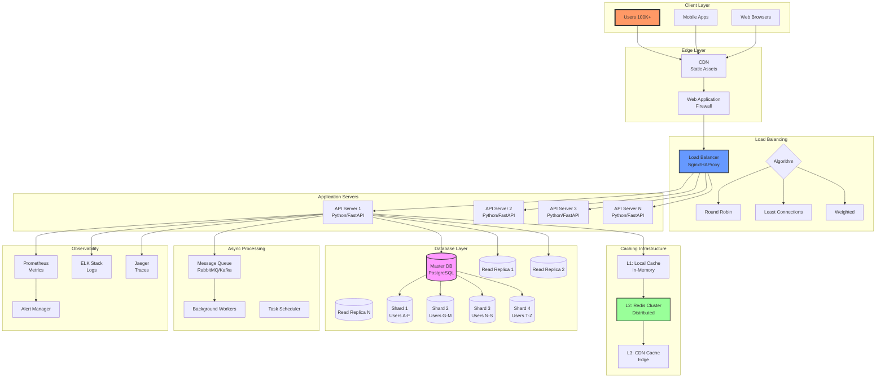
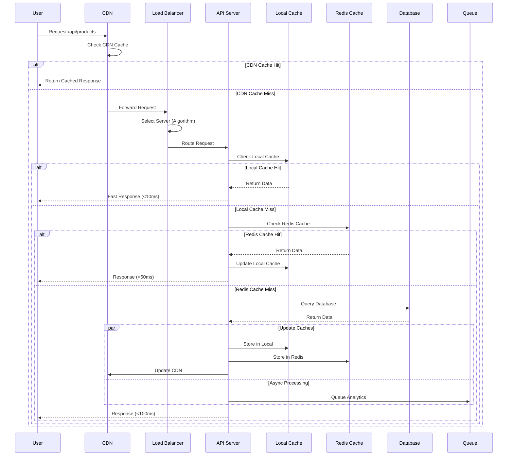
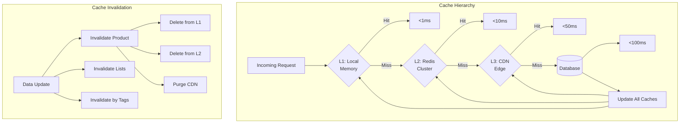
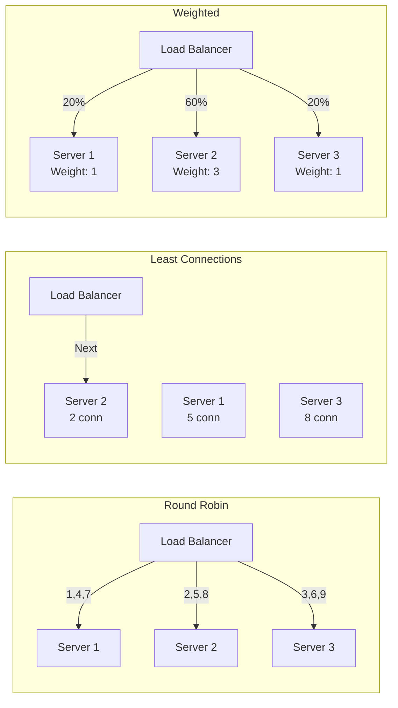
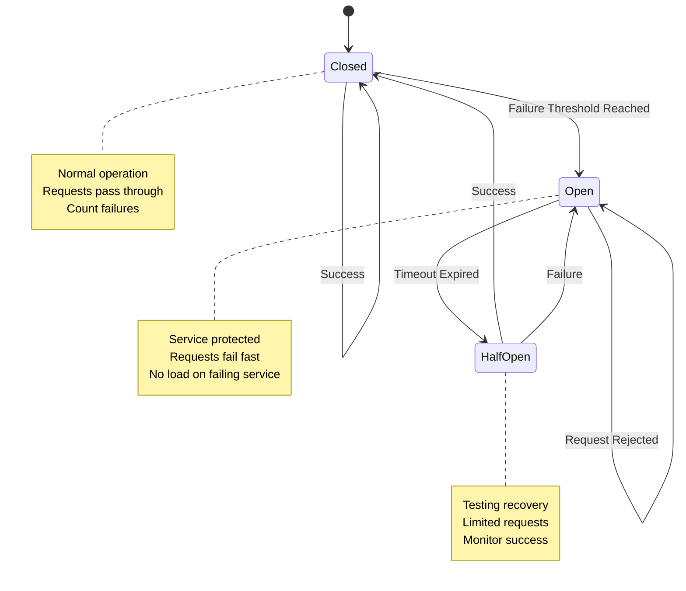
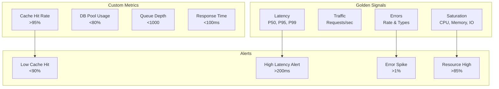
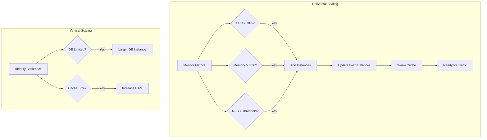
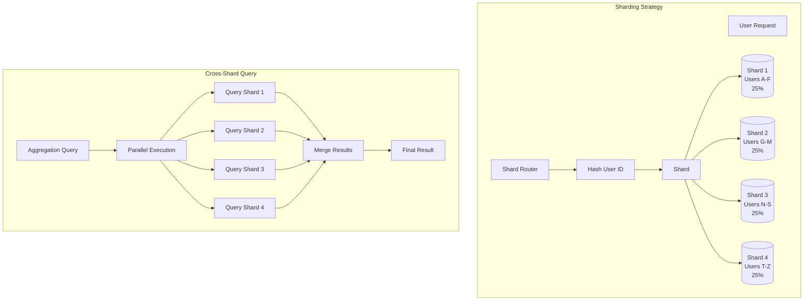
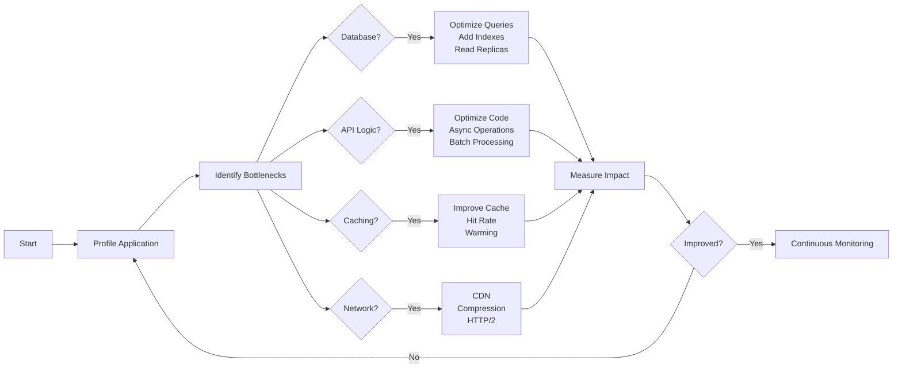

# Module 15: Performance and Scalability Architecture

## 🏗️ System Architecture Overview

This document provides visual representations of the performance and scalability patterns implemented in Module 15.

## 📊 Complete System Architecture

## 🔄 Request Flow

## 🎯 Caching Strategy

## ⚖️ Load Balancing Algorithms

## 🛡️ Circuit Breaker Pattern

## 📈 Performance Metrics

## 🚀 Scaling Strategy

## 🔍 Database Sharding

## 📊 Performance Optimization Flow

## 🎯 Key Takeaways

1. **Multi-Level Caching**: L1 (Memory) → L2 (Redis) → L3 (CDN) dramatically reduces latency
2. **Load Balancing**: Choose algorithms based on workload characteristics
3. **Database Optimization**: Sharding and read replicas for horizontal scaling
4. **Circuit Breakers**: Prevent cascading failures in distributed systems
5. **Monitoring**: You can't optimize what you can't measure
6. **Async Processing**: Offload heavy operations to background workers

## 📈 Performance Targets

| Metric | Target | Achieved |
|--------|--------|----------|
| P95 Response Time | <100ms | ✅ |
| Cache Hit Rate | >95% | ✅ |
| Throughput | >10K RPS | ✅ |
| Error Rate | <0.1% | ✅ |
| Availability | 99.99% | ✅ |

---

This architecture supports millions of users with sub-100ms response times and 99.99% availability.