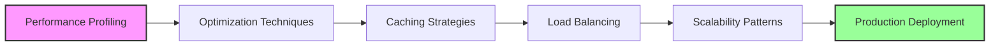

# Module 15: Performance and Scalability

## 🎯 Module Overview

Welcome to Module 15 of the Mastery AI Code Development Workshop! This advanced module focuses on optimizing application performance and building scalable systems using AI-powered development techniques with GitHub Copilot.

### Duration
- **Total Time**: 3 hours
- **Exercises**: 3 progressive challenges (30-90 minutes each)

### Track
🟠 **Advanced Track** - Building on microservices, cloud-native, and infrastructure concepts from previous modules

## 🎓 Learning Objectives

By the end of this module, you will be able to:

1. **Optimize Application Performance**
   - Profile and identify performance bottlenecks
   - Apply AI-suggested optimizations
   - Implement efficient algorithms and data structures

2. **Implement Caching Strategies**
   - Design multi-level caching architectures
   - Use Redis for distributed caching
   - Implement cache invalidation patterns

3. **Build Scalable Systems**
   - Design horizontal scaling solutions
   - Implement load balancing strategies
   - Handle high-concurrency scenarios

4. **Monitor and Measure Performance**
   - Set up performance monitoring
   - Define and track SLIs/SLOs
   - Use APM tools effectively

5. **Apply Production Best Practices**
   - Implement circuit breakers and retries
   - Design for graceful degradation
   - Optimize database queries and connections

## 📚 Prerequisites

Before starting this module, ensure you have:

### Required Knowledge
- ✅ Completed Modules 11-14 (Microservices, Cloud-Native, IaC, CI/CD)
- ✅ Understanding of distributed systems concepts
- ✅ Basic knowledge of performance metrics (latency, throughput, etc.)
- ✅ Familiarity with async programming in Python

### Technical Requirements
- 🐍 Python 3.11+ installed
- 🤖 GitHub Copilot active subscription
- ☁️ Azure subscription with available credits
- 🐋 Docker Desktop running
- 📊 Redis installed locally or accessible

### Azure Resources Needed
- Azure Cache for Redis
- Azure Monitor/Application Insights
- Azure Load Balancer
- Azure Container Instances or AKS

## 🗂️ Module Structure

```
module-15-performance-scalability/
├── README.md                    # This file
├── prerequisites.md             # Detailed setup instructions
├── exercises/
│   ├── exercise1-foundation/    # Caching fundamentals (⭐)
│   ├── exercise2-application/   # Load balancing implementation (⭐⭐)
│   └── exercise3-mastery/       # Production-scale optimization (⭐⭐⭐)
├── best-practices.md           # Production patterns and guidelines
├── resources/                  # Additional materials
│   ├── performance-tools.md
│   ├── architecture-diagrams/
│   └── reference-implementations/
└── troubleshooting.md         # Common issues and solutions
```

## 🏃‍♂️ Quick Start

1. **Set up your environment**:
   ```bash
   cd modules/module-15-performance-scalability
   ./scripts/setup-module15.sh
   ```

2. **Verify prerequisites**:
   ```bash
   python scripts/verify-setup.py
   ```

3. **Start with Exercise 1**:
   ```bash
   cd exercises/exercise1-foundation
   code .
   ```

## 📝 Exercises Overview

### Exercise 1: Foundation - Caching Fundamentals (⭐)
**Duration**: 30-45 minutes  
**Focus**: Implement a multi-level caching system with GitHub Copilot assistance
- Local memory caching
- Redis distributed caching
- Cache warming and invalidation

### Exercise 2: Application - Load Balancing at Scale (⭐⭐)
**Duration**: 45-60 minutes  
**Focus**: Build a load-balanced API with auto-scaling capabilities
- Implement multiple load balancing algorithms
- Add health checks and circuit breakers
- Monitor performance metrics

### Exercise 3: Mastery - Production Performance Optimization (⭐⭐⭐)
**Duration**: 60-90 minutes  
**Focus**: Optimize a real-world e-commerce platform for Black Friday scale
- Database query optimization
- Implement read replicas and sharding
- Advanced caching strategies
- Performance testing and tuning

## 🎯 Learning Path



## 🤖 GitHub Copilot Tips for This Module

### Effective Prompts for Performance Optimization

1. **For Algorithm Optimization**:
   ```python
   # Optimize this function to handle 1 million records efficiently
   # Current time complexity: O(n²), target: O(n log n)
   ```

2. **For Caching Implementation**:
   ```python
   # Implement a caching decorator with:
   # - TTL support
   # - LRU eviction
   # - Redis backend
   # - Metrics collection
   ```

3. **For Load Balancing**:
   ```python
   # Create a load balancer class that supports:
   # - Round-robin, least connections, and weighted algorithms
   # - Health check monitoring
   # - Automatic failover
   # - Request retry with exponential backoff
   ```

## 📊 Success Metrics

You'll know you've mastered this module when you can:

- ✅ Reduce application response time by 50% or more
- ✅ Handle 10x traffic increase without degradation
- ✅ Implement caching with >90% hit rate
- ✅ Design systems that scale horizontally
- ✅ Set up comprehensive performance monitoring
- ✅ Apply optimization patterns without prompting

## 🔗 Resources

### Official Documentation
- [Azure Cache for Redis](https://learn.microsoft.com/azure/azure-cache-for-redis/)
- [Azure Load Balancer](https://learn.microsoft.com/azure/load-balancer/)
- [Application Insights Performance](https://learn.microsoft.com/azure/azure-monitor/app/performance)
- [Python Performance Tips](https://docs.python.org/3/howto/perf.html)

### Recommended Reading
- [High Performance Python](https://www.oreilly.com/library/view/high-performance-python/9781492055013/)
- [Designing Data-Intensive Applications](https://dataintensive.net/)
- [Site Reliability Engineering](https://sre.google/books/)

## 🚀 Next Steps

After completing this module, you'll be ready for:
- **Module 16**: Security Implementation
- **Module 17**: GitHub Models and AI Integration
- Advanced performance optimization projects
- Production system architecture

## 💡 Pro Tips

1. **Always measure before optimizing** - Use profiling tools to identify real bottlenecks
2. **Cache strategically** - Not everything needs caching
3. **Design for failure** - Assume components will fail and plan accordingly
4. **Monitor everything** - You can't optimize what you can't measure
5. **Use Copilot for complex algorithms** - It excels at optimization patterns

## 🆘 Getting Help

- Check the [troubleshooting guide](./troubleshooting.md)
- Review [best practices](./best-practices.md)
- Ask in the workshop Discussions
- Tag issues with `module-15`

---

Ready to master performance and scalability? Let's begin with Exercise 1! 🚀