[🏠 Workshop](../../README.md) > [📚 Modules](../README.md) > [Module 16](README.md)

[⬅️ Module 15: Performance and Scalability](../module-15/README.md) | **📖 Module 16: Security Implementation** | [Module 17: GitHub Models and AI Integration ➡️](../module-17/README.md)

---

# Module 16: Security Implementation

## 🎯 Module Overview

Welcome to Module 16! This module delivers comprehensive enterprise security implementation using Zero Trust principles, advanced encryption techniques, and compliance frameworks. You'll learn to build secure, compliant systems that protect data, users, and infrastructure while enabling AI-powered development workflows.

### Duration
- **Total Time**: 3 hours
- **Lecture/Demo**: 45 minutes
- **Hands-on Exercises**: 2 hours 15 minutes

### Track
- 🔴 Enterprise Track (Modules 16-20)

## 🎓 Learning Objectives

By the end of this module, you will be able to:

1. **Implement Zero Trust Architecture** - Design and deploy systems with "never trust, always verify" principles
2. **Apply Advanced Encryption** - Secure data at rest, in transit, and in use with modern cryptographic techniques
3. **Ensure Compliance** - Meet regulatory requirements (GDPR, HIPAA, SOC2) through automated controls
4. **Secure AI Workloads** - Protect AI models, prompts, and outputs from security threats
5. **Build Secure CI/CD Pipelines** - Implement security scanning, vulnerability management, and secure deployments

## 🔧 Prerequisites

- ✅ Completed Modules 1-15
- ✅ Understanding of cloud architecture patterns
- ✅ Basic security concepts (authentication, authorization)
- ✅ Azure subscription with security services enabled
- ✅ GitHub Advanced Security access

See [prerequisites.md](prerequisites.md) for detailed setup instructions.

## 📚 Key Concepts

### Zero Trust Principles

```mermaid
graph TB
    subgraph "Zero Trust Architecture"
        A[User/Device] -->|Verify Explicitly| B[Identity Verification]
        B -->|Multi-Factor Auth| C[Access Decision]
        C -->|Least Privilege| D[Resource Access]
        D -->|Continuous Monitoring| E[Behavior Analysis]
        E -->|Anomaly Detection| F[Adaptive Response]
        F -->|Re-verify| B
    end
    
    subgraph "Security Layers"
        G[Network Security]
        H[Application Security]
        I[Data Security]
        J[Infrastructure Security]
    end
    
    style A fill:#e74c3c
    style B fill:#3498db
    style C fill:#2ecc71
    style D fill:#f39c12
    style E fill:#9b59b6
    style F fill:#34495e
```

### Security Implementation Stack

1. **Identity & Access Management**
   - Microsoft Entra ID
   - OAuth 2.0 / OpenID Connect
   - Role-Based Access Control (RBAC)
   - Conditional Access Policies

2. **Data Protection**
   - Azure Key Vault for secrets
   - Transparent Data Encryption (TDE)
   - Client-side encryption
   - Data Loss Prevention (DLP)

3. **Network Security**
   - Azure Firewall
   - Network Security Groups (NSG)
   - Private Endpoints
   - DDoS Protection

4. **Application Security**
   - GitHub Advanced Security
   - OWASP compliance
   - Secure coding practices
   - Dependency scanning

5. **Compliance & Governance**
   - Azure Policy
   - Microsoft Defender for Cloud
   - Microsoft Sentinel (SIEM)
   - Compliance Manager

## 🛠️ Module Exercises

### Exercise 1: Zero Trust API Gateway (⭐ Easy - 30 minutes)
Build a secure API gateway implementing Zero Trust principles with authentication, authorization, and rate limiting.

### Exercise 2: Encrypted AI Pipeline (⭐⭐ Medium - 45 minutes)
Create an end-to-end encrypted pipeline for AI model training and inference with compliance logging.

### Exercise 3: Enterprise Security Platform (⭐⭐⭐ Hard - 60 minutes)
Implement a complete security platform with SIEM integration, automated remediation, and compliance reporting.

## 📋 Module Agenda

### Part 1: Foundations (45 minutes)
- Zero Trust architecture deep dive
- Modern encryption techniques
- Compliance frameworks overview
- Security in AI systems

### Part 2: Hands-on Implementation (2 hours 15 minutes)
- Exercise 1: Zero Trust API Gateway
- Exercise 2: Encrypted AI Pipeline
- Exercise 3: Enterprise Security Platform
- Q&A and troubleshooting

## 🔗 Resources

### Official Documentation
- [Microsoft Zero Trust Guidance](https://learn.microsoft.com/security/zero-trust/)
- [Azure Security Documentation](https://learn.microsoft.com/azure/security/)
- [GitHub Advanced Security](https://docs.github.com/en/get-started/learning-about-github/about-github-advanced-security)
- [Microsoft Defender for Cloud](https://learn.microsoft.com/azure/defender-for-cloud/)

### Additional Learning
- [OWASP Top 10](https://owasp.org/www-project-top-ten/)
- [NIST Cybersecurity Framework](https://www.nist.gov/cyberframework)
- [Azure Security Best Practices](https://learn.microsoft.com/azure/security/fundamentals/best-practices-and-patterns)

## 🎯 Success Criteria

By completing this module, you will have:
- ✅ Implemented Zero Trust architecture in a real application
- ✅ Applied encryption to protect sensitive data
- ✅ Automated compliance checks and reporting
- ✅ Secured an AI pipeline end-to-end
- ✅ Built production-ready security solutions

## 🚀 Next Steps

After completing this module:
1. Continue to [Module 17: GitHub Models and AI Integration](../module-17-github-models)
2. Review the [security best practices](best-practices.md)
3. Complete the [independent security project](project/README.md)

---

💡 **Pro Tip**: Security is not a feature, it's a fundamental requirement. Every line of code you write should consider security implications. Use GitHub Copilot to help identify potential security vulnerabilities as you code!

---

## 🔗 Quick Links

### Module Resources
- [📋 Prerequisites](prerequisites.md)
- [📖 Best Practices](docs/best-practices.md)
- [🔧 Troubleshooting](docs/troubleshooting.md)
- [💡 Prompt Templates](docs/prompt-templates.md)

### Exercises
- [⭐ Exercise 1 - Foundation](exercises/exercise1/README.md)
- [⭐⭐ Exercise 2 - Application](exercises/exercise2/README.md)
- [⭐⭐⭐ Exercise 3 - Mastery](exercises/exercise3/README.md)

### Workshop Resources
- [🏠 Workshop Home](../../README.md)
- [📚 All Modules](../../README.md#-complete-module-overview)
- [🚀 Quick Start](../../QUICKSTART.md)
- [❓ FAQ](../../FAQ.md)
- [🤖 Prompt Guide](../../PROMPT-GUIDE.md)
- [🔧 Troubleshooting](../../TROUBLESHOOTING.md)

---

## 🔗 Quick Links

### Module Resources
- [📋 Prerequisites](prerequisites.md)
- [📖 Best Practices](docs/best-practices.md)
- [🔧 Troubleshooting](docs/troubleshooting.md)
- [💡 Prompt Templates](docs/prompt-templates.md)

### Exercises
- [⭐ Exercise 1 - Foundation](exercises/exercise1/README.md)
- [⭐⭐ Exercise 2 - Application](exercises/exercise2/README.md)
- [⭐⭐⭐ Exercise 3 - Mastery](exercises/exercise3/README.md)

### Workshop Resources
- [🏠 Workshop Home](../../README.md)
- [📚 All Modules](../../README.md#-complete-module-overview)
- [🚀 Quick Start](../../QUICKSTART.md)
- [❓ FAQ](../../FAQ.md)
- [🤖 Prompt Guide](../../PROMPT-GUIDE.md)
- [🔧 Troubleshooting](../../TROUBLESHOOTING.md)

---

## 🔗 Quick Links

### Module Resources
- [📋 Prerequisites](prerequisites.md)
- [📖 Best Practices](docs/best-practices.md)
- [🔧 Troubleshooting](docs/troubleshooting.md)
- [💡 Prompt Templates](docs/prompt-templates.md)

### Exercises
- [⭐ Exercise 1 - Foundation](exercises/exercise1/README.md)
- [⭐⭐ Exercise 2 - Application](exercises/exercise2/README.md)
- [⭐⭐⭐ Exercise 3 - Mastery](exercises/exercise3/README.md)

### Workshop Resources
- [🏠 Workshop Home](../../README.md)
- [📚 All Modules](../../README.md#-complete-module-overview)
- [🚀 Quick Start](../../QUICKSTART.md)
- [❓ FAQ](../../FAQ.md)
- [🤖 Prompt Guide](../../PROMPT-GUIDE.md)
- [🔧 Troubleshooting](../../TROUBLESHOOTING.md)

## 🧭 Quick Navigation

<table>
<tr>
<td valign="top">

### 📖 Module Content
- [Overview](README.md)
- [Prerequisites](prerequisites.md)
- [Setup Guide](docs/setup.md)
- [Troubleshooting](docs/troubleshooting.md)

</td>
<td valign="top">

### 💻 Exercises
- [Exercise 1 - Foundation ⭐](exercises/exercise1/README.md)
- [Exercise 2 - Application ⭐⭐](exercises/exercise2/README.md)
- [Exercise 3 - Mastery ⭐⭐⭐](exercises/exercise3/README.md)
- [Independent Project](project/README.md)

</td>
<td valign="top">

### 📚 Resources
- [Best Practices](docs/best-practices.md)
- [Common Patterns](docs/common-patterns.md)
- [Prompt Templates](docs/prompt-templates.md)
- [Additional Resources](resources/README.md)

</td>
</tr>
</table>

---

## 🌐 Workshop Resources

| Core Documentation | Learning Resources | Tools & Scripts |
|:------------------:|:-----------------:|:---------------:|
| [🏠 Home](../../README.md) | [🚀 Quick Start](../../QUICKSTART.md) | [🛠️ Scripts](../../scripts/README.md) |
| [📋 Prerequisites](../../PREREQUISITES.md) | [❓ FAQ](../../FAQ.md) | [🔧 Setup](../../scripts/setup-workshop.sh) |
| [📚 All Modules](../README.md) | [🤖 Prompt Guide](../../PROMPT-GUIDE.md) | [✅ Validate](../../scripts/validate-prerequisites.sh) |
| [🗺️ Learning Paths](../../README.md#-learning-paths) | [🔧 Troubleshooting](../../TROUBLESHOOTING.md) | [🧹 Cleanup](../../scripts/cleanup-resources.sh) |

### 🏷️ Module Categories

| 🟢 Fundamentals | 🔵 Intermediate | 🟠 Advanced | 🔴 Enterprise | 🟣 AI Agents | ⭐ Mastery |
|:---------------:|:---------------:|:-----------:|:-------------:|:------------:|:----------:|
| Modules 1-5 | Modules 6-10 | Modules 11-15 | Modules 16-20 | Modules 21-25 | Modules 26-30 |

---

## 🔗 Quick Links

### Module Resources
- [📋 Prerequisites](prerequisites.md)
- [📖 Best Practices](docs/best-practices.md)
- [🔧 Troubleshooting](docs/troubleshooting.md)
- [💡 Prompt Templates](docs/prompt-templates.md)

### Exercises
- [⭐ Exercise 1 - Foundation](exercises/exercise1/README.md)
- [⭐⭐ Exercise 2 - Application](exercises/exercise2/README.md)
- [⭐⭐⭐ Exercise 3 - Mastery](exercises/exercise3/README.md)

### Workshop Resources
- [🏠 Workshop Home](../../README.md)
- [📚 All Modules](../../README.md#-complete-module-overview)
- [🚀 Quick Start](../../QUICKSTART.md)
- [❓ FAQ](../../FAQ.md)
- [🤖 Prompt Guide](../../PROMPT-GUIDE.md)
- [🔧 Troubleshooting](../../TROUBLESHOOTING.md)

## 🧭 Quick Navigation

<table>
<tr>
<td valign="top">

### 📖 Module Content
- [Overview](README.md)
- [Prerequisites](prerequisites.md)
- [Setup Guide](docs/setup.md)
- [Troubleshooting](docs/troubleshooting.md)

</td>
<td valign="top">

### 💻 Exercises
- [Exercise 1 - Foundation ⭐](exercises/exercise1/README.md)
- [Exercise 2 - Application ⭐⭐](exercises/exercise2/README.md)
- [Exercise 3 - Mastery ⭐⭐⭐](exercises/exercise3/README.md)
- [Independent Project](project/README.md)

</td>
<td valign="top">

### 📚 Resources
- [Best Practices](docs/best-practices.md)
- [Common Patterns](docs/common-patterns.md)
- [Prompt Templates](docs/prompt-templates.md)
- [Additional Resources](resources/README.md)

</td>
</tr>
</table>

---

## 🌐 Workshop Resources

| Core Documentation | Learning Resources | Tools & Scripts |
|:------------------:|:-----------------:|:---------------:|
| [🏠 Home](../../README.md) | [🚀 Quick Start](../../QUICKSTART.md) | [🛠️ Scripts](../../scripts/README.md) |
| [📋 Prerequisites](../../PREREQUISITES.md) | [❓ FAQ](../../FAQ.md) | [🔧 Setup](../../scripts/setup-workshop.sh) |
| [📚 All Modules](../README.md) | [🤖 Prompt Guide](../../PROMPT-GUIDE.md) | [✅ Validate](../../scripts/validate-prerequisites.sh) |
| [🗺️ Learning Paths](../../README.md#-learning-paths) | [🔧 Troubleshooting](../../TROUBLESHOOTING.md) | [🧹 Cleanup](../../scripts/cleanup-resources.sh) |

### 🏷️ Module Categories

| 🟢 Fundamentals | 🔵 Intermediate | 🟠 Advanced | 🔴 Enterprise | 🟣 AI Agents | ⭐ Mastery |
|:---------------:|:---------------:|:-----------:|:-------------:|:------------:|:----------:|
| Modules 1-5 | Modules 6-10 | Modules 11-15 | Modules 16-20 | Modules 21-25 | Modules 26-30 |

---

## 🔗 Quick Links

### Module Resources
- [📋 Prerequisites](prerequisites.md)
- [📖 Best Practices](docs/best-practices.md)
- [🔧 Troubleshooting](docs/troubleshooting.md)
- [💡 Prompt Templates](docs/prompt-templates.md)

### Exercises
- [⭐ Exercise 1 - Foundation](exercises/exercise1/README.md)
- [⭐⭐ Exercise 2 - Application](exercises/exercise2/README.md)
- [⭐⭐⭐ Exercise 3 - Mastery](exercises/exercise3/README.md)

### Workshop Resources
- [🏠 Workshop Home](../../README.md)
- [📚 All Modules](../../README.md#-complete-module-overview)
- [🚀 Quick Start](../../QUICKSTART.md)
- [❓ FAQ](../../FAQ.md)
- [🤖 Prompt Guide](../../PROMPT-GUIDE.md)
- [🔧 Troubleshooting](../../TROUBLESHOOTING.md)

## 🧭 Quick Navigation

<table>
<tr>
<td valign="top">

### 📖 Module Content
- [Overview](README.md)
- [Prerequisites](prerequisites.md)
- [Setup Guide](docs/setup.md)
- [Troubleshooting](docs/troubleshooting.md)

</td>
<td valign="top">

### 💻 Exercises
- [Exercise 1 - Foundation ⭐](exercises/exercise1/README.md)
- [Exercise 2 - Application ⭐⭐](exercises/exercise2/README.md)
- [Exercise 3 - Mastery ⭐⭐⭐](exercises/exercise3/README.md)
- [Independent Project](project/README.md)

</td>
<td valign="top">

### 📚 Resources
- [Best Practices](docs/best-practices.md)
- [Common Patterns](docs/common-patterns.md)
- [Prompt Templates](docs/prompt-templates.md)
- [Additional Resources](resources/README.md)

</td>
</tr>
</table>

---

## 🌐 Workshop Resources

| Core Documentation | Learning Resources | Tools & Scripts |
|:------------------:|:-----------------:|:---------------:|
| [🏠 Home](../../README.md) | [🚀 Quick Start](../../QUICKSTART.md) | [🛠️ Scripts](../../scripts/README.md) |
| [📋 Prerequisites](../../PREREQUISITES.md) | [❓ FAQ](../../FAQ.md) | [🔧 Setup](../../scripts/setup-workshop.sh) |
| [📚 All Modules](../README.md) | [🤖 Prompt Guide](../../PROMPT-GUIDE.md) | [✅ Validate](../../scripts/validate-prerequisites.sh) |
| [🗺️ Learning Paths](../../README.md#-learning-paths) | [🔧 Troubleshooting](../../TROUBLESHOOTING.md) | [🧹 Cleanup](../../scripts/cleanup-resources.sh) |

### 🏷️ Module Categories

| 🟢 Fundamentals | 🔵 Intermediate | 🟠 Advanced | 🔴 Enterprise | 🟣 AI Agents | ⭐ Mastery |
|:---------------:|:---------------:|:-----------:|:-------------:|:------------:|:----------:|
| Modules 1-5 | Modules 6-10 | Modules 11-15 | Modules 16-20 | Modules 21-25 | Modules 26-30 |

