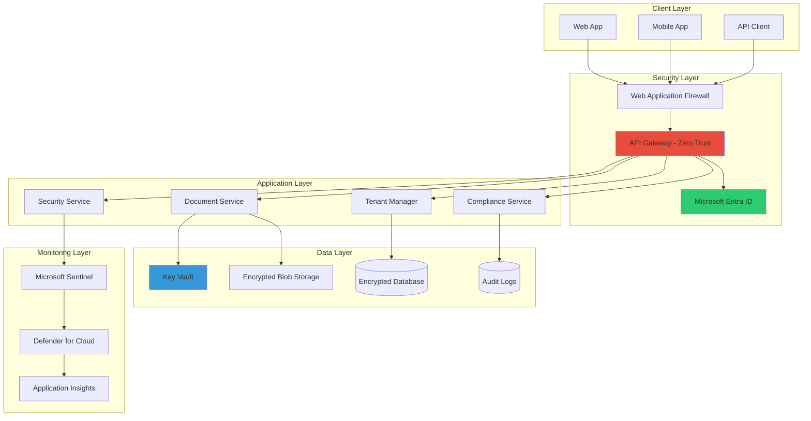

# Independent Project: Secure Multi-Tenant SaaS Platform

## 🎯 Project Overview

Build a secure, multi-tenant SaaS platform that demonstrates enterprise-grade security implementation. This project will integrate all concepts from Module 16, including Zero Trust architecture, encryption, compliance, and automated security monitoring.

### Project Duration
- **Estimated Time**: 8-12 hours
- **Difficulty**: Advanced
- **Prerequisites**: Complete all Module 16 exercises

### What You'll Build
A fictional "SecureVault" SaaS platform that provides:
- Secure document storage and sharing
- Multi-tenant isolation
- End-to-end encryption
- Compliance reporting (GDPR, HIPAA, SOC2)
- Real-time threat monitoring
- Automated incident response

## 🏗️ Architecture



## 📋 Project Requirements

### Core Security Features

1. **Multi-Tenant Isolation**
   - Separate encryption keys per tenant
   - Row-level security in database
   - Isolated storage containers
   - Tenant-specific audit logs

2. **Zero Trust Implementation**
   - No implicit trust
   - Continuous verification
   - Least privilege access
   - Microsegmentation

3. **Data Protection**
   - Encryption at rest (AES-256)
   - Encryption in transit (TLS 1.3)
   - Key rotation every 90 days
   - Secure key management

4. **Compliance & Audit**
   - GDPR compliance (EU tenants)
   - HIPAA compliance (healthcare tenants)
   - SOC2 controls
   - Comprehensive audit logging

5. **Security Monitoring**
   - Real-time threat detection
   - Automated incident response
   - Security dashboards
   - Alert notifications

## 🛠️ Implementation Guide

### Phase 1: Foundation (2-3 hours)

#### 1.1 Project Setup

**Copilot Prompt Suggestion:**
```
Create a Python project structure for a secure multi-tenant SaaS platform with:
- Modular architecture (api, services, security, data layers)
- Docker containerization setup
- Azure bicep templates for infrastructure
- GitHub Actions CI/CD pipeline with security scanning
- Pre-commit hooks for security checks
Include comprehensive .gitignore and security-focused README.
```

**Expected Structure:**
```
securevault/
├── src/
│   ├── api/
│   │   ├── __init__.py
│   │   ├── app.py
│   │   ├── auth.py
│   │   ├── middleware.py
│   │   └── routes/
│   ├── services/
│   │   ├── tenant_service.py
│   │   ├── document_service.py
│   │   ├── compliance_service.py
│   │   └── security_service.py
│   ├── security/
│   │   ├── encryption.py
│   │   ├── zero_trust.py
│   │   ├── monitoring.py
│   │   └── incident_response.py
│   └── data/
│       ├── models.py
│       ├── database.py
│       └── storage.py
├── infrastructure/
│   ├── main.bicep
│   ├── modules/
│   └── parameters/
├── tests/
├── .github/
│   └── workflows/
├── docker/
├── scripts/
└── docs/
```

#### 1.2 Infrastructure as Code

Create Azure infrastructure using Bicep:

```bicep
// main.bicep
param location string = resourceGroup().location
param environment string = 'production'

// Key Vault for secrets
module keyVault 'modules/keyvault.bicep' = {
  name: 'keyVault'
  params: {
    location: location
    vaultName: 'kv-securevault-${environment}'
    enablePurgeProtection: true
    enableSoftDelete: true
  }
}

// Storage Account with encryption
module storage 'modules/storage.bicep' = {
  name: 'storage'
  params: {
    location: location
    storageAccountName: 'stsecurevault${environment}'
    enableBlobEncryption: true
    enableFileEncryption: true
    keyVaultResourceId: keyVault.outputs.resourceId
  }
}

// Application Insights
module monitoring 'modules/monitoring.bicep' = {
  name: 'monitoring'
  params: {
    location: location
    workspaceName: 'law-securevault-${environment}'
    appInsightsName: 'ai-securevault-${environment}'
  }
}
```

### Phase 2: Core Security Implementation (3-4 hours)

#### 2.1 Multi-Tenant Data Isolation

**Copilot Prompt Suggestion:**
```
Create a multi-tenant data isolation system in Python that:
- Implements row-level security using tenant_id
- Creates separate encryption keys per tenant
- Isolates blob storage containers by tenant
- Ensures cross-tenant data access is impossible
- Includes tenant context in all queries
Use SQLAlchemy with PostgreSQL and Azure Blob Storage.
```

**Expected Implementation:**
```python
from sqlalchemy import create_engine, event
from sqlalchemy.orm import sessionmaker, scoped_session
from sqlalchemy.ext.declarative import declarative_base
from contextvars import ContextVar
import uuid

# Tenant context
current_tenant_id: ContextVar[str] = ContextVar('current_tenant_id', default=None)

class TenantIsolation:
    """Ensures complete data isolation between tenants."""
    
    def __init__(self, engine):
        self.engine = engine
        self._setup_row_level_security()
    
    def _setup_row_level_security(self):
        """Configure RLS policies."""
        @event.listens_for(self.engine, "connect")
        def receive_connect(dbapi_connection, connection_record):
            # Enable RLS
            with dbapi_connection.cursor() as cursor:
                cursor.execute("SET row_security = on")
        
        # Create RLS policies
        policies = """
        -- Enable RLS on all tenant tables
        ALTER TABLE documents ENABLE ROW LEVEL SECURITY;
        ALTER TABLE audit_logs ENABLE ROW LEVEL SECURITY;
        
        -- Create policies
        CREATE POLICY tenant_isolation_policy ON documents
            USING (tenant_id = current_setting('app.current_tenant_id')::uuid);
            
        CREATE POLICY tenant_audit_policy ON audit_logs
            USING (tenant_id = current_setting('app.current_tenant_id')::uuid);
        """
    
    def set_tenant_context(self, tenant_id: str):
        """Set current tenant context for RLS."""
        current_tenant_id.set(tenant_id)
        
        # Set in database session
        with self.engine.connect() as conn:
            conn.execute(
                f"SET LOCAL app.current_tenant_id = '{tenant_id}'"
            )
```

#### 2.2 Zero Trust API Gateway

Implement the complete Zero Trust gateway:

```python
from fastapi import FastAPI, Request, Depends, HTTPException
from fastapi.security import HTTPBearer
import asyncio
from typing import Dict, Any, Optional

class ZeroTrustGateway:
    """Complete Zero Trust implementation."""
    
    def __init__(self):
        self.trust_evaluator = TrustEvaluator()
        self.policy_engine = PolicyEngine()
        self.session_manager = SessionManager()
    
    async def evaluate_request(
        self,
        request: Request,
        user: User,
        resource: str,
        action: str
    ) -> TrustDecision:
        """Evaluate every request with Zero Trust."""
        
        # 1. Verify identity continuously
        identity_score = await self.trust_evaluator.verify_identity(
            user,
            request.client.host,
            request.headers
        )
        
        # 2. Assess device trust
        device_score = await self.trust_evaluator.assess_device(
            request.headers.get("User-Agent"),
            request.headers.get("X-Device-Id")
        )
        
        # 3. Evaluate network context
        network_score = await self.trust_evaluator.evaluate_network(
            request.client.host,
            request.headers.get("X-Forwarded-For")
        )
        
        # 4. Check behavioral patterns
        behavior_score = await self.trust_evaluator.analyze_behavior(
            user.id,
            action,
            resource
        )
        
        # 5. Calculate composite trust score
        trust_score = self._calculate_trust_score(
            identity_score,
            device_score,
            network_score,
            behavior_score
        )
        
        # 6. Make access decision
        decision = await self.policy_engine.evaluate(
            user=user,
            resource=resource,
            action=action,
            trust_score=trust_score,
            context={
                "ip": request.client.host,
                "time": datetime.utcnow(),
                "tenant_id": user.tenant_id
            }
        )
        
        # 7. Log decision for audit
        await self._audit_decision(user, resource, action, decision)
        
        return decision
```

#### 2.3 End-to-End Encryption

Implement document encryption with per-tenant keys:

```python
class TenantEncryptionService:
    """Per-tenant encryption management."""
    
    def __init__(self, key_vault_url: str):
        self.key_vault = KeyVaultClient(key_vault_url)
        self.key_cache = TTLCache(maxsize=100, ttl=3600)
    
    async def encrypt_document(
        self,
        tenant_id: str,
        document: bytes,
        classification: DataClassification
    ) -> EncryptedDocument:
        """Encrypt document with tenant-specific key."""
        
        # Get or create tenant KEK
        kek = await self._get_tenant_kek(tenant_id)
        
        # Generate document DEK
        dek = secrets.token_bytes(32)
        
        # Encrypt DEK with tenant KEK
        encrypted_dek = await self.key_vault.encrypt(
            key_id=kek.id,
            algorithm="RSA-OAEP-256",
            plaintext=dek
        )
        
        # Encrypt document with DEK
        iv = secrets.token_bytes(12)
        cipher = Cipher(
            algorithms.AES(dek),
            modes.GCM(iv),
            backend=default_backend()
        )
        
        encryptor = cipher.encryptor()
        
        # Add tenant ID to AAD for additional security
        encryptor.authenticate_additional_data(tenant_id.encode())
        
        ciphertext = encryptor.update(document) + encryptor.finalize()
        
        return EncryptedDocument(
            tenant_id=tenant_id,
            ciphertext=ciphertext,
            encrypted_dek=encrypted_dek,
            iv=iv,
            tag=encryptor.tag,
            algorithm="AES-256-GCM",
            kek_id=kek.id,
            classification=classification,
            encrypted_at=datetime.utcnow()
        )
```

### Phase 3: Compliance & Monitoring (2-3 hours)

#### 3.1 Compliance Engine

**Copilot Prompt Suggestion:**
```
Create a compliance engine that:
- Automatically detects tenant compliance requirements based on region
- Implements GDPR controls for EU tenants
- Implements HIPAA controls for healthcare tenants  
- Generates compliance reports on demand
- Tracks consent and data processing activities
- Handles data subject requests (access, deletion, portability)
Include audit trail for all compliance activities.
```

#### 3.2 Security Monitoring Platform

Implement comprehensive security monitoring:

```python
class SecurityMonitoringPlatform:
    """Real-time security monitoring and response."""
    
    def __init__(self):
        self.sentinel = SentinelClient()
        self.threat_detector = ThreatDetector()
        self.incident_manager = IncidentManager()
        self.metrics_collector = MetricsCollector()
    
    async def monitor_tenant_security(self, tenant_id: str):
        """Monitor security for specific tenant."""
        
        monitors = [
            self._monitor_access_patterns(tenant_id),
            self._monitor_data_access(tenant_id),
            self._monitor_api_usage(tenant_id),
            self._monitor_encryption_operations(tenant_id),
            self._monitor_compliance_violations(tenant_id)
        ]
        
        await asyncio.gather(*monitors)
    
    async def _monitor_access_patterns(self, tenant_id: str):
        """Detect anomalous access patterns."""
        query = f"""
        SecurityEvent
        | where TenantId == '{tenant_id}'
        | where TimeGenerated > ago(5m)
        | summarize 
            FailedLogins = countif(EventID == 4625),
            SuccessfulLogins = countif(EventID == 4624),
            PrivilegeEscalations = countif(EventID == 4672)
        by UserPrincipalName, IpAddress
        | where FailedLogins > 5 or PrivilegeEscalations > 0
        """
        
        results = await self.sentinel.query(query)
        
        for anomaly in results:
            await self.incident_manager.create_incident(
                tenant_id=tenant_id,
                type="suspicious_access",
                severity=self._calculate_severity(anomaly),
                details=anomaly
            )
```

### Phase 4: Advanced Features (2-3 hours)

#### 4.1 Automated Incident Response

Implement automated security response:

```python
class AutomatedSecurityResponse:
    """Automated incident response system."""
    
    def __init__(self):
        self.response_playbooks = self._load_playbooks()
        self.remediation_engine = RemediationEngine()
    
    async def respond_to_incident(self, incident: SecurityIncident):
        """Execute automated response playbook."""
        
        # Select appropriate playbook
        playbook = self._select_playbook(incident)
        
        if not playbook:
            await self._escalate_to_human(incident)
            return
        
        # Execute playbook steps
        for step in playbook.steps:
            try:
                result = await self._execute_step(step, incident)
                
                if not result.success:
                    await self._handle_step_failure(step, result, incident)
                    break
                    
            except Exception as e:
                await self._handle_execution_error(step, e, incident)
                break
        
        # Verify remediation
        await self._verify_remediation(incident)
```

#### 4.2 Security Dashboard

Create a real-time security dashboard:

```python
from fastapi import WebSocket
import asyncio
import json

class SecurityDashboard:
    """Real-time security dashboard."""
    
    def __init__(self):
        self.connected_clients: Dict[str, List[WebSocket]] = {}
        self.metrics_cache = SecurityMetricsCache()
    
    async def handle_websocket(
        self,
        websocket: WebSocket,
        tenant_id: str,
        user: User
    ):
        """Handle dashboard WebSocket connection."""
        
        # Verify dashboard access
        if not self._can_access_dashboard(user, tenant_id):
            await websocket.close(code=4003)
            return
        
        await websocket.accept()
        
        # Add to connected clients
        if tenant_id not in self.connected_clients:
            self.connected_clients[tenant_id] = []
        self.connected_clients[tenant_id].append(websocket)
        
        try:
            # Send initial state
            await self._send_dashboard_state(websocket, tenant_id)
            
            # Handle incoming messages
            while True:
                data = await websocket.receive_json()
                await self._handle_dashboard_command(
                    websocket,
                    tenant_id,
                    user,
                    data
                )
                
        except Exception as e:
            logger.error(f"Dashboard error: {e}")
        finally:
            self.connected_clients[tenant_id].remove(websocket)
```

## 📊 Project Deliverables

### 1. Working Application
- Fully functional multi-tenant SaaS platform
- Deployed to Azure using provided infrastructure
- Accessible via secure API and web interface

### 2. Security Documentation
- Threat model document
- Security architecture diagram
- Incident response runbook
- Compliance matrix

### 3. Demonstration
- Live demo showing:
  - Multi-tenant isolation
  - Encryption in action
  - Compliance report generation
  - Security incident handling
  - Real-time monitoring

### 4. Test Suite
```python
# test_security.py
import pytest
from securevault import app, security

class TestSecurityImplementation:
    """Comprehensive security tests."""
    
    @pytest.mark.asyncio
    async def test_tenant_isolation(self):
        """Verify complete tenant isolation."""
        # Create two tenants
        tenant1 = await create_test_tenant("tenant1")
        tenant2 = await create_test_tenant("tenant2")
        
        # Create documents in tenant1
        doc1 = await create_document(tenant1, "secret1")
        
        # Try to access from tenant2
        with pytest.raises(AccessDeniedException):
            await get_document(tenant2, doc1.id)
    
    @pytest.mark.asyncio
    async def test_encryption(self):
        """Verify encryption implementation."""
        # Create and encrypt document
        document = b"Sensitive data"
        encrypted = await encrypt_document("tenant1", document)
        
        # Verify encryption
        assert encrypted.ciphertext != document
        assert encrypted.algorithm == "AES-256-GCM"
        assert len(encrypted.iv) == 12
        
        # Verify decryption
        decrypted = await decrypt_document(encrypted)
        assert decrypted == document
    
    @pytest.mark.asyncio
    async def test_zero_trust(self):
        """Verify Zero Trust implementation."""
        # Test continuous verification
        user = await create_test_user()
        
        # First request should succeed
        response1 = await make_api_request(user, "/api/documents")
        assert response1.status_code == 200
        
        # Suspicious activity should trigger verification
        for _ in range(100):
            await make_api_request(user, "/api/documents")
        
        # Should require re-authentication
        response2 = await make_api_request(user, "/api/documents")
        assert response2.status_code == 401
```

## 🎯 Evaluation Criteria

Your project will be evaluated on:

### 1. Security Implementation (40%)
- Zero Trust architecture properly implemented
- Encryption correctly applied throughout
- Multi-tenant isolation complete
- Security best practices followed

### 2. Compliance (20%)
- GDPR controls implemented
- HIPAA controls implemented
- Audit logging comprehensive
- Compliance reports accurate

### 3. Monitoring & Response (20%)
- Real-time threat detection working
- Automated response functional
- Security metrics tracked
- Dashboards providing value

### 4. Code Quality (20%)
- Clean, maintainable code
- Proper error handling
- Comprehensive documentation
- Test coverage > 80%

## 🚀 Bonus Challenges

1. **Advanced Threat Detection**
   - Implement ML-based anomaly detection
   - Create custom threat intelligence feed
   - Add behavioral biometrics

2. **Blockchain Audit Trail**
   - Implement immutable audit logs using blockchain
   - Create tamper-proof compliance records

3. **Hardware Security Module**
   - Integrate with Azure HSM for key management
   - Implement hardware-backed encryption

4. **Cross-Cloud Security**
   - Extend platform to support AWS and GCP
   - Implement cloud-agnostic security controls

## 📚 Resources

- [Azure Security Benchmark](https://learn.microsoft.com/security/benchmark/azure/)
- [OWASP ASVS](https://owasp.org/www-project-application-security-verification-standard/)
- [NIST SP 800-53](https://csrc.nist.gov/publications/detail/sp/800-53/rev-5/final)
- [Cloud Security Alliance Guidelines](https://cloudsecurityalliance.org/)

## 🎉 Project Completion

Upon completing this project, you will have:
- Built a production-grade secure SaaS platform
- Implemented enterprise security controls
- Created a portfolio-worthy project
- Gained hands-on experience with:
  - Zero Trust architecture
  - Multi-tenant security
  - Compliance automation
  - Security monitoring
  - Incident response

**Congratulations on completing Module 16!** You now have the skills to implement enterprise-grade security in any application.

---

💡 **Next Steps**: Share your implementation in the workshop showcase and proceed to Module 17 to learn about GitHub Models and AI Integration!