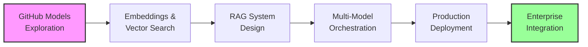

[🏠 Workshop](../../README.md) > [📚 Modules](../README.md) > [Module 17](README.md)

<div align="center">

[⬅️ Module 16: Security Implementation](../module-16/README.md) | **📖 Module 17: GitHub Models and AI Integration** | [Module 18: Enterprise Integration Patterns ➡️](../module-18/README.md)

</div>

---

# Module 17: GitHub Models and AI Integration

## 🎯 Module Overview

Welcome to Module 17 of the Mastery AI Code Development Workshop! This enterprise-level module focuses on leveraging GitHub Models for AI experimentation and seamlessly integrating AI capabilities into production applications using Azure AI services.

### Duration
- **Total Time**: 3 hours
- **Exercises**: 3 progressive challenges (30-90 minutes each)

### Track
🔴 **Enterprise Track** - Building on security concepts from Module 16, preparing for enterprise integration patterns

## 🎓 Learning Objectives

By the end of this module, you will be able to:

1. **Master GitHub Models Platform**
   - Navigate and experiment with various AI models
   - Compare model performance side-by-side
   - Optimize prompts at scale
   - Transition from experimentation to production

2. **Implement Advanced Embeddings**
   - Generate embeddings for different content types
   - Build semantic search systems
   - Implement vector databases
   - Optimize embedding strategies

3. **Build RAG Systems**
   - Design Retrieval-Augmented Generation architectures
   - Implement document chunking strategies
   - Create context-aware AI responses
   - Evaluate RAG performance

4. **Deploy Production AI**
   - Migrate from GitHub Models to Azure OpenAI
   - Implement caching and optimization
   - Handle rate limiting and failover
   - Monitor AI costs and performance

5. **Create Multi-Model Orchestration**
   - Design model selection strategies
   - Implement model routing logic
   - Build fallback mechanisms
   - Optimize for latency and cost

## 📚 Prerequisites

Before starting this module, ensure you have:

### Required Knowledge
- ✅ Completed Modules 1-16 of the workshop
- ✅ Understanding of REST APIs and async programming
- ✅ Basic machine learning concepts (embeddings, vectors)
- ✅ Experience with cloud architectures
- ✅ Familiarity with JSON and API integration

### Technical Requirements
- 🐍 Python 3.11+ installed
- 🤖 GitHub Copilot active subscription
- 🧪 GitHub Models access (preview)
- ☁️ Azure subscription with OpenAI access
- 🐋 Docker Desktop running
- 💾 8GB RAM minimum

### Azure Resources Needed
- Azure OpenAI Service (GPT-4, embeddings)
- Azure AI Search or Cosmos DB (vector capabilities)
- Azure Functions (serverless compute)
- Azure API Management (optional)
- Application Insights (monitoring)

## 🗂️ Module Structure

```
github-models-ai-integration/
├── README.md                    # This file
├── prerequisites.md             # Detailed setup instructions
├── exercises/
│   ├── exercise1-foundation/    # Semantic search system (⭐)
│   ├── exercise2-application/   # RAG implementation (⭐⭐)
│   └── exercise3-mastery/       # Multi-model platform (⭐⭐⭐)
├── best-practices.md           # Production patterns and guidelines
├── resources/                  # Additional materials
│   ├── model-comparison.md
│   ├── architecture-diagrams/
│   └── sample-data/
└── troubleshooting.md         # Common issues and solutions
```

## 🏃‍♂️ Quick Start

1. **Set up your environment**:
   ```bash
   cd modules/github-models-ai-integration
   ./scripts/setup-module17.sh
   ```

2. **Verify prerequisites**:
   ```bash
   python scripts/verify-setup.py
   ```

3. **Configure API keys**:
   ```bash
   cp .env.example .env
   # Edit .env with your GitHub and Azure credentials
   ```

4. **Start with Exercise 1**:
   ```bash
   cd exercises/exercise1-foundation
   code .
   ```

## 📝 Exercises Overview

### Exercise 1: Foundation - AI-Powered Semantic Search (⭐)
**Duration**: 30-45 minutes  
**Focus**: Build a semantic search system using GitHub Models and embeddings
- Experiment with different embedding models
- Implement vector similarity search
- Create a search API with caching
- Compare performance metrics

### Exercise 2: Application - Enterprise RAG System (⭐⭐)
**Duration**: 45-60 minutes  
**Focus**: Create a production-ready Retrieval-Augmented Generation system
- Process and chunk documents effectively
- Implement hybrid search (keyword + semantic)
- Build context-aware responses
- Add evaluation metrics

### Exercise 3: Mastery - Multi-Model AI Platform (⭐⭐⭐)
**Duration**: 60-90 minutes  
**Focus**: Design a comprehensive AI orchestration platform
- Implement model registry and selection
- Build intelligent routing logic
- Create fallback and retry mechanisms
- Deploy with monitoring and observability

## 🎯 Learning Path



## 🤖 GitHub Copilot Tips for This Module

### Effective Prompts for AI Integration

1. **For Embedding Generation**:
   ```python
   # Create a function that generates embeddings using GitHub Models API
   # Support multiple embedding models (ada, text-embedding-3-small)
   # Include retry logic and error handling
   # Cache embeddings to reduce API calls
   ```

2. **For Vector Search Implementation**:
   ```python
   # Implement a vector similarity search that:
   # - Uses cosine similarity for matching
   # - Supports batch processing
   # - Returns top-k results with scores
   # - Includes metadata filtering
   ```

3. **For RAG System**:
   ```python
   # Build a RAG pipeline that:
   # - Chunks documents intelligently
   # - Retrieves relevant context
   # - Generates responses with citations
   # - Handles conversation history
   # - Implements prompt templates
   ```

## 📊 Success Metrics

You'll know you've mastered this module when you can:

- ✅ Navigate GitHub Models playground confidently
- ✅ Implement semantic search with >90% relevance
- ✅ Build RAG systems with <2s response time
- ✅ Design multi-model architectures
- ✅ Optimize AI costs by 50% or more
- ✅ Deploy production-ready AI integrations

## 🔗 Resources

### Official Documentation
- [GitHub Models Documentation](https://docs.github.com/models)
- [Azure OpenAI Service](https://learn.microsoft.com/azure/ai-services/openai/)
- [Azure AI Search - Vector Search](https://learn.microsoft.com/azure/search/vector-search-overview)
- [Semantic Kernel Documentation](https://learn.microsoft.com/semantic-kernel/)

### GitHub Models Available
- **Language Models**: GPT-4, GPT-3.5, Llama, Mistral
- **Embedding Models**: text-embedding-ada-002, text-embedding-3-small
- **Specialized Models**: Whisper (speech), DALL-E (images)

### Recommended Reading
- [Building AI Applications with LangChain](https://www.langchain.com/)
- [Vector Databases Explained](https://www.pinecone.io/learn/)
- [RAG Best Practices](https://www.llamaindex.ai/)

## 🚀 Next Steps

After completing this module, you'll be ready for:
- **Module 18**: Enterprise Integration Patterns
- **Module 19**: Monitoring and Observability
- Building production AI applications
- Implementing advanced AI architectures

## 💡 Pro Tips

1. **Start with GitHub Models** - Experiment freely before committing to production
2. **Cache embeddings aggressively** - They're expensive to generate
3. **Monitor token usage** - Set up alerts for cost control
4. **Use appropriate models** - Not every task needs GPT-4
5. **Version your prompts** - They're code too!

## 🆘 Getting Help

- Check the [troubleshooting guide](./troubleshooting.md)
- Review [best practices](./best-practices.md)
- Explore the [GitHub Models playground](https://github.com/marketplace/models)
- Ask in the workshop Discussions
- Tag issues with `module-17`

---

Ready to integrate AI into your enterprise applications? Let's begin with Exercise 1! 🚀

---

## 🔗 Quick Links

### Module Resources
- [📋 Prerequisites](prerequisites.md)
- [📖 Best Practices](docs/best-practices.md)
- [🔧 Troubleshooting](docs/troubleshooting.md)
- [💡 Prompt Templates](docs/prompt-templates.md)

### Exercises
- [⭐ Exercise 1 - Foundation](exercises/exercise1/README.md)
- [⭐⭐ Exercise 2 - Application](exercises/exercise2/README.md)
- [⭐⭐⭐ Exercise 3 - Mastery](exercises/exercise3/README.md)

### Workshop Resources
- [🏠 Workshop Home](../../README.md)
- [📚 All Modules](../../README.md#-complete-module-overview)
- [🚀 Quick Start](../../QUICKSTART.md)
- [❓ FAQ](../../FAQ.md)
- [🤖 Prompt Guide](../../PROMPT-GUIDE.md)
- [🔧 Troubleshooting](../../TROUBLESHOOTING.md)


---

## 🔗 Quick Links

### Module Resources
- [📋 Prerequisites](prerequisites.md)
- [📖 Best Practices](docs/best-practices.md)
- [🔧 Troubleshooting](docs/troubleshooting.md)
- [💡 Prompt Templates](docs/prompt-templates.md)

### Exercises
- [⭐ Exercise 1 - Foundation](exercises/exercise1/README.md)
- [⭐⭐ Exercise 2 - Application](exercises/exercise2/README.md)
- [⭐⭐⭐ Exercise 3 - Mastery](exercises/exercise3/README.md)

### Workshop Resources
- [🏠 Workshop Home](../../README.md)
- [📚 All Modules](../../README.md#-complete-module-overview)
- [🚀 Quick Start](../../QUICKSTART.md)
- [❓ FAQ](../../FAQ.md)
- [🤖 Prompt Guide](../../PROMPT-GUIDE.md)
- [🔧 Troubleshooting](../../TROUBLESHOOTING.md)


---

## 🔗 Quick Links

### Module Resources
- [📋 Prerequisites](prerequisites.md)
- [📖 Best Practices](docs/best-practices.md)
- [🔧 Troubleshooting](docs/troubleshooting.md)
- [💡 Prompt Templates](docs/prompt-templates.md)

### Exercises
- [⭐ Exercise 1 - Foundation](exercises/exercise1/README.md)
- [⭐⭐ Exercise 2 - Application](exercises/exercise2/README.md)
- [⭐⭐⭐ Exercise 3 - Mastery](exercises/exercise3/README.md)

### Workshop Resources
- [🏠 Workshop Home](../../README.md)
- [📚 All Modules](../../README.md#-complete-module-overview)
- [🚀 Quick Start](../../QUICKSTART.md)
- [❓ FAQ](../../FAQ.md)
- [🤖 Prompt Guide](../../PROMPT-GUIDE.md)
- [🔧 Troubleshooting](../../TROUBLESHOOTING.md)


## 🧭 Quick Navigation

<table>
<tr>
<td valign="top">

### 📖 Module Content
- [Overview](README.md)
- [Prerequisites](prerequisites.md)
- [Setup Guide](docs/setup.md)
- [Troubleshooting](docs/troubleshooting.md)

</td>
<td valign="top">

### 💻 Exercises
- [Exercise 1 - Foundation ⭐](exercises/exercise1/README.md)
- [Exercise 2 - Application ⭐⭐](exercises/exercise2/README.md)
- [Exercise 3 - Mastery ⭐⭐⭐](exercises/exercise3/README.md)
- [Independent Project](project/README.md)

</td>
<td valign="top">

### 📚 Resources
- [Best Practices](docs/best-practices.md)
- [Common Patterns](docs/common-patterns.md)
- [Prompt Templates](docs/prompt-templates.md)
- [Additional Resources](resources/README.md)

</td>
</tr>
</table>


---

## 🌐 Workshop Resources

<div align="center">

| Core Documentation | Learning Resources | Tools & Scripts |
|:------------------:|:-----------------:|:---------------:|
| [🏠 Home](../../README.md) | [🚀 Quick Start](../../QUICKSTART.md) | [🛠️ Scripts](../../scripts/README.md) |
| [📋 Prerequisites](../../PREREQUISITES.md) | [❓ FAQ](../../FAQ.md) | [🔧 Setup](../../scripts/setup-workshop.sh) |
| [📚 All Modules](../README.md) | [🤖 Prompt Guide](../../PROMPT-GUIDE.md) | [✅ Validate](../../scripts/validate-prerequisites.sh) |
| [🗺️ Learning Paths](../../README.md#-learning-paths) | [🔧 Troubleshooting](../../TROUBLESHOOTING.md) | [🧹 Cleanup](../../scripts/cleanup-resources.sh) |

</div>

### 🏷️ Module Categories

<div align="center">

| 🟢 Fundamentals | 🔵 Intermediate | 🟠 Advanced | 🔴 Enterprise | 🟣 AI Agents | ⭐ Mastery |
|:---------------:|:---------------:|:-----------:|:-------------:|:------------:|:----------:|
| Modules 1-5 | Modules 6-10 | Modules 11-15 | Modules 16-20 | Modules 21-25 | Modules 26-30 |

</div>


---

## 🔗 Quick Links

### Module Resources
- [📋 Prerequisites](prerequisites.md)
- [📖 Best Practices](docs/best-practices.md)
- [🔧 Troubleshooting](docs/troubleshooting.md)
- [💡 Prompt Templates](docs/prompt-templates.md)

### Exercises
- [⭐ Exercise 1 - Foundation](exercises/exercise1/README.md)
- [⭐⭐ Exercise 2 - Application](exercises/exercise2/README.md)
- [⭐⭐⭐ Exercise 3 - Mastery](exercises/exercise3/README.md)

### Workshop Resources
- [🏠 Workshop Home](../../README.md)
- [📚 All Modules](../../README.md#-complete-module-overview)
- [🚀 Quick Start](../../QUICKSTART.md)
- [❓ FAQ](../../FAQ.md)
- [🤖 Prompt Guide](../../PROMPT-GUIDE.md)
- [🔧 Troubleshooting](../../TROUBLESHOOTING.md)


## 🧭 Quick Navigation

<table>
<tr>
<td valign="top">

### 📖 Module Content
- [Overview](README.md)
- [Prerequisites](prerequisites.md)
- [Setup Guide](docs/setup.md)
- [Troubleshooting](docs/troubleshooting.md)

</td>
<td valign="top">

### 💻 Exercises
- [Exercise 1 - Foundation ⭐](exercises/exercise1/README.md)
- [Exercise 2 - Application ⭐⭐](exercises/exercise2/README.md)
- [Exercise 3 - Mastery ⭐⭐⭐](exercises/exercise3/README.md)
- [Independent Project](project/README.md)

</td>
<td valign="top">

### 📚 Resources
- [Best Practices](docs/best-practices.md)
- [Common Patterns](docs/common-patterns.md)
- [Prompt Templates](docs/prompt-templates.md)
- [Additional Resources](resources/README.md)

</td>
</tr>
</table>


---

## 🌐 Workshop Resources

<div align="center">

| Core Documentation | Learning Resources | Tools & Scripts |
|:------------------:|:-----------------:|:---------------:|
| [🏠 Home](../../README.md) | [🚀 Quick Start](../../QUICKSTART.md) | [🛠️ Scripts](../../scripts/README.md) |
| [📋 Prerequisites](../../PREREQUISITES.md) | [❓ FAQ](../../FAQ.md) | [🔧 Setup](../../scripts/setup-workshop.sh) |
| [📚 All Modules](../README.md) | [🤖 Prompt Guide](../../PROMPT-GUIDE.md) | [✅ Validate](../../scripts/validate-prerequisites.sh) |
| [🗺️ Learning Paths](../../README.md#-learning-paths) | [🔧 Troubleshooting](../../TROUBLESHOOTING.md) | [🧹 Cleanup](../../scripts/cleanup-resources.sh) |

</div>

### 🏷️ Module Categories

<div align="center">

| 🟢 Fundamentals | 🔵 Intermediate | 🟠 Advanced | 🔴 Enterprise | 🟣 AI Agents | ⭐ Mastery |
|:---------------:|:---------------:|:-----------:|:-------------:|:------------:|:----------:|
| Modules 1-5 | Modules 6-10 | Modules 11-15 | Modules 16-20 | Modules 21-25 | Modules 26-30 |

</div>


---

## 🔗 Quick Links

### Module Resources
- [📋 Prerequisites](prerequisites.md)
- [📖 Best Practices](docs/best-practices.md)
- [🔧 Troubleshooting](docs/troubleshooting.md)
- [💡 Prompt Templates](docs/prompt-templates.md)

### Exercises
- [⭐ Exercise 1 - Foundation](exercises/exercise1/README.md)
- [⭐⭐ Exercise 2 - Application](exercises/exercise2/README.md)
- [⭐⭐⭐ Exercise 3 - Mastery](exercises/exercise3/README.md)

### Workshop Resources
- [🏠 Workshop Home](../../README.md)
- [📚 All Modules](../../README.md#-complete-module-overview)
- [🚀 Quick Start](../../QUICKSTART.md)
- [❓ FAQ](../../FAQ.md)
- [🤖 Prompt Guide](../../PROMPT-GUIDE.md)
- [🔧 Troubleshooting](../../TROUBLESHOOTING.md)


## 🧭 Quick Navigation

<table>
<tr>
<td valign="top">

### 📖 Module Content
- [Overview](README.md)
- [Prerequisites](prerequisites.md)
- [Setup Guide](docs/setup.md)
- [Troubleshooting](docs/troubleshooting.md)

</td>
<td valign="top">

### 💻 Exercises
- [Exercise 1 - Foundation ⭐](exercises/exercise1/README.md)
- [Exercise 2 - Application ⭐⭐](exercises/exercise2/README.md)
- [Exercise 3 - Mastery ⭐⭐⭐](exercises/exercise3/README.md)
- [Independent Project](project/README.md)

</td>
<td valign="top">

### 📚 Resources
- [Best Practices](docs/best-practices.md)
- [Common Patterns](docs/common-patterns.md)
- [Prompt Templates](docs/prompt-templates.md)
- [Additional Resources](resources/README.md)

</td>
</tr>
</table>


---

## 🌐 Workshop Resources

<div align="center">

| Core Documentation | Learning Resources | Tools & Scripts |
|:------------------:|:-----------------:|:---------------:|
| [🏠 Home](../../README.md) | [🚀 Quick Start](../../QUICKSTART.md) | [🛠️ Scripts](../../scripts/README.md) |
| [📋 Prerequisites](../../PREREQUISITES.md) | [❓ FAQ](../../FAQ.md) | [🔧 Setup](../../scripts/setup-workshop.sh) |
| [📚 All Modules](../README.md) | [🤖 Prompt Guide](../../PROMPT-GUIDE.md) | [✅ Validate](../../scripts/validate-prerequisites.sh) |
| [🗺️ Learning Paths](../../README.md#-learning-paths) | [🔧 Troubleshooting](../../TROUBLESHOOTING.md) | [🧹 Cleanup](../../scripts/cleanup-resources.sh) |

</div>

### 🏷️ Module Categories

<div align="center">

| 🟢 Fundamentals | 🔵 Intermediate | 🟠 Advanced | 🔴 Enterprise | 🟣 AI Agents | ⭐ Mastery |
|:---------------:|:---------------:|:-----------:|:-------------:|:------------:|:----------:|
| Modules 1-5 | Modules 6-10 | Modules 11-15 | Modules 16-20 | Modules 21-25 | Modules 26-30 |

</div>

