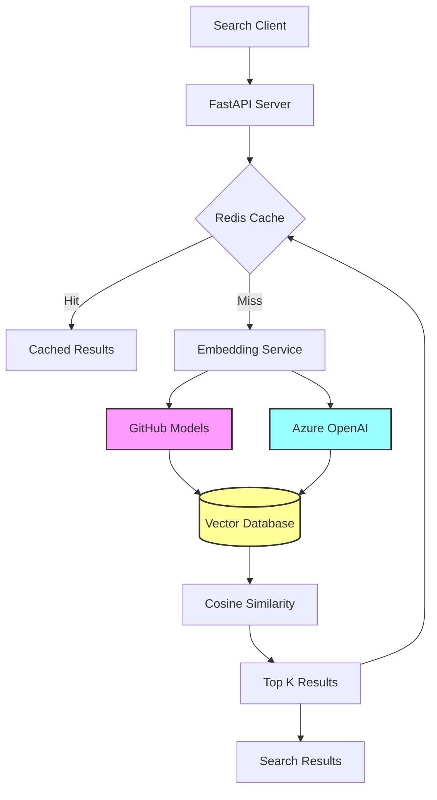

# Exercise 1: AI-Powered Semantic Search (⭐ Foundation)

## 🎯 Exercise Overview

**Duration**: 30-45 minutes  
**Difficulty**: ⭐ (Easy)  
**Success Rate**: 95%

In this foundation exercise, you'll build a semantic search system using GitHub Models for experimentation and Azure OpenAI for production. You'll learn how to generate embeddings, implement vector similarity search, and create a high-performance search API.

## 🎓 Learning Objectives

By completing this exercise, you will:
- Experiment with embedding models in GitHub Models
- Generate text embeddings for semantic understanding
- Implement cosine similarity for vector search
- Build a REST API with semantic search capabilities
- Add caching to optimize performance
- Compare different embedding models

## 📋 Prerequisites

- ✅ Module 17 environment set up
- ✅ GitHub Models access configured
- ✅ Azure OpenAI service deployed
- ✅ Python virtual environment activated
- ✅ Vector database running (Qdrant or Azure AI Search)

## 🏗️ What You'll Build

A semantic search system that understands meaning, not just keywords:



## 🚀 Implementation Steps

### Step 1: Project Structure

Create the following structure:

```
exercise1-foundation/
├── app.py                 # Main FastAPI application
├── embeddings.py         # Embedding generation logic
├── search.py            # Search implementation
├── vector_store.py      # Vector database interface
├── models.py           # Data models
├── config.py          # Configuration
├── requirements.txt   # Dependencies
├── data/
│   └── products.json  # Sample product data
└── tests/
    ├── test_embeddings.py
    └── test_search.py
```

### Step 2: Create Configuration

Create `config.py`:

**🤖 Copilot Prompt Suggestion #1:**
```python
# Create a configuration class that:
# - Loads environment variables with python-dotenv
# - Supports both GitHub Models and Azure OpenAI endpoints
# - Configures embedding model settings (dimensions, batch size)
# - Sets up vector database connections
# - Includes cache TTL and search parameters
# Use pydantic settings for validation
```

**Expected Output Structure:**
```python
from pydantic_settings import BaseSettings
from typing import Optional
import os

class Settings(BaseSettings):
    # GitHub Models
    github_token: str
    github_models_endpoint: str = "https://models.inference.ai.azure.com"
    
    # Azure OpenAI
    azure_openai_endpoint: Optional[str] = None
    azure_openai_api_key: Optional[str] = None
    azure_openai_api_version: str = "2023-12-01-preview"
    azure_openai_deployment: str = "text-embedding-ada-002"
    
    # Model settings
    embedding_model: str = "text-embedding-ada-002"
    embedding_dimension: int = 1536
    embedding_batch_size: int = 100
    
    # Vector store
    vector_store_type: str = "qdrant"  # or "azure_search"
    qdrant_url: str = "http://localhost:6333"
    qdrant_collection: str = "products"
    
    # Cache
    redis_url: str = "redis://localhost:6379"
    cache_ttl: int = 3600
    
    # Search
    search_top_k: int = 10
    similarity_threshold: float = 0.7
    
    class Config:
        env_file = ".env"
```

### Step 3: Create Data Models

Create `models.py`:

```python
from pydantic import BaseModel
from typing import List, Optional, Dict, Any
from datetime import datetime

class Product(BaseModel):
    id: str
    name: str
    description: str
    category: str
    price: float
    features: List[str]
    metadata: Dict[str, Any] = {}

class EmbeddingRequest(BaseModel):
    text: str
    model: Optional[str] = "text-embedding-ada-002"

class EmbeddingResponse(BaseModel):
    embedding: List[float]
    model: str
    usage: Dict[str, int]

class SearchRequest(BaseModel):
    query: str
    top_k: Optional[int] = 10
    filters: Optional[Dict[str, Any]] = {}
    include_embeddings: bool = False

class SearchResult(BaseModel):
    product: Product
    score: float
    explanation: Optional[str] = None

class SearchResponse(BaseModel):
    results: List[SearchResult]
    query: str
    model_used: str
    search_time_ms: float
    total_results: int
```

### Step 4: Implement Embedding Service

Create `embeddings.py`:

**🤖 Copilot Prompt Suggestion #2:**
```python
# Create an embedding service that:
# - Supports both GitHub Models and Azure OpenAI
# - Implements retry logic with exponential backoff
# - Handles rate limiting gracefully
# - Batches embedding requests for efficiency
# - Caches embeddings in Redis
# - Tracks token usage and costs
# Include proper error handling and logging
```

**Expected Implementation Pattern:**
```python
import asyncio
from typing import List, Dict, Any, Optional
import httpx
from tenacity import retry, stop_after_attempt, wait_exponential
import redis
import json
import hashlib
import logging
from config import Settings

logger = logging.getLogger(__name__)

class EmbeddingService:
    def __init__(self, settings: Settings):
        self.settings = settings
        self.redis_client = redis.from_url(settings.redis_url)
        self._github_client = None
        self._azure_client = None
        
    @retry(
        stop=stop_after_attempt(3),
        wait=wait_exponential(multiplier=1, min=4, max=10)
    )
    async def generate_embedding(
        self, 
        text: str, 
        model: Optional[str] = None,
        use_github: bool = True
    ) -> List[float]:
        """Generate embedding for text with caching."""
        # Create cache key
        cache_key = self._get_cache_key(text, model)
        
        # Check cache first
        cached = self._get_from_cache(cache_key)
        if cached:
            logger.info(f"Cache hit for embedding: {cache_key}")
            return cached
        
        # Generate embedding
        if use_github:
            embedding = await self._github_embedding(text, model)
        else:
            embedding = await self._azure_embedding(text, model)
        
        # Cache the result
        self._cache_embedding(cache_key, embedding)
        
        return embedding
    
    # Additional methods...
```

### Step 5: Implement Vector Store

Create `vector_store.py`:

**🤖 Copilot Prompt Suggestion #3:**
```python
# Create a vector store interface that:
# - Abstracts Qdrant and Azure AI Search backends
# - Supports batch insertion of vectors
# - Implements efficient similarity search
# - Handles metadata filtering
# - Provides collection management (create, delete, list)
# - Includes index optimization methods
# Make it async and production-ready
```

### Step 6: Build Search Engine

Create `search.py`:

**🤖 Copilot Prompt Suggestion #4:**
```python
# Implement a semantic search engine that:
# - Processes search queries into embeddings
# - Performs vector similarity search
# - Ranks results by relevance score
# - Supports hybrid search (keyword + semantic)
# - Implements result explanation
# - Adds query expansion for better recall
# Include performance metrics tracking
```

### Step 7: Create FastAPI Application

Create `app.py`:

```python
from fastapi import FastAPI, HTTPException, Depends
from fastapi.responses import JSONResponse
from contextlib import asynccontextmanager
import time
import logging
from typing import List

from config import Settings
from models import (
    SearchRequest, SearchResponse, SearchResult,
    EmbeddingRequest, EmbeddingResponse
)
from embeddings import EmbeddingService
from search import SearchEngine
from vector_store import VectorStore

# Configure logging
logging.basicConfig(level=logging.INFO)
logger = logging.getLogger(__name__)

# Global instances
settings = Settings()
embedding_service = None
search_engine = None
vector_store = None

@asynccontextmanager
async def lifespan(app: FastAPI):
    """Initialize services on startup."""
    global embedding_service, search_engine, vector_store
    
    logger.info("Initializing services...")
    
    # Initialize services
    embedding_service = EmbeddingService(settings)
    vector_store = VectorStore(settings)
    search_engine = SearchEngine(embedding_service, vector_store, settings)
    
    # Initialize vector store
    await vector_store.initialize()
    
    # Load sample data if collection is empty
    if await vector_store.is_empty():
        logger.info("Loading sample data...")
        await load_sample_data()
    
    yield
    
    # Cleanup
    logger.info("Shutting down services...")
    await vector_store.close()

app = FastAPI(
    title="Semantic Search API",
    description="AI-powered semantic search using GitHub Models and Azure OpenAI",
    version="1.0.0",
    lifespan=lifespan
)

@app.post("/embeddings", response_model=EmbeddingResponse)
async def generate_embedding(request: EmbeddingRequest):
    """Generate embedding for given text."""
    start_time = time.time()
    
    try:
        embedding = await embedding_service.generate_embedding(
            text=request.text,
            model=request.model
        )
        
        return EmbeddingResponse(
            embedding=embedding,
            model=request.model,
            usage={
                "prompt_tokens": len(request.text.split()),
                "total_tokens": len(request.text.split()),
                "time_ms": int((time.time() - start_time) * 1000)
            }
        )
    except Exception as e:
        logger.error(f"Error generating embedding: {str(e)}")
        raise HTTPException(status_code=500, detail=str(e))

@app.post("/search", response_model=SearchResponse)
async def search_products(request: SearchRequest):
    """Search products using semantic similarity."""
    start_time = time.time()
    
    try:
        results = await search_engine.search(
            query=request.query,
            top_k=request.top_k,
            filters=request.filters
        )
        
        search_results = [
            SearchResult(
                product=result["product"],
                score=result["score"],
                explanation=result.get("explanation")
            )
            for result in results
        ]
        
        return SearchResponse(
            results=search_results,
            query=request.query,
            model_used=settings.embedding_model,
            search_time_ms=int((time.time() - start_time) * 1000),
            total_results=len(search_results)
        )
    except Exception as e:
        logger.error(f"Search error: {str(e)}")
        raise HTTPException(status_code=500, detail=str(e))

@app.get("/health")
async def health_check():
    """Check service health."""
    return {
        "status": "healthy",
        "services": {
            "embeddings": "active",
            "vector_store": await vector_store.health_check(),
            "cache": embedding_service.redis_client.ping()
        }
    }

@app.get("/models")
async def list_models():
    """List available embedding models."""
    return {
        "github_models": [
            "text-embedding-ada-002",
            "text-embedding-3-small",
            "text-embedding-3-large"
        ],
        "azure_models": [
            settings.azure_openai_deployment
        ],
        "default": settings.embedding_model
    }

async def load_sample_data():
    """Load sample product data into vector store."""
    import json
    
    with open("data/products.json", "r") as f:
        products = json.load(f)
    
    for product in products:
        # Generate embedding for product
        text = f"{product['name']} {product['description']} {' '.join(product['features'])}"
        embedding = await embedding_service.generate_embedding(text)
        
        # Store in vector database
        await vector_store.add_vector(
            id=product["id"],
            vector=embedding,
            metadata=product
        )
    
    logger.info(f"Loaded {len(products)} products into vector store")

if __name__ == "__main__":
    import uvicorn
    uvicorn.run(app, host="0.0.0.0", port=8000)
```

### Step 8: Create Sample Data

Create `data/products.json`:

```json
[
  {
    "id": "prod-001",
    "name": "AI-Powered Smart Camera",
    "description": "Advanced security camera with real-time object detection and facial recognition capabilities",
    "category": "Electronics",
    "price": 299.99,
    "features": [
      "4K resolution",
      "Night vision",
      "Motion detection",
      "Cloud storage",
      "Mobile app",
      "AI alerts"
    ]
  },
  {
    "id": "prod-002",
    "name": "Quantum Computing Textbook",
    "description": "Comprehensive guide to quantum computing principles and practical applications",
    "category": "Books",
    "price": 89.99,
    "features": [
      "Beginner friendly",
      "Code examples",
      "Online resources",
      "Practice problems"
    ]
  }
]
```

### Step 9: Test Your Implementation

Create `tests/test_search.py`:

**🤖 Copilot Prompt Suggestion #5:**
```python
# Create comprehensive tests that:
# - Test embedding generation accuracy
# - Verify search relevance
# - Measure performance metrics
# - Test edge cases (empty queries, special characters)
# - Validate caching behavior
# - Compare GitHub Models vs Azure OpenAI results
# Use pytest with async support
```

## 📊 Testing and Validation

### Run the Application

```bash
# Start the API server
uvicorn app:app --reload --port 8000

# In another terminal, test the endpoints
# Generate embedding
curl -X POST "http://localhost:8000/embeddings" \
  -H "Content-Type: application/json" \
  -d '{"text": "smart security camera with AI"}'

# Search products
curl -X POST "http://localhost:8000/search" \
  -H "Content-Type: application/json" \
  -d '{"query": "camera for home security", "top_k": 5}'
```

### Performance Testing

```python
# Create performance_test.py
import asyncio
import time
import httpx
import statistics

async def test_search_performance():
    queries = [
        "AI camera with night vision",
        "quantum computing book for beginners",
        "smart home security",
        "machine learning textbook",
        "4K camera with motion detection"
    ]
    
    async with httpx.AsyncClient() as client:
        response_times = []
        
        for query in queries:
            start = time.time()
            response = await client.post(
                "http://localhost:8000/search",
                json={"query": query}
            )
            response_times.append(time.time() - start)
        
        print(f"Average response time: {statistics.mean(response_times)*1000:.2f}ms")
        print(f"P95 response time: {statistics.quantiles(response_times, n=20)[18]*1000:.2f}ms")

asyncio.run(test_search_performance())
```

## ✅ Success Criteria

Your implementation is successful when:

1. **Embedding Generation**: < 100ms per text
2. **Search Accuracy**: Relevant results in top 3
3. **Cache Hit Rate**: > 80% for repeated queries
4. **API Response Time**: < 200ms P95
5. **Vector Store**: Supports 10K+ products
6. **Error Handling**: Graceful fallbacks

## 🏆 Extension Challenges

1. **Multi-Model Comparison**: Compare embeddings from different models
2. **Batch Processing**: Implement bulk embedding generation
3. **Query Expansion**: Add synonym support for better recall
4. **Relevance Feedback**: Learn from user interactions

## 💡 Key Takeaways

- GitHub Models enables rapid experimentation
- Embeddings capture semantic meaning
- Vector databases enable similarity search
- Caching is crucial for performance
- Model selection impacts quality and cost

## 📚 Additional Resources

- [GitHub Models Embeddings Guide](https://docs.github.com/models/embeddings)
- [Azure OpenAI Embeddings](https://learn.microsoft.com/azure/ai-services/openai/how-to/embeddings)
- [Vector Search Best Practices](https://www.pinecone.io/learn/vector-search/)

## Next Steps

Congratulations on building your semantic search system! Continue to Exercise 2 where you'll build a complete RAG system.

[Continue to Exercise 2 →](../exercise2-application/instructions/part1.md)