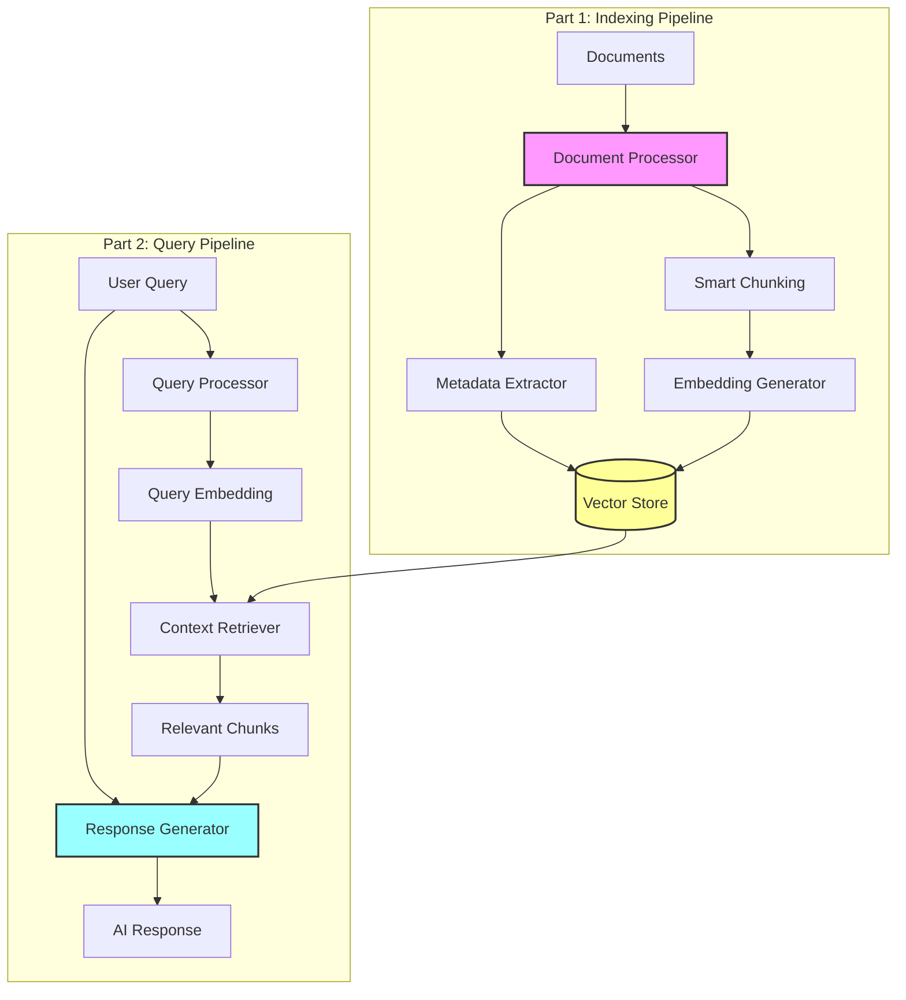

# Exercise 2: Enterprise RAG System - Part 1 (⭐⭐ Application)

## 🎯 Exercise Overview

**Duration**: 45-60 minutes (Part 1: 25 minutes, Part 2: 35 minutes)  
**Difficulty**: ⭐⭐ (Medium)  
**Success Rate**: 80%

In this application-level exercise, you'll build a production-ready Retrieval-Augmented Generation (RAG) system. Part 1 focuses on document processing and indexing, while Part 2 covers query processing and response generation.

## 🎓 Learning Objectives - Part 1

By completing Part 1, you will:
- Process and chunk documents intelligently
- Generate embeddings for document chunks
- Build a searchable vector index
- Implement metadata filtering
- Handle various document formats
- Optimize chunk size and overlap

## 📋 Prerequisites

- ✅ Completed Exercise 1 (Semantic Search)
- ✅ Understanding of document processing
- ✅ Familiarity with vector databases
- ✅ Azure OpenAI GPT-4 access

## 🏗️ What You'll Build

A complete RAG pipeline that retrieves relevant context and generates accurate responses:



## 🚀 Part 1: Document Processing and Indexing

### Step 1: Project Structure

Create the following structure:

```
exercise2-application/
├── rag_system.py         # Main RAG system
├── document_processor.py # Document processing logic
├── chunking.py          # Text chunking strategies
├── indexer.py           # Vector indexing
├── query_engine.py      # Query processing (Part 2)
├── generator.py         # Response generation (Part 2)
├── config.py           # Configuration
├── evaluation.py       # RAG evaluation metrics
├── data/
│   ├── documents/      # Source documents
│   └── processed/      # Processed chunks
└── tests/
    ├── test_processing.py
    └── test_rag.py
```

### Step 2: Enhanced Configuration

Update `config.py`:

**🤖 Copilot Prompt Suggestion #1:**
```python
# Extend the configuration from Exercise 1 to include:
# - Document processing settings (chunk size, overlap)
# - Supported file formats (PDF, TXT, MD, DOCX)
# - RAG-specific parameters (context window, temperature)
# - Model selection for generation (GPT-4, GPT-3.5)
# - Evaluation metrics configuration
# - Prompt templates location
```

**Expected Enhancement:**
```python
from pydantic_settings import BaseSettings
from typing import Optional, List
import os

class RAGSettings(BaseSettings):
    # Previous settings from Exercise 1...
    
    # Document processing
    chunk_size: int = 1000
    chunk_overlap: int = 200
    min_chunk_size: int = 100
    supported_formats: List[str] = [".txt", ".md", ".pdf", ".docx", ".json"]
    
    # RAG parameters
    context_window_size: int = 3000
    max_context_chunks: int = 5
    generation_temperature: float = 0.7
    generation_max_tokens: int = 500
    
    # Generation models
    generation_model: str = "gpt-4"
    fallback_model: str = "gpt-3.5-turbo"
    
    # Evaluation
    enable_evaluation: bool = True
    evaluation_metrics: List[str] = ["relevance", "coherence", "factuality"]
    
    # Prompts
    system_prompt_path: str = "prompts/system.txt"
    user_prompt_template: str = "prompts/user_template.txt"
    
    class Config:
        env_file = ".env"
```

### Step 3: Document Processor

Create `document_processor.py`:

**🤖 Copilot Prompt Suggestion #2:**
```python
# Create a document processor that:
# - Supports multiple file formats (PDF, DOCX, TXT, MD)
# - Extracts text and metadata from documents
# - Cleans and normalizes text (remove extra spaces, fix encoding)
# - Preserves document structure (headings, paragraphs)
# - Handles tables and code blocks appropriately
# - Tracks document source and page numbers
# Include async processing for large documents
```

**Expected Implementation Pattern:**
```python
import asyncio
from typing import List, Dict, Any, Optional
from pathlib import Path
import logging
from abc import ABC, abstractmethod
import re

logger = logging.getLogger(__name__)

class Document:
    """Represents a processed document."""
    def __init__(
        self, 
        content: str, 
        metadata: Dict[str, Any],
        source: str
    ):
        self.content = content
        self.metadata = metadata
        self.source = source
        self.chunks: List['DocumentChunk'] = []

class DocumentChunk:
    """Represents a chunk of a document."""
    def __init__(
        self,
        content: str,
        metadata: Dict[str, Any],
        chunk_id: str,
        document_id: str
    ):
        self.content = content
        self.metadata = metadata
        self.chunk_id = chunk_id
        self.document_id = document_id
        self.embedding: Optional[List[float]] = None

class BaseProcessor(ABC):
    """Base class for document processors."""
    
    @abstractmethod
    async def process(self, file_path: Path) -> Document:
        """Process a document file."""
        pass
    
    def clean_text(self, text: str) -> str:
        """Clean and normalize text."""
        # Remove excessive whitespace
        text = re.sub(r'\s+', ' ', text)
        # Fix common encoding issues
        text = text.replace('"', '"').replace('"', '"')
        text = text.replace(''', "'").replace(''', "'")
        # Remove zero-width characters
        text = re.sub(r'[\u200b\u200c\u200d\ufeff]', '', text)
        return text.strip()

class TextProcessor(BaseProcessor):
    """Process plain text files."""
    
    async def process(self, file_path: Path) -> Document:
        """Process a text file."""
        # TODO: Implement text file processing
        # Copilot Prompt: Read file, extract metadata, clean text
        pass

class MarkdownProcessor(BaseProcessor):
    """Process Markdown files."""
    
    async def process(self, file_path: Path) -> Document:
        """Process a Markdown file."""
        # TODO: Parse Markdown structure
        # Copilot Prompt: Extract headers, code blocks, links
        # Preserve structure in metadata
        pass

class PDFProcessor(BaseProcessor):
    """Process PDF files."""
    
    async def process(self, file_path: Path) -> Document:
        """Process a PDF file."""
        # TODO: Extract text from PDF
        # Copilot Prompt: Use PyPDF2 or pdfplumber
        # Track page numbers in metadata
        pass

class DocumentProcessor:
    """Main document processing orchestrator."""
    
    def __init__(self, settings):
        self.settings = settings
        self.processors = {
            '.txt': TextProcessor(),
            '.md': MarkdownProcessor(),
            '.pdf': PDFProcessor(),
            # Add more processors
        }
    
    async def process_document(self, file_path: Path) -> Document:
        """Process a document based on its type."""
        suffix = file_path.suffix.lower()
        
        if suffix not in self.processors:
            raise ValueError(f"Unsupported file format: {suffix}")
        
        processor = self.processors[suffix]
        return await processor.process(file_path)
    
    async def process_directory(self, directory: Path) -> List[Document]:
        """Process all documents in a directory."""
        documents = []
        
        for file_path in directory.rglob("*"):
            if file_path.is_file() and file_path.suffix in self.settings.supported_formats:
                try:
                    doc = await self.process_document(file_path)
                    documents.append(doc)
                    logger.info(f"Processed: {file_path}")
                except Exception as e:
                    logger.error(f"Error processing {file_path}: {e}")
        
        return documents
```

### Step 4: Smart Chunking

Create `chunking.py`:

**🤖 Copilot Prompt Suggestion #3:**
```python
# Implement intelligent chunking strategies:
# - Sentence-aware chunking (don't break mid-sentence)
# - Semantic chunking (keep related content together)
# - Sliding window with configurable overlap
# - Respect document structure (don't split headers from content)
# - Handle code blocks and tables as single chunks
# - Add chunk metadata (position, neighbors, section)
# Support multiple strategies: fixed-size, semantic, recursive
```

### Step 5: Vector Indexer

Create `indexer.py`:

**🤖 Copilot Prompt Suggestion #4:**
```python
# Create a vector indexer that:
# - Generates embeddings for document chunks
# - Stores vectors with metadata in vector database
# - Supports batch processing for efficiency
# - Implements deduplication logic
# - Creates auxiliary indexes (by document, by date)
# - Handles incremental updates
# - Provides index statistics and management
# Include progress tracking and error recovery
```

### Step 6: Create Sample Documents

Create `data/documents/sample.md`:

```markdown
# AI Development Best Practices

## Introduction

Artificial Intelligence development requires careful consideration of various factors including data quality, model selection, and ethical implications.

## Data Preparation

### Data Quality
High-quality data is essential for training effective AI models. Consider:
- Data completeness and accuracy
- Bias detection and mitigation
- Privacy and compliance requirements

### Feature Engineering
Transform raw data into meaningful features:
- Normalization and scaling
- Categorical encoding
- Feature selection techniques

## Model Development

### Model Selection
Choose appropriate models based on:
- Problem type (classification, regression, generation)
- Data characteristics
- Performance requirements
- Interpretability needs

### Training Best Practices
- Use proper train/validation/test splits
- Implement cross-validation
- Monitor for overfitting
- Track experiments with MLflow

## Deployment Considerations

### Performance Optimization
- Model quantization
- Caching strategies
- Batch processing
- Edge deployment options

### Monitoring and Maintenance
- Track model performance metrics
- Implement drift detection
- Plan for model updates
- Maintain audit logs
```

### Step 7: Implementation Script

Create `index_documents.py`:

```python
import asyncio
import logging
from pathlib import Path
from document_processor import DocumentProcessor
from chunking import ChunkingStrategy
from indexer import VectorIndexer
from embeddings import EmbeddingService
from config import RAGSettings

logging.basicConfig(level=logging.INFO)
logger = logging.getLogger(__name__)

async def index_documents():
    """Index all documents in the data directory."""
    settings = RAGSettings()
    
    # Initialize services
    processor = DocumentProcessor(settings)
    chunker = ChunkingStrategy(settings)
    embedding_service = EmbeddingService(settings)
    indexer = VectorIndexer(embedding_service, settings)
    
    # Process documents
    documents_path = Path("data/documents")
    logger.info(f"Processing documents from: {documents_path}")
    
    documents = await processor.process_directory(documents_path)
    logger.info(f"Processed {len(documents)} documents")
    
    # Chunk documents
    all_chunks = []
    for doc in documents:
        chunks = chunker.chunk_document(doc)
        all_chunks.extend(chunks)
        logger.info(f"Created {len(chunks)} chunks from {doc.source}")
    
    # Index chunks
    logger.info(f"Indexing {len(all_chunks)} chunks...")
    await indexer.index_chunks(all_chunks)
    
    # Print statistics
    stats = await indexer.get_statistics()
    logger.info(f"Indexing complete. Statistics: {stats}")

if __name__ == "__main__":
    asyncio.run(index_documents())
```

### Step 8: Test Document Processing

Create `tests/test_processing.py`:

**🤖 Copilot Prompt Suggestion #5:**
```python
# Create comprehensive tests for document processing:
# - Test each file format processor
# - Verify chunk boundaries are correct
# - Test metadata extraction accuracy
# - Validate text cleaning functions
# - Test edge cases (empty files, corrupted files)
# - Verify chunk overlap calculations
# - Test incremental indexing
# Use pytest with fixtures for sample documents
```

## 📊 Validation for Part 1

### Run the Indexing Pipeline

```bash
# Index sample documents
python index_documents.py

# Verify index creation
curl http://localhost:6333/collections

# Check indexed vectors
curl http://localhost:6333/collections/products/points/count
```

### Verify Processing Quality

```python
# Create verify_chunks.py
import asyncio
from vector_store import VectorStore
from config import RAGSettings

async def verify_chunks():
    settings = RAGSettings()
    store = VectorStore(settings)
    
    # Get sample chunks
    chunks = await store.get_random_chunks(5)
    
    for chunk in chunks:
        print(f"\n--- Chunk {chunk['id']} ---")
        print(f"Content: {chunk['content'][:200]}...")
        print(f"Metadata: {chunk['metadata']}")
        print(f"Embedding size: {len(chunk['embedding'])}")

asyncio.run(verify_chunks())
```

## ✅ Part 1 Success Criteria

Before proceeding to Part 2, ensure:

1. **Document Processing**: All formats handled correctly
2. **Chunking Quality**: Chunks are coherent and complete
3. **Metadata Preservation**: Source tracking maintained
4. **Index Creation**: Vectors stored successfully
5. **Performance**: Processing < 1 sec per document
6. **Error Handling**: Graceful failure recovery

## 💡 Part 1 Key Takeaways

- Document structure matters for RAG quality
- Chunk size affects retrieval precision
- Metadata enables better filtering
- Batch processing improves efficiency
- Proper error handling is crucial

## Next Steps

You've successfully built the indexing pipeline! Continue to Part 2 where you'll implement query processing and response generation.

[Continue to Part 2 →](./part2.md)