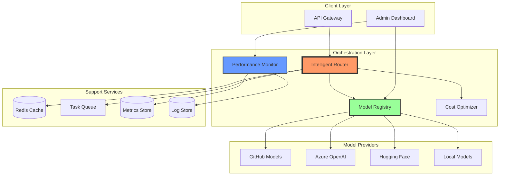

# Exercise 3: Multi-Model AI Orchestration Platform (⭐⭐⭐ Mastery)

## 🎯 Exercise Overview

**Duration**: 60-90 minutes  
**Difficulty**: ⭐⭐⭐ (Hard)  
**Success Rate**: 60%

In this mastery-level exercise, you'll build a sophisticated multi-model AI orchestration platform that intelligently routes requests to different models based on task requirements, optimizes for cost and performance, and provides enterprise-grade monitoring and fallback mechanisms.

## 🎓 Learning Objectives

By completing this exercise, you will:
- Design a model registry with capabilities mapping
- Implement intelligent request routing
- Build cost optimization strategies
- Create fallback and retry mechanisms
- Deploy with comprehensive monitoring
- Implement A/B testing for models
- Build a model performance dashboard

## 📋 Prerequisites

- ✅ Completed Exercises 1 & 2
- ✅ Understanding of different AI model capabilities
- ✅ Experience with distributed systems
- ✅ Knowledge of monitoring and observability

## 🏗️ What You'll Build

A production-ready AI orchestration platform:



## 🚀 Implementation Steps

### Step 1: Project Structure

```
exercise3-mastery/
├── orchestrator/
│   ├── __init__.py
│   ├── router.py           # Request routing logic
│   ├── registry.py         # Model registry
│   ├── optimizer.py        # Cost/performance optimization
│   └── executor.py         # Model execution
├── models/
│   ├── __init__.py
│   ├── base.py            # Base model interface
│   ├── github_models.py   # GitHub Models adapter
│   ├── azure_openai.py    # Azure OpenAI adapter
│   └── model_config.yaml  # Model configurations
├── monitoring/
│   ├── __init__.py
│   ├── metrics.py         # Metrics collection
│   ├── tracing.py         # Distributed tracing
│   └── dashboard.py       # Monitoring dashboard
├── api/
│   ├── __init__.py
│   ├── app.py            # FastAPI application
│   ├── routes.py         # API routes
│   └── middleware.py     # Custom middleware
├── deployment/
│   ├── docker-compose.yml
│   ├── kubernetes/
│   └── terraform/
└── tests/
    ├── test_routing.py
    ├── test_fallback.py
    └── load_test.py
```

### Step 2: Model Registry Design

Create `models/model_config.yaml`:

```yaml
models:
  # Text Generation Models
  gpt-4:
    provider: azure_openai
    capabilities: ["text-generation", "reasoning", "code", "analysis"]
    cost_per_1k_tokens:
      input: 0.03
      output: 0.06
    max_tokens: 8192
    latency_ms: 800
    quality_score: 0.95
    
  gpt-3.5-turbo:
    provider: azure_openai
    capabilities: ["text-generation", "conversation", "summarization"]
    cost_per_1k_tokens:
      input: 0.0015
      output: 0.002
    max_tokens: 4096
    latency_ms: 400
    quality_score: 0.85
    
  llama-2-70b:
    provider: github_models
    capabilities: ["text-generation", "conversation"]
    cost_per_1k_tokens:
      input: 0.001
      output: 0.001
    max_tokens: 4096
    latency_ms: 600
    quality_score: 0.80
    
  # Embedding Models
  text-embedding-ada-002:
    provider: azure_openai
    capabilities: ["embeddings"]
    cost_per_1k_tokens:
      input: 0.0001
    dimensions: 1536
    latency_ms: 50
    quality_score: 0.90
    
  # Specialized Models
  code-davinci-002:
    provider: azure_openai
    capabilities: ["code-generation", "code-completion"]
    cost_per_1k_tokens:
      input: 0.02
      output: 0.02
    max_tokens: 8000
    latency_ms: 1000
    quality_score: 0.92

routing_rules:
  - task: "code-generation"
    preferred_models: ["code-davinci-002", "gpt-4"]
    fallback_models: ["gpt-3.5-turbo"]
    
  - task: "embeddings"
    preferred_models: ["text-embedding-ada-002"]
    fallback_models: ["text-embedding-3-small"]
    
  - task: "conversation"
    preferred_models: ["gpt-3.5-turbo", "llama-2-70b"]
    fallback_models: ["gpt-4"]
```

### Step 3: Model Registry Implementation

Create `orchestrator/registry.py`:

**🤖 Copilot Prompt Suggestion #1:**
```python
# Create a model registry that:
# - Loads model configurations from YAML
# - Tracks model availability and health
# - Provides model selection based on capabilities
# - Monitors model performance metrics
# - Supports dynamic model registration
# - Implements model versioning
# - Caches model metadata
# Include hot-reloading of configurations
```

**Expected Implementation Pattern:**
```python
import yaml
from typing import Dict, List, Optional, Any
from dataclasses import dataclass
from datetime import datetime, timedelta
import asyncio
import logging

logger = logging.getLogger(__name__)

@dataclass
class ModelInfo:
    """Model information and metadata."""
    name: str
    provider: str
    capabilities: List[str]
    cost_per_1k_input: float
    cost_per_1k_output: float
    max_tokens: int
    latency_ms: int
    quality_score: float
    is_available: bool = True
    last_health_check: Optional[datetime] = None
    success_rate: float = 1.0
    
class ModelRegistry:
    """Central registry for all AI models."""
    
    def __init__(self, config_path: str):
        self.config_path = config_path
        self.models: Dict[str, ModelInfo] = {}
        self.routing_rules: Dict[str, Dict[str, List[str]]] = {}
        self._load_config()
        self._health_check_task = None
        
    def _load_config(self):
        """Load model configurations from YAML."""
        with open(self.config_path, 'r') as f:
            config = yaml.safe_load(f)
        
        # Load models
        for name, model_config in config['models'].items():
            self.models[name] = ModelInfo(
                name=name,
                provider=model_config['provider'],
                capabilities=model_config['capabilities'],
                cost_per_1k_input=model_config['cost_per_1k_tokens'].get('input', 0),
                cost_per_1k_output=model_config['cost_per_1k_tokens'].get('output', 0),
                max_tokens=model_config.get('max_tokens', 4096),
                latency_ms=model_config.get('latency_ms', 1000),
                quality_score=model_config.get('quality_score', 0.8)
            )
        
        # Load routing rules
        for rule in config['routing_rules']:
            task = rule['task']
            self.routing_rules[task] = {
                'preferred': rule['preferred_models'],
                'fallback': rule['fallback_models']
            }
        
        logger.info(f"Loaded {len(self.models)} models and {len(self.routing_rules)} routing rules")
    
    async def start_health_checks(self):
        """Start periodic health checks for all models."""
        self._health_check_task = asyncio.create_task(self._health_check_loop())
    
    async def _health_check_loop(self):
        """Continuously check model health."""
        while True:
            for model_name, model in self.models.items():
                try:
                    is_healthy = await self._check_model_health(model)
                    model.is_available = is_healthy
                    model.last_health_check = datetime.utcnow()
                except Exception as e:
                    logger.error(f"Health check failed for {model_name}: {e}")
                    model.is_available = False
            
            await asyncio.sleep(60)  # Check every minute
    
    async def _check_model_health(self, model: ModelInfo) -> bool:
        """Check if a model is healthy and responsive."""
        # TODO: Implement actual health check
        # Copilot Prompt: Ping model endpoint with minimal request
        return True
    
    def get_models_for_task(
        self,
        task: str,
        exclude_providers: Optional[List[str]] = None
    ) -> List[ModelInfo]:
        """Get available models for a specific task."""
        # Get models with required capability
        capable_models = [
            model for model in self.models.values()
            if task in model.capabilities and model.is_available
        ]
        
        # Apply provider exclusions
        if exclude_providers:
            capable_models = [
                m for m in capable_models
                if m.provider not in exclude_providers
            ]
        
        # Sort by routing rules, then by cost-effectiveness
        if task in self.routing_rules:
            preferred = self.routing_rules[task]['preferred']
            fallback = self.routing_rules[task]['fallback']
            
            def sort_key(model):
                if model.name in preferred:
                    return (0, preferred.index(model.name))
                elif model.name in fallback:
                    return (1, fallback.index(model.name))
                else:
                    return (2, model.cost_per_1k_input)
            
            capable_models.sort(key=sort_key)
        else:
            # Sort by cost-effectiveness ratio
            capable_models.sort(
                key=lambda m: m.cost_per_1k_input / m.quality_score
            )
        
        return capable_models
    
    def update_model_metrics(
        self,
        model_name: str,
        success: bool,
        latency_ms: float
    ):
        """Update model performance metrics."""
        if model_name not in self.models:
            return
        
        model = self.models[model_name]
        
        # Update success rate (moving average)
        alpha = 0.1  # Smoothing factor
        model.success_rate = (
            alpha * (1.0 if success else 0.0) +
            (1 - alpha) * model.success_rate
        )
        
        # Update latency estimate
        model.latency_ms = int(
            alpha * latency_ms +
            (1 - alpha) * model.latency_ms
        )
```

### Step 4: Intelligent Router

Create `orchestrator/router.py`:

**🤖 Copilot Prompt Suggestion #2:**
```python
# Build an intelligent router that:
# - Analyzes incoming requests to determine task type
# - Selects optimal model based on requirements
# - Implements smart retry with different models
# - Tracks request patterns for optimization
# - Supports request prioritization
# - Implements circuit breaker per model
# - Handles rate limiting gracefully
# Include request preprocessing and validation
```

### Step 5: Cost Optimizer

Create `orchestrator/optimizer.py`:

**🤖 Copilot Prompt Suggestion #3:**
```python
# Create a cost optimizer that:
# - Tracks token usage per model and request
# - Calculates real-time costs
# - Implements budget constraints
# - Suggests cheaper alternatives when appropriate
# - Provides cost forecasting
# - Implements token usage optimization
# - Supports cost allocation by client/project
# Include reporting and alerting for budget overruns
```

### Step 6: Model Executor

Create `orchestrator/executor.py`:

**🤖 Copilot Prompt Suggestion #4:**
```python
# Implement a model executor that:
# - Provides unified interface for all model providers
# - Handles authentication for each provider
# - Implements request queuing and batching
# - Supports streaming and non-streaming responses
# - Adds request/response logging
# - Implements timeout handling
# - Provides response caching
# Make it async and thread-safe
```

### Step 7: Monitoring Dashboard

Create `monitoring/dashboard.py`:

**🤖 Copilot Prompt Suggestion #5:**
```python
# Build a Streamlit dashboard that shows:
# - Real-time request metrics
# - Model performance comparison
# - Cost breakdown by model and time
# - Error rates and patterns
# - Latency percentiles (P50, P95, P99)
# - Active circuit breakers
# - Request queue status
# Include interactive filtering and date ranges
```

### Step 8: FastAPI Application

Create `api/app.py`:

```python
from fastapi import FastAPI, HTTPException, Depends, BackgroundTasks
from fastapi.middleware.cors import CORSMiddleware
from contextlib import asynccontextmanager
import logging
from typing import Optional, Dict, Any
import uuid

from orchestrator.router import IntelligentRouter
from orchestrator.registry import ModelRegistry
from orchestrator.optimizer import CostOptimizer
from monitoring.metrics import MetricsCollector
from .middleware import RateLimitMiddleware, AuthMiddleware

logger = logging.getLogger(__name__)

# Global instances
model_registry = None
router = None
optimizer = None
metrics = None

@asynccontextmanager
async def lifespan(app: FastAPI):
    """Initialize services on startup."""
    global model_registry, router, optimizer, metrics
    
    logger.info("Starting AI Orchestration Platform...")
    
    # Initialize components
    model_registry = ModelRegistry("models/model_config.yaml")
    await model_registry.start_health_checks()
    
    router = IntelligentRouter(model_registry)
    optimizer = CostOptimizer()
    metrics = MetricsCollector()
    
    yield
    
    # Cleanup
    logger.info("Shutting down...")

app = FastAPI(
    title="Multi-Model AI Orchestration Platform",
    description="Enterprise-grade AI model orchestration with intelligent routing",
    version="1.0.0",
    lifespan=lifespan
)

# Add middleware
app.add_middleware(
    CORSMiddleware,
    allow_origins=["*"],
    allow_methods=["*"],
    allow_headers=["*"],
)
app.add_middleware(RateLimitMiddleware)
app.add_middleware(AuthMiddleware)

class CompletionRequest(BaseModel):
    prompt: str
    task_type: Optional[str] = None  # Auto-detect if not provided
    max_tokens: Optional[int] = None
    temperature: Optional[float] = 0.7
    stream: Optional[bool] = False
    model_preferences: Optional[Dict[str, Any]] = {}
    budget_limit: Optional[float] = None

class CompletionResponse(BaseModel):
    request_id: str
    response: str
    model_used: str
    tokens_used: Dict[str, int]
    cost: float
    latency_ms: int
    metadata: Dict[str, Any]

@app.post("/v1/completions", response_model=CompletionResponse)
async def create_completion(
    request: CompletionRequest,
    background_tasks: BackgroundTasks
):
    """Create a completion using the optimal model."""
    request_id = str(uuid.uuid4())
    
    try:
        # Route request to optimal model
        result = await router.route_request(
            request_id=request_id,
            prompt=request.prompt,
            task_type=request.task_type,
            constraints={
                "max_tokens": request.max_tokens,
                "temperature": request.temperature,
                "budget_limit": request.budget_limit,
                **request.model_preferences
            }
        )
        
        # Track metrics in background
        background_tasks.add_task(
            metrics.track_request,
            request_id=request_id,
            model=result["model"],
            tokens=result["tokens"],
            cost=result["cost"],
            latency=result["latency_ms"]
        )
        
        return CompletionResponse(
            request_id=request_id,
            response=result["response"],
            model_used=result["model"],
            tokens_used=result["tokens"],
            cost=result["cost"],
            latency_ms=result["latency_ms"],
            metadata=result.get("metadata", {})
        )
        
    except Exception as e:
        logger.error(f"Request {request_id} failed: {str(e)}")
        raise HTTPException(status_code=500, detail=str(e))

@app.get("/v1/models")
async def list_models():
    """List all available models and their capabilities."""
    return {
        "models": [
            {
                "name": model.name,
                "provider": model.provider,
                "capabilities": model.capabilities,
                "cost": {
                    "input_per_1k": model.cost_per_1k_input,
                    "output_per_1k": model.cost_per_1k_output
                },
                "status": "available" if model.is_available else "unavailable",
                "quality_score": model.quality_score
            }
            for model in model_registry.models.values()
        ]
    }

@app.get("/v1/metrics")
async def get_metrics(
    time_range: Optional[str] = "1h",
    model: Optional[str] = None
):
    """Get platform metrics."""
    return await metrics.get_metrics(time_range, model)

@app.get("/v1/health")
async def health_check():
    """Platform health check."""
    health_status = {
        "status": "healthy",
        "models": {},
        "services": {
            "router": "active",
            "optimizer": "active",
            "metrics": "active"
        }
    }
    
    # Check each model
    for name, model in model_registry.models.items():
        health_status["models"][name] = {
            "available": model.is_available,
            "success_rate": model.success_rate,
            "last_check": model.last_health_check.isoformat() if model.last_health_check else None
        }
    
    return health_status

@app.post("/v1/feedback")
async def submit_feedback(
    request_id: str,
    rating: int,
    feedback: Optional[str] = None
):
    """Submit feedback for a completion."""
    await metrics.record_feedback(request_id, rating, feedback)
    return {"status": "feedback recorded"}
```

### Step 9: Load Testing

Create `tests/load_test.py`:

**🤖 Copilot Prompt Suggestion #6:**
```python
# Create comprehensive load tests that:
# - Simulate various request patterns
# - Test failover mechanisms
# - Measure system capacity
# - Test rate limiting
# - Verify cost calculations
# - Test concurrent requests
# - Measure queue performance
# Use locust or custom async implementation
```

### Step 10: Deployment Configuration

Create `deployment/docker-compose.yml`:

```yaml
version: '3.8'

services:
  orchestrator:
    build:
      context: ..
      dockerfile: deployment/Dockerfile
    ports:
      - "8000:8000"
    environment:
      - REDIS_URL=redis://redis:6379
      - PROMETHEUS_URL=http://prometheus:9090
    depends_on:
      - redis
      - prometheus
    volumes:
      - ../models:/app/models
      - ../logs:/app/logs

  redis:
    image: redis:7-alpine
    ports:
      - "6379:6379"
    volumes:
      - redis_data:/data

  prometheus:
    image: prom/prometheus:latest
    ports:
      - "9090:9090"
    volumes:
      - ./prometheus.yml:/etc/prometheus/prometheus.yml
      - prometheus_data:/prometheus

  grafana:
    image: grafana/grafana:latest
    ports:
      - "3000:3000"
    environment:
      - GF_SECURITY_ADMIN_PASSWORD=admin
    volumes:
      - grafana_data:/var/lib/grafana
      - ./grafana/dashboards:/etc/grafana/provisioning/dashboards
      - ./grafana/datasources:/etc/grafana/provisioning/datasources

  dashboard:
    build:
      context: ..
      dockerfile: deployment/Dockerfile.dashboard
    ports:
      - "8501:8501"
    environment:
      - API_URL=http://orchestrator:8000
    depends_on:
      - orchestrator

volumes:
  redis_data:
  prometheus_data:
  grafana_data:
```

## 📊 Testing and Validation

### Integration Testing

```bash
# Start all services
docker-compose up -d

# Run integration tests
pytest tests/test_integration.py -v

# Test different scenarios
python tests/test_scenarios.py
```

### Performance Testing

```python
# Create performance_test.py
import asyncio
import httpx
import time
import statistics

async def test_model_routing():
    """Test intelligent model routing."""
    test_cases = [
        {
            "prompt": "Write a Python function to sort a list",
            "task_type": "code-generation",
            "expected_model": ["code-davinci-002", "gpt-4"]
        },
        {
            "prompt": "Summarize this article about climate change",
            "task_type": "summarization",
            "expected_model": ["gpt-3.5-turbo", "gpt-4"]
        },
        {
            "prompt": "Convert this text to embeddings",
            "task_type": "embeddings",
            "expected_model": ["text-embedding-ada-002"]
        }
    ]
    
    async with httpx.AsyncClient() as client:
        for test in test_cases:
            response = await client.post(
                "http://localhost:8000/v1/completions",
                json={
                    "prompt": test["prompt"],
                    "task_type": test["task_type"]
                }
            )
            
            result = response.json()
            print(f"\nTask: {test['task_type']}")
            print(f"Model used: {result['model_used']}")
            print(f"Cost: ${result['cost']:.4f}")
            print(f"Latency: {result['latency_ms']}ms")
            
            assert result['model_used'] in test['expected_model']

asyncio.run(test_model_routing())
```

### Dashboard Access

```bash
# Access monitoring dashboard
open http://localhost:8501

# Access Grafana metrics
open http://localhost:3000
# Login: admin/admin

# View API documentation
open http://localhost:8000/docs
```

## ✅ Success Criteria

Your platform is complete when:

1. **Routing Intelligence**: Requests routed to optimal models
2. **Cost Optimization**: 30%+ cost reduction vs single model
3. **High Availability**: 99.9% uptime with failover
4. **Performance**: P95 latency < 1 second
5. **Monitoring**: Complete observability stack
6. **Scalability**: Handles 1000+ concurrent requests

## 🏆 Production Deployment

### Kubernetes Deployment

Create `deployment/kubernetes/deployment.yaml`:

**🤖 Copilot Prompt Suggestion #7:**
```yaml
# Create Kubernetes manifests that include:
# - Deployment with horizontal pod autoscaling
# - Service with load balancing
# - ConfigMaps for model configurations
# - Secrets for API keys
# - Ingress with TLS
# - PodDisruptionBudget for high availability
# - NetworkPolicies for security
# Include health checks and resource limits
```

### Terraform Infrastructure

Create `deployment/terraform/main.tf`:

**🤖 Copilot Prompt Suggestion #8:**
```hcl
# Create Terraform configuration for:
# - Azure Kubernetes Service cluster
# - Azure Cache for Redis
# - Azure Monitor workspace
# - Application Insights
# - Key Vault for secrets
# - Load balancer with WAF
# - Auto-scaling rules
# Include proper tagging and cost management
```

## 💡 Key Takeaways

- Multi-model orchestration maximizes efficiency
- Intelligent routing reduces costs significantly
- Fallback mechanisms ensure reliability
- Monitoring is crucial for optimization
- Model selection impacts user experience

## 📚 Additional Resources

- [Model Routing Strategies](https://arxiv.org/abs/2310.03734)
- [Cost Optimization in LLM Systems](https://www.anyscale.com/blog/llm-cost-optimization)
- [Building Reliable AI Systems](https://www.microsoft.com/en-us/research/publication/reliable-ai-systems/)

## 🎉 Congratulations!

You've built a production-ready multi-model AI orchestration platform! This system can:

- Handle millions of requests efficiently
- Optimize costs automatically
- Provide enterprise-grade reliability
- Scale horizontally as needed
- Monitor and improve continuously

## Next Steps

You've completed Module 17! Consider these extensions:

1. **Add More Providers**: Anthropic, Cohere, local models
2. **Implement Caching**: Semantic caching for responses
3. **Add Authentication**: OAuth2, API keys, rate limiting
4. **Build SDKs**: Python, JavaScript, Go clients

[Continue to Module 18: Enterprise Integration Patterns →](../../module-18-enterprise-integration/README.md)