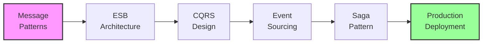

# Module 18: Enterprise Integration Patterns

## 🎯 Module Overview

Welcome to Module 18 of the Mastery AI Code Development Workshop! This enterprise-level module focuses on implementing sophisticated integration patterns that enable complex distributed systems to communicate effectively. You'll master ESB, CQRS, Event Sourcing, and Saga patterns using modern cloud-native approaches.

### Duration
- **Total Time**: 3 hours
- **Exercises**: 3 progressive challenges (30-90 minutes each)

### Track
🔴 **Enterprise Track** - Building on AI integration from Module 17, preparing for monitoring and observability

## 🎓 Learning Objectives

By the end of this module, you will be able to:

1. **Master Enterprise Service Bus (ESB)**
   - Design message-based architectures
   - Implement routing and transformation
   - Build protocol adapters
   - Handle message orchestration

2. **Implement CQRS Pattern**
   - Separate read and write models
   - Design command handlers
   - Build query optimized views
   - Ensure eventual consistency

3. **Build Event Sourcing Systems**
   - Store events as source of truth
   - Implement event stores
   - Create projections
   - Handle event replay

4. **Design Saga Orchestration**
   - Implement distributed transactions
   - Build compensating transactions
   - Handle long-running processes
   - Ensure system consistency

5. **Create Production Systems**
   - Implement monitoring and tracing
   - Handle failures gracefully
   - Scale components independently
   - Deploy with zero downtime

## 📚 Prerequisites

Before starting this module, ensure you have:

### Required Knowledge
- ✅ Completed Modules 1-17 of the workshop
- ✅ Understanding of distributed systems
- ✅ Experience with message queues
- ✅ Knowledge of database transactions
- ✅ Familiarity with domain-driven design

### Technical Requirements
- 🐍 Python 3.11+ installed
- 🤖 GitHub Copilot active subscription
- ☁️ Azure subscription with Service Bus access
- 🐳 Docker Desktop running
- 💾 16GB RAM recommended

### Azure Resources Needed
- Azure Service Bus (Premium tier for transactions)
- Azure Event Hubs
- Azure Cosmos DB (with Change Feed)
- Azure Functions
- Azure Container Instances

## 🗂️ Module Structure

```
module-18-enterprise-integration-patterns/
├── README.md                    # This file
├── prerequisites.md             # Detailed setup instructions
├── exercises/
│   ├── exercise1-esb/          # Service Bus implementation (⭐)
│   ├── exercise2-cqrs-es/      # CQRS + Event Sourcing (⭐⭐)
│   └── exercise3-saga/         # Distributed Saga (⭐⭐⭐)
├── best-practices.md           # Production patterns and guidelines
├── resources/                  # Additional materials
│   ├── pattern-catalog.md
│   ├── architecture-diagrams/
│   └── sample-events/
└── troubleshooting.md         # Common issues and solutions
```

## 🏃‍♂️ Quick Start

1. **Set up your environment**:
   ```bash
   cd modules/module-18-enterprise-integration-patterns
   ./scripts/setup-module18.sh
   ```

2. **Verify prerequisites**:
   ```bash
   python scripts/verify-setup.py
   ```

3. **Configure Azure resources**:
   ```bash
   ./scripts/provision-azure.sh
   ```

4. **Start with Exercise 1**:
   ```bash
   cd exercises/exercise1-esb
   code .
   ```

## 📝 Exercises Overview

### Exercise 1: Foundation - Enterprise Service Bus (⭐)
**Duration**: 30-45 minutes  
**Focus**: Build a message-based integration system using Azure Service Bus
- Implement message routing and transformation
- Create protocol adapters (HTTP to AMQP)
- Build content-based routing
- Add dead letter handling

### Exercise 2: Application - CQRS with Event Sourcing (⭐⭐)
**Duration**: 45-60 minutes  
**Focus**: Create a CQRS system with event sourcing for an e-commerce platform
- Separate command and query models
- Implement event store with snapshots
- Build real-time projections
- Create materialized views

### Exercise 3: Mastery - Distributed Saga Orchestration (⭐⭐⭐)
**Duration**: 60-90 minutes  
**Focus**: Design a complete saga for multi-service order processing
- Implement saga orchestrator
- Build compensating transactions
- Handle partial failures
- Create monitoring dashboard

## 🎯 Learning Path



## 🤖 GitHub Copilot Tips for This Module

### Effective Prompts for Integration Patterns

1. **For ESB Implementation**:
   ```python
   # Create a message router that:
   # - Routes based on message type and content
   # - Transforms between different formats (JSON, XML, Avro)
   # - Implements retry with exponential backoff
   # - Handles poison messages
   # - Tracks message flow with correlation IDs
   ```

2. **For CQRS Design**:
   ```python
   # Implement CQRS pattern with:
   # - Separate command and query interfaces
   # - Command validation and authorization
   # - Async command processing
   # - Read model projections
   # - Consistency boundaries
   ```

3. **For Saga Implementation**:
   ```python
   # Build a saga orchestrator that:
   # - Manages multi-step transactions
   # - Implements compensating actions
   # - Handles timeouts and retries
   # - Persists saga state
   # - Provides observability
   ```

## 📊 Success Metrics

You'll know you've mastered this module when you can:

- ✅ Design message-based architectures
- ✅ Implement CQRS with <100ms query response
- ✅ Build event sourcing with replay capability
- ✅ Create sagas handling 10+ steps
- ✅ Achieve 99.9% message delivery reliability
- ✅ Deploy with zero downtime updates

## 🔗 Resources

### Official Documentation
- [Azure Service Bus Documentation](https://learn.microsoft.com/azure/service-bus-messaging/)
- [Event Sourcing Pattern](https://learn.microsoft.com/azure/architecture/patterns/event-sourcing)
- [CQRS Pattern](https://learn.microsoft.com/azure/architecture/patterns/cqrs)
- [Saga Pattern](https://learn.microsoft.com/azure/architecture/patterns/saga)

### Integration Technologies
- **Message Brokers**: Azure Service Bus, Event Hubs, Kafka
- **Event Stores**: EventStore, Cosmos DB, PostgreSQL
- **Orchestrators**: Azure Durable Functions, Temporal
- **Monitoring**: Application Insights, Datadog

### Recommended Reading
- [Enterprise Integration Patterns](https://www.enterpriseintegrationpatterns.com/)
- [Building Event-Driven Microservices](https://www.oreilly.com/library/view/building-event-driven-microservices/9781492057888/)
- [Designing Data-Intensive Applications](https://dataintensive.net/)

## 🚀 Next Steps

After completing this module, you'll be ready for:
- **Module 19**: Monitoring and Observability
- **Module 20**: Production Deployment Strategies
- Building enterprise-grade distributed systems
- Implementing complex business workflows

## 💡 Pro Tips

1. **Start with Messages** - Design your message contracts first
2. **Embrace Eventual Consistency** - Don't fight distributed systems
3. **Plan for Failure** - Every operation can fail
4. **Monitor Everything** - Observability is crucial
5. **Test Chaos** - Introduce failures intentionally

## 🆘 Getting Help

- Check the [troubleshooting guide](./troubleshooting.md)
- Review [best practices](./best-practices.md)
- Explore the [pattern catalog](./resources/pattern-catalog.md)
- Ask in the workshop Discussions
- Tag issues with `module-18`

---

Ready to master enterprise integration patterns? Let's begin with Exercise 1! 🚀
