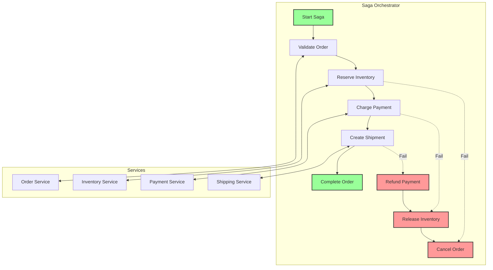

# Exercise 3: Distributed Saga Orchestration (⭐⭐⭐ Mastery)

## 🎯 Exercise Overview

**Duration**: 60-90 minutes  
**Difficulty**: ⭐⭐⭐ (Hard)  
**Success Rate**: 60%

In this mastery-level exercise, you'll implement a distributed saga pattern to handle complex multi-service transactions. You'll build a complete order processing saga that coordinates between order, payment, inventory, and shipping services with compensating transactions for failure scenarios.

## 🎓 Learning Objectives

By completing this exercise, you will:
- Design saga orchestration for distributed transactions
- Implement compensating transactions
- Handle partial failures gracefully
- Build saga state persistence
- Create timeout and retry mechanisms
- Monitor saga execution
- Implement both orchestration and choreography patterns

## 📋 Prerequisites

- ✅ Completed Exercises 1 & 2
- ✅ Understanding of distributed transactions
- ✅ Knowledge of compensation patterns
- ✅ Experience with state machines

## 🏗️ What You'll Build

A complete order processing saga with multiple participants:



## 🚀 Implementation Steps

### Step 1: Project Structure

Create the following structure:

```
exercise3-saga/
├── saga/
│   ├── __init__.py
│   ├── orchestrator.py      # Saga orchestrator
│   ├── definition.py        # Saga definitions
│   ├── state_machine.py     # State machine implementation
│   └── persistence.py       # Saga state persistence
├── participants/
│   ├── __init__.py
│   ├── order_service.py     # Order participant
│   ├── inventory_service.py # Inventory participant
│   ├── payment_service.py   # Payment participant
│   └── shipping_service.py  # Shipping participant
├── messages/
│   ├── __init__.py
│   ├── commands.py          # Saga commands
│   └── events.py            # Saga events
├── monitoring/
│   ├── __init__.py
│   ├── tracer.py           # Distributed tracing
│   └── dashboard.py        # Saga monitoring dashboard
├── api/
│   ├── __init__.py
│   └── saga_api.py         # API endpoints
└── tests/
    ├── test_saga_flow.py
    └── test_compensation.py
```

### Step 2: Saga Definition

Create `saga/definition.py`:

**🤖 Copilot Prompt Suggestion #1:**
```python
# Create a saga definition framework that:
# - Defines saga steps and transitions
# - Maps commands to participants
# - Specifies compensation for each step
# - Sets timeout for each operation
# - Defines retry policies
# - Supports conditional branching
# - Validates saga consistency
# Use a DSL or configuration approach
```

**Expected Implementation:**
```python
from dataclasses import dataclass, field
from typing import Dict, List, Optional, Callable, Any
from enum import Enum
import uuid
from datetime import datetime, timedelta

class StepStatus(Enum):
    PENDING = "PENDING"
    RUNNING = "RUNNING"
    COMPLETED = "COMPLETED"
    FAILED = "FAILED"
    COMPENSATING = "COMPENSATING"
    COMPENSATED = "COMPENSATED"

@dataclass
class SagaStep:
    """Defines a single step in a saga."""
    name: str
    command_type: str
    participant: str
    compensation_command: Optional[str] = None
    timeout_seconds: int = 30
    retry_count: int = 3
    retry_delay_seconds: int = 5
    is_compensatable: bool = True
    
@dataclass
class SagaDefinition:
    """Defines a complete saga flow."""
    name: str
    steps: List[SagaStep]
    timeout_seconds: int = 300
    
    def get_compensation_steps(self, failed_at_step: str) -> List[SagaStep]:
        """Get compensation steps for rollback."""
        compensation_steps = []
        
        # Find the failed step index
        failed_index = next(
            (i for i, step in enumerate(self.steps) if step.name == failed_at_step),
            len(self.steps)
        )
        
        # Get all completed steps before failure in reverse order
        for i in range(failed_index - 1, -1, -1):
            step = self.steps[i]
            if step.is_compensatable and step.compensation_command:
                comp_step = SagaStep(
                    name=f"compensate_{step.name}",
                    command_type=step.compensation_command,
                    participant=step.participant,
                    timeout_seconds=step.timeout_seconds,
                    retry_count=step.retry_count,
                    is_compensatable=False
                )
                compensation_steps.append(comp_step)
        
        return compensation_steps

# Define Order Processing Saga
ORDER_PROCESSING_SAGA = SagaDefinition(
    name="OrderProcessingSaga",
    steps=[
        SagaStep(
            name="validate_order",
            command_type="ValidateOrderCommand",
            participant="OrderService",
            compensation_command=None,  # No compensation needed
            is_compensatable=False
        ),
        SagaStep(
            name="reserve_inventory",
            command_type="ReserveInventoryCommand",
            participant="InventoryService",
            compensation_command="ReleaseInventoryCommand",
            timeout_seconds=20
        ),
        SagaStep(
            name="charge_payment",
            command_type="ChargePaymentCommand",
            participant="PaymentService",
            compensation_command="RefundPaymentCommand",
            timeout_seconds=30,
            retry_count=2  # Less retries for payment
        ),
        SagaStep(
            name="create_shipment",
            command_type="CreateShipmentCommand",
            participant="ShippingService",
            compensation_command="CancelShipmentCommand",
            timeout_seconds=25
        ),
        SagaStep(
            name="complete_order",
            command_type="CompleteOrderCommand",
            participant="OrderService",
            compensation_command=None,
            is_compensatable=False
        )
    ],
    timeout_seconds=180  # 3 minutes total
)

@dataclass
class SagaInstance:
    """Runtime instance of a saga."""
    saga_id: str = field(default_factory=lambda: str(uuid.uuid4()))
    saga_type: str = ""
    correlation_id: str = ""
    current_step: Optional[str] = None
    status: str = "PENDING"
    data: Dict[str, Any] = field(default_factory=dict)
    step_results: Dict[str, Any] = field(default_factory=dict)
    error: Optional[str] = None
    created_at: datetime = field(default_factory=datetime.utcnow)
    updated_at: datetime = field(default_factory=datetime.utcnow)
    completed_at: Optional[datetime] = None
    
    def is_completed(self) -> bool:
        return self.status in ["COMPLETED", "FAILED", "COMPENSATED"]
    
    def is_compensating(self) -> bool:
        return self.status == "COMPENSATING"
    
    def get_timeout_at(self, timeout_seconds: int) -> datetime:
        return self.created_at + timedelta(seconds=timeout_seconds)
```

### Step 3: Saga State Machine

Create `saga/state_machine.py`:

**🤖 Copilot Prompt Suggestion #2:**
```python
# Build a saga state machine that:
# - Manages saga state transitions
# - Enforces valid state changes
# - Handles step execution flow
# - Triggers compensation on failure
# - Implements timeout detection
# - Supports saga suspension/resumption
# - Provides state history
# Use state pattern or FSM library
```

### Step 4: Saga Orchestrator

Create `saga/orchestrator.py`:

**🤖 Copilot Prompt Suggestion #3:**
```python
# Create a saga orchestrator that:
# - Executes saga steps in sequence
# - Sends commands to participants
# - Handles participant responses
# - Manages compensation flow
# - Implements retry with backoff
# - Persists saga state changes
# - Monitors saga execution
# - Handles concurrent sagas
# Make it resilient and observable
```

**Expected Implementation Pattern:**
```python
import asyncio
from typing import Dict, Any, Optional, List
import logging
from datetime import datetime
from tenacity import retry, stop_after_attempt, wait_exponential

from saga.definition import SagaDefinition, SagaInstance, SagaStep, StepStatus
from saga.state_machine import SagaStateMachine
from saga.persistence import SagaPersistence
from messages.commands import Command, CommandResult
from monitoring.tracer import SagaTracer

logger = logging.getLogger(__name__)

class SagaOrchestrator:
    """Orchestrates saga execution."""
    
    def __init__(
        self,
        persistence: SagaPersistence,
        command_dispatcher: 'CommandDispatcher',
        tracer: SagaTracer
    ):
        self.persistence = persistence
        self.command_dispatcher = command_dispatcher
        self.tracer = tracer
        self.running_sagas: Dict[str, asyncio.Task] = {}
        
    async def start_saga(
        self,
        saga_definition: SagaDefinition,
        initial_data: Dict[str, Any],
        correlation_id: Optional[str] = None
    ) -> SagaInstance:
        """Start a new saga instance."""
        # Create saga instance
        saga = SagaInstance(
            saga_type=saga_definition.name,
            correlation_id=correlation_id or str(uuid.uuid4()),
            data=initial_data,
            status="RUNNING"
        )
        
        # Persist initial state
        await self.persistence.save_saga(saga)
        
        # Start execution
        task = asyncio.create_task(
            self._execute_saga(saga, saga_definition)
        )
        self.running_sagas[saga.saga_id] = task
        
        logger.info(f"Started saga {saga.saga_id} of type {saga.saga_type}")
        
        return saga
    
    async def _execute_saga(
        self,
        saga: SagaInstance,
        definition: SagaDefinition
    ) -> None:
        """Execute saga steps."""
        try:
            # Start tracing
            with self.tracer.trace_saga(saga):
                # Execute each step
                for step in definition.steps:
                    success = await self._execute_step(saga, step)
                    
                    if not success:
                        # Step failed, start compensation
                        await self._compensate_saga(
                            saga, 
                            definition, 
                            failed_at_step=step.name
                        )
                        return
                
                # All steps completed successfully
                saga.status = "COMPLETED"
                saga.completed_at = datetime.utcnow()
                await self.persistence.save_saga(saga)
                
                logger.info(f"Saga {saga.saga_id} completed successfully")
                
        except Exception as e:
            logger.error(f"Saga {saga.saga_id} failed with error: {str(e)}")
            saga.status = "FAILED"
            saga.error = str(e)
            await self.persistence.save_saga(saga)
            
        finally:
            # Clean up
            self.running_sagas.pop(saga.saga_id, None)
    
    async def _execute_step(
        self,
        saga: SagaInstance,
        step: SagaStep
    ) -> bool:
        """Execute a single saga step."""
        logger.info(f"Executing step {step.name} for saga {saga.saga_id}")
        
        # Update saga state
        saga.current_step = step.name
        saga.updated_at = datetime.utcnow()
        await self.persistence.save_saga(saga)
        
        # Create command
        command = self._create_command(step, saga)
        
        try:
            # Execute with retry
            result = await self._execute_with_retry(
                command,
                step.participant,
                step.retry_count,
                step.retry_delay_seconds,
                step.timeout_seconds
            )
            
            # Store result
            saga.step_results[step.name] = result.data
            
            # Check if step succeeded
            if result.success:
                logger.info(
                    f"Step {step.name} completed for saga {saga.saga_id}"
                )
                return True
            else:
                logger.warning(
                    f"Step {step.name} failed for saga {saga.saga_id}: "
                    f"{result.error}"
                )
                saga.error = result.error
                return False
                
        except Exception as e:
            logger.error(
                f"Step {step.name} failed with exception: {str(e)}"
            )
            saga.error = str(e)
            return False
    
    @retry(
        stop=stop_after_attempt(3),
        wait=wait_exponential(multiplier=2, min=1, max=10),
        reraise=True
    )
    async def _execute_with_retry(
        self,
        command: Command,
        participant: str,
        max_retries: int,
        retry_delay: int,
        timeout: int
    ) -> CommandResult:
        """Execute command with retry logic."""
        try:
            # Send command with timeout
            result = await asyncio.wait_for(
                self.command_dispatcher.send_command(
                    command,
                    participant
                ),
                timeout=timeout
            )
            
            return result
            
        except asyncio.TimeoutError:
            logger.error(f"Command {command.command_type} timed out")
            raise
    
    async def _compensate_saga(
        self,
        saga: SagaInstance,
        definition: SagaDefinition,
        failed_at_step: str
    ) -> None:
        """Execute compensation flow."""
        logger.info(
            f"Starting compensation for saga {saga.saga_id} "
            f"failed at {failed_at_step}"
        )
        
        saga.status = "COMPENSATING"
        await self.persistence.save_saga(saga)
        
        # Get compensation steps
        compensation_steps = definition.get_compensation_steps(failed_at_step)
        
        # Execute compensation steps
        for comp_step in compensation_steps:
            try:
                success = await self._execute_step(saga, comp_step)
                if not success:
                    logger.error(
                        f"Compensation step {comp_step.name} failed "
                        f"for saga {saga.saga_id}"
                    )
                    # Continue with other compensations
            except Exception as e:
                logger.error(
                    f"Error in compensation step {comp_step.name}: {str(e)}"
                )
        
        # Update final status
        saga.status = "COMPENSATED"
        saga.completed_at = datetime.utcnow()
        await self.persistence.save_saga(saga)
        
        logger.info(f"Saga {saga.saga_id} compensation completed")
    
    def _create_command(
        self,
        step: SagaStep,
        saga: SagaInstance
    ) -> Command:
        """Create command for step execution."""
        # Command creation logic based on step type
        # This would be extended based on actual command types
        return Command(
            command_type=step.command_type,
            saga_id=saga.saga_id,
            correlation_id=saga.correlation_id,
            data={
                **saga.data,
                **saga.step_results  # Include previous results
            }
        )
    
    async def get_saga_status(self, saga_id: str) -> Optional[SagaInstance]:
        """Get current saga status."""
        return await self.persistence.get_saga(saga_id)
    
    async def list_sagas(
        self,
        status: Optional[str] = None,
        limit: int = 100
    ) -> List[SagaInstance]:
        """List sagas with optional filtering."""
        return await self.persistence.list_sagas(status, limit)
    
    async def retry_failed_saga(self, saga_id: str) -> SagaInstance:
        """Retry a failed saga from the last successful step."""
        saga = await self.persistence.get_saga(saga_id)
        
        if not saga or saga.status != "FAILED":
            raise ValueError(f"Saga {saga_id} not found or not failed")
        
        # Reset status and continue from last successful step
        saga.status = "RUNNING"
        saga.error = None
        await self.persistence.save_saga(saga)
        
        # Restart execution
        # Implementation would continue from last successful step
        
        return saga
```

### Step 5: Service Participants

Create `participants/inventory_service.py`:

**🤖 Copilot Prompt Suggestion #4:**
```python
# Create inventory service participant that:
# - Handles ReserveInventory commands
# - Implements ReleaseInventory compensation
# - Tracks reservations by saga ID
# - Validates product availability
# - Implements idempotent operations
# - Handles concurrent reservations
# - Provides reservation expiry
# Include proper locking and consistency
```

### Step 6: Saga Persistence

Create `saga/persistence.py`:

**🤖 Copilot Prompt Suggestion #5:**
```python
# Build saga persistence layer that:
# - Stores saga state in Cosmos DB
# - Supports saga querying by status
# - Implements optimistic concurrency
# - Handles saga history/audit trail
# - Provides saga analytics
# - Supports saga archival
# - Enables saga replay/debugging
# Use async database operations
```

### Step 7: Monitoring Dashboard

Create `monitoring/dashboard.py`:

**🤖 Copilot Prompt Suggestion #6:**
```python
# Create a Streamlit dashboard that shows:
# - Active sagas with current state
# - Saga success/failure rates
# - Average saga duration by type
# - Failed saga details with errors
# - Compensation execution history
# - Step-level performance metrics
# - Real-time saga flow visualization
# Include filtering and drill-down capabilities
```

### Step 8: Saga API

Create `api/saga_api.py`:

```python
from fastapi import FastAPI, HTTPException, BackgroundTasks
from contextlib import asynccontextmanager
import logging
from typing import Dict, Any, List, Optional

from saga.orchestrator import SagaOrchestrator
from saga.definition import ORDER_PROCESSING_SAGA
from saga.persistence import SagaPersistence
from monitoring.tracer import SagaTracer
from participants import setup_participants

logger = logging.getLogger(__name__)

# Global instances
orchestrator = None
persistence = None

@asynccontextmanager
async def lifespan(app: FastAPI):
    """Initialize services on startup."""
    global orchestrator, persistence
    
    logger.info("Starting Saga API...")
    
    # Initialize persistence
    persistence = SagaPersistence(settings.cosmos_connection_string)
    await persistence.initialize()
    
    # Initialize tracer
    tracer = SagaTracer()
    
    # Setup participants
    command_dispatcher = await setup_participants()
    
    # Initialize orchestrator
    orchestrator = SagaOrchestrator(persistence, command_dispatcher, tracer)
    
    yield
    
    logger.info("Shutting down Saga API...")

app = FastAPI(
    title="Saga Orchestration API",
    description="Distributed saga pattern implementation",
    version="1.0.0",
    lifespan=lifespan
)

@app.post("/sagas/order-processing", response_model=Dict[str, Any])
async def start_order_processing_saga(
    order_id: str,
    customer_id: str,
    items: List[Dict[str, Any]],
    payment_info: Dict[str, Any],
    shipping_address: Dict[str, Any]
):
    """Start an order processing saga."""
    try:
        # Prepare saga data
        saga_data = {
            "order_id": order_id,
            "customer_id": customer_id,
            "items": items,
            "payment_info": payment_info,
            "shipping_address": shipping_address,
            "total_amount": sum(
                item["quantity"] * item["unit_price"] 
                for item in items
            )
        }
        
        # Start saga
        saga = await orchestrator.start_saga(
            ORDER_PROCESSING_SAGA,
            saga_data,
            correlation_id=order_id
        )
        
        return {
            "saga_id": saga.saga_id,
            "status": saga.status,
            "correlation_id": saga.correlation_id,
            "message": "Order processing started"
        }
        
    except Exception as e:
        logger.error(f"Failed to start saga: {str(e)}")
        raise HTTPException(status_code=500, detail=str(e))

@app.get("/sagas/{saga_id}", response_model=Dict[str, Any])
async def get_saga_status(saga_id: str):
    """Get saga status and details."""
    saga = await orchestrator.get_saga_status(saga_id)
    
    if not saga:
        raise HTTPException(status_code=404, detail="Saga not found")
    
    return {
        "saga_id": saga.saga_id,
        "saga_type": saga.saga_type,
        "status": saga.status,
        "current_step": saga.current_step,
        "created_at": saga.created_at.isoformat(),
        "updated_at": saga.updated_at.isoformat(),
        "completed_at": saga.completed_at.isoformat() if saga.completed_at else None,
        "error": saga.error,
        "step_results": saga.step_results
    }

@app.get("/sagas", response_model=List[Dict[str, Any]])
async def list_sagas(
    status: Optional[str] = None,
    limit: int = 100
):
    """List sagas with optional status filter."""
    sagas = await orchestrator.list_sagas(status, limit)
    
    return [
        {
            "saga_id": saga.saga_id,
            "saga_type": saga.saga_type,
            "status": saga.status,
            "correlation_id": saga.correlation_id,
            "created_at": saga.created_at.isoformat(),
            "current_step": saga.current_step
        }
        for saga in sagas
    ]

@app.post("/sagas/{saga_id}/retry")
async def retry_saga(saga_id: str):
    """Retry a failed saga."""
    try:
        saga = await orchestrator.retry_failed_saga(saga_id)
        
        return {
            "saga_id": saga.saga_id,
            "status": saga.status,
            "message": "Saga retry initiated"
        }
        
    except ValueError as e:
        raise HTTPException(status_code=400, detail=str(e))
    except Exception as e:
        logger.error(f"Failed to retry saga: {str(e)}")
        raise HTTPException(status_code=500, detail=str(e))

@app.get("/sagas/{saga_id}/history")
async def get_saga_history(saga_id: str):
    """Get detailed saga execution history."""
    history = await persistence.get_saga_history(saga_id)
    
    if not history:
        raise HTTPException(status_code=404, detail="Saga not found")
    
    return history

@app.get("/metrics/sagas")
async def get_saga_metrics():
    """Get saga execution metrics."""
    return await persistence.get_saga_metrics()

@app.get("/health")
async def health_check():
    """Check API health."""
    return {
        "status": "healthy",
        "components": {
            "orchestrator": "active",
            "persistence": "connected"
        }
    }
```

### Step 9: Integration Testing

Create `tests/test_saga_flow.py`:

**🤖 Copilot Prompt Suggestion #7:**
```python
# Create comprehensive saga tests that:
# - Test happy path execution
# - Simulate failures at each step
# - Verify compensation execution
# - Test concurrent saga execution
# - Validate timeout handling
# - Test saga retry functionality
# - Measure end-to-end performance
# Include chaos testing scenarios
```

### Step 10: Run Complete System

Create `docker-compose.yml`:

```yaml
version: '3.8'

services:
  # Saga Orchestrator
  saga-orchestrator:
    build: .
    ports:
      - "8003:8000"
    environment:
      - SERVICE_NAME=saga-orchestrator
      - COSMOS_CONNECTION_STRING=${COSMOS_CONNECTION_STRING}
      - SERVICEBUS_CONNECTION_STRING=${SERVICEBUS_CONNECTION_STRING}
    depends_on:
      - order-service
      - inventory-service
      - payment-service
      - shipping-service

  # Order Service
  order-service:
    build: ./participants/order
    environment:
      - SERVICE_NAME=order-service
      - COSMOS_CONNECTION_STRING=${COSMOS_CONNECTION_STRING}

  # Inventory Service
  inventory-service:
    build: ./participants/inventory
    environment:
      - SERVICE_NAME=inventory-service
      - REDIS_URL=redis://redis:6379

  # Payment Service
  payment-service:
    build: ./participants/payment
    environment:
      - SERVICE_NAME=payment-service
      - PAYMENT_GATEWAY_URL=${PAYMENT_GATEWAY_URL}

  # Shipping Service
  shipping-service:
    build: ./participants/shipping
    environment:
      - SERVICE_NAME=shipping-service
      - SHIPPING_API_KEY=${SHIPPING_API_KEY}

  # Monitoring Dashboard
  saga-dashboard:
    build: ./monitoring
    ports:
      - "8501:8501"
    environment:
      - COSMOS_CONNECTION_STRING=${COSMOS_CONNECTION_STRING}

  # Supporting services
  redis:
    image: redis:7-alpine
    ports:
      - "6379:6379"

  jaeger:
    image: jaegertracing/all-in-one:latest
    ports:
      - "16686:16686"
```

## 📊 Testing and Validation

### Test Saga Execution

```bash
# Start all services
docker-compose up -d

# Create an order saga
ORDER_SAGA=$(curl -X POST "http://localhost:8003/sagas/order-processing" \
  -H "Content-Type: application/json" \
  -d '{
    "order_id": "ORDER-001",
    "customer_id": "CUST-001",
    "items": [
      {"product_id": "PROD-001", "quantity": 2, "unit_price": 49.99},
      {"product_id": "PROD-002", "quantity": 1, "unit_price": 29.99}
    ],
    "payment_info": {
      "card_number": "4111111111111111",
      "expiry": "12/25",
      "cvv": "123"
    },
    "shipping_address": {
      "street": "123 Main St",
      "city": "Seattle",
      "state": "WA",
      "zip": "98101"
    }
  }' | jq -r '.saga_id')

echo "Started saga: $ORDER_SAGA"

# Check saga status
curl "http://localhost:8003/sagas/$ORDER_SAGA" | jq

# View saga history
curl "http://localhost:8003/sagas/$ORDER_SAGA/history" | jq

# Access monitoring dashboard
open http://localhost:8501
```

### Test Failure Scenarios

```python
# Create failure_test.py
import asyncio
import httpx

async def test_payment_failure():
    """Test saga compensation on payment failure."""
    async with httpx.AsyncClient() as client:
        # Create order with invalid payment
        response = await client.post(
            "http://localhost:8003/sagas/order-processing",
            json={
                "order_id": "FAIL-001",
                "customer_id": "CUST-001",
                "items": [{"product_id": "PROD-001", "quantity": 1000, "unit_price": 9999.99}],
                "payment_info": {
                    "card_number": "4000000000000002",  # Will decline
                    "expiry": "12/25",
                    "cvv": "123"
                },
                "shipping_address": {
                    "street": "123 Fail St",
                    "city": "Seattle",
                    "state": "WA",
                    "zip": "98101"
                }
            }
        )
        
        saga_id = response.json()["saga_id"]
        print(f"Started saga: {saga_id}")
        
        # Wait and check status
        await asyncio.sleep(10)
        
        status_response = await client.get(f"http://localhost:8003/sagas/{saga_id}")
        status = status_response.json()
        
        print(f"Final status: {status['status']}")
        print(f"Error: {status.get('error')}")
        
        # Check compensation executed
        assert status["status"] == "COMPENSATED"

asyncio.run(test_payment_failure())
```

### Performance Test

```python
# Create performance_test_saga.py
import asyncio
import time
import httpx
import statistics

async def test_saga_performance():
    """Test saga system performance."""
    async with httpx.AsyncClient() as client:
        saga_times = []
        saga_ids = []
        
        # Start 50 sagas concurrently
        start_time = time.time()
        tasks = []
        
        for i in range(50):
            task = client.post(
                "http://localhost:8003/sagas/order-processing",
                json={
                    "order_id": f"PERF-{i:03d}",
                    "customer_id": f"CUST-{i % 10:03d}",
                    "items": [{"product_id": "PROD-001", "quantity": 1, "unit_price": 99.99}],
                    "payment_info": {
                        "card_number": "4111111111111111",
                        "expiry": "12/25",
                        "cvv": "123"
                    },
                    "shipping_address": {
                        "street": f"{i} Performance St",
                        "city": "Seattle",
                        "state": "WA",
                        "zip": "98101"
                    }
                }
            )
            tasks.append(task)
        
        responses = await asyncio.gather(*tasks)
        
        for response in responses:
            saga_ids.append(response.json()["saga_id"])
        
        print(f"Started {len(saga_ids)} sagas in {time.time() - start_time:.2f}s")
        
        # Wait for completion
        await asyncio.sleep(30)
        
        # Check completion times
        for saga_id in saga_ids[:10]:  # Sample 10
            response = await client.get(f"http://localhost:8003/sagas/{saga_id}")
            saga = response.json()
            
            if saga["completed_at"]:
                created = datetime.fromisoformat(saga["created_at"])
                completed = datetime.fromisoformat(saga["completed_at"])
                duration = (completed - created).total_seconds()
                saga_times.append(duration)
        
        print(f"Average saga duration: {statistics.mean(saga_times):.2f}s")
        print(f"Min duration: {min(saga_times):.2f}s")
        print(f"Max duration: {max(saga_times):.2f}s")

asyncio.run(test_saga_performance())
```

## ✅ Success Criteria

Your saga implementation is complete when:

1. **Happy Path**: Orders process end-to-end successfully
2. **Compensation**: Failures trigger proper rollback
3. **Idempotency**: Repeated commands handled correctly
4. **Monitoring**: Full visibility into saga execution
5. **Performance**: <5s for complete saga execution
6. **Reliability**: 99%+ success rate under load

## 🏆 Extension Challenges

1. **Choreography Pattern**: Implement event-driven saga
2. **Parallel Steps**: Add parallel execution support
3. **Saga Versioning**: Handle saga definition changes
4. **Advanced Routing**: Conditional saga paths

## 💡 Key Takeaways

- Sagas manage distributed transactions
- Compensation ensures consistency
- Orchestration provides central control
- State persistence enables recovery
- Monitoring is crucial for debugging

## 📚 Additional Resources

- [Saga Pattern](https://microservices.io/patterns/data/saga.html)
- [Azure Saga Implementation](https://learn.microsoft.com/azure/architecture/reference-architectures/saga/saga)
- [Compensating Transaction Pattern](https://docs.microsoft.com/azure/architecture/patterns/compensating-transaction)

## 🎉 Congratulations!

You've mastered enterprise integration patterns! You've built:

- Message-based ESB for integration
- CQRS with Event Sourcing for scalability
- Distributed Saga for complex workflows

## Next Steps

You've completed Module 18! Consider:

1. **Combine Patterns**: Integrate ESB + CQRS + Saga
2. **Add Security**: Implement authentication/authorization
3. **Scale Testing**: Test with thousands of concurrent operations
4. **Production Deployment**: Deploy to AKS with monitoring

[Continue to Module 19: Monitoring and Observability →](../../module-19-monitoring-observability/README.md)