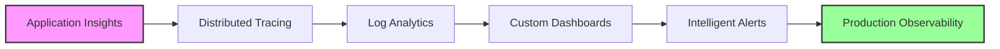

# Module 19: Monitoring and Observability

## 🎯 Module Overview

Welcome to Module 19 of the Mastery AI Code Development Workshop! This enterprise-level module focuses on implementing comprehensive monitoring and observability solutions using Azure Monitor, Application Insights, and industry-standard practices. You'll learn to build production-grade monitoring systems with AI-powered insights.

### Duration
- **Total Time**: 3 hours
- **Exercises**: 3 progressive challenges (30-90 minutes each)

### Track
🔴 **Enterprise Track** - Building on security implementation and enterprise patterns from previous modules

## 🎓 Learning Objectives

By the end of this module, you will be able to:

1. **Implement Application Performance Monitoring (APM)**
   - Set up Application Insights for full-stack monitoring
   - Implement distributed tracing across microservices
   - Monitor performance metrics and detect anomalies

2. **Design Centralized Logging Systems**
   - Implement structured logging patterns
   - Build log aggregation pipelines
   - Create efficient log queries with KQL

3. **Build Real-time Dashboards**
   - Design informative Azure dashboards
   - Create custom workbooks and visualizations
   - Integrate with Grafana for advanced scenarios

4. **Implement Proactive Monitoring**
   - Set up intelligent alerts and automation
   - Build predictive monitoring solutions
   - Create self-healing systems

5. **Apply Observability Best Practices**
   - Implement the three pillars: logs, metrics, traces
   - Design for cloud-native observability
   - Optimize monitoring costs

## 📚 Prerequisites

Before starting this module, ensure you have:

### Required Knowledge
- ✅ Completed Modules 16-18 (Security, GitHub Models, Enterprise Integration)
- ✅ Understanding of distributed systems architecture
- ✅ Experience with microservices and containers
- ✅ Basic knowledge of metrics and logging concepts

### Technical Requirements
- 🐍 Python 3.11+ installed
- 🤖 GitHub Copilot active subscription
- ☁️ Azure subscription with available credits
- 🐋 Docker Desktop running
- 📊 VS Code with Azure extensions

### Azure Resources Needed
- Azure Monitor workspace
- Application Insights instance
- Log Analytics workspace
- Azure Managed Grafana (optional)
- Storage account for logs

## 🗂️ Module Structure

```
module-19-monitoring-observability/
├── README.md                      # This file
├── prerequisites.md               # Detailed setup instructions
├── exercises/
│   ├── exercise1-foundation/      # APM implementation (⭐)
│   │   ├── instructions/
│   │   │   ├── part1.md         # Setup and basics
│   │   │   └── part2.md         # Implementation
│   │   ├── starter/
│   │   ├── solution/
│   │   └── tests/
│   ├── exercise2-application/     # Distributed tracing (⭐⭐)
│   │   └── [same structure]
│   └── exercise3-mastery/         # Production monitoring (⭐⭐⭐)
│       └── [same structure]
├── best-practices.md             # Production patterns
├── resources/
│   ├── monitoring-templates/
│   ├── dashboard-samples/
│   ├── alert-rules/
│   └── kql-queries/
└── troubleshooting.md           # Common issues

```

## 🏃‍♂️ Quick Start

1. **Set up your environment**:
   ```bash
   cd modules/module-19-monitoring-observability
   ./scripts/setup-module19.sh
   ```

2. **Verify prerequisites**:
   ```bash
   python scripts/verify-setup.py
   ```

3. **Start with Exercise 1**:
   ```bash
   cd exercises/exercise1-foundation
   code .
   ```

## 📝 Exercises Overview

### Exercise 1: Foundation - Application Performance Monitoring (⭐)
**Duration**: 30-45 minutes  
**Focus**: Implement comprehensive APM with Application Insights
- Auto-instrumentation setup
- Custom metrics and events
- Performance profiling
- Basic alerting

### Exercise 2: Application - Distributed Tracing System (⭐⭐)
**Duration**: 45-60 minutes  
**Focus**: Build end-to-end tracing across microservices
- OpenTelemetry integration
- Correlation across services
- Trace visualization
- Performance optimization

### Exercise 3: Mastery - Enterprise Observability Platform (⭐⭐⭐)
**Duration**: 60-90 minutes  
**Focus**: Create a complete monitoring solution for production
- Multi-cloud monitoring
- Advanced dashboards
- AI-powered insights
- Cost optimization

## 🎯 Learning Path



## 🤖 GitHub Copilot Tips for This Module

### Effective Prompts for Monitoring

1. **For APM Setup**:
   ```python
   # Create Application Insights instrumentation that:
   # - Auto-tracks HTTP requests and dependencies
   # - Captures custom metrics for business KPIs
   # - Implements sampling for cost control
   # - Includes correlation headers
   ```

2. **For Log Aggregation**:
   ```python
   # Implement structured logging with:
   # - Correlation IDs across services
   # - Log levels (DEBUG, INFO, WARN, ERROR)
   # - JSON format for easy parsing
   # - Automatic PII redaction
   ```

3. **For Dashboard Creation**:
   ```python
   # Generate KQL query for dashboard showing:
   # - Request success rate by endpoint
   # - P95 latency trends
   # - Error rate with drill-down
   # - Resource utilization metrics
   ```

## 📊 Success Metrics

You'll know you've mastered this module when you can:

- ✅ Detect and diagnose issues in < 5 minutes
- ✅ Track custom business metrics automatically
- ✅ Build dashboards that tell a story
- ✅ Implement proactive alerting with < 1% false positives
- ✅ Optimize monitoring costs by 30% or more
- ✅ Create self-documenting observability systems

## 🔗 Resources

### Official Documentation
- [Azure Monitor Overview](https://learn.microsoft.com/azure/azure-monitor/)
- [Application Insights](https://learn.microsoft.com/azure/azure-monitor/app/app-insights-overview)
- [Log Analytics](https://learn.microsoft.com/azure/azure-monitor/logs/log-analytics-overview)
- [Azure Workbooks](https://learn.microsoft.com/azure/azure-monitor/visualize/workbooks-overview)
- [KQL Reference](https://learn.microsoft.com/azure/data-explorer/kusto/query/)

### Recommended Reading
- [Distributed Systems Observability](https://www.oreilly.com/library/view/distributed-systems-observability/9781492033431/)
- [The Site Reliability Workbook](https://sre.google/workbook/table-of-contents/)
- [Observability Engineering](https://www.honeycomb.io/oreilly-observability-engineering/)

## 🚀 Next Steps

After completing this module, you'll be ready for:
- **Module 20**: Production Deployment Strategies
- **Module 21**: Introduction to AI Agents
- Building enterprise monitoring solutions
- Implementing AIOps practices

## 💡 Pro Tips

1. **Start with the Golden Signals** - Latency, Traffic, Errors, Saturation
2. **Instrument early and often** - Observability is not an afterthought
3. **Use sampling wisely** - Balance visibility with cost
4. **Automate everything** - From deployment to alerting
5. **Let Copilot help with KQL** - It's excellent at query generation

## 🆘 Getting Help

- Check the [troubleshooting guide](./troubleshooting.md)
- Review [best practices](./best-practices.md)
- Ask in the workshop Discussions
- Tag issues with `module-19`

---

Ready to achieve complete observability? Let's begin with Exercise 1! 🚀
