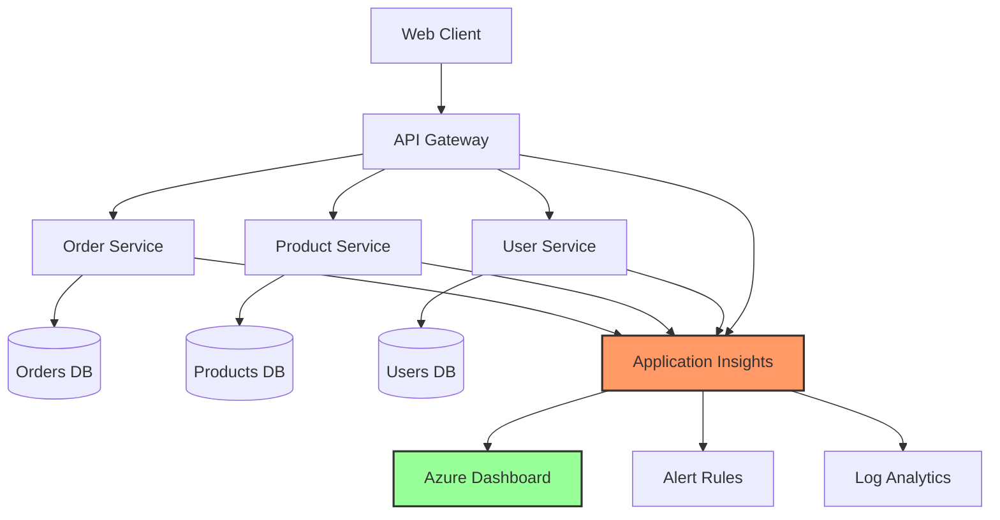

# Exercise 1: Application Performance Monitoring Foundation (⭐)

## 🎯 Exercise Overview

**Duration**: 30-45 minutes  
**Difficulty**: ⭐ (Easy)  
**Success Rate**: 95%

In this foundation exercise, you'll implement comprehensive Application Performance Monitoring (APM) using Azure Application Insights and GitHub Copilot's assistance. You'll learn to instrument applications, track custom metrics, and create basic alerts.

## 🎓 Learning Objectives

By completing this exercise, you will:
- Set up Application Insights with auto-instrumentation
- Implement custom metrics and events tracking
- Create structured logging with correlation
- Build basic performance dashboards
- Configure intelligent alerts

## 📋 Prerequisites

- ✅ Module 19 environment set up
- ✅ Application Insights instance created
- ✅ Python virtual environment activated
- ✅ GitHub Copilot enabled in VS Code

## 🏗️ What You'll Build

A microservices application with comprehensive monitoring:



## 🚀 Part 1: Setting Up the Foundation

### Step 1: Project Structure

Create the following directory structure:

```
exercise1-foundation/
├── services/
│   ├── api_gateway/
│   │   ├── main.py
│   │   ├── monitoring.py
│   │   └── requirements.txt
│   ├── order_service/
│   │   ├── main.py
│   │   ├── monitoring.py
│   │   └── requirements.txt
│   └── shared/
│       ├── __init__.py
│       ├── telemetry.py
│       └── logging_config.py
├── monitoring/
│   ├── dashboards/
│   ├── alerts/
│   └── queries/
├── tests/
│   └── test_monitoring.py
├── docker-compose.yml
└── .env
```

### Step 2: Install Dependencies

Create `services/shared/requirements.txt`:

```txt
# Core
fastapi==0.104.1
uvicorn[standard]==0.24.0
httpx==0.25.1

# Azure Monitoring
azure-monitor-opentelemetry==1.1.0
azure-monitor-opentelemetry-exporter==1.0.0b20
applicationinsights==0.11.10

# OpenTelemetry
opentelemetry-api==1.21.0
opentelemetry-sdk==1.21.0
opentelemetry-instrumentation-fastapi==0.42b0
opentelemetry-instrumentation-httpx==0.42b0

# Logging
structlog==23.2.0
python-json-logger==2.0.7

# Utilities
python-dotenv==1.0.0
pydantic==2.5.0
```

### Step 3: Create Telemetry Configuration

Create `services/shared/telemetry.py`:

**🤖 Copilot Prompt Suggestion #1:**
```python
# Create a comprehensive telemetry configuration that:
# - Initializes Application Insights with connection string
# - Sets up OpenTelemetry tracing and metrics
# - Configures automatic instrumentation for FastAPI and HTTP clients
# - Implements custom dimensions for all telemetry
# - Includes sampling configuration for cost control
# - Provides decorators for custom metric tracking
# Include error handling and graceful degradation
```

**Expected Output Structure:**
```python
import os
from typing import Dict, Any, Optional
from functools import wraps
import time
from opentelemetry import trace, metrics
from opentelemetry.sdk.trace import TracerProvider
from opentelemetry.sdk.metrics import MeterProvider
from azure.monitor.opentelemetry import configure_azure_monitor
from applicationinsights import TelemetryClient
import structlog

logger = structlog.get_logger()

class TelemetryManager:
    def __init__(self):
        self.tracer = None
        self.meter = None
        self.telemetry_client = None
        self._initialized = False
        
    def initialize(self, service_name: str, connection_string: str = None):
        """Initialize telemetry with Application Insights."""
        try:
            # Get connection string from env if not provided
            connection_string = connection_string or os.getenv(
                "APPLICATIONINSIGHTS_CONNECTION_STRING"
            )
            
            if not connection_string:
                logger.warning("No Application Insights connection string found")
                return
            
            # Configure Azure Monitor with OpenTelemetry
            configure_azure_monitor(
                connection_string=connection_string,
                disable_offline_storage=False,
                service_name=service_name,
                service_version="1.0.0"
            )
            
            # Set up tracer
            self.tracer = trace.get_tracer(service_name)
            
            # Set up meter for custom metrics
            self.meter = metrics.get_meter(service_name)
            
            # Initialize Application Insights client for custom events
            self.telemetry_client = TelemetryClient(connection_string)
            
            self._initialized = True
            logger.info(f"Telemetry initialized for service: {service_name}")
            
        except Exception as e:
            logger.error(f"Failed to initialize telemetry: {e}")
```

### Step 4: Implement Structured Logging

Create `services/shared/logging_config.py`:

**🤖 Copilot Prompt Suggestion #2:**
```python
# Create a structured logging configuration that:
# - Uses structlog with JSON formatting
# - Includes correlation IDs for request tracing
# - Automatically adds service metadata to all logs
# - Integrates with Application Insights
# - Implements log level filtering based on environment
# - Sanitizes sensitive data (PII, passwords, tokens)
```

### Step 5: Create the API Gateway Service

Create `services/api_gateway/main.py`:

```python
from fastapi import FastAPI, Request, Response
from fastapi.middleware.cors import CORSMiddleware
import httpx
import asyncio
from typing import Dict, Any
import uuid
from datetime import datetime

from shared.telemetry import TelemetryManager
from shared.logging_config import configure_logging

# Initialize logging and telemetry
logger = configure_logging("api-gateway")
telemetry = TelemetryManager()
telemetry.initialize("api-gateway")

app = FastAPI(title="API Gateway")

# Add CORS middleware
app.add_middleware(
    CORSMiddleware,
    allow_origins=["*"],
    allow_methods=["*"],
    allow_headers=["*"],
)

# Service endpoints
SERVICES = {
    "orders": "http://order-service:8001",
    "products": "http://product-service:8002",
    "users": "http://user-service:8003"
}

@app.middleware("http")
async def monitoring_middleware(request: Request, call_next):
    """Add monitoring to all requests."""
    # Generate correlation ID
    correlation_id = str(uuid.uuid4())
    request.state.correlation_id = correlation_id
    
    # Start span
    with telemetry.tracer.start_as_current_span(
        f"{request.method} {request.url.path}"
    ) as span:
        span.set_attribute("http.method", request.method)
        span.set_attribute("http.url", str(request.url))
        span.set_attribute("correlation_id", correlation_id)
        
        # Track custom metric
        start_time = datetime.utcnow()
        
        try:
            response = await call_next(request)
            
            # Log successful request
            duration = (datetime.utcnow() - start_time).total_seconds()
            logger.info(
                "Request completed",
                method=request.method,
                path=request.url.path,
                status_code=response.status_code,
                duration=duration,
                correlation_id=correlation_id
            )
            
            # Track metrics
            if telemetry._initialized:
                telemetry.telemetry_client.track_metric(
                    "request_duration",
                    duration,
                    properties={
                        "endpoint": request.url.path,
                        "method": request.method,
                        "status_code": str(response.status_code)
                    }
                )
            
            return response
            
        except Exception as e:
            logger.error(
                "Request failed",
                error=str(e),
                correlation_id=correlation_id
            )
            raise
```

### Step 6: Add Custom Metrics

Create `services/api_gateway/monitoring.py`:

**🤖 Copilot Prompt Suggestion #3:**
```python
# Create monitoring utilities that:
# - Track business metrics (orders per minute, revenue, user activity)
# - Implement performance counters with percentiles
# - Create custom events for important business actions
# - Add dependency tracking for external service calls
# - Include A/B testing metric collection
# - Provide health check endpoint with detailed status
```

### Step 7: Create Order Service with Monitoring

Create `services/order_service/main.py`:

```python
from fastapi import FastAPI, HTTPException
from pydantic import BaseModel
from typing import List, Optional
from datetime import datetime
import random
import asyncio

from shared.telemetry import TelemetryManager
from shared.logging_config import configure_logging

# Initialize
logger = configure_logging("order-service")
telemetry = TelemetryManager()
telemetry.initialize("order-service")

app = FastAPI(title="Order Service")

class Order(BaseModel):
    id: Optional[str] = None
    user_id: str
    product_id: str
    quantity: int
    total_amount: float
    status: str = "pending"
    created_at: Optional[datetime] = None

# In-memory storage for demo
orders_db: Dict[str, Order] = {}

@app.post("/orders", response_model=Order)
async def create_order(order: Order):
    """Create a new order with monitoring."""
    with telemetry.tracer.start_as_current_span("create_order") as span:
        # Add order attributes to span
        span.set_attribute("order.user_id", order.user_id)
        span.set_attribute("order.product_id", order.product_id)
        span.set_attribute("order.quantity", order.quantity)
        span.set_attribute("order.amount", order.total_amount)
        
        # Simulate processing time
        processing_time = random.uniform(0.1, 0.5)
        await asyncio.sleep(processing_time)
        
        # Create order
        order.id = str(uuid.uuid4())
        order.created_at = datetime.utcnow()
        orders_db[order.id] = order
        
        # Track business metrics
        if telemetry._initialized:
            # Track order value
            telemetry.telemetry_client.track_metric(
                "order_value",
                order.total_amount,
                properties={
                    "product_id": order.product_id,
                    "quantity": str(order.quantity)
                }
            )
            
            # Track custom event
            telemetry.telemetry_client.track_event(
                "OrderCreated",
                properties={
                    "order_id": order.id,
                    "user_id": order.user_id,
                    "amount": str(order.total_amount)
                },
                measurements={
                    "processing_time": processing_time,
                    "quantity": order.quantity
                }
            )
        
        logger.info(
            "Order created",
            order_id=order.id,
            amount=order.total_amount,
            processing_time=processing_time
        )
        
        return order
```

Continue to [Part 2 →](./part2.md) for dashboard creation and alerting setup.