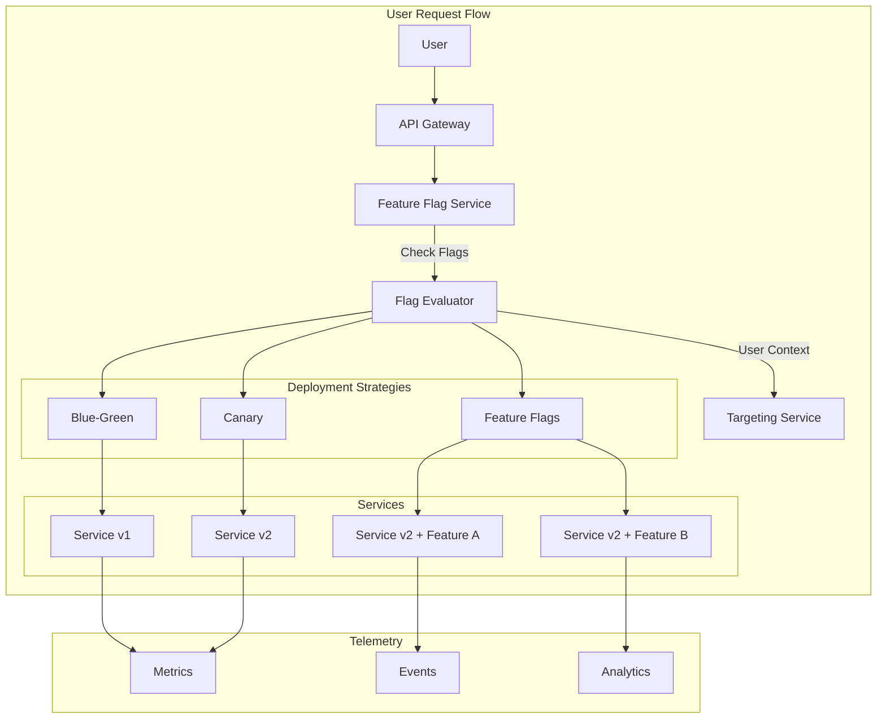

# Exercise 3: Feature Flags & Progressive Delivery (⭐⭐⭐ Mastery)

## 🎯 Exercise Overview

In this mastery-level exercise, you'll build a comprehensive feature flag system that integrates with your deployment strategies. You'll implement percentage rollouts, user targeting, and complex deployment orchestration that combines blue-green, canary, and feature flags for ultimate control.

**Duration**: 60-90 minutes  
**Difficulty**: ⭐⭐⭐ Mastery  
**Success Rate**: 60%

## 🎓 Learning Objectives

By completing this exercise, you will:

1. **Build a Feature Flag Service**: Create a distributed feature flag system
2. **Implement Smart Targeting**: User segmentation and percentage rollouts
3. **Design Flag Hierarchies**: Dependencies and inheritance
4. **Create Progressive Delivery**: Combine all deployment strategies
5. **Build Kill Switches**: Emergency feature disabling
6. **Implement Telemetry**: Track feature usage and impact

## 📚 Concepts Covered

### Progressive Delivery Architecture



## 🛠️ Part 1: Feature Flag Service

### Step 1: Create Core Feature Flag System

**Copilot Prompt Suggestion:**
```python
# Create a feature flag service that:
# - Stores flag configurations with JSON schema validation
# - Supports boolean, string, number, and JSON flag types
# - Implements percentage rollout with consistent hashing
# - Provides user targeting based on attributes
# - Includes flag dependencies and prerequisites
# - Offers real-time flag updates via WebSocket
# - Tracks flag evaluation metrics
# Use FastAPI with Redis backend and WebSocket support
```

**Expected Output:**
Create `feature_flags/service.py`:
```python
from fastapi import FastAPI, WebSocket, HTTPException, Depends
from fastapi.middleware.cors import CORSMiddleware
from pydantic import BaseModel, Field, validator
from typing import Dict, List, Optional, Any, Union, Set
from datetime import datetime, timedelta
from enum import Enum
import json
import hashlib
import asyncio
import redis.asyncio as redis
from jsonschema import validate, ValidationError as JsonSchemaError
import logging
from dataclasses import dataclass, asdict
import uuid

logger = logging.getLogger(__name__)

app = FastAPI(title="Feature Flag Service")

# Add CORS middleware
app.add_middleware(
    CORSMiddleware,
    allow_origins=["*"],
    allow_methods=["*"],
    allow_headers=["*"],
)

# Redis connection
redis_client: Optional[redis.Redis] = None

class FlagType(str, Enum):
    BOOLEAN = "boolean"
    STRING = "string"
    NUMBER = "number"
    JSON = "json"

class TargetingOperator(str, Enum):
    EQUALS = "equals"
    NOT_EQUALS = "not_equals"
    CONTAINS = "contains"
    NOT_CONTAINS = "not_contains"
    IN = "in"
    NOT_IN = "not_in"
    GREATER_THAN = "greater_than"
    LESS_THAN = "less_than"
    REGEX = "regex"

@dataclass
class TargetingRule:
    attribute: str
    operator: TargetingOperator
    value: Any
    negate: bool = False

@dataclass
class RolloutStage:
    percentage: float
    value: Any
    start_time: Optional[datetime] = None
    end_time: Optional[datetime] = None

class FeatureFlagConfig(BaseModel):
    key: str = Field(..., description="Unique flag identifier")
    name: str = Field(..., description="Human-readable name")
    description: Optional[str] = None
    flag_type: FlagType = FlagType.BOOLEAN
    default_value: Any
    enabled: bool = True
    
    # Targeting
    targeting_enabled: bool = False
    targeting_rules: List[Dict[str, Any]] = []
    
    # Percentage rollout
    rollout_enabled: bool = False
    rollout_percentage: float = Field(0, ge=0, le=100)
    rollout_stages: List[Dict[str, Any]] = []
    
    # Advanced features
    prerequisites: List[str] = []  # Other flags that must be enabled
    variants: Dict[str, Any] = {}  # Named variants
    
    # Metadata
    tags: List[str] = []
    created_at: datetime = Field(default_factory=datetime.now)
    updated_at: datetime = Field(default_factory=datetime.now)
    created_by: Optional[str] = None
    
    # JSON Schema validation for JSON type flags
    value_schema: Optional[Dict[str, Any]] = None
    
    @validator('default_value')
    def validate_default_value(cls, v, values):
        """Validate default value matches flag type"""
        if 'flag_type' in values:
            flag_type = values['flag_type']
            if flag_type == FlagType.BOOLEAN and not isinstance(v, bool):
                raise ValueError("Default value must be boolean")
            elif flag_type == FlagType.STRING and not isinstance(v, str):
                raise ValueError("Default value must be string")
            elif flag_type == FlagType.NUMBER and not isinstance(v, (int, float)):
                raise ValueError("Default value must be number")
        return v

class FlagEvaluationContext(BaseModel):
    user_id: str
    attributes: Dict[str, Any] = {}
    request_id: Optional[str] = Field(default_factory=lambda: str(uuid.uuid4()))
    timestamp: datetime = Field(default_factory=datetime.now)

class FlagEvaluationResult(BaseModel):
    key: str
    value: Any
    variation: Optional[str] = None
    reason: str
    prerequisites_met: bool = True
    evaluation_details: Dict[str, Any] = {}

class FeatureFlagService:
    """
    Core feature flag service with advanced targeting and rollout
    """
    
    def __init__(self, redis_url: str):
        self.redis_url = redis_url
        self.websocket_connections: Set[WebSocket] = set()
        self.evaluation_cache: Dict[str, Tuple[Any, datetime]] = {}
        self.cache_ttl = timedelta(minutes=5)
        
    async def connect(self):
        """Initialize Redis connection"""
        global redis_client
        redis_client = await redis.from_url(self.redis_url)
        
    async def disconnect(self):
        """Close Redis connection"""
        if redis_client:
            await redis_client.close()
    
    async def create_flag(self, config: FeatureFlagConfig) -> bool:
        """Create a new feature flag"""
        try:
            # Store flag configuration
            flag_key = f"flag:{config.key}"
            
            # Check if flag already exists
            if await redis_client.exists(flag_key):
                raise HTTPException(status_code=409, detail="Flag already exists")
            
            # Validate JSON schema if provided
            if config.flag_type == FlagType.JSON and config.value_schema:
                try:
                    validate(config.default_value, config.value_schema)
                except JsonSchemaError as e:
                    raise HTTPException(status_code=400, detail=f"Invalid default value: {e}")
            
            # Store flag
            await redis_client.hset(
                flag_key,
                mapping={
                    "config": config.json(),
                    "created_at": datetime.now().isoformat(),
                    "evaluation_count": 0
                }
            )
            
            # Index by tags
            for tag in config.tags:
                await redis_client.sadd(f"tag:{tag}", config.key)
            
            # Notify WebSocket clients
            await self._notify_flag_update(config.key, "created")
            
            logger.info(f"Created feature flag: {config.key}")
            return True
            
        except Exception as e:
            logger.error(f"Failed to create flag: {e}")
            raise
    
    async def get_flag(self, key: str) -> Optional[FeatureFlagConfig]:
        """Get flag configuration"""
        flag_data = await redis_client.hget(f"flag:{key}", "config")
        if flag_data:
            return FeatureFlagConfig.parse_raw(flag_data)
        return None
    
    async def update_flag(self, key: str, updates: Dict[str, Any]) -> bool:
        """Update flag configuration"""
        try:
            # Get existing flag
            flag = await self.get_flag(key)
            if not flag:
                raise HTTPException(status_code=404, detail="Flag not found")
            
            # Apply updates
            flag_dict = flag.dict()
            flag_dict.update(updates)
            flag_dict["updated_at"] = datetime.now()
            
            # Create updated config
            updated_flag = FeatureFlagConfig(**flag_dict)
            
            # Store updated flag
            await redis_client.hset(
                f"flag:{key}",
                "config",
                updated_flag.json()
            )
            
            # Clear evaluation cache
            self._clear_cache_for_flag(key)
            
            # Notify WebSocket clients
            await self._notify_flag_update(key, "updated")
            
            logger.info(f"Updated feature flag: {key}")
            return True
            
        except Exception as e:
            logger.error(f"Failed to update flag: {e}")
            raise
    
    async def evaluate_flag(self, key: str, context: FlagEvaluationContext) -> FlagEvaluationResult:
        """
        Evaluate feature flag for given context
        """
        # Check cache first
        cache_key = f"{key}:{context.user_id}:{hash(json.dumps(context.attributes, sort_keys=True))}"
        if cache_key in self.evaluation_cache:
            cached_value, cached_time = self.evaluation_cache[cache_key]
            if datetime.now() - cached_time < self.cache_ttl:
                return FlagEvaluationResult(
                    key=key,
                    value=cached_value,
                    reason="cached",
                    evaluation_details={"cache_hit": True}
                )
        
        # Get flag configuration
        flag = await self.get_flag(key)
        if not flag:
            raise HTTPException(status_code=404, detail=f"Flag {key} not found")
        
        # Track evaluation
        await redis_client.hincrby(f"flag:{key}", "evaluation_count", 1)
        
        # Check if flag is enabled
        if not flag.enabled:
            return FlagEvaluationResult(
                key=key,
                value=flag.default_value,
                reason="flag_disabled"
            )
        
        # Check prerequisites
        prerequisites_met = await self._check_prerequisites(flag.prerequisites, context)
        if not prerequisites_met:
            return FlagEvaluationResult(
                key=key,
                value=flag.default_value,
                reason="prerequisites_not_met",
                prerequisites_met=False
            )
        
        # Evaluate targeting rules
        if flag.targeting_enabled and flag.targeting_rules:
            targeting_result = await self._evaluate_targeting(flag, context)
            if targeting_result is not None:
                result = FlagEvaluationResult(
                    key=key,
                    value=targeting_result,
                    reason="targeting_match"
                )
                self.evaluation_cache[cache_key] = (targeting_result, datetime.now())
                return result
        
        # Evaluate percentage rollout
        if flag.rollout_enabled:
            rollout_result = self._evaluate_rollout(flag, context)
            if rollout_result is not None:
                result = FlagEvaluationResult(
                    key=key,
                    value=rollout_result,
                    reason="rollout"
                )
                self.evaluation_cache[cache_key] = (rollout_result, datetime.now())
                return result
        
        # Return default value
        result = FlagEvaluationResult(
            key=key,
            value=flag.default_value,
            reason="default"
        )
        self.evaluation_cache[cache_key] = (flag.default_value, datetime.now())
        return result
    
    async def _check_prerequisites(self, prerequisites: List[str], context: FlagEvaluationContext) -> bool:
        """Check if all prerequisite flags are enabled"""
        for prereq_key in prerequisites:
            try:
                result = await self.evaluate_flag(prereq_key, context)
                if not result.value:  # Assuming boolean prerequisites
                    return False
            except:
                return False
        return True
    
    async def _evaluate_targeting(self, flag: FeatureFlagConfig, context: FlagEvaluationContext) -> Optional[Any]:
        """Evaluate targeting rules"""
        for rule_dict in flag.targeting_rules:
            rule = TargetingRule(**rule_dict)
            
            # Get attribute value
            attr_value = context.attributes.get(rule.attribute)
            if attr_value is None:
                continue
            
            # Evaluate rule
            match = self._evaluate_rule(rule, attr_value)
            
            if match:
                # Return variant or specific value
                if "return_value" in rule_dict:
                    return rule_dict["return_value"]
                elif "variant" in rule_dict and rule_dict["variant"] in flag.variants:
                    return flag.variants[rule_dict["variant"]]
                else:
                    return True  # For boolean flags
        
        return None
    
    def _evaluate_rule(self, rule: TargetingRule, value: Any) -> bool:
        """Evaluate a single targeting rule"""
        result = False
        
        if rule.operator == TargetingOperator.EQUALS:
            result = value == rule.value
        elif rule.operator == TargetingOperator.NOT_EQUALS:
            result = value != rule.value
        elif rule.operator == TargetingOperator.CONTAINS:
            result = str(rule.value) in str(value)
        elif rule.operator == TargetingOperator.NOT_CONTAINS:
            result = str(rule.value) not in str(value)
        elif rule.operator == TargetingOperator.IN:
            result = value in rule.value
        elif rule.operator == TargetingOperator.NOT_IN:
            result = value not in rule.value
        elif rule.operator == TargetingOperator.GREATER_THAN:
            result = float(value) > float(rule.value)
        elif rule.operator == TargetingOperator.LESS_THAN:
            result = float(value) < float(rule.value)
        elif rule.operator == TargetingOperator.REGEX:
            import re
            result = bool(re.match(rule.value, str(value)))
        
        return not result if rule.negate else result
    
    def _evaluate_rollout(self, flag: FeatureFlagConfig, context: FlagEvaluationContext) -> Optional[Any]:
        """Evaluate percentage rollout"""
        # Generate consistent hash for user
        hash_input = f"{flag.key}:{context.user_id}".encode()
        hash_value = int(hashlib.md5(hash_input).hexdigest(), 16)
        bucket = (hash_value % 10000) / 100  # 0-99.99
        
        # Check staged rollout
        if flag.rollout_stages:
            current_time = datetime.now()
            for stage_dict in flag.rollout_stages:
                stage = RolloutStage(**stage_dict)
                
                # Check if stage is active
                if stage.start_time and current_time < stage.start_time:
                    continue
                if stage.end_time and current_time > stage.end_time:
                    continue
                
                if bucket < stage.percentage:
                    return stage.value
        
        # Simple percentage rollout
        elif bucket < flag.rollout_percentage:
            # Return first variant or true for boolean
            if flag.variants:
                return list(flag.variants.values())[0]
            return True
        
        return None
    
    def _clear_cache_for_flag(self, key: str):
        """Clear evaluation cache for a specific flag"""
        keys_to_remove = [k for k in self.evaluation_cache.keys() if k.startswith(f"{key}:")]
        for k in keys_to_remove:
            del self.evaluation_cache[k]
    
    async def _notify_flag_update(self, key: str, action: str):
        """Notify WebSocket clients of flag updates"""
        message = json.dumps({
            "type": "flag_update",
            "flag_key": key,
            "action": action,
            "timestamp": datetime.now().isoformat()
        })
        
        # Send to all connected clients
        disconnected = set()
        for websocket in self.websocket_connections:
            try:
                await websocket.send_text(message)
            except:
                disconnected.add(websocket)
        
        # Remove disconnected clients
        self.websocket_connections -= disconnected
    
    async def get_all_flags(self, tags: Optional[List[str]] = None) -> List[FeatureFlagConfig]:
        """Get all flags, optionally filtered by tags"""
        if tags:
            # Get flags by tags
            flag_keys = set()
            for tag in tags:
                tag_flags = await redis_client.smembers(f"tag:{tag}")
                flag_keys.update(tag_flags)
        else:
            # Get all flags
            flag_keys = set()
            cursor = 0
            while True:
                cursor, keys = await redis_client.scan(cursor, match="flag:*", count=100)
                flag_keys.update(key.decode().split(":")[1] for key in keys)
                if cursor == 0:
                    break
        
        # Fetch configurations
        flags = []
        for key in flag_keys:
            flag = await self.get_flag(key)
            if flag:
                flags.append(flag)
        
        return flags
    
    async def bulk_evaluate(self, context: FlagEvaluationContext, 
                          flag_keys: Optional[List[str]] = None) -> Dict[str, Any]:
        """Evaluate multiple flags at once"""
        if not flag_keys:
            # Evaluate all flags
            all_flags = await self.get_all_flags()
            flag_keys = [f.key for f in all_flags]
        
        results = {}
        for key in flag_keys:
            try:
                result = await self.evaluate_flag(key, context)
                results[key] = {
                    "value": result.value,
                    "variation": result.variation,
                    "reason": result.reason
                }
            except Exception as e:
                logger.error(f"Failed to evaluate flag {key}: {e}")
                results[key] = {
                    "value": None,
                    "error": str(e)
                }
        
        return results

# Global service instance
flag_service = FeatureFlagService("redis://localhost:6379")

@app.on_event("startup")
async def startup_event():
    await flag_service.connect()

@app.on_event("shutdown")
async def shutdown_event():
    await flag_service.disconnect()

# API Endpoints
@app.post("/flags", response_model=Dict[str, Any])
async def create_flag(config: FeatureFlagConfig):
    """Create a new feature flag"""
    success = await flag_service.create_flag(config)
    return {"success": success, "flag_key": config.key}

@app.get("/flags/{key}", response_model=FeatureFlagConfig)
async def get_flag(key: str):
    """Get flag configuration"""
    flag = await flag_service.get_flag(key)
    if not flag:
        raise HTTPException(status_code=404, detail="Flag not found")
    return flag

@app.patch("/flags/{key}")
async def update_flag(key: str, updates: Dict[str, Any]):
    """Update flag configuration"""
    success = await flag_service.update_flag(key, updates)
    return {"success": success}

@app.post("/flags/{key}/evaluate", response_model=FlagEvaluationResult)
async def evaluate_flag(key: str, context: FlagEvaluationContext):
    """Evaluate a feature flag"""
    return await flag_service.evaluate_flag(key, context)

@app.post("/flags/evaluate", response_model=Dict[str, Any])
async def bulk_evaluate(context: FlagEvaluationContext, flag_keys: Optional[List[str]] = None):
    """Evaluate multiple flags"""
    return await flag_service.bulk_evaluate(context, flag_keys)

@app.get("/flags", response_model=List[FeatureFlagConfig])
async def list_flags(tags: Optional[List[str]] = None):
    """List all flags"""
    return await flag_service.get_all_flags(tags)

@app.websocket("/ws")
async def websocket_endpoint(websocket: WebSocket):
    """WebSocket endpoint for real-time updates"""
    await websocket.accept()
    flag_service.websocket_connections.add(websocket)
    
    try:
        while True:
            # Keep connection alive
            await websocket.receive_text()
    except:
        flag_service.websocket_connections.remove(websocket)
```

## 🎯 Part 2: Advanced Targeting and Segmentation

### Step 2: Create User Segmentation Service

**Copilot Prompt Suggestion:**
```python
# Create a user segmentation service that:
# - Defines user segments with complex rules
# - Supports real-time segment evaluation
# - Implements segment inheritance and composition
# - Provides segment size estimation
# - Tracks segment membership changes
# - Integrates with feature flags for targeted rollouts
# Use machine learning for predictive segmentation
```

**Expected Output:**
Create `feature_flags/segmentation.py`:
```python
import asyncio
from typing import Dict, List, Optional, Set, Tuple, Any
from datetime import datetime, timedelta
from dataclasses import dataclass, field
import json
import numpy as np
from sklearn.cluster import KMeans
from sklearn.preprocessing import StandardScaler
import pandas as pd
import redis.asyncio as redis
from pydantic import BaseModel, Field
import logging
from enum import Enum

logger = logging.getLogger(__name__)

class SegmentType(str, Enum):
    RULE_BASED = "rule_based"
    ML_BASED = "ml_based"
    COMPOSITE = "composite"
    DYNAMIC = "dynamic"

class SegmentOperator(str, Enum):
    AND = "and"
    OR = "or"
    NOT = "not"

@dataclass
class SegmentRule:
    """Individual rule for segment membership"""
    field: str
    operator: str
    value: Any
    weight: float = 1.0  # For scoring-based segments

@dataclass
class Segment:
    """User segment definition"""
    id: str
    name: str
    description: str
    type: SegmentType
    rules: List[SegmentRule] = field(default_factory=list)
    parent_segments: List[str] = field(default_factory=list)
    exclusion_segments: List[str] = field(default_factory=list)
    
    # ML-based segmentation
    ml_model_id: Optional[str] = None
    feature_columns: List[str] = field(default_factory=list)
    
    # Metadata
    created_at: datetime = field(default_factory=datetime.now)
    updated_at: datetime = field(default_factory=datetime.now)
    estimated_size: int = 0
    last_computed: Optional[datetime] = None
    
    # Performance optimization
    cache_ttl_seconds: int = 300
    priority: int = 0  # Higher priority segments evaluated first

class UserProfile(BaseModel):
    """User profile for segmentation"""
    user_id: str
    attributes: Dict[str, Any]
    behavioral_data: Dict[str, float] = {}
    segment_memberships: Set[str] = set()
    last_updated: datetime = Field(default_factory=datetime.now)

class SegmentationService:
    """
    Advanced user segmentation with ML capabilities
    """
    
    def __init__(self, redis_url: str):
        self.redis_url = redis_url
        self.redis_client: Optional[redis.Redis] = None
        self.segment_cache: Dict[str, Set[str]] = {}  # segment_id -> user_ids
        self.ml_models: Dict[str, Any] = {}  # model_id -> sklearn model
        self.scaler = StandardScaler()
        
    async def connect(self):
        """Initialize connections"""
        self.redis_client = await redis.from_url(self.redis_url)
        
    async def create_segment(self, segment: Segment) -> bool:
        """Create a new segment"""
        try:
            segment_key = f"segment:{segment.id}"
            
            # Validate segment doesn't exist
            if await self.redis_client.exists(segment_key):
                raise ValueError(f"Segment {segment.id} already exists")
            
            # Store segment definition
            await self.redis_client.hset(
                segment_key,
                mapping={
                    "definition": json.dumps(dataclass_to_dict(segment), default=str),
                    "created_at": datetime.now().isoformat()
                }
            )
            
            # Index by type
            await self.redis_client.sadd(f"segments:type:{segment.type}", segment.id)
            
            # Train ML model if needed
            if segment.type == SegmentType.ML_BASED:
                await self._train_ml_segment(segment)
            
            logger.info(f"Created segment: {segment.id}")
            return True
            
        except Exception as e:
            logger.error(f"Failed to create segment: {e}")
            raise
    
    async def evaluate_user_segments(self, user: UserProfile) -> Set[str]:
        """
        Evaluate which segments a user belongs to
        """
        user_segments = set()
        
        # Get all segments sorted by priority
        all_segments = await self._get_all_segments()
        all_segments.sort(key=lambda s: s.priority, reverse=True)
        
        for segment in all_segments:
            # Check cache first
            cache_key = f"segment_membership:{segment.id}:{user.user_id}"
            cached = await self.redis_client.get(cache_key)
            
            if cached is not None:
                if cached == "1":
                    user_segments.add(segment.id)
                continue
            
            # Evaluate segment membership
            is_member = await self._evaluate_segment_membership(user, segment, user_segments)
            
            # Cache result
            await self.redis_client.setex(
                cache_key,
                segment.cache_ttl_seconds,
                "1" if is_member else "0"
            )
            
            if is_member:
                user_segments.add(segment.id)
        
        # Update user profile
        user.segment_memberships = user_segments
        await self._update_user_profile(user)
        
        return user_segments
    
    async def _evaluate_segment_membership(self, user: UserProfile, segment: Segment, 
                                         current_segments: Set[str]) -> bool:
        """
        Evaluate if user belongs to a specific segment
        """
        # Check exclusions first
        for exclusion in segment.exclusion_segments:
            if exclusion in current_segments:
                return False
        
        # Check parent segments
        for parent in segment.parent_segments:
            if parent not in current_segments:
                return False
        
        # Evaluate based on segment type
        if segment.type == SegmentType.RULE_BASED:
            return self._evaluate_rules(user.attributes, segment.rules)
            
        elif segment.type == SegmentType.ML_BASED:
            return await self._evaluate_ml_segment(user, segment)
            
        elif segment.type == SegmentType.COMPOSITE:
            return await self._evaluate_composite_segment(user, segment, current_segments)
            
        elif segment.type == SegmentType.DYNAMIC:
            return await self._evaluate_dynamic_segment(user, segment)
        
        return False
    
    def _evaluate_rules(self, attributes: Dict[str, Any], rules: List[SegmentRule]) -> bool:
        """
        Evaluate rule-based segment membership
        """
        if not rules:
            return True
        
        # Default to AND operation between rules
        for rule in rules:
            if rule.field not in attributes:
                return False
            
            value = attributes[rule.field]
            
            # Evaluate based on operator
            if not self._evaluate_single_rule(value, rule.operator, rule.value):
                return False
        
        return True
    
    def _evaluate_single_rule(self, value: Any, operator: str, target: Any) -> bool:
        """Evaluate a single rule"""
        if operator == "equals":
            return value == target
        elif operator == "not_equals":
            return value != target
        elif operator == "greater_than":
            return float(value) > float(target)
        elif operator == "less_than":
            return float(value) < float(target)
        elif operator == "contains":
            return target in str(value)
        elif operator == "in":
            return value in target
        elif operator == "between":
            return target[0] <= float(value) <= target[1]
        elif operator == "regex":
            import re
            return bool(re.match(target, str(value)))
        
        return False
    
    async def _evaluate_ml_segment(self, user: UserProfile, segment: Segment) -> bool:
        """
        Evaluate ML-based segment membership
        """
        if segment.ml_model_id not in self.ml_models:
            # Load model from storage
            model = await self._load_ml_model(segment.ml_model_id)
            if not model:
                return False
            self.ml_models[segment.ml_model_id] = model
        
        # Extract features
        features = []
        for col in segment.feature_columns:
            if col in user.behavioral_data:
                features.append(user.behavioral_data[col])
            elif col in user.attributes:
                # Convert categorical to numeric if needed
                val = user.attributes[col]
                if isinstance(val, str):
                    # Simple hash encoding for demo
                    features.append(hash(val) % 1000)
                else:
                    features.append(float(val))
            else:
                features.append(0)  # Default value
        
        # Predict segment membership
        try:
            features_array = np.array(features).reshape(1, -1)
            features_scaled = self.scaler.transform(features_array)
            prediction = self.ml_models[segment.ml_model_id].predict(features_scaled)
            return bool(prediction[0])
        except Exception as e:
            logger.error(f"ML prediction failed: {e}")
            return False
    
    async def _evaluate_composite_segment(self, user: UserProfile, segment: Segment,
                                        current_segments: Set[str]) -> bool:
        """
        Evaluate composite segment with boolean logic
        """
        # Composite segments combine other segments with AND/OR/NOT logic
        # Example: "High Value AND (iOS OR Android) AND NOT Churned"
        
        # For demo, using simple AND logic with parent segments
        return all(parent in current_segments for parent in segment.parent_segments)
    
    async def _evaluate_dynamic_segment(self, user: UserProfile, segment: Segment) -> bool:
        """
        Evaluate dynamic segment based on real-time data
        """
        # Dynamic segments use real-time data sources
        # For example: "Users currently in checkout process"
        
        # Check real-time user activity
        activity_key = f"user_activity:{user.user_id}"
        current_activity = await self.redis_client.get(activity_key)
        
        if current_activity:
            activity_data = json.loads(current_activity)
            
            # Example: Check if user is in specific flow
            if segment.id == "checkout_abandoners":
                in_checkout = activity_data.get("current_page", "").startswith("/checkout")
                checkout_duration = activity_data.get("page_duration_seconds", 0)
                return in_checkout and checkout_duration > 300  # 5 minutes
        
        return False
    
    async def _train_ml_segment(self, segment: Segment):
        """
        Train ML model for segment prediction
        """
        # In production, this would load historical data and train a model
        # For demo, creating a simple clustering model
        
        # Generate synthetic training data
        n_samples = 1000
        n_features = len(segment.feature_columns)
        
        # Create two clusters
        cluster1 = np.random.randn(n_samples // 2, n_features) + np.array([2] * n_features)
        cluster2 = np.random.randn(n_samples // 2, n_features) + np.array([-2] * n_features)
        X = np.vstack([cluster1, cluster2])
        
        # Train KMeans
        model = KMeans(n_clusters=2, random_state=42)
        model.fit(self.scaler.fit_transform(X))
        
        # Store model
        self.ml_models[segment.ml_model_id] = model
        
        # Save model to Redis (in production, use proper model storage)
        model_key = f"ml_model:{segment.ml_model_id}"
        await self.redis_client.set(model_key, "model_placeholder")
    
    async def _load_ml_model(self, model_id: str):
        """Load ML model from storage"""
        # In production, deserialize from proper storage
        # For demo, return placeholder
        return KMeans(n_clusters=2)
    
    async def estimate_segment_size(self, segment_id: str) -> int:
        """
        Estimate the size of a segment
        """
        # Get sample of users
        sample_size = 1000
        sample_users = await self._get_user_sample(sample_size)
        
        # Evaluate segment for sample
        matches = 0
        for user_data in sample_users:
            user = UserProfile(**user_data)
            segments = await self.evaluate_user_segments(user)
            if segment_id in segments:
                matches += 1
        
        # Extrapolate to total user base
        total_users = await self.redis_client.get("stats:total_users") or 1000000
        estimated_size = int((matches / sample_size) * int(total_users))
        
        # Update segment with estimate
        segment_key = f"segment:{segment_id}"
        await self.redis_client.hset(segment_key, "estimated_size", estimated_size)
        
        return estimated_size
    
    async def _get_user_sample(self, size: int) -> List[Dict[str, Any]]:
        """Get random sample of users"""
        # In production, this would query user database
        # For demo, generating synthetic users
        users = []
        for i in range(size):
            users.append({
                "user_id": f"user_{i}",
                "attributes": {
                    "age": np.random.randint(18, 65),
                    "country": np.random.choice(["US", "UK", "CA", "AU"]),
                    "platform": np.random.choice(["web", "ios", "android"]),
                    "lifetime_value": np.random.exponential(100)
                },
                "behavioral_data": {
                    "session_count": np.random.poisson(10),
                    "purchase_count": np.random.poisson(2),
                    "days_since_last_visit": np.random.exponential(7)
                }
            })
        return users
    
    async def _get_all_segments(self) -> List[Segment]:
        """Get all segment definitions"""
        segments = []
        
        # Get all segment IDs
        cursor = 0
        while True:
            cursor, keys = await self.redis_client.scan(
                cursor, match="segment:*", count=100
            )
            
            for key in keys:
                segment_data = await self.redis_client.hget(key, "definition")
                if segment_data:
                    segment_dict = json.loads(segment_data)
                    # Convert dict back to Segment dataclass
                    segments.append(Segment(**segment_dict))
            
            if cursor == 0:
                break
        
        return segments
    
    async def _update_user_profile(self, user: UserProfile):
        """Update user profile in storage"""
        user_key = f"user_profile:{user.user_id}"
        await self.redis_client.hset(
            user_key,
            mapping={
                "attributes": json.dumps(user.attributes),
                "behavioral_data": json.dumps(user.behavioral_data),
                "segment_memberships": json.dumps(list(user.segment_memberships)),
                "last_updated": user.last_updated.isoformat()
            }
        )
    
    async def create_segment_overlap_report(self) -> Dict[str, Any]:
        """
        Analyze overlap between segments
        """
        segments = await self._get_all_segments()
        overlap_matrix = {}
        
        # Sample users for analysis
        sample_users = await self._get_user_sample(1000)
        
        # Build segment membership matrix
        segment_members = {s.id: set() for s in segments}
        
        for user_data in sample_users:
            user = UserProfile(**user_data)
            user_segments = await self.evaluate_user_segments(user)
            
            for seg_id in user_segments:
                segment_members[seg_id].add(user.user_id)
        
        # Calculate overlaps
        for seg1 in segments:
            overlap_matrix[seg1.id] = {}
            for seg2 in segments:
                if seg1.id != seg2.id:
                    overlap = len(
                        segment_members[seg1.id] & segment_members[seg2.id]
                    )
                    overlap_pct = (overlap / len(segment_members[seg1.id]) * 100) if segment_members[seg1.id] else 0
                    overlap_matrix[seg1.id][seg2.id] = {
                        "count": overlap,
                        "percentage": round(overlap_pct, 2)
                    }
        
        return {
            "segments": [s.name for s in segments],
            "overlap_matrix": overlap_matrix,
            "report_time": datetime.now().isoformat()
        }

def dataclass_to_dict(obj):
    """Convert dataclass to dict for JSON serialization"""
    if hasattr(obj, '__dataclass_fields__'):
        return {k: dataclass_to_dict(v) for k, v in obj.__dict__.items()}
    elif isinstance(obj, list):
        return [dataclass_to_dict(item) for item in obj]
    elif isinstance(obj, dict):
        return {k: dataclass_to_dict(v) for k, v in obj.items()}
    else:
        return obj

# Predefined segments for common use cases
PREDEFINED_SEGMENTS = [
    Segment(
        id="high_value_users",
        name="High Value Users",
        description="Users with high lifetime value",
        type=SegmentType.RULE_BASED,
        rules=[
            SegmentRule("lifetime_value", "greater_than", 500),
            SegmentRule("purchase_count", "greater_than", 5)
        ],
        priority=10
    ),
    Segment(
        id="new_users",
        name="New Users",
        description="Users who signed up in the last 7 days",
        type=SegmentType.RULE_BASED,
        rules=[
            SegmentRule("days_since_signup", "less_than", 7)
        ],
        priority=5
    ),
    Segment(
        id="at_risk_churn",
        name="At Risk of Churn",
        description="Users showing signs of disengagement",
        type=SegmentType.ML_BASED,
        ml_model_id="churn_prediction_v1",
        feature_columns=[
            "days_since_last_visit",
            "session_count_last_30_days",
            "purchase_count_last_90_days"
        ],
        priority=15
    ),
    Segment(
        id="mobile_power_users",
        name="Mobile Power Users",
        description="Highly engaged mobile app users",
        type=SegmentType.COMPOSITE,
        parent_segments=["high_engagement"],
        rules=[
            SegmentRule("platform", "in", ["ios", "android"]),
            SegmentRule("app_sessions_per_week", "greater_than", 10)
        ],
        priority=8
    )
]
```

## 🔄 Part 3: Progressive Delivery Orchestration

Continue to [Part 2](./exercise3-part2.md) for building the orchestration layer that combines all deployment strategies...