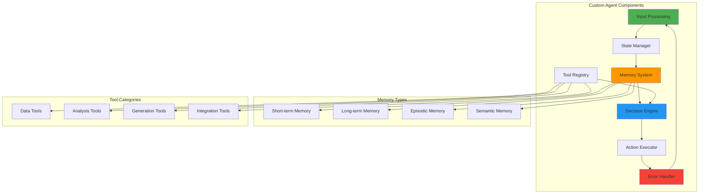

[🠠Workshop](../../README.md) > [📚 Modules](../README.md) > [Module 22](README.md)

[â¬…ï¸ Module 21: Introduction to AI Agents](../module-21/README.md) | **📖 Module 22: Building Custom Agents** | [Module 23: Model Context Protocol (MCP) â¡ï¸](../module-23/README.md)

---

# Module 22: Building Custom Agents

## 🯠Module Overview

Welcome to Module 22! Building on the foundations from Module 21, this module dives deep into creating sophisticated custom agents with complex behaviors. You'll master state management, memory systems, specialized tool integration, and domain-specific agent development that solves real business problems.

### Duration
- **Total Time**: 3 hours
- **Lecture/Demo**: 45 minutes
- **Hands-on Exercises**: 2 hours 15 minutes

### Track
- 🟣 AI Agents & MCP Track (Modules 21-25)

## 📠Learning Objectives

By the end of this module, you will be able to:

1. **Design Custom Agent Architectures** - Create agents tailored to specific domains
2. **Implement Memory and State Management** - Build agents that remember and learn
3. **Create Specialized Tool Functions** - Develop custom tools for agent capabilities
4. **Handle Agent Errors and Fallbacks** - Build resilient agents with graceful degradation
5. **Build Domain-Specific Agents** - Create agents for real business applications

## 🔧 Prerequisites

- ✅ Completed Module 21: Introduction to AI Agents
- ✅ Strong understanding of agent architectures
- ✅ Experience with async programming
- ✅ Familiarity with state management patterns
- ✅ Knowledge of error handling strategies

See [prerequisites.md](prerequisites.md) for detailed setup instructions.

## 📚 Key Concepts

### Advanced Agent Architecture

```mermaid
graph TB
    subgraph "Custom Agent Components"
        A[Input Processing]
        B[State Manager]
        C[Memory System]
        D[Tool Registry]
        E[Decision Engine]
        F[Action Executor]
        G[Error Handler]
    end
    
    subgraph "Memory Types"
        H[Short-term Memory]
        I[Long-term Memory]
        J[Episodic Memory]
        K[Semantic Memory]
    end
    
    subgraph "Tool Categories"
        L[Data Tools]
        M[Analysis Tools]
        N[Generation Tools]
        O[Integration Tools]
    end
    
    A --> B
    B --> C
    C --> E
    D --> E
    E --> F
    F --> G
    G --> A
    
    C --> H
    C --> I
    C --> J
    C --> K
    
    D --> L
    D --> M
    D --> N
    D --> O
    
    style A fill:#4CAF50
    style E fill:#2196F3
    style C fill:#FF9800
    style G fill:#F44336
```

### Agent Specialization Patterns

1. **Task-Specific Agents**
   - Single purpose, highly optimized
   - Deep domain knowledge
   - Specialized tool sets

2. **Multi-Modal Agents**
   - Handle various input types
   - Cross-domain capabilities
   - Adaptive behaviors

3. **Collaborative Agents**
   - Work with other agents
   - Share knowledge and state
   - Coordinate actions

4. **Learning Agents**
   - Improve from experience
   - Adapt to user preferences
   - Optimize over time

## 🚀 What You'll Build

In this module, you'll create:

1. **Documentation Generation Agent** - Automatically creates and maintains documentation
2. **Database Migration Agent** - Safely manages database schema changes
3. **Architecture Decision Agent** - Analyzes and suggests architectural improvements

## 📊 Module Resources

- **Semantic Kernel Docs**: [Building AI Agents](https://learn.microsoft.com/semantic-kernel/agents)
- **LangChain Agents**: [Agent Documentation](https://python.langchain.com/docs/modules/agents/)
- **AutoGen Framework**: [Multi-Agent Systems](https://microsoft.github.io/autogen/)
- **Video Tutorial**: [Module 22 Walkthrough](https://workshop.com/module-22)

## â­ï¸ Next Steps

After completing this module, you'll be ready for:
- **Module 23**: Model Context Protocol (MCP)
- **Module 24**: Multi-Agent Orchestration

Let's build powerful custom agents that transform how we develop software!

---

## 🔗 Quick Links

### Module Resources
- [📋 Prerequisites](prerequisites.md)
- [📖 Best Practices](docs/best-practices.md)
- [🔧 Troubleshooting](docs/troubleshooting.md)
- [💡 Prompt Templates](docs/prompt-templates.md)

### Exercises
- [â­ Exercise 1 - Foundation](exercises/exercise1/README.md)
- [â­â­ Exercise 2 - Application](exercises/exercise2/README.md)
- [â­â­â­ Exercise 3 - Mastery](exercises/exercise3/README.md)

### Workshop Resources
- [🠠Workshop Home](../../README.md)
- [📚 All Modules](../../README.md#-complete-module-overview)
- [🚀 Quick Start](../../QUICKSTART.md)
- [â“ FAQ](../../FAQ.md)
- [🤖 Prompt Guide](../../PROMPT-GUIDE.md)
- [🔧 Troubleshooting](../../TROUBLESHOOTING.md)

---

## 🔗 Quick Links

### Module Resources
- [📋 Prerequisites](prerequisites.md)
- [📖 Best Practices](docs/best-practices.md)
- [🔧 Troubleshooting](docs/troubleshooting.md)
- [💡 Prompt Templates](docs/prompt-templates.md)

### Exercises
- [â­ Exercise 1 - Foundation](exercises/exercise1/README.md)
- [â­â­ Exercise 2 - Application](exercises/exercise2/README.md)
- [â­â­â­ Exercise 3 - Mastery](exercises/exercise3/README.md)

### Workshop Resources
- [🠠Workshop Home](../../README.md)
- [📚 All Modules](../../README.md#-complete-module-overview)
- [🚀 Quick Start](../../QUICKSTART.md)
- [â“ FAQ](../../FAQ.md)
- [🤖 Prompt Guide](../../PROMPT-GUIDE.md)
- [🔧 Troubleshooting](../../TROUBLESHOOTING.md)

---

## 🔗 Quick Links

### Module Resources
- [📋 Prerequisites](prerequisites.md)
- [📖 Best Practices](docs/best-practices.md)
- [🔧 Troubleshooting](docs/troubleshooting.md)
- [💡 Prompt Templates](docs/prompt-templates.md)

### Exercises
- [â­ Exercise 1 - Foundation](exercises/exercise1/README.md)
- [â­â­ Exercise 2 - Application](exercises/exercise2/README.md)
- [â­â­â­ Exercise 3 - Mastery](exercises/exercise3/README.md)

### Workshop Resources
- [🠠Workshop Home](../../README.md)
- [📚 All Modules](../../README.md#-complete-module-overview)
- [🚀 Quick Start](../../QUICKSTART.md)
- [â“ FAQ](../../FAQ.md)
- [🤖 Prompt Guide](../../PROMPT-GUIDE.md)
- [🔧 Troubleshooting](../../TROUBLESHOOTING.md)

## 🧭 Quick Navigation

<table>
<tr>
<td valign="top">

### 📖 Module Content
- [Overview](README.md)
- [Prerequisites](prerequisites.md)
- [Setup Guide](docs/setup.md)
- [Troubleshooting](docs/troubleshooting.md)

</td>
<td valign="top">

### 💻 Exercises
- [Exercise 1 - Foundation â­](exercises/exercise1/README.md)
- [Exercise 2 - Application â­â­](exercises/exercise2/README.md)
- [Exercise 3 - Mastery â­â­â­](exercises/exercise3/README.md)
- [Independent Project](project/README.md)

</td>
<td valign="top">

### 📚 Resources
- [Best Practices](docs/best-practices.md)
- [Common Patterns](docs/common-patterns.md)
- [Prompt Templates](docs/prompt-templates.md)
- [Additional Resources](resources/README.md)

</td>
</tr>
</table>

---

## 🌠Workshop Resources

| Core Documentation | Learning Resources | Tools & Scripts |
|:------------------:|:-----------------:|:---------------:|
| [🠠Home](../../README.md) | [🚀 Quick Start](../../QUICKSTART.md) | [ğŸ› ï¸ Scripts](../../scripts/README.md) |
| [📋 Prerequisites](../../PREREQUISITES.md) | [ⓠFAQ](../../FAQ.md) | [🔧 Setup](../../scripts/setup-workshop.sh) |
| [📚 All Modules](../README.md) | [🤖 Prompt Guide](../../PROMPT-GUIDE.md) | [✅ Validate](../../scripts/validate-prerequisites.sh) |
| [ğŸ—ºï¸ Learning Paths](../../README.md#-learning-paths) | [🔧 Troubleshooting](../../TROUBLESHOOTING.md) | [🧹 Cleanup](../../scripts/cleanup-resources.sh) |

### ğŸ·ï¸ Module Categories

| 🟢 Fundamentals | 🔵 Intermediate | 🟠 Advanced | 🔴 Enterprise | 🟣 AI Agents | ⭠Mastery |
|:---------------:|:---------------:|:-----------:|:-------------:|:------------:|:----------:|
| Modules 1-5 | Modules 6-10 | Modules 11-15 | Modules 16-20 | Modules 21-25 | Modules 26-30 |

---

## 🔗 Quick Links

### Module Resources
- [📋 Prerequisites](prerequisites.md)
- [📖 Best Practices](docs/best-practices.md)
- [🔧 Troubleshooting](docs/troubleshooting.md)
- [💡 Prompt Templates](docs/prompt-templates.md)

### Exercises
- [â­ Exercise 1 - Foundation](exercises/exercise1/README.md)
- [â­â­ Exercise 2 - Application](exercises/exercise2/README.md)
- [â­â­â­ Exercise 3 - Mastery](exercises/exercise3/README.md)

### Workshop Resources
- [🠠Workshop Home](../../README.md)
- [📚 All Modules](../../README.md#-complete-module-overview)
- [🚀 Quick Start](../../QUICKSTART.md)
- [â“ FAQ](../../FAQ.md)
- [🤖 Prompt Guide](../../PROMPT-GUIDE.md)
- [🔧 Troubleshooting](../../TROUBLESHOOTING.md)

## 🧭 Quick Navigation

<table>
<tr>
<td valign="top">

### 📖 Module Content
- [Overview](README.md)
- [Prerequisites](prerequisites.md)
- [Setup Guide](docs/setup.md)
- [Troubleshooting](docs/troubleshooting.md)

</td>
<td valign="top">

### 💻 Exercises
- [Exercise 1 - Foundation â­](exercises/exercise1/README.md)
- [Exercise 2 - Application â­â­](exercises/exercise2/README.md)
- [Exercise 3 - Mastery â­â­â­](exercises/exercise3/README.md)
- [Independent Project](project/README.md)

</td>
<td valign="top">

### 📚 Resources
- [Best Practices](docs/best-practices.md)
- [Common Patterns](docs/common-patterns.md)
- [Prompt Templates](docs/prompt-templates.md)
- [Additional Resources](resources/README.md)

</td>
</tr>
</table>

---

## 🌠Workshop Resources

| Core Documentation | Learning Resources | Tools & Scripts |
|:------------------:|:-----------------:|:---------------:|
| [🠠Home](../../README.md) | [🚀 Quick Start](../../QUICKSTART.md) | [ğŸ› ï¸ Scripts](../../scripts/README.md) |
| [📋 Prerequisites](../../PREREQUISITES.md) | [ⓠFAQ](../../FAQ.md) | [🔧 Setup](../../scripts/setup-workshop.sh) |
| [📚 All Modules](../README.md) | [🤖 Prompt Guide](../../PROMPT-GUIDE.md) | [✅ Validate](../../scripts/validate-prerequisites.sh) |
| [ğŸ—ºï¸ Learning Paths](../../README.md#-learning-paths) | [🔧 Troubleshooting](../../TROUBLESHOOTING.md) | [🧹 Cleanup](../../scripts/cleanup-resources.sh) |

### ğŸ·ï¸ Module Categories

| 🟢 Fundamentals | 🔵 Intermediate | 🟠 Advanced | 🔴 Enterprise | 🟣 AI Agents | ⭠Mastery |
|:---------------:|:---------------:|:-----------:|:-------------:|:------------:|:----------:|
| Modules 1-5 | Modules 6-10 | Modules 11-15 | Modules 16-20 | Modules 21-25 | Modules 26-30 |

---

## 🔗 Quick Links

### Module Resources
- [📋 Prerequisites](prerequisites.md)
- [📖 Best Practices](docs/best-practices.md)
- [🔧 Troubleshooting](docs/troubleshooting.md)
- [💡 Prompt Templates](docs/prompt-templates.md)

### Exercises
- [â­ Exercise 1 - Foundation](exercises/exercise1/README.md)
- [â­â­ Exercise 2 - Application](exercises/exercise2/README.md)
- [â­â­â­ Exercise 3 - Mastery](exercises/exercise3/README.md)

### Workshop Resources
- [🠠Workshop Home](../../README.md)
- [📚 All Modules](../../README.md#-complete-module-overview)
- [🚀 Quick Start](../../QUICKSTART.md)
- [â“ FAQ](../../FAQ.md)
- [🤖 Prompt Guide](../../PROMPT-GUIDE.md)
- [🔧 Troubleshooting](../../TROUBLESHOOTING.md)

## 🧭 Quick Navigation

<table>
<tr>
<td valign="top">

### 📖 Module Content
- [Overview](README.md)
- [Prerequisites](prerequisites.md)
- [Setup Guide](docs/setup.md)
- [Troubleshooting](docs/troubleshooting.md)

</td>
<td valign="top">

### 💻 Exercises
- [Exercise 1 - Foundation â­](exercises/exercise1/README.md)
- [Exercise 2 - Application â­â­](exercises/exercise2/README.md)
- [Exercise 3 - Mastery â­â­â­](exercises/exercise3/README.md)
- [Independent Project](project/README.md)

</td>
<td valign="top">

### 📚 Resources
- [Best Practices](docs/best-practices.md)
- [Common Patterns](docs/common-patterns.md)
- [Prompt Templates](docs/prompt-templates.md)
- [Additional Resources](resources/README.md)

</td>
</tr>
</table>

---

## 🌠Workshop Resources

| Core Documentation | Learning Resources | Tools & Scripts |
|:------------------:|:-----------------:|:---------------:|
| [🠠Home](../../README.md) | [🚀 Quick Start](../../QUICKSTART.md) | [ğŸ› ï¸ Scripts](../../scripts/README.md) |
| [📋 Prerequisites](../../PREREQUISITES.md) | [ⓠFAQ](../../FAQ.md) | [🔧 Setup](../../scripts/setup-workshop.sh) |
| [📚 All Modules](../README.md) | [🤖 Prompt Guide](../../PROMPT-GUIDE.md) | [✅ Validate](../../scripts/validate-prerequisites.sh) |
| [ğŸ—ºï¸ Learning Paths](../../README.md#-learning-paths) | [🔧 Troubleshooting](../../TROUBLESHOOTING.md) | [🧹 Cleanup](../../scripts/cleanup-resources.sh) |

### ğŸ·ï¸ Module Categories

| 🟢 Fundamentals | 🔵 Intermediate | 🟠 Advanced | 🔴 Enterprise | 🟣 AI Agents | ⭠Mastery |
|:---------------:|:---------------:|:-----------:|:-------------:|:------------:|:----------:|
| Modules 1-5 | Modules 6-10 | Modules 11-15 | Modules 16-20 | Modules 21-25 | Modules 26-30 |

