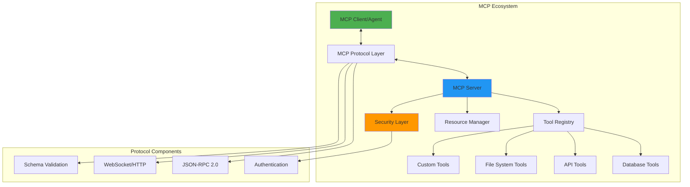

# Module 23: Model Context Protocol (MCP)

## 🎯 Module Overview

Welcome to Module 23! This module provides a deep dive into the Model Context Protocol (MCP), the universal standard for communication between AI agents and external tools. You'll learn to implement MCP servers and clients, build secure communication channels, and create interoperable agent systems.

### Duration
- **Total Time**: 3 hours
- **Lecture/Demo**: 45 minutes
- **Hands-on Exercises**: 2 hours 15 minutes

### Track
- 🟣 AI Agents & MCP Track (Modules 21-25)

## 🎓 Learning Objectives

By the end of this module, you will be able to:

1. **Understand MCP Architecture** - Master the protocol's design and communication patterns
2. **Build MCP Servers** - Create servers that expose tools and capabilities
3. **Implement MCP Clients** - Build clients that discover and use MCP services
4. **Secure MCP Communications** - Implement authentication and encryption
5. **Debug MCP Interactions** - Use tools to monitor and debug MCP traffic
6. **Design Interoperable Systems** - Create agents that work across platforms

## 🏗️ Module Architecture



## 📚 What is MCP?

The Model Context Protocol (MCP) is a standardized protocol that enables:

- **Universal Tool Access**: Any AI agent can use any MCP-compliant tool
- **Service Discovery**: Automatic discovery of available capabilities
- **Type Safety**: Strong typing and schema validation
- **Security**: Built-in authentication and authorization
- **Extensibility**: Easy to add new tools and capabilities

### Core Concepts

1. **MCP Server**: Exposes tools and resources through a standardized interface
2. **MCP Client**: Connects to servers and invokes tools
3. **Tools**: Functions that agents can call (database queries, API calls, etc.)
4. **Resources**: Data sources that agents can access
5. **Protocol**: JSON-RPC 2.0 over WebSocket or HTTP

## 🛠️ Key Technologies

- **Protocol**: JSON-RPC 2.0
- **Transport**: WebSocket, HTTP/2
- **Languages**: TypeScript/JavaScript (reference implementation), Python
- **Schema**: JSON Schema for validation
- **Security**: OAuth2, JWT, TLS

## 🚀 What You'll Build

In this module, you'll create:

1. **File System MCP Server** - Expose file operations through MCP
2. **Database MCP Gateway** - Provide database access via MCP
3. **Multi-Server MCP Client** - Agent that uses multiple MCP servers

## 📋 Prerequisites

Before starting this module, ensure you have:

- ✅ Completed Modules 21-22
- ✅ Understanding of JSON-RPC protocol
- ✅ Experience with WebSocket programming
- ✅ Basic knowledge of async/await patterns
- ✅ Familiarity with TypeScript or JavaScript

See [prerequisites.md](prerequisites.md) for detailed setup instructions.

## 📂 Module Structure

```
module-23-model-context-protocol/
├── README.md                          # This file
├── prerequisites.md                   # Setup requirements
├── best-practices.md                 # MCP implementation guidelines
├── troubleshooting.md               # Common issues and solutions
├── exercises/
│   ├── exercise1-filesystem-server/  # Build file system MCP server
│   ├── exercise2-database-gateway/   # Create database MCP gateway
│   └── exercise3-multi-server/       # Multi-server client implementation
├── resources/
│   ├── mcp-templates/               # Server and client templates
│   ├── protocol-specs/              # MCP specification docs
│   ├── testing-tools/               # MCP testing utilities
│   └── security-configs/            # Security configurations
├── scripts/
│   ├── setup-module.sh              # Environment setup
│   ├── start-mcp-servers.sh         # Start demo servers
│   ├── test-mcp-connection.sh       # Connection testing
│   └── generate-certs.sh            # TLS certificate generation
└── infrastructure/
    ├── docker/                      # MCP server containers
    └── kubernetes/                  # MCP deployment configs
```

## 🎯 Learning Path

### Step 1: Understanding MCP (30 mins)
- Protocol fundamentals
- Message format and flow
- Tool and resource concepts

### Step 2: Building MCP Servers (60 mins)
- Server architecture
- Tool implementation
- Resource exposure
- Error handling

### Step 3: Creating MCP Clients (45 mins)
- Client setup
- Server discovery
- Tool invocation
- Response handling

### Step 4: Advanced Topics (45 mins)
- Security implementation
- Performance optimization
- Debugging techniques
- Production deployment

## 💡 Real-World Applications

MCP enables powerful integrations:

- **Universal Database Access**: Any agent can query any database
- **File System Operations**: Agents can read/write files securely
- **API Gateways**: Expose any API through MCP
- **Tool Orchestration**: Chain multiple tools across servers
- **Cross-Platform Agents**: Agents that work with any MCP server

## 🧪 Hands-on Exercises

### [Exercise 1: File System MCP Server](exercises/exercise1-filesystem-server/) ⭐
Build an MCP server that safely exposes file system operations to agents.

### [Exercise 2: Database MCP Gateway](exercises/exercise2-database-gateway/) ⭐⭐
Create a gateway that provides database access through MCP with proper security.

### [Exercise 3: Multi-Server MCP Client](exercises/exercise3-multi-server/) ⭐⭐⭐
Implement an intelligent agent that discovers and uses multiple MCP servers.

## 📊 Module Resources

### Documentation
- [MCP Specification](https://github.com/modelcontextprotocol/specification)
- [Reference Implementation](resources/protocol-specs/reference-implementation.md)
- [Security Guide](resources/security-configs/mcp-security.md)

### Tools
- MCP Test Client
- Protocol Inspector
- Server Generator
- Client SDK

### Examples
- Sample MCP servers
- Client implementations
- Security configurations
- Deployment templates

## 🎓 Skills You'll Gain

- **Protocol Implementation**: Build compliant MCP servers and clients
- **Tool Design**: Create reusable tools for agents
- **Security**: Implement secure agent-tool communication
- **Debugging**: Diagnose MCP communication issues
- **Integration**: Connect diverse systems through MCP

## 🚦 Success Criteria

You'll have mastered this module when you can:

- ✅ Explain MCP architecture and message flow
- ✅ Build a compliant MCP server from scratch
- ✅ Create clients that discover and use MCP services
- ✅ Implement proper security measures
- ✅ Debug MCP communication issues
- ✅ Design interoperable agent systems

## 🛡️ Security First

MCP includes security as a core feature:

- **Authentication**: OAuth2, API keys, mutual TLS
- **Authorization**: Fine-grained permission control
- **Encryption**: TLS for all communications
- **Validation**: Schema validation for all messages
- **Auditing**: Complete audit trail of tool usage

## 🔧 Development Environment

Required tools:
- Node.js 18+ (for TypeScript implementation)
- Python 3.11+ (for Python implementation)
- Docker Desktop
- VS Code with MCP extension
- Postman or similar for testing

## 📈 Performance Considerations

- Message compression for large payloads
- Connection pooling for multiple servers
- Caching strategies for frequent operations
- Rate limiting and throttling
- Monitoring and metrics

## ⏭️ What's Next?

After completing this module, you'll be ready for:
- **Module 24**: Multi-Agent Orchestration
- **Module 25**: Production Agent Deployment

## 🎉 Let's Get Started!

Ready to master the Model Context Protocol? Start with the [prerequisites](prerequisites.md) to set up your environment, then dive into [Exercise 1](exercises/exercise1-filesystem-server/)!

---

**Remember**: MCP is the foundation for interoperable AI systems. Master it here, and you'll be able to build agents that work anywhere!