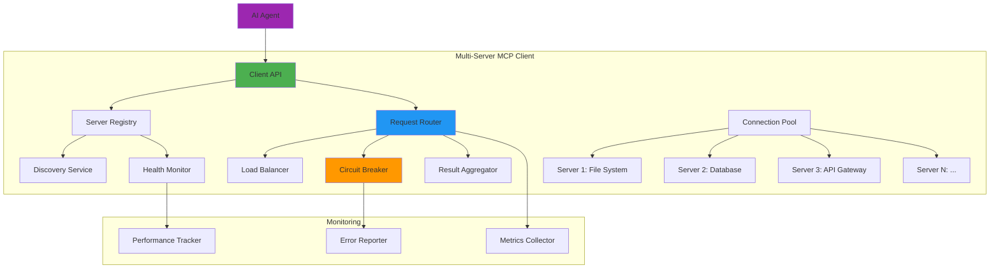

# Exercise 3: Multi-Server MCP Client (⭐⭐⭐ Hard - 60 minutes)

## 🎯 Objective
Build an intelligent MCP client that can discover, connect to, and orchestrate operations across multiple MCP servers, implementing service discovery, load balancing, and failover capabilities.

## 🧠 What You'll Learn
- Multi-server connection management
- Service discovery patterns
- Tool orchestration across servers
- Load balancing strategies
- Failover and circuit breaker patterns
- Result aggregation and caching

## 📋 Prerequisites
- Completed Exercises 1 and 2
- Both MCP servers running
- Understanding of distributed systems concepts
- Knowledge of async/await patterns

## 📚 Background

A Multi-Server MCP Client enables:
- **Service Discovery**: Automatically find available MCP servers
- **Tool Federation**: Use tools from multiple servers seamlessly
- **Load Balancing**: Distribute requests across servers
- **Fault Tolerance**: Handle server failures gracefully
- **Result Aggregation**: Combine results from multiple sources

Key features:
- Connection pooling per server
- Health monitoring
- Automatic retry with backoff
- Circuit breaker for failing servers
- Request routing based on capabilities

## 🏗️ Architecture Overview



## 🛠️ Step-by-Step Instructions

### Step 1: Project Setup

**Copilot Prompt Suggestion:**
```typescript
// Create a TypeScript project for a Multi-Server MCP Client that:
// - Manages connections to multiple MCP servers
// - Implements service discovery and health checking
// - Provides intelligent request routing
// - Handles failover and load balancing
// - Aggregates results from multiple servers
// - Includes comprehensive monitoring
```

1. **Initialize project:**
```bash
mkdir mcp-multi-client
cd mcp-multi-client
npm init -y
```

2. **Install dependencies:**
```bash
# Core dependencies
npm install @modelcontextprotocol/sdk ws axios

# Utility libraries
npm install lodash p-queue p-retry circuit-breaker-js

# Monitoring and caching
npm install prom-client node-cache

# Development dependencies
npm install --save-dev \
  typescript \
  @types/node \
  @types/ws \
  @types/lodash \
  ts-node \
  nodemon \
  jest \
  @types/jest
```

3. **Create directory structure:**
```bash
mkdir -p src/{client,discovery,routing,monitoring,utils}
mkdir -p tests/{unit,integration}
mkdir -p config
```

### Step 2: Define Server Registry and Discovery

**Copilot Prompt Suggestion:**
```typescript
// Create a server registry that:
// - Maintains a list of available MCP servers
// - Supports manual registration and auto-discovery
// - Tracks server capabilities and health status
// - Provides server metadata and statistics
// - Implements server lifecycle events
// - Supports server grouping and tagging
```

Create `src/discovery/ServerRegistry.ts`:
```typescript
import { EventEmitter } from 'events';
import winston from 'winston';

export interface ServerInfo {
  id: string;
  name: string;
  url: string;
  type?: string;
  tags?: string[];
  capabilities?: string[];
  metadata?: Record<string, any>;
  status: 'unknown' | 'connecting' | 'connected' | 'disconnected' | 'error';
  lastSeen?: Date;
  errorCount: number;
  successCount: number;
  averageResponseTime: number;
}

export interface DiscoveryConfig {
  method: 'static' | 'dns' | 'consul' | 'etcd';
  refreshInterval?: number;
  config?: any;
}

export class ServerRegistry extends EventEmitter {
  private servers: Map<string, ServerInfo> = new Map();
  private logger: winston.Logger;
  private discoveryConfig?: DiscoveryConfig;
  private discoveryInterval?: NodeJS.Timer;

  constructor(logger: winston.Logger) {
    super();
    this.logger = logger;
  }

  async initialize(config?: DiscoveryConfig): Promise<void> {
    this.discoveryConfig = config;
    
    if (config && config.method !== 'static') {
      await this.startDiscovery();
    }
  }

  registerServer(server: Omit<ServerInfo, 'status' | 'errorCount' | 'successCount' | 'averageResponseTime'>): void {
    const serverInfo: ServerInfo = {
      ...server,
      status: 'unknown',
      errorCount: 0,
      successCount: 0,
      averageResponseTime: 0
    };
    
    this.servers.set(server.id, serverInfo);
    this.emit('server-registered', serverInfo);
    
    this.logger.info('Server registered', {
      serverId: server.id,
      name: server.name,
      url: server.url
    });
  }

  unregisterServer(serverId: string): void {
    const server = this.servers.get(serverId);
    if (server) {
      this.servers.delete(serverId);
      this.emit('server-unregistered', server);
      
      this.logger.info('Server unregistered', {
        serverId: server.id,
        name: server.name
      });
    }
  }

  getServer(serverId: string): ServerInfo | undefined {
    return this.servers.get(serverId);
  }

  getAllServers(): ServerInfo[] {
    return Array.from(this.servers.values());
  }

  getServersByTag(tag: string): ServerInfo[] {
    return this.getAllServers().filter(
      server => server.tags?.includes(tag)
    );
  }

  getServersByCapability(capability: string): ServerInfo[] {
    return this.getAllServers().filter(
      server => server.capabilities?.includes(capability)
    );
  }

  getHealthyServers(): ServerInfo[] {
    return this.getAllServers().filter(
      server => server.status === 'connected'
    );
  }

  updateServerStatus(serverId: string, status: ServerInfo['status']): void {
    const server = this.servers.get(serverId);
    if (server) {
      const oldStatus = server.status;
      server.status = status;
      server.lastSeen = new Date();
      
      if (oldStatus !== status) {
        this.emit('server-status-changed', {
          server,
          oldStatus,
          newStatus: status
        });
        
        this.logger.info('Server status changed', {
          serverId: server.id,
          name: server.name,
          oldStatus,
          newStatus: status
        });
      }
    }
  }

  updateServerMetrics(
    serverId: string, 
    success: boolean, 
    responseTime: number
  ): void {
    const server = this.servers.get(serverId);
    if (server) {
      if (success) {
        server.successCount++;
      } else {
        server.errorCount++;
      }
      
      // Update average response time (exponential moving average)
      const alpha = 0.3; // Smoothing factor
      server.averageResponseTime = 
        alpha * responseTime + (1 - alpha) * server.averageResponseTime;
      
      this.emit('server-metrics-updated', {
        serverId,
        success,
        responseTime,
        metrics: {
          errorCount: server.errorCount,
          successCount: server.successCount,
          averageResponseTime: server.averageResponseTime,
          errorRate: server.errorCount / (server.errorCount + server.successCount)
        }
      });
    }
  }

  updateServerCapabilities(serverId: string, capabilities: string[]): void {
    const server = this.servers.get(serverId);
    if (server) {
      server.capabilities = capabilities;
      this.emit('server-capabilities-updated', {
        serverId,
        capabilities
      });
    }
  }

  private async startDiscovery(): Promise<void> {
    if (this.discoveryConfig) {
      await this.runDiscovery();
      
      // Set up periodic discovery
      if (this.discoveryConfig.refreshInterval) {
        this.discoveryInterval = setInterval(
          () => this.runDiscovery(),
          this.discoveryConfig.refreshInterval
        );
      }
    }
  }

  private async runDiscovery(): Promise<void> {
    if (!this.discoveryConfig) return;
    
    this.logger.debug('Running service discovery', {
      method: this.discoveryConfig.method
    });
    
    try {
      let discoveredServers: ServerInfo[] = [];
      
      switch (this.discoveryConfig.method) {
        case 'dns':
          discoveredServers = await this.discoverViaDNS();
          break;
        case 'consul':
          discoveredServers = await this.discoverViaConsul();
          break;
        case 'etcd':
          discoveredServers = await this.discoverViaEtcd();
          break;
      }
      
      // Update registry with discovered servers
      for (const server of discoveredServers) {
        if (!this.servers.has(server.id)) {
          this.registerServer(server);
        }
      }
      
      // Remove servers that are no longer discovered
      const discoveredIds = new Set(discoveredServers.map(s => s.id));
      for (const [id, server] of this.servers) {
        if (!discoveredIds.has(id) && server.metadata?.discovered) {
          this.unregisterServer(id);
        }
      }
      
    } catch (error) {
      this.logger.error('Service discovery failed', { error });
      this.emit('discovery-error', error);
    }
  }

  private async discoverViaDNS(): Promise<ServerInfo[]> {
    // DNS-based discovery implementation
    // This is a simplified example
    const { serviceName, domain } = this.discoveryConfig!.config;
    
    // In real implementation, use dns.resolveSrv()
    return [];
  }

  private async discoverViaConsul(): Promise<ServerInfo[]> {
    // Consul-based discovery implementation
    const { consulUrl, serviceName } = this.discoveryConfig!.config;
    
    // In real implementation, query Consul API
    return [];
  }

  private async discoverViaEtcd(): Promise<ServerInfo[]> {
    // etcd-based discovery implementation
    const { etcdUrl, prefix } = this.discoveryConfig!.config;
    
    // In real implementation, query etcd API
    return [];
  }

  async shutdown(): Promise<void> {
    if (this.discoveryInterval) {
      clearInterval(this.discoveryInterval);
    }
    
    this.servers.clear();
    this.removeAllListeners();
  }

  getStatistics(): {
    totalServers: number;
    healthyServers: number;
    unhealthyServers: number;
    averageResponseTime: number;
    totalRequests: number;
    totalErrors: number;
    overallErrorRate: number;
  } {
    const servers = this.getAllServers();
    const healthy = servers.filter(s => s.status === 'connected');
    const unhealthy = servers.filter(s => s.status !== 'connected');
    
    const totalRequests = servers.reduce((sum, s) => sum + s.successCount + s.errorCount, 0);
    const totalErrors = servers.reduce((sum, s) => sum + s.errorCount, 0);
    const totalResponseTime = servers.reduce((sum, s) => sum + s.averageResponseTime * s.successCount, 0);
    const totalSuccesses = servers.reduce((sum, s) => sum + s.successCount, 0);
    
    return {
      totalServers: servers.length,
      healthyServers: healthy.length,
      unhealthyServers: unhealthy.length,
      averageResponseTime: totalSuccesses > 0 ? totalResponseTime / totalSuccesses : 0,
      totalRequests,
      totalErrors,
      overallErrorRate: totalRequests > 0 ? totalErrors / totalRequests : 0
    };
  }
}
```

### Step 3: Implement Connection Pool Manager

**Copilot Prompt Suggestion:**
```typescript
// Create a connection pool manager that:
// - Maintains WebSocket connections to multiple MCP servers
// - Implements connection pooling per server
// - Handles connection lifecycle (connect, reconnect, disconnect)
// - Provides health checking for connections
// - Manages connection limits and timeouts
// - Implements automatic reconnection with backoff
```

Create `src/client/ConnectionPool.ts`:
```typescript
import WebSocket from 'ws';
import { EventEmitter } from 'events';
import pRetry from 'p-retry';
import winston from 'winston';

export interface ConnectionConfig {
  maxConnections: number;
  minConnections: number;
  connectionTimeout: number;
  idleTimeout: number;
  maxRetries: number;
  retryDelay: number;
  healthCheckInterval: number;
}

export interface MCPConnection {
  id: string;
  serverId: string;
  ws: WebSocket;
  state: 'connecting' | 'ready' | 'busy' | 'closing' | 'closed';
  lastUsed: Date;
  requestCount: number;
}

export class ConnectionPool extends EventEmitter {
  private pools: Map<string, MCPConnection[]> = new Map();
  private config: ConnectionConfig;
  private logger: winston.Logger;
  private healthCheckIntervals: Map<string, NodeJS.Timer> = new Map();

  constructor(config: ConnectionConfig, logger: winston.Logger) {
    super();
    
    this.config = {
      maxConnections: 5,
      minConnections: 1,
      connectionTimeout: 5000,
      idleTimeout: 300000, // 5 minutes
      maxRetries: 3,
      retryDelay: 1000,
      healthCheckInterval: 30000, // 30 seconds
      ...config
    };
    
    this.logger = logger;
  }

  async createPool(serverId: string, serverUrl: string): Promise<void> {
    if (this.pools.has(serverId)) {
      throw new Error(`Pool already exists for server: ${serverId}`);
    }
    
    this.pools.set(serverId, []);
    
    // Create minimum connections
    const connectionPromises = [];
    for (let i = 0; i < this.config.minConnections; i++) {
      connectionPromises.push(this.createConnection(serverId, serverUrl));
    }
    
    await Promise.all(connectionPromises);
    
    // Start health checking
    this.startHealthCheck(serverId, serverUrl);
    
    this.logger.info('Connection pool created', {
      serverId,
      connections: this.config.minConnections
    });
  }

  private async createConnection(
    serverId: string, 
    serverUrl: string
  ): Promise<MCPConnection> {
    const connectionId = `${serverId}-${Date.now()}-${Math.random().toString(36).substr(2, 9)}`;
    
    const connection = await pRetry(
      async () => {
        const ws = new WebSocket(serverUrl);
        
        return new Promise<MCPConnection>((resolve, reject) => {
          const timeout = setTimeout(() => {
            ws.close();
            reject(new Error('Connection timeout'));
          }, this.config.connectionTimeout);
          
          ws.once('open', () => {
            clearTimeout(timeout);
            
            const conn: MCPConnection = {
              id: connectionId,
              serverId,
              ws,
              state: 'ready',
              lastUsed: new Date(),
              requestCount: 0
            };
            
            this.setupConnectionHandlers(conn);
            
            const pool = this.pools.get(serverId);
            if (pool) {
              pool.push(conn);
            }
            
            this.emit('connection-created', {
              connectionId: conn.id,
              serverId
            });
            
            resolve(conn);
          });
          
          ws.once('error', (error) => {
            clearTimeout(timeout);
            reject(error);
          });
        });
      },
      {
        retries: this.config.maxRetries,
        minTimeout: this.config.retryDelay,
        onFailedAttempt: (error) => {
          this.logger.warn('Connection attempt failed', {
            serverId,
            attempt: error.attemptNumber,
            error: error.message
          });
        }
      }
    );
    
    return connection;
  }

  private setupConnectionHandlers(connection: MCPConnection): void {
    connection.ws.on('close', () => {
      connection.state = 'closed';
      
      const pool = this.pools.get(connection.serverId);
      if (pool) {
        const index = pool.findIndex(c => c.id === connection.id);
        if (index !== -1) {
          pool.splice(index, 1);
        }
      }
      
      this.emit('connection-closed', {
        connectionId: connection.id,
        serverId: connection.serverId
      });
      
      // Maintain minimum connections
      this.maintainPool(connection.serverId);
    });
    
    connection.ws.on('error', (error) => {
      this.logger.error('Connection error', {
        connectionId: connection.id,
        serverId: connection.serverId,
        error: error.message
      });
      
      this.emit('connection-error', {
        connectionId: connection.id,
        serverId: connection.serverId,
        error
      });
    });
    
    connection.ws.on('pong', () => {
      connection.lastUsed = new Date();
    });
  }

  async getConnection(serverId: string): Promise<MCPConnection> {
    const pool = this.pools.get(serverId);
    if (!pool) {
      throw new Error(`No pool exists for server: ${serverId}`);
    }
    
    // Find available connection
    let connection = pool.find(c => c.state === 'ready' && c.ws.readyState === WebSocket.OPEN);
    
    if (!connection) {
      // Create new connection if under limit
      if (pool.length < this.config.maxConnections) {
        const serverUrl = await this.getServerUrl(serverId);
        connection = await this.createConnection(serverId, serverUrl);
      } else {
        // Wait for available connection
        connection = await this.waitForConnection(serverId);
      }
    }
    
    connection.state = 'busy';
    connection.lastUsed = new Date();
    connection.requestCount++;
    
    return connection;
  }

  releaseConnection(connection: MCPConnection): void {
    if (connection.state === 'busy') {
      connection.state = 'ready';
      
      this.emit('connection-released', {
        connectionId: connection.id,
        serverId: connection.serverId
      });
    }
  }

  private async waitForConnection(
    serverId: string, 
    timeout: number = 30000
  ): Promise<MCPConnection> {
    return new Promise((resolve, reject) => {
      const startTime = Date.now();
      
      const checkInterval = setInterval(() => {
        const pool = this.pools.get(serverId);
        if (!pool) {
          clearInterval(checkInterval);
          reject(new Error(`Pool removed for server: ${serverId}`));
          return;
        }
        
        const connection = pool.find(
          c => c.state === 'ready' && c.ws.readyState === WebSocket.OPEN
        );
        
        if (connection) {
          clearInterval(checkInterval);
          resolve(connection);
        } else if (Date.now() - startTime > timeout) {
          clearInterval(checkInterval);
          reject(new Error('Timeout waiting for available connection'));
        }
      }, 100);
    });
  }

  private async maintainPool(serverId: string): Promise<void> {
    const pool = this.pools.get(serverId);
    if (!pool) return;
    
    const activeConnections = pool.filter(
      c => c.state !== 'closed' && c.ws.readyState === WebSocket.OPEN
    );
    
    if (activeConnections.length < this.config.minConnections) {
      const serverUrl = await this.getServerUrl(serverId);
      const needed = this.config.minConnections - activeConnections.length;
      
      for (let i = 0; i < needed; i++) {
        try {
          await this.createConnection(serverId, serverUrl);
        } catch (error) {
          this.logger.error('Failed to maintain pool', {
            serverId,
            error
          });
        }
      }
    }
  }

  private startHealthCheck(serverId: string, serverUrl: string): void {
    const interval = setInterval(async () => {
      const pool = this.pools.get(serverId);
      if (!pool) {
        clearInterval(interval);
        this.healthCheckIntervals.delete(serverId);
        return;
      }
      
      // Check connection health
      for (const connection of pool) {
        if (connection.ws.readyState === WebSocket.OPEN) {
          connection.ws.ping();
        } else if (connection.state !== 'closed') {
          connection.state = 'closed';
        }
      }
      
      // Remove idle connections
      const now = Date.now();
      const idleConnections = pool.filter(
        c => c.state === 'ready' && 
        now - c.lastUsed.getTime() > this.config.idleTimeout &&
        pool.length > this.config.minConnections
      );
      
      for (const conn of idleConnections) {
        conn.ws.close();
      }
      
      // Maintain minimum connections
      await this.maintainPool(serverId);
      
    }, this.config.healthCheckInterval);
    
    this.healthCheckIntervals.set(serverId, interval);
  }

  private async getServerUrl(serverId: string): Promise<string> {
    // This would typically query the server registry
    // For now, return a placeholder
    return `ws://localhost:3000`;
  }

  async closePool(serverId: string): Promise<void> {
    const pool = this.pools.get(serverId);
    if (!pool) return;
    
    // Stop health check
    const interval = this.healthCheckIntervals.get(serverId);
    if (interval) {
      clearInterval(interval);
      this.healthCheckIntervals.delete(serverId);
    }
    
    // Close all connections
    for (const connection of pool) {
      if (connection.ws.readyState === WebSocket.OPEN) {
        connection.ws.close();
      }
    }
    
    this.pools.delete(serverId);
    
    this.logger.info('Connection pool closed', { serverId });
  }

  async shutdown(): Promise<void> {
    const serverIds = Array.from(this.pools.keys());
    
    await Promise.all(
      serverIds.map(serverId => this.closePool(serverId))
    );
    
    this.removeAllListeners();
  }

  getPoolStats(serverId: string): {
    total: number;
    ready: number;
    busy: number;
    closed: number;
  } | null {
    const pool = this.pools.get(serverId);
    if (!pool) return null;
    
    return {
      total: pool.length,
      ready: pool.filter(c => c.state === 'ready').length,
      busy: pool.filter(c => c.state === 'busy').length,
      closed: pool.filter(c => c.state === 'closed').length
    };
  }
}
```

## ⏭️ Next Steps

Continue to [Part 2](./part2.md) where we'll implement:
- Request routing and load balancing
- Circuit breaker pattern
- Result aggregation
- Multi-server orchestration