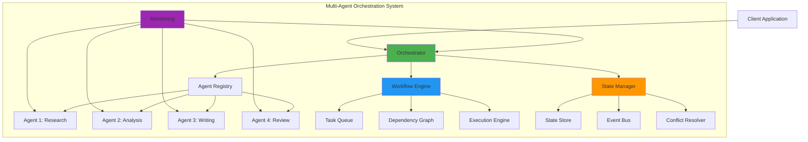

[🏠 Workshop](../../README.md) > [📚 Modules](../README.md) > [Module 24](README.md)

<div align="center">

[⬅️ Module 23: Model Context Protocol (MCP)](../module-23/README.md) | **📖 Module 24: Multi-Agent Orchestration** | [Module 25: Advanced Agent Patterns ➡️](../module-25/README.md)

</div>

---

# Module 24: Multi-Agent Orchestration

## 🎯 Module Overview

Welcome to Module 24! This module teaches you how to orchestrate multiple AI agents working together to solve complex problems. You'll learn coordination patterns, workflow management, state synchronization, and how to build resilient multi-agent systems that can handle real-world challenges.

### Duration
- **Total Time**: 3 hours
- **Lecture/Demo**: 45 minutes
- **Hands-on Exercises**: 2 hours 15 minutes

### Track
- 🟣 AI Agents & MCP Track (Modules 21-25)

## 🎓 Learning Objectives

By the end of this module, you will be able to:

1. **Design Multi-Agent Architectures** - Create systems where agents collaborate effectively
2. **Implement Coordination Patterns** - Master pub/sub, leader election, and consensus
3. **Build Workflow Engines** - Orchestrate complex multi-step agent workflows
4. **Manage Distributed State** - Synchronize state across multiple agents
5. **Handle Conflicts** - Implement conflict resolution strategies
6. **Monitor Agent Systems** - Track and optimize multi-agent performance

## 🏗️ Module Architecture



## 📚 What is Multi-Agent Orchestration?

Multi-Agent Orchestration involves coordinating multiple AI agents to work together on complex tasks that no single agent could handle alone. It requires:

- **Agent Discovery**: Finding and registering available agents
- **Task Distribution**: Assigning work based on agent capabilities
- **Communication**: Enabling agents to share information
- **Coordination**: Ensuring agents work together effectively
- **State Management**: Maintaining consistency across agents
- **Error Handling**: Recovering from agent failures

### Key Concepts

1. **Agent Roles**: Specialized agents for specific tasks
2. **Workflows**: Multi-step processes involving multiple agents
3. **Coordination Patterns**: How agents communicate and synchronize
4. **State Synchronization**: Keeping agents aligned on shared data
5. **Consensus Mechanisms**: Resolving conflicts between agents

## 🛠️ Key Technologies

- **Orchestration**: Custom orchestrator with TypeScript/Python
- **Communication**: MCP, gRPC, Message Queues
- **State Management**: Redis, etcd, Distributed stores
- **Workflow**: Apache Airflow, Temporal, Custom engines
- **Monitoring**: OpenTelemetry, Prometheus, Grafana

## 🚀 What You'll Build

In this module, you'll create:

1. **Research Assistant System** - Multiple agents collaborating on research tasks
2. **Content Generation Pipeline** - Agents working together to create content
3. **Distributed Problem Solver** - Agents solving complex problems collaboratively

## 📋 Prerequisites

Before starting this module, ensure you have:

- ✅ Completed Modules 21-23
- ✅ Understanding of agent architectures
- ✅ Experience with MCP protocol
- ✅ Knowledge of async/await patterns
- ✅ Basic distributed systems concepts

See [prerequisites.md](prerequisites.md) for detailed setup instructions.

## 📂 Module Structure

```
multi-agent-orchestration/
├── README.md                          # This file
├── prerequisites.md                   # Setup requirements
├── best-practices.md                 # Orchestration best practices
├── troubleshooting.md               # Common issues and solutions
├── exercises/
│   ├── exercise1-research-system/    # Multi-agent research assistant
│   ├── exercise2-content-pipeline/   # Content generation workflow
│   └── exercise3-problem-solver/     # Distributed problem solving
├── resources/
│   ├── orchestration-patterns/      # Common patterns and templates
│   ├── workflow-templates/          # Reusable workflow definitions
│   ├── monitoring-configs/          # Monitoring setup configs
│   └── state-management/            # State sync implementations
├── scripts/
│   ├── setup-module.sh             # Environment setup
│   ├── start-agents.sh             # Start demo agents
│   ├── test-orchestration.sh       # Test orchestration
│   └── monitor-agents.sh           # Agent monitoring
└── infrastructure/
    ├── docker/                     # Agent containers
    └── kubernetes/                 # K8s orchestration configs
```

## 🎯 Learning Path

### Step 1: Orchestration Fundamentals (30 mins)
- Multi-agent architectures
- Communication patterns
- Coordination strategies
- State management approaches

### Step 2: Building Orchestrators (60 mins)
- Agent registry implementation
- Task distribution algorithms
- Workflow engine creation
- State synchronization

### Step 3: Advanced Patterns (45 mins)
- Leader election
- Consensus protocols
- Conflict resolution
- Failure handling

### Step 4: Production Systems (45 mins)
- Monitoring and observability
- Performance optimization
- Scaling strategies
- Deployment patterns

## 💡 Real-World Applications

Multi-agent orchestration enables:

- **Complex Research**: Agents dividing research tasks and synthesizing results
- **Content Pipelines**: Research → Writing → Editing → Publishing workflows
- **Customer Service**: Multiple specialized agents handling different aspects
- **Data Processing**: Distributed analysis with specialized agents
- **Decision Making**: Agents providing different perspectives for decisions

## 🧪 Hands-on Exercises

### [Exercise 1: Research Assistant System](exercises/exercise1-research-system/) ⭐
Build a multi-agent system where specialized agents collaborate on research tasks.

### [Exercise 2: Content Generation Pipeline](exercises/exercise2-content-pipeline/) ⭐⭐
Create a workflow where agents work together to generate, review, and publish content.

### [Exercise 3: Distributed Problem Solver](exercises/exercise3-problem-solver/) ⭐⭐⭐
Implement a system where agents collaborate to solve complex computational problems.

## 📊 Module Resources

### Documentation
- [Orchestration Patterns](resources/orchestration-patterns/README.md)
- [Workflow Design Guide](resources/workflow-templates/design-guide.md)
- [State Management Strategies](resources/state-management/strategies.md)

### Tools
- Agent Registry Manager
- Workflow Designer
- State Synchronizer
- Performance Analyzer

### Examples
- Multi-agent workflows
- Coordination patterns
- State sync implementations
- Monitoring dashboards

## 🎓 Skills You'll Gain

- **System Design**: Architect multi-agent systems
- **Coordination**: Implement agent communication patterns
- **Workflow Management**: Build complex agent workflows
- **State Synchronization**: Manage distributed state
- **Monitoring**: Track multi-agent system health

## 🚦 Success Criteria

You'll have mastered this module when you can:

- ✅ Design multi-agent architectures for complex tasks
- ✅ Implement coordination patterns between agents
- ✅ Build workflow engines for agent orchestration
- ✅ Manage state across distributed agents
- ✅ Handle failures and conflicts gracefully
- ✅ Monitor and optimize multi-agent systems

## 🛡️ Best Practices

Multi-agent orchestration requires careful design:

- **Clear Responsibilities**: Each agent should have a well-defined role
- **Loose Coupling**: Agents should be independent yet coordinated
- **Fault Tolerance**: System should handle agent failures
- **Observability**: All agent activities should be traceable
- **Scalability**: Design for varying numbers of agents

## 🔧 Development Environment

Required tools:
- Node.js 18+ or Python 3.11+
- Redis (for state management)
- Docker Desktop
- Message queue (RabbitMQ/Kafka)
- Monitoring stack (Prometheus/Grafana)

## 📈 Performance Considerations

- Message passing overhead between agents
- State synchronization costs
- Network latency in distributed setups
- Resource allocation for multiple agents
- Bottlenecks in coordination points

## ⏭️ What's Next?

After completing this module, you'll be ready for:
- **Module 25**: Production Agent Deployment - Deploy agents at scale

## 🎉 Let's Get Started!

Ready to master multi-agent orchestration? Start with the [prerequisites](prerequisites.md) to set up your environment, then dive into [Exercise 1](exercises/exercise1-research-system/)!

---

**Remember**: The whole is greater than the sum of its parts. Master orchestration, and your agents will accomplish amazing things together!

---

## 🔗 Quick Links

### Module Resources
- [📋 Prerequisites](prerequisites.md)
- [📖 Best Practices](docs/best-practices.md)
- [🔧 Troubleshooting](docs/troubleshooting.md)
- [💡 Prompt Templates](docs/prompt-templates.md)

### Exercises
- [⭐ Exercise 1 - Foundation](exercises/exercise1/README.md)
- [⭐⭐ Exercise 2 - Application](exercises/exercise2/README.md)
- [⭐⭐⭐ Exercise 3 - Mastery](exercises/exercise3/README.md)

### Workshop Resources
- [🏠 Workshop Home](../../README.md)
- [📚 All Modules](../../README.md#-complete-module-overview)
- [🚀 Quick Start](../../QUICKSTART.md)
- [❓ FAQ](../../FAQ.md)
- [🤖 Prompt Guide](../../PROMPT-GUIDE.md)
- [🔧 Troubleshooting](../../TROUBLESHOOTING.md)


---

## 🔗 Quick Links

### Module Resources
- [📋 Prerequisites](prerequisites.md)
- [📖 Best Practices](docs/best-practices.md)
- [🔧 Troubleshooting](docs/troubleshooting.md)
- [💡 Prompt Templates](docs/prompt-templates.md)

### Exercises
- [⭐ Exercise 1 - Foundation](exercises/exercise1/README.md)
- [⭐⭐ Exercise 2 - Application](exercises/exercise2/README.md)
- [⭐⭐⭐ Exercise 3 - Mastery](exercises/exercise3/README.md)

### Workshop Resources
- [🏠 Workshop Home](../../README.md)
- [📚 All Modules](../../README.md#-complete-module-overview)
- [🚀 Quick Start](../../QUICKSTART.md)
- [❓ FAQ](../../FAQ.md)
- [🤖 Prompt Guide](../../PROMPT-GUIDE.md)
- [🔧 Troubleshooting](../../TROUBLESHOOTING.md)


---

## 🔗 Quick Links

### Module Resources
- [📋 Prerequisites](prerequisites.md)
- [📖 Best Practices](docs/best-practices.md)
- [🔧 Troubleshooting](docs/troubleshooting.md)
- [💡 Prompt Templates](docs/prompt-templates.md)

### Exercises
- [⭐ Exercise 1 - Foundation](exercises/exercise1/README.md)
- [⭐⭐ Exercise 2 - Application](exercises/exercise2/README.md)
- [⭐⭐⭐ Exercise 3 - Mastery](exercises/exercise3/README.md)

### Workshop Resources
- [🏠 Workshop Home](../../README.md)
- [📚 All Modules](../../README.md#-complete-module-overview)
- [🚀 Quick Start](../../QUICKSTART.md)
- [❓ FAQ](../../FAQ.md)
- [🤖 Prompt Guide](../../PROMPT-GUIDE.md)
- [🔧 Troubleshooting](../../TROUBLESHOOTING.md)


## 🧭 Quick Navigation

<table>
<tr>
<td valign="top">

### 📖 Module Content
- [Overview](README.md)
- [Prerequisites](prerequisites.md)
- [Setup Guide](docs/setup.md)
- [Troubleshooting](docs/troubleshooting.md)

</td>
<td valign="top">

### 💻 Exercises
- [Exercise 1 - Foundation ⭐](exercises/exercise1/README.md)
- [Exercise 2 - Application ⭐⭐](exercises/exercise2/README.md)
- [Exercise 3 - Mastery ⭐⭐⭐](exercises/exercise3/README.md)
- [Independent Project](project/README.md)

</td>
<td valign="top">

### 📚 Resources
- [Best Practices](docs/best-practices.md)
- [Common Patterns](docs/common-patterns.md)
- [Prompt Templates](docs/prompt-templates.md)
- [Additional Resources](resources/README.md)

</td>
</tr>
</table>


---

## 🌐 Workshop Resources

<div align="center">

| Core Documentation | Learning Resources | Tools & Scripts |
|:------------------:|:-----------------:|:---------------:|
| [🏠 Home](../../README.md) | [🚀 Quick Start](../../QUICKSTART.md) | [🛠️ Scripts](../../scripts/README.md) |
| [📋 Prerequisites](../../PREREQUISITES.md) | [❓ FAQ](../../FAQ.md) | [🔧 Setup](../../scripts/setup-workshop.sh) |
| [📚 All Modules](../README.md) | [🤖 Prompt Guide](../../PROMPT-GUIDE.md) | [✅ Validate](../../scripts/validate-prerequisites.sh) |
| [🗺️ Learning Paths](../../README.md#-learning-paths) | [🔧 Troubleshooting](../../TROUBLESHOOTING.md) | [🧹 Cleanup](../../scripts/cleanup-resources.sh) |

</div>

### 🏷️ Module Categories

<div align="center">

| 🟢 Fundamentals | 🔵 Intermediate | 🟠 Advanced | 🔴 Enterprise | 🟣 AI Agents | ⭐ Mastery |
|:---------------:|:---------------:|:-----------:|:-------------:|:------------:|:----------:|
| Modules 1-5 | Modules 6-10 | Modules 11-15 | Modules 16-20 | Modules 21-25 | Modules 26-30 |

</div>


---

## 🔗 Quick Links

### Module Resources
- [📋 Prerequisites](prerequisites.md)
- [📖 Best Practices](docs/best-practices.md)
- [🔧 Troubleshooting](docs/troubleshooting.md)
- [💡 Prompt Templates](docs/prompt-templates.md)

### Exercises
- [⭐ Exercise 1 - Foundation](exercises/exercise1/README.md)
- [⭐⭐ Exercise 2 - Application](exercises/exercise2/README.md)
- [⭐⭐⭐ Exercise 3 - Mastery](exercises/exercise3/README.md)

### Workshop Resources
- [🏠 Workshop Home](../../README.md)
- [📚 All Modules](../../README.md#-complete-module-overview)
- [🚀 Quick Start](../../QUICKSTART.md)
- [❓ FAQ](../../FAQ.md)
- [🤖 Prompt Guide](../../PROMPT-GUIDE.md)
- [🔧 Troubleshooting](../../TROUBLESHOOTING.md)


## 🧭 Quick Navigation

<table>
<tr>
<td valign="top">

### 📖 Module Content
- [Overview](README.md)
- [Prerequisites](prerequisites.md)
- [Setup Guide](docs/setup.md)
- [Troubleshooting](docs/troubleshooting.md)

</td>
<td valign="top">

### 💻 Exercises
- [Exercise 1 - Foundation ⭐](exercises/exercise1/README.md)
- [Exercise 2 - Application ⭐⭐](exercises/exercise2/README.md)
- [Exercise 3 - Mastery ⭐⭐⭐](exercises/exercise3/README.md)
- [Independent Project](project/README.md)

</td>
<td valign="top">

### 📚 Resources
- [Best Practices](docs/best-practices.md)
- [Common Patterns](docs/common-patterns.md)
- [Prompt Templates](docs/prompt-templates.md)
- [Additional Resources](resources/README.md)

</td>
</tr>
</table>


---

## 🌐 Workshop Resources

<div align="center">

| Core Documentation | Learning Resources | Tools & Scripts |
|:------------------:|:-----------------:|:---------------:|
| [🏠 Home](../../README.md) | [🚀 Quick Start](../../QUICKSTART.md) | [🛠️ Scripts](../../scripts/README.md) |
| [📋 Prerequisites](../../PREREQUISITES.md) | [❓ FAQ](../../FAQ.md) | [🔧 Setup](../../scripts/setup-workshop.sh) |
| [📚 All Modules](../README.md) | [🤖 Prompt Guide](../../PROMPT-GUIDE.md) | [✅ Validate](../../scripts/validate-prerequisites.sh) |
| [🗺️ Learning Paths](../../README.md#-learning-paths) | [🔧 Troubleshooting](../../TROUBLESHOOTING.md) | [🧹 Cleanup](../../scripts/cleanup-resources.sh) |

</div>

### 🏷️ Module Categories

<div align="center">

| 🟢 Fundamentals | 🔵 Intermediate | 🟠 Advanced | 🔴 Enterprise | 🟣 AI Agents | ⭐ Mastery |
|:---------------:|:---------------:|:-----------:|:-------------:|:------------:|:----------:|
| Modules 1-5 | Modules 6-10 | Modules 11-15 | Modules 16-20 | Modules 21-25 | Modules 26-30 |

</div>


---

## 🔗 Quick Links

### Module Resources
- [📋 Prerequisites](prerequisites.md)
- [📖 Best Practices](docs/best-practices.md)
- [🔧 Troubleshooting](docs/troubleshooting.md)
- [💡 Prompt Templates](docs/prompt-templates.md)

### Exercises
- [⭐ Exercise 1 - Foundation](exercises/exercise1/README.md)
- [⭐⭐ Exercise 2 - Application](exercises/exercise2/README.md)
- [⭐⭐⭐ Exercise 3 - Mastery](exercises/exercise3/README.md)

### Workshop Resources
- [🏠 Workshop Home](../../README.md)
- [📚 All Modules](../../README.md#-complete-module-overview)
- [🚀 Quick Start](../../QUICKSTART.md)
- [❓ FAQ](../../FAQ.md)
- [🤖 Prompt Guide](../../PROMPT-GUIDE.md)
- [🔧 Troubleshooting](../../TROUBLESHOOTING.md)


## 🧭 Quick Navigation

<table>
<tr>
<td valign="top">

### 📖 Module Content
- [Overview](README.md)
- [Prerequisites](prerequisites.md)
- [Setup Guide](docs/setup.md)
- [Troubleshooting](docs/troubleshooting.md)

</td>
<td valign="top">

### 💻 Exercises
- [Exercise 1 - Foundation ⭐](exercises/exercise1/README.md)
- [Exercise 2 - Application ⭐⭐](exercises/exercise2/README.md)
- [Exercise 3 - Mastery ⭐⭐⭐](exercises/exercise3/README.md)
- [Independent Project](project/README.md)

</td>
<td valign="top">

### 📚 Resources
- [Best Practices](docs/best-practices.md)
- [Common Patterns](docs/common-patterns.md)
- [Prompt Templates](docs/prompt-templates.md)
- [Additional Resources](resources/README.md)

</td>
</tr>
</table>


---

## 🌐 Workshop Resources

<div align="center">

| Core Documentation | Learning Resources | Tools & Scripts |
|:------------------:|:-----------------:|:---------------:|
| [🏠 Home](../../README.md) | [🚀 Quick Start](../../QUICKSTART.md) | [🛠️ Scripts](../../scripts/README.md) |
| [📋 Prerequisites](../../PREREQUISITES.md) | [❓ FAQ](../../FAQ.md) | [🔧 Setup](../../scripts/setup-workshop.sh) |
| [📚 All Modules](../README.md) | [🤖 Prompt Guide](../../PROMPT-GUIDE.md) | [✅ Validate](../../scripts/validate-prerequisites.sh) |
| [🗺️ Learning Paths](../../README.md#-learning-paths) | [🔧 Troubleshooting](../../TROUBLESHOOTING.md) | [🧹 Cleanup](../../scripts/cleanup-resources.sh) |

</div>

### 🏷️ Module Categories

<div align="center">

| 🟢 Fundamentals | 🔵 Intermediate | 🟠 Advanced | 🔴 Enterprise | 🟣 AI Agents | ⭐ Mastery |
|:---------------:|:---------------:|:-----------:|:-------------:|:------------:|:----------:|
| Modules 1-5 | Modules 6-10 | Modules 11-15 | Modules 16-20 | Modules 21-25 | Modules 26-30 |

</div>

