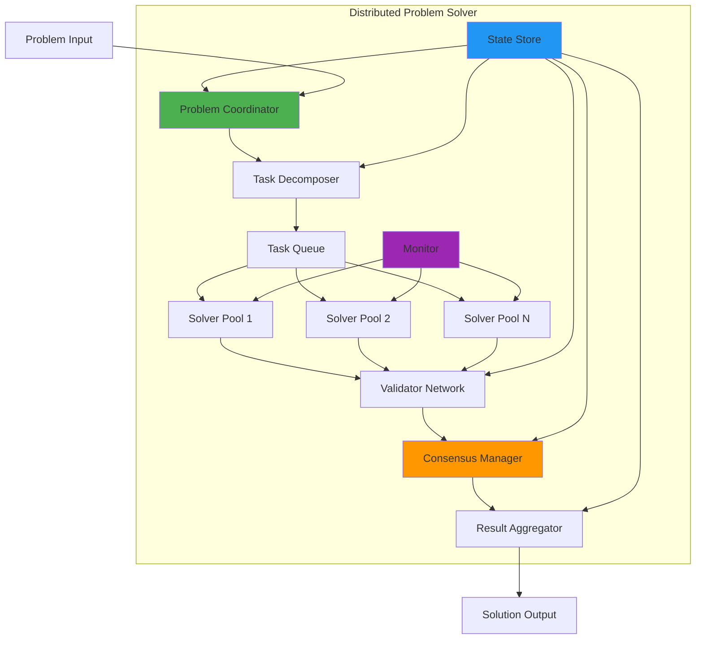

# Exercise 3: Distributed Problem Solver (⭐⭐⭐ Hard - 60 minutes)

## 🎯 Objective
Build a sophisticated multi-agent system that coordinates specialized agents to solve complex computational problems through distributed processing, consensus mechanisms, and intelligent task decomposition.

## 🧠 What You'll Learn
- Advanced agent coordination patterns
- Distributed problem decomposition
- Consensus mechanisms for solution verification
- Load balancing across agent pools
- Fault tolerance and recovery strategies
- Performance optimization for distributed systems

## 📋 Prerequisites
- Completed Exercises 1 and 2
- Strong understanding of distributed systems
- Experience with parallel processing
- Knowledge of consensus algorithms
- Familiarity with computational complexity

## 📚 Background

A Distributed Problem Solver demonstrates how multiple AI agents can collaborate to solve problems that are too complex or time-consuming for a single agent. The system includes:

- **Problem Analyzer**: Decomposes complex problems into sub-tasks
- **Solver Agents**: Specialized agents for different problem types
- **Validator Agents**: Verify solution correctness
- **Consensus Manager**: Ensures agreement on solutions
- **Result Aggregator**: Combines partial solutions

This architecture enables solving problems like:
- Large-scale optimization
- Distributed machine learning
- Complex simulations
- Parallel data processing

## 🏗️ Architecture Overview



## 🛠️ Step-by-Step Instructions

### Step 1: Project Setup

**Copilot Prompt Suggestion:**
```typescript
// Create a TypeScript project for a distributed problem solver that:
// - Decomposes complex problems into parallelizable sub-tasks
// - Manages pools of specialized solver agents
// - Implements consensus mechanisms for solution validation
// - Handles partial failures and recovery
// - Optimizes task distribution for performance
// - Provides real-time monitoring and metrics
```

1. **Initialize the project:**
```bash
mkdir distributed-problem-solver
cd distributed-problem-solver
npm init -y
```

2. **Install dependencies:**
```bash
# Core dependencies
npm install \
  bull \
  bull-board \
  ioredis \
  p-queue \
  p-map \
  async-mutex

# Consensus and coordination
npm install \
  raft-consensus \
  hashring \
  node-zookeeper-client

# Computation and ML
npm install \
  numeric \
  ml-matrix \
  simple-statistics \
  @tensorflow/tfjs-node

# Monitoring
npm install \
  prom-client \
  @opentelemetry/api \
  @opentelemetry/sdk-node

# Utilities
npm install \
  winston \
  dotenv \
  lodash \
  uuid

# Development dependencies
npm install --save-dev \
  typescript \
  @types/node \
  @types/bull \
  @types/lodash \
  ts-node \
  nodemon \
  jest \
  @types/jest
```

3. **Create directory structure:**
```bash
mkdir -p src/{coordinator,decomposer,solvers,validators,consensus,aggregator,monitoring,utils}
mkdir -p tests/{unit,integration,performance}
mkdir -p config
```

### Step 2: Define Problem Solver Core

**Copilot Prompt Suggestion:**
```typescript
// Create a problem solver core that:
// - Defines problem types and complexity levels
// - Manages problem lifecycle and state
// - Tracks solver agent capabilities
// - Implements task scheduling strategies
// - Handles result validation and consensus
// - Provides fault tolerance mechanisms
```

Create `src/coordinator/ProblemSolver.ts`:
```typescript
import { EventEmitter } from 'events';
import Bull from 'bull';
import { v4 as uuidv4 } from 'uuid';
import winston from 'winston';
import { Mutex } from 'async-mutex';

// Problem type definitions
export enum ProblemType {
  OPTIMIZATION = 'optimization',
  MACHINE_LEARNING = 'machine_learning',
  SIMULATION = 'simulation',
  DATA_PROCESSING = 'data_processing',
  MATHEMATICAL = 'mathematical',
  GRAPH_ANALYSIS = 'graph_analysis'
}

export interface Problem {
  id: string;
  type: ProblemType;
  complexity: 'low' | 'medium' | 'high' | 'extreme';
  data: any;
  constraints?: any;
  metadata?: {
    priority?: number;
    deadline?: Date;
    requiredAccuracy?: number;
    maxIterations?: number;
  };
}

export interface SubTask {
  id: string;
  problemId: string;
  type: string;
  data: any;
  dependencies: string[];
  estimatedComplexity: number;
  assignedTo?: string;
  status: 'pending' | 'assigned' | 'running' | 'completed' | 'failed';
  result?: any;
  attempts: number;
}

export interface Solution {
  problemId: string;
  result: any;
  confidence: number;
  consensus: {
    achieved: boolean;
    votes: Map<string, any>;
    finalValue?: any;
  };
  performance: {
    totalTime: number;
    computeTime: number;
    validationTime: number;
    parallelism: number;
  };
  metadata: any;
}

export enum SolverCapability {
  LINEAR_OPTIMIZATION = 'linear_optimization',
  NONLINEAR_OPTIMIZATION = 'nonlinear_optimization',
  NEURAL_NETWORK = 'neural_network',
  STATISTICAL_ANALYSIS = 'statistical_analysis',
  GRAPH_ALGORITHMS = 'graph_algorithms',
  NUMERICAL_COMPUTATION = 'numerical_computation',
  MONTE_CARLO = 'monte_carlo',
  GENETIC_ALGORITHM = 'genetic_algorithm'
}

export interface SolverAgent {
  id: string;
  capabilities: SolverCapability[];
  performance: {
    successRate: number;
    avgExecutionTime: number;
    currentLoad: number;
    maxLoad: number;
  };
  status: 'idle' | 'busy' | 'offline';
  lastSeen: Date;
}

export class ProblemSolver extends EventEmitter {
  private problems: Map<string, Problem> = new Map();
  private subTasks: Map<string, SubTask> = new Map();
  private solutions: Map<string, Solution> = new Map();
  private solverAgents: Map<string, SolverAgent> = new Map();
  private taskQueue: Bull.Queue;
  private validationQueue: Bull.Queue;
  private logger: winston.Logger;
  private stateMutex: Mutex;

  constructor(private redisUrl: string) {
    super();
    
    this.logger = winston.createLogger({
      level: 'info',
      format: winston.format.json(),
      defaultMeta: { service: 'problem-solver' }
    });
    
    this.taskQueue = new Bull('problem-tasks', redisUrl);
    this.validationQueue = new Bull('validation-tasks', redisUrl);
    this.stateMutex = new Mutex();
    
    this.setupQueues();
  }

  private setupQueues(): void {
    // Task queue processing
    this.taskQueue.on('completed', (job, result) => {
      this.handleTaskCompleted(job.data.taskId, result);
    });
    
    this.taskQueue.on('failed', (job, err) => {
      this.handleTaskFailed(job.data.taskId, err);
    });
    
    // Validation queue processing
    this.validationQueue.on('completed', (job, result) => {
      this.handleValidationCompleted(job.data.problemId, result);
    });
  }

  async submitProblem(problem: Problem): Promise<string> {
    const problemId = problem.id || uuidv4();
    problem.id = problemId;
    
    await this.stateMutex.runExclusive(async () => {
      this.problems.set(problemId, problem);
    });
    
    this.logger.info('Problem submitted', {
      problemId,
      type: problem.type,
      complexity: problem.complexity
    });
    
    this.emit('problem-submitted', { problemId, problem });
    
    // Start problem solving process
    setImmediate(() => this.startProblemSolving(problemId));
    
    return problemId;
  }

  private async startProblemSolving(problemId: string): Promise<void> {
    const problem = this.problems.get(problemId);
    if (!problem) return;
    
    try {
      // Decompose problem into sub-tasks
      const subTasks = await this.decomposeProblem(problem);
      
      // Store sub-tasks
      await this.stateMutex.runExclusive(async () => {
        subTasks.forEach(task => {
          this.subTasks.set(task.id, task);
        });
      });
      
      this.logger.info('Problem decomposed', {
        problemId,
        subTaskCount: subTasks.length
      });
      
      // Schedule sub-tasks
      await this.scheduleSubTasks(subTasks);
      
    } catch (error) {
      this.logger.error('Problem solving failed', {
        problemId,
        error
      });
      
      this.emit('problem-failed', { problemId, error });
    }
  }

  private async decomposeProblem(problem: Problem): Promise<SubTask[]> {
    // This would be implemented by the TaskDecomposer
    // For now, return a simple decomposition
    const subTasks: SubTask[] = [];
    
    switch (problem.type) {
      case ProblemType.OPTIMIZATION:
        subTasks.push(...this.decomposeOptimization(problem));
        break;
        
      case ProblemType.MACHINE_LEARNING:
        subTasks.push(...this.decomposeML(problem));
        break;
        
      case ProblemType.DATA_PROCESSING:
        subTasks.push(...this.decomposeDataProcessing(problem));
        break;
        
      default:
        // Single task for unknown types
        subTasks.push({
          id: uuidv4(),
          problemId: problem.id,
          type: 'generic',
          data: problem.data,
          dependencies: [],
          estimatedComplexity: 1,
          status: 'pending',
          attempts: 0
        });
    }
    
    return subTasks;
  }

  private decomposeOptimization(problem: Problem): SubTask[] {
    const tasks: SubTask[] = [];
    
    // Initial solution generation
    tasks.push({
      id: uuidv4(),
      problemId: problem.id,
      type: 'generate_initial_solution',
      data: { 
        constraints: problem.constraints,
        bounds: problem.data.bounds
      },
      dependencies: [],
      estimatedComplexity: 0.2,
      status: 'pending',
      attempts: 0
    });
    
    // Parallel optimization runs
    const parallelRuns = problem.complexity === 'extreme' ? 8 : 4;
    const initialTaskId = tasks[0].id;
    
    for (let i = 0; i < parallelRuns; i++) {
      tasks.push({
        id: uuidv4(),
        problemId: problem.id,
        type: 'optimize_parallel',
        data: {
          runIndex: i,
          method: i % 2 === 0 ? 'gradient_descent' : 'genetic_algorithm',
          parameters: problem.data
        },
        dependencies: [initialTaskId],
        estimatedComplexity: 0.8,
        status: 'pending',
        attempts: 0
      });
    }
    
    // Result aggregation
    const optimizationTaskIds = tasks.slice(1).map(t => t.id);
    tasks.push({
      id: uuidv4(),
      problemId: problem.id,
      type: 'aggregate_optimization_results',
      data: { method: 'best_of_parallel' },
      dependencies: optimizationTaskIds,
      estimatedComplexity: 0.1,
      status: 'pending',
      attempts: 0
    });
    
    return tasks;
  }

  private decomposeML(problem: Problem): SubTask[] {
    const tasks: SubTask[] = [];
    
    // Data preprocessing
    tasks.push({
      id: uuidv4(),
      problemId: problem.id,
      type: 'preprocess_data',
      data: {
        features: problem.data.features,
        preprocessing: ['normalize', 'remove_outliers']
      },
      dependencies: [],
      estimatedComplexity: 0.3,
      status: 'pending',
      attempts: 0
    });
    
    // Feature engineering
    const preprocessId = tasks[0].id;
    tasks.push({
      id: uuidv4(),
      problemId: problem.id,
      type: 'feature_engineering',
      data: {
        methods: ['polynomial', 'interactions']
      },
      dependencies: [preprocessId],
      estimatedComplexity: 0.4,
      status: 'pending',
      attempts: 0
    });
    
    // Model training (parallel)
    const featureEngId = tasks[1].id;
    const models = ['random_forest', 'neural_network', 'svm', 'xgboost'];
    
    models.forEach(model => {
      tasks.push({
        id: uuidv4(),
        problemId: problem.id,
        type: 'train_model',
        data: {
          model,
          hyperparameters: problem.data.hyperparameters?.[model]
        },
        dependencies: [featureEngId],
        estimatedComplexity: 0.7,
        status: 'pending',
        attempts: 0
      });
    });
    
    // Model evaluation and selection
    const modelTaskIds = tasks.slice(2).map(t => t.id);
    tasks.push({
      id: uuidv4(),
      problemId: problem.id,
      type: 'evaluate_models',
      data: {
        metrics: ['accuracy', 'f1_score', 'auc']
      },
      dependencies: modelTaskIds,
      estimatedComplexity: 0.2,
      status: 'pending',
      attempts: 0
    });
    
    return tasks;
  }

  private decomposeDataProcessing(problem: Problem): SubTask[] {
    const tasks: SubTask[] = [];
    const dataSize = problem.data.size || 1000;
    const chunkSize = Math.ceil(dataSize / 10); // 10 parallel chunks
    
    // Data chunking
    for (let i = 0; i < 10; i++) {
      tasks.push({
        id: uuidv4(),
        problemId: problem.id,
        type: 'process_data_chunk',
        data: {
          chunkIndex: i,
          startIndex: i * chunkSize,
          endIndex: Math.min((i + 1) * chunkSize, dataSize),
          operations: problem.data.operations
        },
        dependencies: [],
        estimatedComplexity: 0.5,
        status: 'pending',
        attempts: 0
      });
    }
    
    // Merge results
    const chunkTaskIds = tasks.map(t => t.id);
    tasks.push({
      id: uuidv4(),
      problemId: problem.id,
      type: 'merge_processed_data',
      data: {
        mergeStrategy: problem.data.mergeStrategy || 'concatenate'
      },
      dependencies: chunkTaskIds,
      estimatedComplexity: 0.2,
      status: 'pending',
      attempts: 0
    });
    
    return tasks;
  }

  private async scheduleSubTasks(subTasks: SubTask[]): Promise<void> {
    // Build dependency graph
    const dependencyGraph = this.buildDependencyGraph(subTasks);
    
    // Schedule tasks without dependencies first
    const readyTasks = subTasks.filter(task => task.dependencies.length === 0);
    
    for (const task of readyTasks) {
      await this.scheduleTask(task);
    }
  }

  private buildDependencyGraph(subTasks: SubTask[]): Map<string, Set<string>> {
    const graph = new Map<string, Set<string>>();
    
    subTasks.forEach(task => {
      if (!graph.has(task.id)) {
        graph.set(task.id, new Set());
      }
      
      task.dependencies.forEach(dep => {
        if (!graph.has(dep)) {
          graph.set(dep, new Set());
        }
        graph.get(dep)!.add(task.id);
      });
    });
    
    return graph;
  }

  private async scheduleTask(task: SubTask): Promise<void> {
    // Find suitable solver
    const solver = await this.findSuitableSolver(task);
    
    if (!solver) {
      this.logger.warn('No suitable solver found', {
        taskId: task.id,
        taskType: task.type
      });
      
      // Retry later
      setTimeout(() => this.scheduleTask(task), 5000);
      return;
    }
    
    // Assign task to solver
    task.assignedTo = solver.id;
    task.status = 'assigned';
    
    // Update solver load
    solver.performance.currentLoad += task.estimatedComplexity;
    
    // Add to task queue
    await this.taskQueue.add({
      taskId: task.id,
      solverId: solver.id,
      taskData: task
    }, {
      priority: task.estimatedComplexity * 10,
      attempts: 3,
      backoff: {
        type: 'exponential',
        delay: 2000
      }
    });
    
    this.logger.info('Task scheduled', {
      taskId: task.id,
      solverId: solver.id,
      taskType: task.type
    });
    
    this.emit('task-scheduled', { task, solver });
  }

  private async findSuitableSolver(task: SubTask): Promise<SolverAgent | null> {
    const requiredCapabilities = this.getRequiredCapabilities(task.type);
    
    // Filter solvers by capability and availability
    const suitableSolvers = Array.from(this.solverAgents.values())
      .filter(solver => 
        solver.status !== 'offline' &&
        solver.performance.currentLoad < solver.performance.maxLoad &&
        requiredCapabilities.every(cap => solver.capabilities.includes(cap))
      )
      .sort((a, b) => {
        // Sort by load and performance
        const loadDiff = (a.performance.currentLoad / a.performance.maxLoad) -
                        (b.performance.currentLoad / b.performance.maxLoad);
        
        if (Math.abs(loadDiff) > 0.1) {
          return loadDiff;
        }
        
        // If similar load, prefer better success rate
        return b.performance.successRate - a.performance.successRate;
      });
    
    return suitableSolvers[0] || null;
  }

  private getRequiredCapabilities(taskType: string): SolverCapability[] {
    const capabilityMap: Record<string, SolverCapability[]> = {
      'generate_initial_solution': [SolverCapability.NUMERICAL_COMPUTATION],
      'optimize_parallel': [SolverCapability.LINEAR_OPTIMIZATION, SolverCapability.NONLINEAR_OPTIMIZATION],
      'genetic_algorithm': [SolverCapability.GENETIC_ALGORITHM],
      'preprocess_data': [SolverCapability.STATISTICAL_ANALYSIS],
      'feature_engineering': [SolverCapability.STATISTICAL_ANALYSIS],
      'train_model': [SolverCapability.NEURAL_NETWORK],
      'process_data_chunk': [SolverCapability.NUMERICAL_COMPUTATION],
      'aggregate_optimization_results': [SolverCapability.STATISTICAL_ANALYSIS],
      'evaluate_models': [SolverCapability.STATISTICAL_ANALYSIS],
      'merge_processed_data': [SolverCapability.NUMERICAL_COMPUTATION]
    };
    
    return capabilityMap[taskType] || [SolverCapability.NUMERICAL_COMPUTATION];
  }

  registerSolver(agent: SolverAgent): void {
    this.solverAgents.set(agent.id, agent);
    
    this.logger.info('Solver registered', {
      solverId: agent.id,
      capabilities: agent.capabilities
    });
    
    this.emit('solver-registered', agent);
  }

  async updateSolverStatus(
    solverId: string, 
    status: 'idle' | 'busy' | 'offline'
  ): Promise<void> {
    const solver = this.solverAgents.get(solverId);
    if (solver) {
      solver.status = status;
      solver.lastSeen = new Date();
      
      if (status === 'offline') {
        // Reassign tasks
        await this.reassignSolverTasks(solverId);
      }
    }
  }

  private async reassignSolverTasks(solverId: string): Promise<void> {
    const tasks = Array.from(this.subTasks.values())
      .filter(task => 
        task.assignedTo === solverId && 
        task.status !== 'completed'
      );
    
    for (const task of tasks) {
      task.assignedTo = undefined;
      task.status = 'pending';
      task.attempts++;
      
      // Reschedule
      await this.scheduleTask(task);
    }
  }

  private async handleTaskCompleted(taskId: string, result: any): Promise<void> {
    const task = this.subTasks.get(taskId);
    if (!task) return;
    
    task.status = 'completed';
    task.result = result;
    
    // Update solver metrics
    const solver = this.solverAgents.get(task.assignedTo!);
    if (solver) {
      solver.performance.currentLoad -= task.estimatedComplexity;
      solver.performance.successRate = 
        (solver.performance.successRate * 0.95) + 0.05; // Exponential moving average
    }
    
    this.logger.info('Task completed', {
      taskId,
      problemId: task.problemId
    });
    
    // Check for dependent tasks
    await this.scheduleDependentTasks(taskId);
    
    // Check if all tasks for problem are complete
    await this.checkProblemCompletion(task.problemId);
  }

  private async handleTaskFailed(taskId: string, error: Error): Promise<void> {
    const task = this.subTasks.get(taskId);
    if (!task) return;
    
    task.attempts++;
    
    // Update solver metrics
    const solver = this.solverAgents.get(task.assignedTo!);
    if (solver) {
      solver.performance.currentLoad -= task.estimatedComplexity;
      solver.performance.successRate = 
        (solver.performance.successRate * 0.95); // Penalize failure
    }
    
    if (task.attempts < 3) {
      // Retry
      task.status = 'pending';
      task.assignedTo = undefined;
      await this.scheduleTask(task);
    } else {
      // Mark as failed
      task.status = 'failed';
      
      this.logger.error('Task failed permanently', {
        taskId,
        problemId: task.problemId,
        error
      });
      
      // Fail the entire problem
      this.emit('problem-failed', {
        problemId: task.problemId,
        reason: `Task ${taskId} failed after ${task.attempts} attempts`
      });
    }
  }

  private async scheduleDependentTasks(completedTaskId: string): Promise<void> {
    const dependentTasks = Array.from(this.subTasks.values())
      .filter(task => 
        task.dependencies.includes(completedTaskId) &&
        task.status === 'pending'
      );
    
    for (const task of dependentTasks) {
      // Check if all dependencies are satisfied
      const allDependenciesComplete = task.dependencies.every(depId => {
        const depTask = this.subTasks.get(depId);
        return depTask?.status === 'completed';
      });
      
      if (allDependenciesComplete) {
        await this.scheduleTask(task);
      }
    }
  }

  private async checkProblemCompletion(problemId: string): Promise<void> {
    const problemTasks = Array.from(this.subTasks.values())
      .filter(task => task.problemId === problemId);
    
    const allComplete = problemTasks.every(task => 
      task.status === 'completed' || task.status === 'failed'
    );
    
    if (!allComplete) return;
    
    // All tasks complete, aggregate results
    const results = problemTasks
      .filter(task => task.status === 'completed')
      .map(task => ({
        taskId: task.id,
        type: task.type,
        result: task.result
      }));
    
    // Send for validation
    await this.validationQueue.add({
      problemId,
      results,
      problem: this.problems.get(problemId)
    });
  }

  private async handleValidationCompleted(
    problemId: string, 
    validationResult: any
  ): Promise<void> {
    const problem = this.problems.get(problemId);
    if (!problem) return;
    
    const solution: Solution = {
      problemId,
      result: validationResult.finalResult,
      confidence: validationResult.confidence,
      consensus: validationResult.consensus,
      performance: this.calculatePerformanceMetrics(problemId),
      metadata: validationResult.metadata
    };
    
    this.solutions.set(problemId, solution);
    
    this.logger.info('Problem solved', {
      problemId,
      confidence: solution.confidence,
      consensusAchieved: solution.consensus.achieved
    });
    
    this.emit('problem-solved', { problemId, solution });
  }

  private calculatePerformanceMetrics(problemId: string): any {
    const tasks = Array.from(this.subTasks.values())
      .filter(task => task.problemId === problemId);
    
    const problem = this.problems.get(problemId)!;
    const startTime = problem.metadata?.startTime || Date.now();
    const totalTime = Date.now() - startTime;
    
    // Calculate parallelism
    const taskTimeline = this.buildTaskTimeline(tasks);
    const maxParallelism = this.calculateMaxParallelism(taskTimeline);
    
    return {
      totalTime,
      computeTime: tasks.reduce((sum, task) => sum + (task.result?.computeTime || 0), 0),
      validationTime: totalTime * 0.1, // Estimate
      parallelism: maxParallelism
    };
  }

  private buildTaskTimeline(tasks: SubTask[]): any[] {
    // Simplified timeline building
    return tasks.map(task => ({
      taskId: task.id,
      start: task.result?.startTime || 0,
      end: task.result?.endTime || 0
    }));
  }

  private calculateMaxParallelism