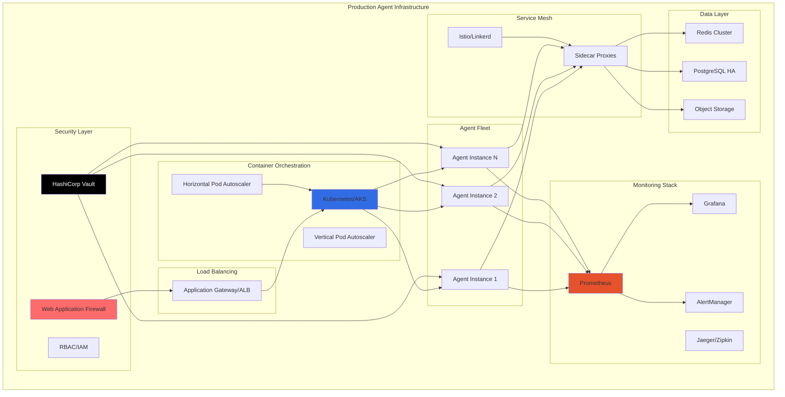

[🏠 Workshop](../../README.md) > [📚 Modules](../README.md) > [Module 25](README.md)

<div align="center">

[⬅️ Module 24: Multi-Agent Orchestration](../module-24/README.md) | **📖 Module 25: Advanced Agent Patterns** | [Module 26: Enterprise .NET Development ➡️](../module-26/README.md)

</div>

---

# Module 25: Advanced Agent Patterns

## 🎯 Module Overview

Welcome to Module 25! This final module in the AI Agents & MCP track teaches you how to deploy, monitor, and maintain AI agents in production environments. You'll learn enterprise-grade practices for scalability, reliability, security, and cost optimization.

### Duration
- **Total Time**: 3 hours
- **Lecture/Demo**: 45 minutes
- **Hands-on Exercises**: 2 hours 15 minutes

### Track
- 🟣 AI Agents & MCP Track (Modules 21-25) - Final Module

## 🎓 Learning Objectives

By the end of this module, you will be able to:

1. **Deploy Agents at Scale** - Implement production-grade agent deployments
2. **Ensure High Availability** - Build resilient agent systems with failover
3. **Monitor Agent Health** - Implement comprehensive observability
4. **Secure Agent Infrastructure** - Apply security best practices
5. **Optimize Performance** - Tune agents for production workloads
6. **Manage Costs** - Implement cost-effective scaling strategies

## 🏗️ Production Architecture



## 📚 What is Production Agent Deployment?

Production agent deployment involves taking AI agents from development to enterprise-scale production environments. This includes:

- **Infrastructure as Code**: Automated, reproducible deployments
- **Container Orchestration**: Kubernetes-based scaling and management
- **Service Mesh**: Advanced traffic management and security
- **Observability**: Comprehensive monitoring and tracing
- **Security Hardening**: Zero-trust architecture implementation
- **Disaster Recovery**: Backup and recovery strategies

### Key Production Considerations

1. **Scalability**: Handle varying workloads efficiently
2. **Reliability**: Maintain high availability (99.9%+)
3. **Security**: Protect against threats and vulnerabilities
4. **Performance**: Optimize for low latency and high throughput
5. **Cost**: Balance performance with budget constraints
6. **Compliance**: Meet regulatory requirements

## 🛠️ Production Technologies

- **Container Orchestration**: Kubernetes, Azure AKS, AWS EKS
- **Service Mesh**: Istio, Linkerd, Consul Connect
- **Monitoring**: Prometheus, Grafana, ELK Stack
- **Tracing**: Jaeger, Zipkin, AWS X-Ray
- **Security**: HashiCorp Vault, Azure Key Vault, RBAC
- **CI/CD**: GitHub Actions, Azure DevOps, GitLab CI
- **Infrastructure**: Terraform, Pulumi, ARM/Bicep

## 🚀 What You'll Build

In this module, you'll create:

1. **Production-Ready Agent Deployment** - Full Kubernetes deployment with auto-scaling
2. **Monitoring & Alerting System** - Complete observability stack
3. **Disaster Recovery Solution** - Automated backup and recovery system

## 📋 Prerequisites

Before starting this module, ensure you have:

- ✅ Completed Modules 21-24
- ✅ Understanding of container orchestration
- ✅ Basic knowledge of cloud platforms (Azure/AWS)
- ✅ Experience with Infrastructure as Code
- ✅ Familiarity with monitoring concepts

See [prerequisites.md](prerequisites.md) for detailed setup instructions.

## 📂 Module Structure

```
production-deployment/
├── README.md                          # This file
├── prerequisites.md                   # Setup requirements
├── best-practices.md                  # Production best practices
├── troubleshooting.md                # Common issues and solutions
├── exercises/
│   ├── exercise1-k8s-deployment/     # Kubernetes agent deployment
│   ├── exercise2-monitoring-stack/   # Observability implementation
│   └── exercise3-disaster-recovery/  # Backup and recovery system
├── resources/
│   ├── k8s-manifests/               # Kubernetes configurations
│   ├── helm-charts/                 # Helm chart templates
│   ├── terraform/                   # Infrastructure as Code
│   ├── monitoring/                  # Monitoring configurations
│   └── security/                    # Security policies
├── scripts/
│   ├── deploy-production.sh         # Production deployment script
│   ├── health-check.sh             # Health verification
│   ├── rollback.sh                 # Rollback procedures
│   └── disaster-recovery.sh        # DR automation
└── infrastructure/
    ├── environments/                # Environment configs
    └── modules/                     # Reusable IaC modules
```

## 🎯 Learning Path

### Step 1: Production Fundamentals (30 mins)
- Production vs development environments
- High availability patterns
- Security considerations
- Cost optimization strategies

### Step 2: Container Orchestration (45 mins)
- Kubernetes deployment strategies
- Service mesh implementation
- Auto-scaling configuration
- Health checks and probes

### Step 3: Observability (45 mins)
- Metrics collection and visualization
- Distributed tracing
- Log aggregation
- Alerting strategies

### Step 4: Security & Compliance (60 mins)
- Zero-trust architecture
- Secrets management
- Network policies
- Compliance automation

## 💡 Real-World Applications

Production agent deployment enables:

- **Enterprise AI Services**: Scalable AI capabilities for organizations
- **Global Agent Networks**: Distributed agents across regions
- **Mission-Critical Systems**: High-reliability AI operations
- **Cost-Effective Scaling**: Efficient resource utilization
- **Regulatory Compliance**: Meeting industry standards

## 🧪 Hands-on Exercises

### [Exercise 1: Kubernetes Agent Deployment](exercises/exercise1-k8s-deployment/) ⭐
Deploy a multi-agent system to Kubernetes with auto-scaling, health checks, and rolling updates.

### [Exercise 2: Complete Monitoring Stack](exercises/exercise2-monitoring-stack/) ⭐⭐
Implement comprehensive observability with metrics, logs, traces, and intelligent alerting.

### [Exercise 3: Disaster Recovery System](exercises/exercise3-disaster-recovery/) ⭐⭐⭐
Build an automated backup and recovery system with RTO/RPO targets and chaos testing.

## 📊 Module Resources

### Documentation
- [Kubernetes Best Practices](resources/k8s-manifests/README.md)
- [Helm Chart Development](resources/helm-charts/README.md)
- [Infrastructure as Code](resources/terraform/README.md)
- [Security Hardening Guide](resources/security/hardening-guide.md)

### Tools
- Production Readiness Checklist
- Cost Calculator
- Performance Baseline Tool
- Security Scanner

### Examples
- Multi-region deployment
- Blue-green deployment
- Canary releases
- Circuit breaker patterns

## 🎓 Skills You'll Master

- **Infrastructure as Code**: Terraform, Kubernetes manifests
- **Container Orchestration**: Advanced Kubernetes patterns
- **Observability**: Metrics, logs, traces, and alerts
- **Security**: Zero-trust, secrets management, RBAC
- **Reliability**: HA, DR, and chaos engineering
- **Cost Management**: Resource optimization and monitoring

## 🚦 Success Criteria

You'll have mastered this module when you can:

- ✅ Deploy agents to production Kubernetes clusters
- ✅ Implement comprehensive monitoring and alerting
- ✅ Secure agent infrastructure against threats
- ✅ Design for high availability and disaster recovery
- ✅ Optimize costs while maintaining performance
- ✅ Automate deployment and recovery processes

## 🛡️ Production Best Practices

Key practices for production agent deployment:

- **Immutable Infrastructure**: Never modify production directly
- **GitOps**: All changes through version control
- **Observability First**: Monitor everything from day one
- **Security by Design**: Build security into every layer
- **Chaos Engineering**: Test failure scenarios regularly
- **Cost Awareness**: Monitor and optimize spending

## 🔧 Required Tools

Production deployment tools:
- Kubernetes CLI (kubectl)
- Helm 3.x
- Terraform 1.5+
- Docker 24.x+
- Cloud CLI (az/aws/gcloud)
- Monitoring tools (promtool, etc.)

## 📈 Performance Targets

Production SLAs to achieve:
- Availability: 99.9% (three nines)
- Response time: <100ms p95
- Error rate: <0.1%
- Recovery time: <5 minutes
- Scale time: <2 minutes

## ⏭️ Course Completion

After completing this module, you'll have:
- Mastered the entire AI Agents & MCP track
- Built production-ready agent systems
- Gained enterprise deployment skills

## 🎉 Let's Deploy to Production!

Ready to take your agents to production? Start with the [prerequisites](prerequisites.md) to set up your environment, then dive into [Exercise 1](exercises/exercise1-k8s-deployment/)!

---

**Important**: Production deployments require careful planning and testing. Always follow your organization's deployment procedures and security policies.

---

## 🔗 Quick Links

### Module Resources
- [📋 Prerequisites](prerequisites.md)
- [📖 Best Practices](docs/best-practices.md)
- [🔧 Troubleshooting](docs/troubleshooting.md)
- [💡 Prompt Templates](docs/prompt-templates.md)

### Exercises
- [⭐ Exercise 1 - Foundation](exercises/exercise1/README.md)
- [⭐⭐ Exercise 2 - Application](exercises/exercise2/README.md)
- [⭐⭐⭐ Exercise 3 - Mastery](exercises/exercise3/README.md)

### Workshop Resources
- [🏠 Workshop Home](../../README.md)
- [📚 All Modules](../../README.md#-complete-module-overview)
- [🚀 Quick Start](../../QUICKSTART.md)
- [❓ FAQ](../../FAQ.md)
- [🤖 Prompt Guide](../../PROMPT-GUIDE.md)
- [🔧 Troubleshooting](../../TROUBLESHOOTING.md)


---

## 🔗 Quick Links

### Module Resources
- [📋 Prerequisites](prerequisites.md)
- [📖 Best Practices](docs/best-practices.md)
- [🔧 Troubleshooting](docs/troubleshooting.md)
- [💡 Prompt Templates](docs/prompt-templates.md)

### Exercises
- [⭐ Exercise 1 - Foundation](exercises/exercise1/README.md)
- [⭐⭐ Exercise 2 - Application](exercises/exercise2/README.md)
- [⭐⭐⭐ Exercise 3 - Mastery](exercises/exercise3/README.md)

### Workshop Resources
- [🏠 Workshop Home](../../README.md)
- [📚 All Modules](../../README.md#-complete-module-overview)
- [🚀 Quick Start](../../QUICKSTART.md)
- [❓ FAQ](../../FAQ.md)
- [🤖 Prompt Guide](../../PROMPT-GUIDE.md)
- [🔧 Troubleshooting](../../TROUBLESHOOTING.md)


---

## 🔗 Quick Links

### Module Resources
- [📋 Prerequisites](prerequisites.md)
- [📖 Best Practices](docs/best-practices.md)
- [🔧 Troubleshooting](docs/troubleshooting.md)
- [💡 Prompt Templates](docs/prompt-templates.md)

### Exercises
- [⭐ Exercise 1 - Foundation](exercises/exercise1/README.md)
- [⭐⭐ Exercise 2 - Application](exercises/exercise2/README.md)
- [⭐⭐⭐ Exercise 3 - Mastery](exercises/exercise3/README.md)

### Workshop Resources
- [🏠 Workshop Home](../../README.md)
- [📚 All Modules](../../README.md#-complete-module-overview)
- [🚀 Quick Start](../../QUICKSTART.md)
- [❓ FAQ](../../FAQ.md)
- [🤖 Prompt Guide](../../PROMPT-GUIDE.md)
- [🔧 Troubleshooting](../../TROUBLESHOOTING.md)


## 🧭 Quick Navigation

<table>
<tr>
<td valign="top">

### 📖 Module Content
- [Overview](README.md)
- [Prerequisites](prerequisites.md)
- [Setup Guide](docs/setup.md)
- [Troubleshooting](docs/troubleshooting.md)

</td>
<td valign="top">

### 💻 Exercises
- [Exercise 1 - Foundation ⭐](exercises/exercise1/README.md)
- [Exercise 2 - Application ⭐⭐](exercises/exercise2/README.md)
- [Exercise 3 - Mastery ⭐⭐⭐](exercises/exercise3/README.md)
- [Independent Project](project/README.md)

</td>
<td valign="top">

### 📚 Resources
- [Best Practices](docs/best-practices.md)
- [Common Patterns](docs/common-patterns.md)
- [Prompt Templates](docs/prompt-templates.md)
- [Additional Resources](resources/README.md)

</td>
</tr>
</table>


---

## 🌐 Workshop Resources

<div align="center">

| Core Documentation | Learning Resources | Tools & Scripts |
|:------------------:|:-----------------:|:---------------:|
| [🏠 Home](../../README.md) | [🚀 Quick Start](../../QUICKSTART.md) | [🛠️ Scripts](../../scripts/README.md) |
| [📋 Prerequisites](../../PREREQUISITES.md) | [❓ FAQ](../../FAQ.md) | [🔧 Setup](../../scripts/setup-workshop.sh) |
| [📚 All Modules](../README.md) | [🤖 Prompt Guide](../../PROMPT-GUIDE.md) | [✅ Validate](../../scripts/validate-prerequisites.sh) |
| [🗺️ Learning Paths](../../README.md#-learning-paths) | [🔧 Troubleshooting](../../TROUBLESHOOTING.md) | [🧹 Cleanup](../../scripts/cleanup-resources.sh) |

</div>

### 🏷️ Module Categories

<div align="center">

| 🟢 Fundamentals | 🔵 Intermediate | 🟠 Advanced | 🔴 Enterprise | 🟣 AI Agents | ⭐ Mastery |
|:---------------:|:---------------:|:-----------:|:-------------:|:------------:|:----------:|
| Modules 1-5 | Modules 6-10 | Modules 11-15 | Modules 16-20 | Modules 21-25 | Modules 26-30 |

</div>


---

## 🔗 Quick Links

### Module Resources
- [📋 Prerequisites](prerequisites.md)
- [📖 Best Practices](docs/best-practices.md)
- [🔧 Troubleshooting](docs/troubleshooting.md)
- [💡 Prompt Templates](docs/prompt-templates.md)

### Exercises
- [⭐ Exercise 1 - Foundation](exercises/exercise1/README.md)
- [⭐⭐ Exercise 2 - Application](exercises/exercise2/README.md)
- [⭐⭐⭐ Exercise 3 - Mastery](exercises/exercise3/README.md)

### Workshop Resources
- [🏠 Workshop Home](../../README.md)
- [📚 All Modules](../../README.md#-complete-module-overview)
- [🚀 Quick Start](../../QUICKSTART.md)
- [❓ FAQ](../../FAQ.md)
- [🤖 Prompt Guide](../../PROMPT-GUIDE.md)
- [🔧 Troubleshooting](../../TROUBLESHOOTING.md)


## 🧭 Quick Navigation

<table>
<tr>
<td valign="top">

### 📖 Module Content
- [Overview](README.md)
- [Prerequisites](prerequisites.md)
- [Setup Guide](docs/setup.md)
- [Troubleshooting](docs/troubleshooting.md)

</td>
<td valign="top">

### 💻 Exercises
- [Exercise 1 - Foundation ⭐](exercises/exercise1/README.md)
- [Exercise 2 - Application ⭐⭐](exercises/exercise2/README.md)
- [Exercise 3 - Mastery ⭐⭐⭐](exercises/exercise3/README.md)
- [Independent Project](project/README.md)

</td>
<td valign="top">

### 📚 Resources
- [Best Practices](docs/best-practices.md)
- [Common Patterns](docs/common-patterns.md)
- [Prompt Templates](docs/prompt-templates.md)
- [Additional Resources](resources/README.md)

</td>
</tr>
</table>


---

## 🌐 Workshop Resources

<div align="center">

| Core Documentation | Learning Resources | Tools & Scripts |
|:------------------:|:-----------------:|:---------------:|
| [🏠 Home](../../README.md) | [🚀 Quick Start](../../QUICKSTART.md) | [🛠️ Scripts](../../scripts/README.md) |
| [📋 Prerequisites](../../PREREQUISITES.md) | [❓ FAQ](../../FAQ.md) | [🔧 Setup](../../scripts/setup-workshop.sh) |
| [📚 All Modules](../README.md) | [🤖 Prompt Guide](../../PROMPT-GUIDE.md) | [✅ Validate](../../scripts/validate-prerequisites.sh) |
| [🗺️ Learning Paths](../../README.md#-learning-paths) | [🔧 Troubleshooting](../../TROUBLESHOOTING.md) | [🧹 Cleanup](../../scripts/cleanup-resources.sh) |

</div>

### 🏷️ Module Categories

<div align="center">

| 🟢 Fundamentals | 🔵 Intermediate | 🟠 Advanced | 🔴 Enterprise | 🟣 AI Agents | ⭐ Mastery |
|:---------------:|:---------------:|:-----------:|:-------------:|:------------:|:----------:|
| Modules 1-5 | Modules 6-10 | Modules 11-15 | Modules 16-20 | Modules 21-25 | Modules 26-30 |

</div>


---

## 🔗 Quick Links

### Module Resources
- [📋 Prerequisites](prerequisites.md)
- [📖 Best Practices](docs/best-practices.md)
- [🔧 Troubleshooting](docs/troubleshooting.md)
- [💡 Prompt Templates](docs/prompt-templates.md)

### Exercises
- [⭐ Exercise 1 - Foundation](exercises/exercise1/README.md)
- [⭐⭐ Exercise 2 - Application](exercises/exercise2/README.md)
- [⭐⭐⭐ Exercise 3 - Mastery](exercises/exercise3/README.md)

### Workshop Resources
- [🏠 Workshop Home](../../README.md)
- [📚 All Modules](../../README.md#-complete-module-overview)
- [🚀 Quick Start](../../QUICKSTART.md)
- [❓ FAQ](../../FAQ.md)
- [🤖 Prompt Guide](../../PROMPT-GUIDE.md)
- [🔧 Troubleshooting](../../TROUBLESHOOTING.md)


## 🧭 Quick Navigation

<table>
<tr>
<td valign="top">

### 📖 Module Content
- [Overview](README.md)
- [Prerequisites](prerequisites.md)
- [Setup Guide](docs/setup.md)
- [Troubleshooting](docs/troubleshooting.md)

</td>
<td valign="top">

### 💻 Exercises
- [Exercise 1 - Foundation ⭐](exercises/exercise1/README.md)
- [Exercise 2 - Application ⭐⭐](exercises/exercise2/README.md)
- [Exercise 3 - Mastery ⭐⭐⭐](exercises/exercise3/README.md)
- [Independent Project](project/README.md)

</td>
<td valign="top">

### 📚 Resources
- [Best Practices](docs/best-practices.md)
- [Common Patterns](docs/common-patterns.md)
- [Prompt Templates](docs/prompt-templates.md)
- [Additional Resources](resources/README.md)

</td>
</tr>
</table>


---

## 🌐 Workshop Resources

<div align="center">

| Core Documentation | Learning Resources | Tools & Scripts |
|:------------------:|:-----------------:|:---------------:|
| [🏠 Home](../../README.md) | [🚀 Quick Start](../../QUICKSTART.md) | [🛠️ Scripts](../../scripts/README.md) |
| [📋 Prerequisites](../../PREREQUISITES.md) | [❓ FAQ](../../FAQ.md) | [🔧 Setup](../../scripts/setup-workshop.sh) |
| [📚 All Modules](../README.md) | [🤖 Prompt Guide](../../PROMPT-GUIDE.md) | [✅ Validate](../../scripts/validate-prerequisites.sh) |
| [🗺️ Learning Paths](../../README.md#-learning-paths) | [🔧 Troubleshooting](../../TROUBLESHOOTING.md) | [🧹 Cleanup](../../scripts/cleanup-resources.sh) |

</div>

### 🏷️ Module Categories

<div align="center">

| 🟢 Fundamentals | 🔵 Intermediate | 🟠 Advanced | 🔴 Enterprise | 🟣 AI Agents | ⭐ Mastery |
|:---------------:|:---------------:|:-----------:|:-------------:|:------------:|:----------:|
| Modules 1-5 | Modules 6-10 | Modules 11-15 | Modules 16-20 | Modules 21-25 | Modules 26-30 |

</div>

