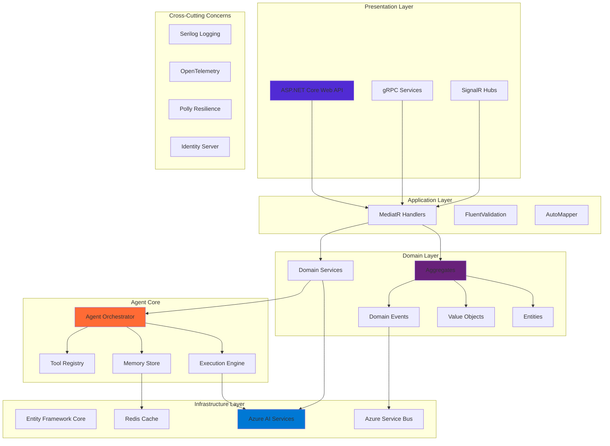

# Module 26: .NET Enterprise AI Agents

## 🎯 Module Overview

Welcome to Module 26! This module focuses on building enterprise-grade AI agents using .NET and C#. You'll learn how to leverage the power of the .NET ecosystem to create scalable, maintainable, and secure AI agent solutions that meet enterprise requirements.

### Duration
- **Total Time**: 3 hours
- **Lecture/Demo**: 45 minutes
- **Hands-on Exercises**: 2 hours 15 minutes

### Track
- 🟢 Enterprise Mastery Track (Modules 26-28) - First Module

## 🎓 Learning Objectives

By the end of this module, you will be able to:

1. **Build Enterprise AI Agents** - Create production-ready agents using .NET 8 and C#
2. **Implement Domain-Driven Design** - Apply DDD principles to AI agent architecture
3. **Integrate with Azure AI Services** - Leverage Azure OpenAI, Cognitive Services, and more
4. **Apply Enterprise Patterns** - Use CQRS, Event Sourcing, and Clean Architecture
5. **Ensure Security & Compliance** - Implement enterprise security standards
6. **Create Scalable Solutions** - Build agents that scale with enterprise demands

## 🏗️ Enterprise Architecture



## 📚 What is .NET Enterprise AI Development?

Enterprise AI development in .NET combines the robustness of the .NET platform with cutting-edge AI capabilities to create solutions that meet stringent enterprise requirements:

- **Type Safety**: Leverage C#'s strong typing for reliable AI agent development
- **Performance**: Utilize .NET's high-performance runtime for demanding workloads
- **Integration**: Seamlessly connect with existing enterprise systems
- **Security**: Built-in security features and compliance capabilities
- **Tooling**: World-class development tools and debugging capabilities
- **Cloud-Native**: First-class support for Azure and cloud deployments

### Key Technologies

- **.NET 8**: Latest LTS version with enhanced performance
- **C# 12**: Modern language features for cleaner code
- **ASP.NET Core**: High-performance web framework
- **Entity Framework Core**: Modern ORM for data access
- **Azure AI Services**: Comprehensive AI capabilities
- **Semantic Kernel**: Microsoft's AI orchestration framework

## 🛠️ Enterprise Patterns & Practices

### Clean Architecture
```
src/
├── EnterpriseAgent.Domain/          # Core business logic
├── EnterpriseAgent.Application/     # Use cases and application logic
├── EnterpriseAgent.Infrastructure/  # External concerns
├── EnterpriseAgent.API/            # Web API presentation
└── EnterpriseAgent.Tests/          # Comprehensive test suites
```

### CQRS Pattern
- **Commands**: Modify state through well-defined operations
- **Queries**: Read state without side effects
- **Events**: Communicate changes across boundaries

### Domain-Driven Design
- **Aggregates**: Consistency boundaries
- **Value Objects**: Immutable domain concepts
- **Domain Events**: Business-meaningful occurrences
- **Repositories**: Abstract data persistence

## 🚀 What You'll Build

In this module, you'll create:

1. **Enterprise Agent Framework** - Complete .NET-based agent architecture
2. **Multi-Modal Agent System** - Agents supporting text, voice, and vision
3. **Compliance-Ready Platform** - GDPR, HIPAA, and SOC 2 compliant agent system

## 📋 Prerequisites

Before starting this module, ensure you have:

- ✅ Completed Modules 21-25 (AI Agents fundamentals)
- ✅ Strong C# and .NET knowledge
- ✅ Understanding of enterprise architecture patterns
- ✅ Basic knowledge of Azure services
- ✅ Familiarity with dependency injection and SOLID principles

See [prerequisites.md](prerequisites.md) for detailed setup instructions.

## 📂 Module Structure

```
module-26-dotnet-enterprise-agents/
├── README.md                           # This file
├── prerequisites.md                    # Setup requirements
├── best-practices.md                   # Enterprise .NET best practices
├── troubleshooting.md                 # Common issues and solutions
├── exercises/
│   ├── exercise1-agent-framework/     # Build enterprise agent framework
│   ├── exercise2-multimodal-agents/   # Multi-modal agent implementation
│   └── exercise3-compliance-platform/ # Compliance-ready platform
├── src/
│   ├── EnterpriseAgent.Domain/       # Domain models and logic
│   ├── EnterpriseAgent.Application/  # Application services
│   ├── EnterpriseAgent.Infrastructure/ # Infrastructure implementations
│   ├── EnterpriseAgent.API/          # Web API project
│   └── EnterpriseAgent.Tests/        # Test projects
├── scripts/
│   ├── setup-environment.ps1          # PowerShell setup script
│   ├── build-solution.ps1             # Build automation
│   ├── run-tests.ps1                  # Test execution
│   └── deploy-azure.ps1               # Azure deployment
└── resources/
    ├── architecture-diagrams/         # Solution architecture
    ├── api-specifications/            # OpenAPI specs
    ├── deployment-templates/          # ARM/Bicep templates
    └── sample-data/                   # Test data sets
```

## 🎯 Learning Path

### Step 1: Enterprise Foundations (30 mins)
- .NET 8 and C# 12 features for AI
- Clean Architecture principles
- Domain-Driven Design for agents
- Enterprise patterns overview

### Step 2: Agent Framework Development (45 mins)
- Building the core agent engine
- Implementing tool abstractions
- Memory and state management
- Orchestration patterns

### Step 3: Azure AI Integration (45 mins)
- Azure OpenAI integration
- Cognitive Services utilization
- Durable Functions for workflows
- Service Bus for messaging

### Step 4: Enterprise Features (60 mins)
- Security and authentication
- Compliance implementation
- Monitoring and diagnostics
- Performance optimization

## 💡 Real-World Applications

Enterprise .NET AI agents enable:

- **Intelligent Document Processing**: Automated analysis and extraction
- **Customer Service Automation**: Multi-channel support agents
- **Business Process Automation**: Intelligent workflow orchestration
- **Compliance Monitoring**: Automated regulatory compliance
- **Financial Analysis**: Real-time market intelligence agents

## 🧪 Hands-on Exercises

### [Exercise 1: Enterprise Agent Framework](exercises/exercise1-agent-framework/) ⭐
Build a complete enterprise-grade agent framework using Clean Architecture, CQRS, and DDD principles.

### [Exercise 2: Multi-Modal Agent System](exercises/exercise2-multimodal-agents/) ⭐⭐
Implement agents that can process text, voice, images, and documents using Azure AI services.

### [Exercise 3: Compliance-Ready Platform](exercises/exercise3-compliance-platform/) ⭐⭐⭐
Create a fully compliant agent platform with audit trails, data privacy, and regulatory features.

## 📊 Module Resources

### Documentation
- [Clean Architecture Guide](resources/clean-architecture-guide.md)
- [DDD Implementation Patterns](resources/ddd-patterns.md)
- [Azure AI Integration Guide](resources/azure-ai-integration.md)
- [Security Best Practices](resources/security-guide.md)

### Code Templates
- Agent base classes
- Repository patterns
- CQRS handlers
- Integration test helpers

### Tools & Libraries
- Semantic Kernel SDK
- MediatR for CQRS
- FluentValidation
- Polly for resilience

## 🎓 Skills You'll Master

- **Enterprise Architecture**: Clean Architecture, DDD, CQRS
- **AI Integration**: Azure OpenAI, Cognitive Services, Semantic Kernel
- **Security**: OAuth 2.0, Azure AD, Key Vault integration
- **Performance**: Caching, async patterns, optimization
- **Testing**: Unit, integration, and end-to-end testing
- **Deployment**: Azure deployment, CI/CD pipelines

## 🚦 Success Criteria

You'll have mastered this module when you can:

- ✅ Design and implement enterprise-grade AI agents in .NET
- ✅ Apply Clean Architecture and DDD principles to AI solutions
- ✅ Integrate multiple Azure AI services effectively
- ✅ Implement proper security and compliance measures
- ✅ Create scalable and maintainable agent systems
- ✅ Deploy agents to Azure with full observability

## 🛡️ Enterprise Standards

Key standards we'll implement:

- **Security**: OAuth 2.0, mTLS, encryption at rest
- **Compliance**: GDPR, HIPAA, SOC 2
- **Performance**: <100ms response time, 99.9% availability
- **Scalability**: Horizontal scaling, load balancing
- **Maintainability**: SOLID principles, comprehensive testing

## 🔧 Required Tools

Enterprise development tools:
- Visual Studio 2022 or VS Code
- .NET 8 SDK
- Azure CLI
- Docker Desktop
- SQL Server Developer Edition
- Azure subscription (free tier works)

## 📈 Performance Targets

Enterprise SLAs to achieve:
- Response time: <100ms p95
- Throughput: 1000+ requests/second
- Availability: 99.9% uptime
- Error rate: <0.1%
- Recovery time: <5 minutes

## ⏭️ What's Next?

After completing this module:
- Module 27: COBOL to Modern AI Migration
- Module 28: Advanced DevOps & Security
- Module 29: Enterprise Architecture Review
- Module 30: Capstone Project

## 🎉 Let's Build Enterprise AI!

Ready to create enterprise-grade AI agents with .NET? Start with the [prerequisites](prerequisites.md) to set up your environment, then dive into [Exercise 1](exercises/exercise1-agent-framework/)!

---

**Note**: This module assumes strong .NET knowledge. If you need a refresher, review the [.NET documentation](https://docs.microsoft.com/dotnet/) before starting.