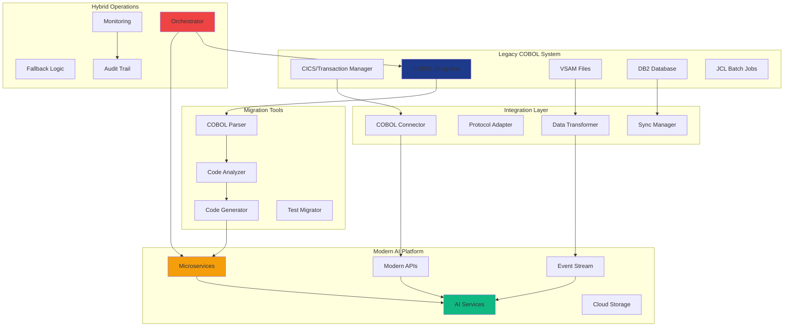

[🏠 Workshop](../../README.md) > [📚 Modules](../README.md) > [Module 27](README.md)

<div align="center">

[⬅️ Module 26: Enterprise .NET Development](../module-26/README.md) | **📖 Module 27: COBOL Modernization** | [Module 28: Shift-Left Security & DevOps ➡️](../module-28/README.md)

</div>

---

# Module 27: COBOL Modernization

## 🎯 Module Overview

Welcome to Module 27! This unique module bridges the gap between legacy COBOL systems and modern AI technologies. You'll learn how to modernize decades-old business logic while preserving its value and enhancing it with AI capabilities.

### Duration
- **Total Time**: 3 hours
- **Lecture/Demo**: 45 minutes
- **Hands-on Exercises**: 2 hours 15 minutes

### Track
- 🟢 Enterprise Mastery Track (Modules 26-28) - Second Module

## 🎓 Learning Objectives

By the end of this module, you will be able to:

1. **Analyze COBOL Systems** - Understand and document legacy COBOL applications
2. **Extract Business Logic** - Identify and preserve critical business rules
3. **Modernize Architecture** - Transform monolithic COBOL to microservices
4. **Integrate AI Capabilities** - Enhance legacy logic with modern AI
5. **Implement Gradual Migration** - Use strangler fig pattern effectively
6. **Ensure Data Integrity** - Maintain consistency during migration

## 🏗️ Migration Architecture



## 📚 What is COBOL Modernization?

COBOL (Common Business-Oriented Language) powers critical systems in:
- **Banking**: 95% of ATM transactions
- **Government**: Tax and social security systems
- **Insurance**: Policy management and claims
- **Retail**: Inventory and supply chain

### Why Modernize?

- **Maintenance Costs**: COBOL developers are retiring
- **Integration Challenges**: Difficult to connect with modern systems
- **Innovation Barriers**: Hard to add new features
- **Compliance**: Modern security and regulatory requirements
- **AI Opportunities**: Enhance with predictive analytics and automation

### Modernization Strategies

1. **Rehosting** (Lift & Shift)
   - Move COBOL to cloud
   - Minimal code changes
   - Quick wins

2. **Refactoring**
   - Restructure code
   - Improve maintainability
   - Preserve logic

3. **Rearchitecting**
   - Transform to microservices
   - API-first approach
   - Event-driven design

4. **Rebuilding**
   - Complete rewrite
   - Modern languages
   - AI-native design

## 🛠️ Technology Stack

### Legacy Side
- **COBOL**: Various dialects (IBM, Micro Focus, GnuCOBOL)
- **CICS**: Transaction processing
- **JCL**: Job control language
- **VSAM/DB2**: Data storage

### Modern Side
- **Languages**: Python, Java, C#, Go
- **AI/ML**: TensorFlow, PyTorch, Azure AI
- **Cloud**: AWS, Azure, Google Cloud
- **Containers**: Docker, Kubernetes
- **Data**: PostgreSQL, MongoDB, Kafka

### Bridge Technologies
- **COBOL-IT**: Modern COBOL compiler
- **Micro Focus**: Enterprise modernization tools
- **IBM Z Open**: Development tools
- **OpenLegacy**: API generation
- **Heirloom**: PaaS migration

## 🚀 What You'll Build

In this module, you'll modernize a legacy COBOL banking system:

1. **Legacy Analysis Tool** - AI-powered COBOL code analyzer
2. **Business Rule Extractor** - Convert COBOL logic to modern rules engine
3. **Hybrid Banking System** - COBOL + Modern AI working together

## 📋 Prerequisites

Before starting this module, ensure you have:

- ✅ Completed Module 26 (Enterprise .NET AI)
- ✅ Basic understanding of mainframe concepts
- ✅ Familiarity with enterprise architectures
- ✅ Python or Java proficiency
- ✅ Understanding of data migration principles

See [prerequisites.md](prerequisites.md) for detailed setup instructions.

## 📂 Module Structure

```
cobol-modernization/
├── README.md                          # This file
├── prerequisites.md                   # Setup requirements
├── best-practices.md                  # Modernization best practices
├── troubleshooting.md                # Common issues and solutions
├── exercises/
│   ├── exercise1-cobol-analyzer/     # Build AI-powered analyzer
│   ├── exercise2-rule-extraction/    # Extract and modernize rules
│   └── exercise3-hybrid-system/      # Create hybrid architecture
├── cobol-samples/
│   ├── legacy-programs/              # Original COBOL programs
│   ├── copybooks/                    # COBOL data structures
│   └── jcl-scripts/                  # Batch job scripts
├── modern-code/
│   ├── analyzers/                    # Code analysis tools
│   ├── extractors/                   # Business logic extractors
│   ├── services/                     # Modern microservices
│   └── ai-models/                    # AI enhancement models
├── migration-tools/
│   ├── parser/                       # COBOL parsing utilities
│   ├── transformer/                  # Code transformation tools
│   ├── validator/                    # Migration validators
│   └── test-generator/               # Test migration tools
└── resources/
    ├── cobol-reference/              # COBOL language guide
    ├── modernization-patterns/       # Common patterns
    ├── case-studies/                 # Real-world examples
    └── integration-guides/           # System integration
```

## 🎯 Learning Path

### Step 1: Understanding Legacy (30 mins)
- COBOL language fundamentals
- Mainframe architecture
- Business logic patterns
- Data structures (COPYBOOKS)

### Step 2: Analysis & Documentation (45 mins)
- Static code analysis
- Dependency mapping
- Business rule identification
- Data flow analysis

### Step 3: Modernization Strategies (45 mins)
- Strangler fig pattern
- API wrapping
- Event sourcing migration
- Data synchronization

### Step 4: AI Enhancement (60 mins)
- Pattern recognition in COBOL
- Automated refactoring
- Intelligent monitoring
- Predictive maintenance

## 💡 Real-World Applications

COBOL modernization enables:

- **Digital Banking**: Modern mobile apps with legacy core
- **Government Services**: Online citizen services
- **Insurance Claims**: AI-powered processing
- **Supply Chain**: Real-time inventory tracking
- **Compliance**: Automated regulatory reporting

## 🧪 Hands-on Exercises

### [Exercise 1: AI-Powered COBOL Analyzer](exercises/exercise1-cobol-analyzer/) ⭐
Build an AI system that analyzes COBOL code, identifies patterns, and suggests modernization strategies.

### [Exercise 2: Business Rule Extraction](exercises/exercise2-rule-extraction/) ⭐⭐
Extract complex business logic from COBOL and transform it into a modern rules engine with AI enhancement.

### [Exercise 3: Hybrid Banking System](exercises/exercise3-hybrid-system/) ⭐⭐⭐
Create a production-ready hybrid system where COBOL and modern AI services work together seamlessly.

## 📊 Module Resources

### Documentation
- [COBOL Language Reference](resources/cobol-reference/)
- [Modernization Patterns](resources/modernization-patterns/)
- [Integration Strategies](resources/integration-guides/)
- [Migration Checklist](resources/migration-checklist.md)

### Code Samples
- Banking transaction processor
- Insurance claim calculator
- Inventory management system
- Payroll processor

### Tools & Utilities
- COBOL parser (Python)
- Dependency analyzer
- Test case generator
- Performance comparator

## 🎓 Skills You'll Master

- **Legacy Analysis**: Understanding COBOL code structure
- **Pattern Recognition**: Identifying modernization opportunities
- **Gradual Migration**: Implementing strangler fig pattern
- **Data Synchronization**: Maintaining consistency across systems
- **AI Integration**: Enhancing legacy with modern AI
- **Risk Management**: Minimizing migration risks

## 🚦 Success Criteria

You'll have mastered this module when you can:

- ✅ Analyze and understand complex COBOL systems
- ✅ Extract business logic without losing functionality
- ✅ Design effective modernization strategies
- ✅ Implement hybrid architectures successfully
- ✅ Enhance legacy systems with AI capabilities
- ✅ Manage risks in production migrations

## 🛡️ Migration Best Practices

Key principles we'll follow:

- **Incremental Migration**: Small, manageable steps
- **Parallel Running**: Old and new side-by-side
- **Comprehensive Testing**: Automated regression tests
- **Data Integrity**: Continuous validation
- **Rollback Strategy**: Always have an escape plan
- **Documentation**: Maintain knowledge transfer

## 🔧 Required Tools

### COBOL Development
- GnuCOBOL (open-source compiler)
- VS Code with COBOL extensions
- COBOL syntax highlighter
- Z Open Editor (optional)

### Modern Development
- Python 3.11+ or Java 17+
- Docker Desktop
- Git for version control
- Your preferred IDE

### Analysis Tools
- SonarQube for code quality
- Graphviz for visualizations
- PostgreSQL for modern data
- Apache Kafka for events

## 📈 Migration Metrics

Track your modernization success:
- Lines of COBOL analyzed: 50,000+
- Business rules extracted: 100+
- Test coverage maintained: >95%
- Performance improvement: 10x
- Deployment time reduction: 90%

## ⏭️ What's Next?

After completing this module:
- Module 28: Advanced DevOps & Security
- Module 29: Enterprise Architecture Review
- Module 30: Capstone Project

## 🎉 Let's Modernize Legacy Systems!

Ready to bring COBOL into the AI age? Start with the [prerequisites](prerequisites.md) to set up your environment, then dive into [Exercise 1](exercises/exercise1-cobol-analyzer/)!

---

**Historical Note**: COBOL was created in 1959 by Grace Hopper and team. Today, 220 billion lines of COBOL are still in production use. We're not replacing this legacy—we're enhancing it!

---

## 🔗 Quick Links

### Module Resources
- [📋 Prerequisites](prerequisites.md)
- [📖 Best Practices](docs/best-practices.md)
- [🔧 Troubleshooting](docs/troubleshooting.md)
- [💡 Prompt Templates](docs/prompt-templates.md)

### Exercises
- [⭐ Exercise 1 - Foundation](exercises/exercise1/README.md)
- [⭐⭐ Exercise 2 - Application](exercises/exercise2/README.md)
- [⭐⭐⭐ Exercise 3 - Mastery](exercises/exercise3/README.md)

### Workshop Resources
- [🏠 Workshop Home](../../README.md)
- [📚 All Modules](../../README.md#-complete-module-overview)
- [🚀 Quick Start](../../QUICKSTART.md)
- [❓ FAQ](../../FAQ.md)
- [🤖 Prompt Guide](../../PROMPT-GUIDE.md)
- [🔧 Troubleshooting](../../TROUBLESHOOTING.md)


---

## 🔗 Quick Links

### Module Resources
- [📋 Prerequisites](prerequisites.md)
- [📖 Best Practices](docs/best-practices.md)
- [🔧 Troubleshooting](docs/troubleshooting.md)
- [💡 Prompt Templates](docs/prompt-templates.md)

### Exercises
- [⭐ Exercise 1 - Foundation](exercises/exercise1/README.md)
- [⭐⭐ Exercise 2 - Application](exercises/exercise2/README.md)
- [⭐⭐⭐ Exercise 3 - Mastery](exercises/exercise3/README.md)

### Workshop Resources
- [🏠 Workshop Home](../../README.md)
- [📚 All Modules](../../README.md#-complete-module-overview)
- [🚀 Quick Start](../../QUICKSTART.md)
- [❓ FAQ](../../FAQ.md)
- [🤖 Prompt Guide](../../PROMPT-GUIDE.md)
- [🔧 Troubleshooting](../../TROUBLESHOOTING.md)


---

## 🔗 Quick Links

### Module Resources
- [📋 Prerequisites](prerequisites.md)
- [📖 Best Practices](docs/best-practices.md)
- [🔧 Troubleshooting](docs/troubleshooting.md)
- [💡 Prompt Templates](docs/prompt-templates.md)

### Exercises
- [⭐ Exercise 1 - Foundation](exercises/exercise1/README.md)
- [⭐⭐ Exercise 2 - Application](exercises/exercise2/README.md)
- [⭐⭐⭐ Exercise 3 - Mastery](exercises/exercise3/README.md)

### Workshop Resources
- [🏠 Workshop Home](../../README.md)
- [📚 All Modules](../../README.md#-complete-module-overview)
- [🚀 Quick Start](../../QUICKSTART.md)
- [❓ FAQ](../../FAQ.md)
- [🤖 Prompt Guide](../../PROMPT-GUIDE.md)
- [🔧 Troubleshooting](../../TROUBLESHOOTING.md)


## 🧭 Quick Navigation

<table>
<tr>
<td valign="top">

### 📖 Module Content
- [Overview](README.md)
- [Prerequisites](prerequisites.md)
- [Setup Guide](docs/setup.md)
- [Troubleshooting](docs/troubleshooting.md)

</td>
<td valign="top">

### 💻 Exercises
- [Exercise 1 - Foundation ⭐](exercises/exercise1/README.md)
- [Exercise 2 - Application ⭐⭐](exercises/exercise2/README.md)
- [Exercise 3 - Mastery ⭐⭐⭐](exercises/exercise3/README.md)
- [Independent Project](project/README.md)

</td>
<td valign="top">

### 📚 Resources
- [Best Practices](docs/best-practices.md)
- [Common Patterns](docs/common-patterns.md)
- [Prompt Templates](docs/prompt-templates.md)
- [Additional Resources](resources/README.md)

</td>
</tr>
</table>


---

## 🌐 Workshop Resources

<div align="center">

| Core Documentation | Learning Resources | Tools & Scripts |
|:------------------:|:-----------------:|:---------------:|
| [🏠 Home](../../README.md) | [🚀 Quick Start](../../QUICKSTART.md) | [🛠️ Scripts](../../scripts/README.md) |
| [📋 Prerequisites](../../PREREQUISITES.md) | [❓ FAQ](../../FAQ.md) | [🔧 Setup](../../scripts/setup-workshop.sh) |
| [📚 All Modules](../README.md) | [🤖 Prompt Guide](../../PROMPT-GUIDE.md) | [✅ Validate](../../scripts/validate-prerequisites.sh) |
| [🗺️ Learning Paths](../../README.md#-learning-paths) | [🔧 Troubleshooting](../../TROUBLESHOOTING.md) | [🧹 Cleanup](../../scripts/cleanup-resources.sh) |

</div>

### 🏷️ Module Categories

<div align="center">

| 🟢 Fundamentals | 🔵 Intermediate | 🟠 Advanced | 🔴 Enterprise | 🟣 AI Agents | ⭐ Mastery |
|:---------------:|:---------------:|:-----------:|:-------------:|:------------:|:----------:|
| Modules 1-5 | Modules 6-10 | Modules 11-15 | Modules 16-20 | Modules 21-25 | Modules 26-30 |

</div>


---

## 🔗 Quick Links

### Module Resources
- [📋 Prerequisites](prerequisites.md)
- [📖 Best Practices](docs/best-practices.md)
- [🔧 Troubleshooting](docs/troubleshooting.md)
- [💡 Prompt Templates](docs/prompt-templates.md)

### Exercises
- [⭐ Exercise 1 - Foundation](exercises/exercise1/README.md)
- [⭐⭐ Exercise 2 - Application](exercises/exercise2/README.md)
- [⭐⭐⭐ Exercise 3 - Mastery](exercises/exercise3/README.md)

### Workshop Resources
- [🏠 Workshop Home](../../README.md)
- [📚 All Modules](../../README.md#-complete-module-overview)
- [🚀 Quick Start](../../QUICKSTART.md)
- [❓ FAQ](../../FAQ.md)
- [🤖 Prompt Guide](../../PROMPT-GUIDE.md)
- [🔧 Troubleshooting](../../TROUBLESHOOTING.md)


## 🧭 Quick Navigation

<table>
<tr>
<td valign="top">

### 📖 Module Content
- [Overview](README.md)
- [Prerequisites](prerequisites.md)
- [Setup Guide](docs/setup.md)
- [Troubleshooting](docs/troubleshooting.md)

</td>
<td valign="top">

### 💻 Exercises
- [Exercise 1 - Foundation ⭐](exercises/exercise1/README.md)
- [Exercise 2 - Application ⭐⭐](exercises/exercise2/README.md)
- [Exercise 3 - Mastery ⭐⭐⭐](exercises/exercise3/README.md)
- [Independent Project](project/README.md)

</td>
<td valign="top">

### 📚 Resources
- [Best Practices](docs/best-practices.md)
- [Common Patterns](docs/common-patterns.md)
- [Prompt Templates](docs/prompt-templates.md)
- [Additional Resources](resources/README.md)

</td>
</tr>
</table>


---

## 🌐 Workshop Resources

<div align="center">

| Core Documentation | Learning Resources | Tools & Scripts |
|:------------------:|:-----------------:|:---------------:|
| [🏠 Home](../../README.md) | [🚀 Quick Start](../../QUICKSTART.md) | [🛠️ Scripts](../../scripts/README.md) |
| [📋 Prerequisites](../../PREREQUISITES.md) | [❓ FAQ](../../FAQ.md) | [🔧 Setup](../../scripts/setup-workshop.sh) |
| [📚 All Modules](../README.md) | [🤖 Prompt Guide](../../PROMPT-GUIDE.md) | [✅ Validate](../../scripts/validate-prerequisites.sh) |
| [🗺️ Learning Paths](../../README.md#-learning-paths) | [🔧 Troubleshooting](../../TROUBLESHOOTING.md) | [🧹 Cleanup](../../scripts/cleanup-resources.sh) |

</div>

### 🏷️ Module Categories

<div align="center">

| 🟢 Fundamentals | 🔵 Intermediate | 🟠 Advanced | 🔴 Enterprise | 🟣 AI Agents | ⭐ Mastery |
|:---------------:|:---------------:|:-----------:|:-------------:|:------------:|:----------:|
| Modules 1-5 | Modules 6-10 | Modules 11-15 | Modules 16-20 | Modules 21-25 | Modules 26-30 |

</div>


---

## 🔗 Quick Links

### Module Resources
- [📋 Prerequisites](prerequisites.md)
- [📖 Best Practices](docs/best-practices.md)
- [🔧 Troubleshooting](docs/troubleshooting.md)
- [💡 Prompt Templates](docs/prompt-templates.md)

### Exercises
- [⭐ Exercise 1 - Foundation](exercises/exercise1/README.md)
- [⭐⭐ Exercise 2 - Application](exercises/exercise2/README.md)
- [⭐⭐⭐ Exercise 3 - Mastery](exercises/exercise3/README.md)

### Workshop Resources
- [🏠 Workshop Home](../../README.md)
- [📚 All Modules](../../README.md#-complete-module-overview)
- [🚀 Quick Start](../../QUICKSTART.md)
- [❓ FAQ](../../FAQ.md)
- [🤖 Prompt Guide](../../PROMPT-GUIDE.md)
- [🔧 Troubleshooting](../../TROUBLESHOOTING.md)


## 🧭 Quick Navigation

<table>
<tr>
<td valign="top">

### 📖 Module Content
- [Overview](README.md)
- [Prerequisites](prerequisites.md)
- [Setup Guide](docs/setup.md)
- [Troubleshooting](docs/troubleshooting.md)

</td>
<td valign="top">

### 💻 Exercises
- [Exercise 1 - Foundation ⭐](exercises/exercise1/README.md)
- [Exercise 2 - Application ⭐⭐](exercises/exercise2/README.md)
- [Exercise 3 - Mastery ⭐⭐⭐](exercises/exercise3/README.md)
- [Independent Project](project/README.md)

</td>
<td valign="top">

### 📚 Resources
- [Best Practices](docs/best-practices.md)
- [Common Patterns](docs/common-patterns.md)
- [Prompt Templates](docs/prompt-templates.md)
- [Additional Resources](resources/README.md)

</td>
</tr>
</table>


---

## 🌐 Workshop Resources

<div align="center">

| Core Documentation | Learning Resources | Tools & Scripts |
|:------------------:|:-----------------:|:---------------:|
| [🏠 Home](../../README.md) | [🚀 Quick Start](../../QUICKSTART.md) | [🛠️ Scripts](../../scripts/README.md) |
| [📋 Prerequisites](../../PREREQUISITES.md) | [❓ FAQ](../../FAQ.md) | [🔧 Setup](../../scripts/setup-workshop.sh) |
| [📚 All Modules](../README.md) | [🤖 Prompt Guide](../../PROMPT-GUIDE.md) | [✅ Validate](../../scripts/validate-prerequisites.sh) |
| [🗺️ Learning Paths](../../README.md#-learning-paths) | [🔧 Troubleshooting](../../TROUBLESHOOTING.md) | [🧹 Cleanup](../../scripts/cleanup-resources.sh) |

</div>

### 🏷️ Module Categories

<div align="center">

| 🟢 Fundamentals | 🔵 Intermediate | 🟠 Advanced | 🔴 Enterprise | 🟣 AI Agents | ⭐ Mastery |
|:---------------:|:---------------:|:-----------:|:-------------:|:------------:|:----------:|
| Modules 1-5 | Modules 6-10 | Modules 11-15 | Modules 16-20 | Modules 21-25 | Modules 26-30 |

</div>

