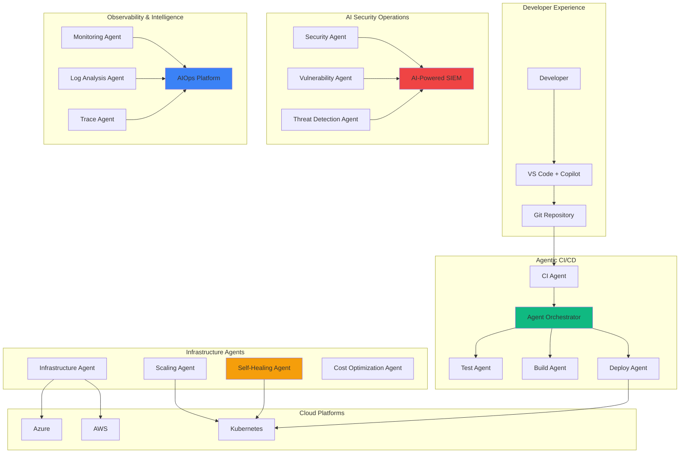

# Module 28: Advanced DevOps & Security - Agentic DevOps

## 🎯 Module Overview

Welcome to Module 28! This cutting-edge module introduces Agentic DevOps - where AI agents autonomously manage your infrastructure, security, and deployment pipelines. You'll build self-healing systems that think, adapt, and evolve.

### Duration
- **Total Time**: 3 hours
- **Lecture/Demo**: 45 minutes
- **Hands-on Exercises**: 2 hours 15 minutes

### Track
- 🔴 Enterprise Mastery Track (Modules 26-28) - Final Module

## 🎓 Learning Objectives

By the end of this module, you will be able to:

1. **Build Agentic CI/CD** - Create AI agents that manage deployment pipelines
2. **Implement AI Security Ops** - Autonomous security monitoring and response
3. **Design Self-Healing Systems** - Infrastructure that fixes itself
4. **Create DevOps Agents** - Specialized agents for different operations
5. **Orchestrate Agent Teams** - Multiple agents working together
6. **Ensure Compliance** - Automated governance and audit

## 🏗️ Agentic DevOps Architecture



## 📚 What is Agentic DevOps?

Agentic DevOps represents the evolution of DevOps where AI agents autonomously:

### 🤖 Autonomous Operations
- **Self-Managing Pipelines**: CI/CD that adapts to code changes
- **Intelligent Testing**: Agents that write and update tests
- **Smart Deployments**: Risk-aware, self-optimizing releases
- **Proactive Security**: Threat prevention, not just detection

### 🧠 AI-Driven Decision Making
- **Predictive Scaling**: Anticipate load before it happens
- **Anomaly Detection**: Identify issues humans would miss
- **Root Cause Analysis**: Instant problem diagnosis
- **Performance Optimization**: Continuous improvement

### 🔄 Self-Healing Infrastructure
- **Auto-Recovery**: Fix problems without human intervention
- **Configuration Drift**: Automatic correction
- **Resource Optimization**: Right-size everything
- **Disaster Prevention**: Stop issues before they occur

## 🛠️ Technology Stack

### Core Technologies
- **Languages**: Python, Go, TypeScript
- **AI/ML**: OpenAI, Azure AI, Anthropic Claude
- **Orchestration**: Kubernetes, Terraform, Pulumi
- **CI/CD**: GitHub Actions, GitLab CI, Jenkins X
- **Security**: Falco, OPA, Sentinel, CrowdStrike

### Agent Frameworks
- **LangChain**: Agent orchestration
- **AutoGen**: Multi-agent systems
- **CrewAI**: Agent teams
- **Semantic Kernel**: Enterprise agents
- **Custom MCP Servers**: Specialized tools

### Observability
- **OpenTelemetry**: Distributed tracing
- **Prometheus + Grafana**: Metrics
- **ELK Stack**: Log aggregation
- **Jaeger**: Trace analysis
- **Custom AI Dashboards**: Intelligent insights

## 🚀 What You'll Build

In this module, you'll create a complete Agentic DevOps platform:

1. **Agentic CI/CD Pipeline** - Self-managing deployment system
2. **AI Security Operations Center** - Autonomous security platform
3. **Intelligent Platform** - Full self-healing infrastructure

## 📋 Prerequisites

Before starting this module, ensure you have:

- ✅ Completed Modules 21-27 (AI Agents, MCP, Enterprise)
- ✅ Strong Python and DevOps knowledge
- ✅ Kubernetes experience
- ✅ Understanding of CI/CD pipelines
- ✅ Basic security concepts

See [prerequisites.md](prerequisites.md) for detailed setup instructions.

## 📂 Module Structure

```
module-28-advanced-devops-security/
├── README.md                          # This file
├── prerequisites.md                   # Setup requirements
├── best-practices.md                  # DevSecOps best practices
├── troubleshooting.md                # Common issues and solutions
├── exercises/
│   ├── exercise1-agentic-cicd/       # Self-managing pipelines
│   ├── exercise2-ai-security-ops/    # Autonomous security
│   └── exercise3-intelligent-platform/ # Complete platform
├── agents/
│   ├── ci-agent/                     # CI/CD automation agent
│   ├── security-agent/               # Security operations agent
│   ├── infra-agent/                  # Infrastructure agent
│   ├── monitoring-agent/             # Observability agent
│   └── orchestrator/                 # Agent coordinator
├── pipelines/
│   ├── templates/                    # Reusable pipeline templates
│   ├── policies/                     # Pipeline policies
│   └── workflows/                    # GitHub Actions workflows
├── security/
│   ├── policies/                     # Security policies as code
│   ├── scanners/                     # Custom security scanners
│   ├── response/                     # Incident response automation
│   └── compliance/                   # Compliance checks
├── infrastructure/
│   ├── terraform/                    # IaC templates
│   ├── kubernetes/                   # K8s manifests
│   ├── helm/                         # Helm charts
│   └── monitoring/                   # Observability setup
└── resources/
    ├── agent-patterns/               # Common agent patterns
    ├── security-playbooks/           # Security runbooks
    ├── architecture-diagrams/        # System designs
    └── case-studies/                 # Real-world examples
```

## 🎯 Learning Path

### Step 1: Agentic Fundamentals (30 mins)
- Agent architectures for DevOps
- Communication patterns
- Decision-making frameworks
- Tool integration via MCP

### Step 2: Intelligent Pipelines (45 mins)
- Self-configuring CI/CD
- Adaptive testing strategies
- Risk-based deployments
- Performance optimization

### Step 3: Security Automation (45 mins)
- Threat detection agents
- Automated response
- Compliance validation
- Security orchestration

### Step 4: Platform Intelligence (60 mins)
- Multi-agent coordination
- Self-healing patterns
- Cost optimization
- Continuous improvement

## 💡 Real-World Applications

Agentic DevOps enables:

- **Zero-Touch Deployments**: Full automation from code to production
- **Predictive Maintenance**: Fix issues before they happen
- **Security Operations**: 24/7 autonomous protection
- **Cost Optimization**: Reduce cloud spend by 40%+
- **Compliance Automation**: Always audit-ready

## 🧪 Hands-on Exercises

### [Exercise 1: Agentic CI/CD Pipeline](exercises/exercise1-agentic-cicd/) ⭐
Build an AI-powered CI/CD pipeline that self-configures, optimizes, and manages deployments autonomously.

### [Exercise 2: AI Security Operations](exercises/exercise2-ai-security-ops/) ⭐⭐
Create an autonomous security operations center with AI agents for threat detection, response, and compliance.

### [Exercise 3: Intelligent Platform](exercises/exercise3-intelligent-platform/) ⭐⭐⭐
Develop a complete self-managing platform with multiple specialized agents working together.

## 📊 Module Resources

### Documentation
- [Agent Development Guide](resources/agent-patterns/)
- [Security Playbooks](resources/security-playbooks/)
- [Architecture Patterns](resources/architecture-diagrams/)
- [Best Practices](best-practices.md)

### Code Templates
- CI/CD agent templates
- Security agent frameworks
- Infrastructure automation
- Monitoring dashboards

### Tools & Utilities
- Agent testing framework
- Pipeline validator
- Security scanner
- Cost analyzer

## 🎓 Skills You'll Master

- **Agent Development**: Building specialized DevOps agents
- **Pipeline Automation**: Self-managing CI/CD
- **Security Automation**: AI-driven security ops
- **Infrastructure Intelligence**: Self-healing systems
- **Multi-Agent Orchestration**: Coordinating agent teams
- **Observability**: AI-powered monitoring

## 🚦 Success Criteria

You'll have mastered this module when you can:

- ✅ Build autonomous DevOps agents
- ✅ Create self-managing pipelines
- ✅ Implement AI security operations
- ✅ Design self-healing infrastructure
- ✅ Orchestrate multiple agents effectively
- ✅ Ensure compliance automatically

## 🛡️ Security Best Practices

Key security principles:

- **Zero Trust Architecture**: Never trust, always verify
- **Shift-Left Security**: Security from the start
- **Policy as Code**: Automated governance
- **Continuous Compliance**: Real-time validation
- **Incident Response**: Automated remediation
- **Audit Trail**: Complete traceability

## 🔧 Required Tools

### Development
- Python 3.11+
- Docker Desktop
- Kubernetes (local or cloud)
- VS Code with extensions

### CI/CD
- GitHub with Actions
- Container registry
- Artifact storage
- Secret management

### Security
- SAST/DAST tools
- Container scanners
- Policy engines
- SIEM integration

### Monitoring
- Prometheus
- Grafana
- OpenTelemetry
- Custom dashboards

## 📈 Success Metrics

Track your Agentic DevOps success:
- Deployment frequency: 10x increase
- Lead time: 90% reduction
- MTTR: <5 minutes
- Security incidents: 95% reduction
- Cost optimization: 40% savings
- Compliance score: 100%

## ⏭️ What's Next?

After completing this module:
- Module 29: Enterprise Architecture Review (.NET)
- Module 30: Ultimate Capstone Challenge
- Real-world implementation projects

## 🎉 Let's Build Intelligent DevOps!

Ready to create self-managing systems? Start with the [prerequisites](prerequisites.md) to set up your environment, then dive into [Exercise 1](exercises/exercise1-agentic-cicd/)!

---

**🚀 Innovation Note**: Agentic DevOps is the future - where infrastructure thinks, adapts, and evolves. You're not just automating tasks; you're creating intelligent systems that improve themselves continuously!
