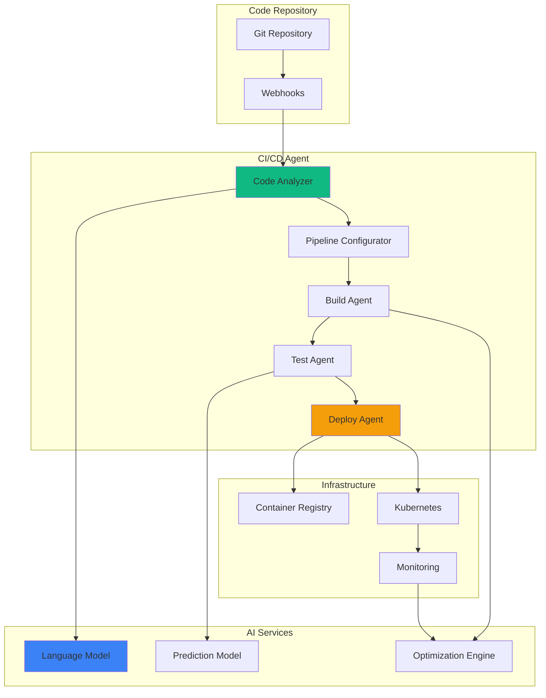

# Exercise 1: Agentic CI/CD Pipeline (⭐ Easy - 30 minutes)

## 🎯 Objective
Build an AI-powered CI/CD pipeline that self-configures based on code analysis, optimizes build processes, and manages deployments autonomously.

## 🧠 What You'll Learn
- Creating self-configuring pipelines
- AI-driven code analysis
- Automated test selection
- Intelligent deployment strategies
- Pipeline optimization
- Agent-based automation

## 📋 Prerequisites
- Completed Module 28 prerequisites
- Basic CI/CD knowledge
- Python environment ready
- Docker and Git installed
- GitHub account (or GitLab)

## 📚 Background

Traditional CI/CD pipelines require manual configuration and maintenance. An Agentic CI/CD pipeline:

- **Self-Configures**: Analyzes code to determine build requirements
- **Optimizes**: Learns from past builds to improve performance
- **Adapts**: Changes strategy based on code changes
- **Self-Heals**: Fixes common issues automatically
- **Predicts**: Anticipates problems before they occur

## 🏗️ Architecture



## 🛠️ Step-by-Step Instructions

### Step 1: Create the CI/CD Agent Base

**Copilot Prompt Suggestion:**
```python
# Create a CI/CD agent that:
# - Analyzes repository structure
# - Detects programming languages and frameworks
# - Identifies test frameworks
# - Finds build configuration files
# - Generates optimal pipeline configuration
# Use async patterns and include error handling
```

Create `agents/cicd_agent.py`:
```python
import os
import json
import yaml
import asyncio
from typing import Dict, List, Any, Optional
from dataclasses import dataclass
from pathlib import Path
import aiohttp
import git
from langchain.agents import Tool
from langchain.llms import OpenAI
from langchain.prompts import PromptTemplate
import logging
from datetime import datetime

logging.basicConfig(level=logging.INFO)
logger = logging.getLogger(__name__)

@dataclass
class RepositoryAnalysis:
    """Repository analysis results"""
    primary_language: str
    framework: Optional[str]
    test_framework: Optional[str]
    build_tool: Optional[str]
    has_dockerfile: bool
    has_kubernetes: bool
    dependencies: List[str]
    suggested_pipeline: Dict[str, Any]

@dataclass
class PipelineConfig:
    """Pipeline configuration"""
    name: str
    trigger: Dict[str, Any]
    stages: List[Dict[str, Any]]
    environment: Dict[str, str]
    notifications: Dict[str, Any]

class CICDAgent:
    """Autonomous CI/CD pipeline agent"""
    
    def __init__(self, openai_api_key: str, github_token: str):
        self.llm = OpenAI(api_key=openai_api_key)
        self.github_token = github_token
        self.session = aiohttp.ClientSession()
        self.pipeline_history = {}
        
    async def analyze_repository(self, repo_url: str) -> RepositoryAnalysis:
        """Analyze repository structure and content"""
        logger.info(f"Analyzing repository: {repo_url}")
        
        # Clone repository temporarily
        temp_dir = f"/tmp/repo_analysis_{datetime.now().timestamp()}"
        repo = git.Repo.clone_from(repo_url, temp_dir)
        
        try:
            # Analyze repository structure
            analysis = await self._analyze_structure(temp_dir)
            
            # Use AI to understand the project
            ai_insights = await self._get_ai_insights(analysis)
            
            # Generate pipeline configuration
            pipeline_config = await self._generate_pipeline_config(analysis, ai_insights)
            
            return RepositoryAnalysis(
                primary_language=analysis['primary_language'],
                framework=analysis.get('framework'),
                test_framework=analysis.get('test_framework'),
                build_tool=analysis.get('build_tool'),
                has_dockerfile='Dockerfile' in analysis['files'],
                has_kubernetes=any('kubernetes' in f or 'k8s' in f for f in analysis['files']),
                dependencies=analysis.get('dependencies', []),
                suggested_pipeline=pipeline_config
            )
            
        finally:
            # Cleanup
            import shutil
            shutil.rmtree(temp_dir)
    
    async def _analyze_structure(self, repo_path: str) -> Dict[str, Any]:
        """Analyze repository file structure"""
        analysis = {
            'files': [],
            'languages': {},
            'config_files': [],
            'test_files': []
        }
        
        # Walk through repository
        for root, dirs, files in os.walk(repo_path):
            # Skip hidden directories
            dirs[:] = [d for d in dirs if not d.startswith('.')]
            
            for file in files:
                file_path = os.path.join(root, file)
                rel_path = os.path.relpath(file_path, repo_path)
                analysis['files'].append(rel_path)
                
                # Detect languages
                ext = Path(file).suffix
                if ext in ['.py', '.js', '.ts', '.java', '.go', '.rs', '.rb']:
                    analysis['languages'][ext] = analysis['languages'].get(ext, 0) + 1
                
                # Detect test files
                if 'test' in file.lower() or 'spec' in file.lower():
                    analysis['test_files'].append(rel_path)
                
                # Detect config files
                if file in ['package.json', 'requirements.txt', 'pom.xml', 'build.gradle', 'Cargo.toml']:
                    analysis['config_files'].append(file)
        
        # Determine primary language
        if analysis['languages']:
            primary_ext = max(analysis['languages'], key=analysis['languages'].get)
            analysis['primary_language'] = {
                '.py': 'python',
                '.js': 'javascript',
                '.ts': 'typescript',
                '.java': 'java',
                '.go': 'go',
                '.rs': 'rust',
                '.rb': 'ruby'
            }.get(primary_ext, 'unknown')
        else:
            analysis['primary_language'] = 'unknown'
        
        # Detect frameworks and tools
        await self._detect_frameworks(repo_path, analysis)
        
        return analysis
    
    async def _detect_frameworks(self, repo_path: str, analysis: Dict[str, Any]):
        """Detect frameworks and build tools"""
        
        # Python
        if 'requirements.txt' in analysis['config_files']:
            req_path = os.path.join(repo_path, 'requirements.txt')
            with open(req_path, 'r') as f:
                requirements = f.read()
                if 'django' in requirements:
                    analysis['framework'] = 'django'
                elif 'flask' in requirements:
                    analysis['framework'] = 'flask'
                elif 'fastapi' in requirements:
                    analysis['framework'] = 'fastapi'
                
                if 'pytest' in requirements:
                    analysis['test_framework'] = 'pytest'
                elif 'unittest' in requirements:
                    analysis['test_framework'] = 'unittest'
        
        # JavaScript/TypeScript
        if 'package.json' in analysis['config_files']:
            pkg_path = os.path.join(repo_path, 'package.json')
            with open(pkg_path, 'r') as f:
                package = json.load(f)
                deps = {**package.get('dependencies', {}), **package.get('devDependencies', {})}
                
                if 'react' in deps:
                    analysis['framework'] = 'react'
                elif 'vue' in deps:
                    analysis['framework'] = 'vue'
                elif 'express' in deps:
                    analysis['framework'] = 'express'
                
                if 'jest' in deps:
                    analysis['test_framework'] = 'jest'
                elif 'mocha' in deps:
                    analysis['test_framework'] = 'mocha'
                
                analysis['build_tool'] = 'npm'
                if 'yarn.lock' in analysis['files']:
                    analysis['build_tool'] = 'yarn'
        
        # Java
        if 'pom.xml' in analysis['config_files']:
            analysis['build_tool'] = 'maven'
        elif 'build.gradle' in analysis['config_files']:
            analysis['build_tool'] = 'gradle'
    
    async def _get_ai_insights(self, analysis: Dict[str, Any]) -> Dict[str, Any]:
        """Get AI insights about the project"""
        
        prompt = f"""
        Analyze this repository structure and provide insights:
        
        Primary Language: {analysis['primary_language']}
        Framework: {analysis.get('framework', 'None detected')}
        Test Framework: {analysis.get('test_framework', 'None detected')}
        Build Tool: {analysis.get('build_tool', 'None detected')}
        Number of test files: {len(analysis['test_files'])}
        Has Dockerfile: {'Dockerfile' in analysis['files']}
        
        Provide insights in JSON format:
        {{
            "project_type": "web_app|api|library|cli|other",
            "deployment_strategy": "container|serverless|traditional",
            "test_strategy": "unit|integration|e2e|mixed",
            "build_optimization": ["suggestions"],
            "security_considerations": ["considerations"],
            "estimated_build_time": "duration",
            "recommended_stages": ["stage1", "stage2", ...]
        }}
        """
        
        response = self.llm(prompt)
        
        try:
            return json.loads(response)
        except json.JSONDecodeError:
            # Fallback to defaults
            return {
                "project_type": "web_app",
                "deployment_strategy": "container",
                "test_strategy": "unit",
                "build_optimization": ["Use caching", "Parallelize tests"],
                "security_considerations": ["Scan dependencies", "Check secrets"],
                "estimated_build_time": "5-10 minutes",
                "recommended_stages": ["build", "test", "security", "deploy"]
            }
    
    async def _generate_pipeline_config(self, 
                                      analysis: Dict[str, Any], 
                                      ai_insights: Dict[str, Any]) -> Dict[str, Any]:
        """Generate optimal pipeline configuration"""
        
        config = {
            "version": "1.0",
            "name": f"{analysis['primary_language']}-pipeline",
            "trigger": {
                "push": {
                    "branches": ["main", "develop"]
                },
                "pull_request": {
                    "branches": ["main"]
                }
            },
            "stages": []
        }
        
        # Build stage
        build_stage = self._create_build_stage(analysis)
        if build_stage:
            config["stages"].append(build_stage)
        
        # Test stage
        test_stage = self._create_test_stage(analysis)
        if test_stage:
            config["stages"].append(test_stage)
        
        # Security stage
        security_stage = self._create_security_stage(analysis, ai_insights)
        config["stages"].append(security_stage)
        
        # Deploy stage
        if ai_insights['deployment_strategy'] == 'container':
            deploy_stage = self._create_container_deploy_stage(analysis)
            config["stages"].append(deploy_stage)
        
        return config
    
    def _create_build_stage(self, analysis: Dict[str, Any]) -> Optional[Dict[str, Any]]:
        """Create build stage configuration"""
        
        if analysis['primary_language'] == 'python':
            return {
                "name": "build",
                "steps": [
                    {
                        "name": "Install dependencies",
                        "run": "pip install -r requirements.txt"
                    },
                    {
                        "name": "Lint code",
                        "run": "flake8 . --max-line-length=88"
                    }
                ]
            }
        elif analysis['primary_language'] == 'javascript':
            build_cmd = "npm install" if analysis.get('build_tool') == 'npm' else "yarn install"
            return {
                "name": "build",
                "steps": [
                    {
                        "name": "Install dependencies",
                        "run": build_cmd
                    },
                    {
                        "name": "Build",
                        "run": f"{analysis.get('build_tool', 'npm')} run build"
                    }
                ]
            }
        
        return None
    
    def _create_test_stage(self, analysis: Dict[str, Any]) -> Optional[Dict[str, Any]]:
        """Create test stage configuration"""
        
        if not analysis['test_files']:
            return None
        
        test_commands = {
            'pytest': 'pytest -v --cov=.',
            'unittest': 'python -m unittest discover',
            'jest': 'jest --coverage',
            'mocha': 'mocha --recursive'
        }
        
        test_cmd = test_commands.get(analysis.get('test_framework', ''), 'echo "No tests configured"')
        
        return {
            "name": "test",
            "steps": [
                {
                    "name": "Run tests",
                    "run": test_cmd
                },
                {
                    "name": "Upload coverage",
                    "run": "codecov || echo 'Coverage upload failed'"
                }
            ]
        }
    
    def _create_security_stage(self, analysis: Dict[str, Any], ai_insights: Dict[str, Any]) -> Dict[str, Any]:
        """Create security scanning stage"""
        
        steps = []
        
        # Dependency scanning
        if analysis['primary_language'] == 'python':
            steps.append({
                "name": "Scan Python dependencies",
                "run": "safety check || true"
            })
        elif analysis['primary_language'] == 'javascript':
            steps.append({
                "name": "Audit npm packages",
                "run": "npm audit || true"
            })
        
        # Secret scanning
        steps.append({
            "name": "Scan for secrets",
            "run": "gitleaks detect --source . -v || true"
        })
        
        # Container scanning if Dockerfile exists
        if 'Dockerfile' in analysis['files']:
            steps.append({
                "name": "Scan container image",
                "run": "trivy image --exit-code 1 --severity HIGH,CRITICAL ${IMAGE_NAME} || true"
            })
        
        return {
            "name": "security",
            "steps": steps
        }
    
    def _create_container_deploy_stage(self, analysis: Dict[str, Any]) -> Dict[str, Any]:
        """Create container deployment stage"""
        
        return {
            "name": "deploy",
            "steps": [
                {
                    "name": "Build container",
                    "run": "docker build -t ${IMAGE_NAME}:${VERSION} ."
                },
                {
                    "name": "Push to registry",
                    "run": "docker push ${IMAGE_NAME}:${VERSION}"
                },
                {
                    "name": "Deploy to Kubernetes",
                    "run": "kubectl set image deployment/app app=${IMAGE_NAME}:${VERSION}"
                }
            ],
            "environment": {
                "IMAGE_NAME": "${{ github.repository }}",
                "VERSION": "${{ github.sha }}"
            }
        }
    
    async def generate_github_workflow(self, config: Dict[str, Any]) -> str:
        """Generate GitHub Actions workflow from config"""
        
        workflow = {
            'name': config['name'],
            'on': config['trigger'],
            'env': config.get('environment', {}),
            'jobs': {}
        }
        
        # Create job for each stage
        for i, stage in enumerate(config['stages']):
            job_name = stage['name']
            job = {
                'runs-on': 'ubuntu-latest',
                'steps': [
                    {
                        'uses': 'actions/checkout@v3'
                    }
                ]
            }
            
            # Add setup steps based on language
            if 'python' in config['name']:
                job['steps'].append({
                    'name': 'Set up Python',
                    'uses': 'actions/setup-python@v4',
                    'with': {'python-version': '3.11'}
                })
            elif 'javascript' in config['name']:
                job['steps'].append({
                    'name': 'Set up Node.js',
                    'uses': 'actions/setup-node@v3',
                    'with': {'node-version': '18'}
                })
            
            # Add stage steps
            for step in stage['steps']:
                job['steps'].append({
                    'name': step['name'],
                    'run': step['run']
                })
            
            # Add dependencies
            if i > 0:
                job['needs'] = config['stages'][i-1]['name']
            
            workflow['jobs'][job_name] = job
        
        return yaml.dump(workflow, default_flow_style=False)
    
    async def optimize_pipeline(self, 
                              pipeline_id: str, 
                              execution_history: List[Dict[str, Any]]) -> Dict[str, Any]:
        """Optimize pipeline based on execution history"""
        
        if not execution_history:
            return {"optimizations": []}
        
        # Analyze execution patterns
        avg_duration = sum(e['duration'] for e in execution_history) / len(execution_history)
        failure_rate = sum(1 for e in execution_history if e['status'] == 'failed') / len(execution_history)
        
        optimizations = []
        
        # Optimize based on patterns
        if avg_duration > 600:  # More than 10 minutes
            optimizations.append({
                "type": "performance",
                "suggestion": "Enable parallel test execution",
                "impact": "Reduce build time by up to 50%"
            })
        
        if failure_rate > 0.2:  # More than 20% failure rate
            # Analyze failure patterns
            failed_steps = [e['failed_step'] for e in execution_history if e.get('failed_step')]
            most_common_failure = max(set(failed_steps), key=failed_steps.count) if failed_steps else None
            
            optimizations.append({
                "type": "reliability",
                "suggestion": f"Add retry logic for step: {most_common_failure}",
                "impact": "Reduce failure rate"
            })
        
        # Check for optimization opportunities
        test_durations = [e['stages']['test']['duration'] for e in execution_history 
                         if 'test' in e.get('stages', {})]
        if test_durations and max(test_durations) > 300:
            optimizations.append({
                "type": "test_optimization",
                "suggestion": "Implement test result caching",
                "impact": "Skip unchanged test files"
            })
        
        return {
            "optimizations": optimizations,
            "metrics": {
                "avg_duration": avg_duration,
                "failure_rate": failure_rate,
                "total_runs": len(execution_history)
            }
        }
    
    async def self_heal_pipeline(self, error: Dict[str, Any]) -> Optional[Dict[str, Any]]:
        """Attempt to self-heal pipeline errors"""
        
        error_type = error.get('type')
        context = error.get('context', {})
        
        healing_actions = {
            'dependency_conflict': self._heal_dependency_conflict,
            'test_failure': self._heal_test_failure,
            'build_failure': self._heal_build_failure,
            'deployment_failure': self._heal_deployment_failure
        }
        
        if error_type in healing_actions:
            return await healing_actions[error_type](context)
        
        # Use AI for unknown errors
        return await self._ai_heal_error(error)
    
    async def _heal_dependency_conflict(self, context: Dict[str, Any]) -> Dict[str, Any]:
        """Heal dependency conflicts"""
        
        return {
            "action": "update_dependencies",
            "steps": [
                "Clear dependency cache",
                "Update lock file",
                "Retry installation with --force flag"
            ],
            "commands": [
                "rm -rf node_modules package-lock.json",
                "npm install",
                "npm dedupe"
            ]
        }
    
    async def _ai_heal_error(self, error: Dict[str, Any]) -> Dict[str, Any]:
        """Use AI to suggest healing actions"""
        
        prompt = f"""
        Pipeline error occurred:
        Type: {error.get('type')}
        Message: {error.get('message')}
        Stack trace: {error.get('stack_trace', 'N/A')}
        
        Suggest healing actions in JSON format:
        {{
            "action": "description",
            "steps": ["step1", "step2"],
            "commands": ["command1", "command2"],
            "preventive_measure": "how to prevent this"
        }}
        """
        
        response = self.llm(prompt)
        
        try:
            return json.loads(response)
        except:
            return {
                "action": "manual_intervention_required",
                "steps": ["Review error logs", "Check recent changes"],
                "commands": [],
                "preventive_measure": "Add better error handling"
            }
    
    async def close(self):
        """Cleanup resources"""
        await self.session.close()
```

### Step 2: Create Pipeline Optimizer

Create `agents/pipeline_optimizer.py`:
```python
import numpy as np
from typing import List, Dict, Any, Tuple
from datetime import datetime, timedelta
import json
from sklearn.linear_model import LinearRegression
from sklearn.preprocessing import StandardScaler
import joblib

class PipelineOptimizer:
    """ML-based pipeline optimization"""
    
    def __init__(self):
        self.models = {}
        self.scaler = StandardScaler()
        self.optimization_history = []
        
    def analyze_performance(self, executions: List[Dict[str, Any]]) -> Dict[str, Any]:
        """Analyze pipeline performance trends"""
        
        if len(executions) < 5:
            return {"status": "insufficient_data", "min_required": 5}
        
        # Extract features
        features = []
        durations = []
        
        for execution in executions:
            feature = self._extract_features(execution)
            features.append(feature)
            durations.append(execution['duration_seconds'])
        
        # Fit model
        X = np.array(features)
        y = np.array(durations)
        
        X_scaled = self.scaler.fit_transform(X)
        
        model = LinearRegression()
        model.fit(X_scaled, y)
        
        # Identify bottlenecks
        feature_importance = abs(model.coef_)
        feature_names = ['code_changes', 'test_count', 'dependencies', 'time_of_day', 'day_of_week']
        
        bottlenecks = []
        for i, importance in enumerate(feature_importance):
            if importance > np.mean(feature_importance):
                bottlenecks.append({
                    'factor': feature_names[i],
                    'impact': float(importance),
                    'recommendation': self._get_recommendation(feature_names[i])
                })
        
        # Predict optimal conditions
        optimal_features = self._find_optimal_features(model, X_scaled)
        
        return {
            'status': 'analyzed',
            'avg_duration': np.mean(durations),
            'std_duration': np.std(durations),
            'bottlenecks': sorted(bottlenecks, key=lambda x: x['impact'], reverse=True),
            'optimal_conditions': optimal_features,
            'predicted_optimal_duration': float(model.predict(optimal_features.reshape(1, -1))[0])
        }
    
    def _extract_features(self, execution: Dict[str, Any]) -> List[float]:
        """Extract features from execution data"""
        
        timestamp = datetime.fromisoformat(execution['timestamp'])
        
        return [
            execution.get('code_changes', 0),  # Number of files changed
            execution.get('test_count', 0),     # Number of tests run
            execution.get('dependency_count', 0), # Number of dependencies
            timestamp.hour,                      # Hour of day
            timestamp.weekday()                  # Day of week
        ]
    
    def _get_recommendation(self, factor: str) -> str:
        """Get optimization recommendation for factor"""
        
        recommendations = {
            'code_changes': 'Consider breaking large PRs into smaller ones',
            'test_count': 'Implement test parallelization or selective testing',
            'dependencies': 'Cache dependencies between builds',
            'time_of_day': 'Schedule heavy builds during off-peak hours',
            'day_of_week': 'Avoid deployments on Fridays'
        }
        
        return recommendations.get(factor, 'Analyze this factor more closely')
    
    def _find_optimal_features(self, model, X_scaled: np.ndarray) -> np.ndarray:
        """Find optimal feature values"""
        
        # Use mean values as starting point
        optimal = np.mean(X_scaled, axis=0)
        
        # Adjust based on model coefficients
        for i, coef in enumerate(model.coef_):
            if coef > 0:  # Positive correlation with duration
                optimal[i] = np.min(X_scaled[:, i])  # Use minimum value
            else:  # Negative correlation
                optimal[i] = np.max(X_scaled[:, i])  # Use maximum value
        
        return optimal
    
    def suggest_caching_strategy(self, 
                                build_data: Dict[str, Any]) -> Dict[str, Any]:
        """Suggest optimal caching strategy"""
        
        suggestions = []
        
        # Analyze dependency installation time
        if build_data.get('dependency_install_time', 0) > 60:
            suggestions.append({
                'type': 'dependency_cache',
                'key': f"{build_data['language']}-deps-${{{{ hashFiles('**/package-lock.json') }}}}",
                'paths': ['node_modules/', '.npm/'],
                'estimated_time_saved': build_data['dependency_install_time'] * 0.8
            })
        
        # Analyze build artifacts
        if build_data.get('build_time', 0) > 120:
            suggestions.append({
                'type': 'build_cache',
                'key': 'build-${{ github.sha }}',
                'paths': ['dist/', 'build/'],
                'estimated_time_saved': build_data['build_time'] * 0.7
            })
        
        # Test result caching
        if build_data.get('test_time', 0) > 180:
            suggestions.append({
                'type': 'test_cache',
                'key': 'test-results-${{ hashFiles("**/*.test.js") }}',
                'paths': ['.jest-cache/', 'coverage/'],
                'estimated_time_saved': build_data['test_time'] * 0.5
            })
        
        total_time_saved = sum(s['estimated_time_saved'] for s in suggestions)
        
        return {
            'suggestions': suggestions,
            'total_estimated_time_saved': total_time_saved,
            'cache_configuration': self._generate_cache_config(suggestions)
        }
    
    def _generate_cache_config(self, suggestions: List[Dict[str, Any]]) -> Dict[str, Any]:
        """Generate cache configuration for CI/CD"""
        
        config = {
            'caches': []
        }
        
        for suggestion in suggestions:
            cache_step = {
                'name': f"Cache {suggestion['type']}",
                'uses': 'actions/cache@v3',
                'with': {
                    'path': '|'.join(suggestion['paths']),
                    'key': suggestion['key'],
                    'restore-keys': suggestion['key'].split('-')[0] + '-'
                }
            }
            config['caches'].append(cache_step)
        
        return config
```

### Step 3: Create Pipeline Executor

Create `agents/pipeline_executor.py`:
```python
import asyncio
import docker
from typing import Dict, Any, List, Optional
from datetime import datetime
import yaml
import logging
from dataclasses import dataclass
import aioredis
import json

logger = logging.getLogger(__name__)

@dataclass
class PipelineExecution:
    """Pipeline execution tracking"""
    id: str
    pipeline_name: str
    commit_sha: str
    branch: str
    status: str
    started_at: datetime
    completed_at: Optional[datetime] = None
    stages: Dict[str, Any] = None
    metrics: Dict[str, Any] = None

class SmartPipelineExecutor:
    """Intelligent pipeline executor with self-optimization"""
    
    def __init__(self, redis_url: str = "redis://localhost"):
        self.docker_client = docker.from_env()
        self.redis_url = redis_url
        self.executions = {}
        self.execution_history = []
        
    async def initialize(self):
        """Initialize connections"""
        self.redis = await aioredis.create_redis_pool(self.redis_url)
        
    async def execute_pipeline(self, 
                             pipeline_config: Dict[str, Any],
                             context: Dict[str, Any]) -> PipelineExecution:
        """Execute pipeline with intelligent optimization"""
        
        execution = PipelineExecution(
            id=f"exec-{datetime.now().timestamp()}",
            pipeline_name=pipeline_config['name'],
            commit_sha=context['commit_sha'],
            branch=context['branch'],
            status='running',
            started_at=datetime.now(),
            stages={}
        )
        
        self.executions[execution.id] = execution
        
        try:
            # Prepare execution environment
            env = await self._prepare_environment(pipeline_config, context)
            
            # Execute stages
            for stage in pipeline_config['stages']:
                stage_result = await self._execute_stage(stage, env, execution)
                execution.stages[stage['name']] = stage_result
                
                if stage_result['status'] == 'failed':
                    # Attempt self-healing
                    healed = await self._attempt_healing(stage, stage_result, env)
                    if not healed:
                        execution.status = 'failed'
                        break
            else:
                execution.status = 'success'
            
            execution.completed_at = datetime.now()
            
            # Collect metrics
            execution.metrics = await self._collect_metrics(execution)
            
            # Learn from execution
            await self._learn_from_execution(execution)
            
            # Store in history
            self.execution_history.append(execution)
            await self._store_execution(execution)
            
        except Exception as e:
            logger.error(f"Pipeline execution failed: {e}")
            execution.status = 'error'
            execution.completed_at = datetime.now()
            
        return execution
    
    async def _prepare_environment(self, 
                                 pipeline_config: Dict[str, Any],
                                 context: Dict[str, Any]) -> Dict[str, Any]:
        """Prepare execution environment"""
        
        env = {
            'CI': 'true',
            'COMMIT_SHA': context['commit_sha'],
            'BRANCH': context['branch'],
            'PIPELINE_ID': context.get('pipeline_id', 'unknown'),
            **pipeline_config.get('environment', {})
        }
        
        # Add optimizations based on history
        if self.execution_history:
            # Check if we should enable caching
            recent_failures = sum(1 for e in self.execution_history[-10:] 
                                if e.status == 'failed')
            if recent_failures > 3:
                env['AGGRESSIVE_CACHING'] = 'true'
            
            # Check if we should run in safe mode
            if self._is_high_risk_change(context):
                env['SAFE_MODE'] = 'true'
        
        return env
    
    async def _execute_stage(self, 
                           stage: Dict[str, Any],
                           env: Dict[str, Any],
                           execution: PipelineExecution) -> Dict[str, Any]:
        """Execute a pipeline stage"""
        
        logger.info(f"Executing stage: {stage['name']}")
        
        stage_result = {
            'name': stage['name'],
            'status': 'running',
            'started_at': datetime.now().isoformat(),
            'steps': []
        }
        
        try:
            for step in stage['steps']:
                step_result = await self._execute_step(step, env)
                stage_result['steps'].append(step_result)
                
                if step_result['status'] == 'failed':
                    stage_result['status'] = 'failed'
                    stage_result['failed_step'] = step['name']
                    break
            else:
                stage_result['status'] = 'success'
                
        except Exception as e:
            logger.error(f"Stage {stage['name']} failed: {e}")
            stage_result['status'] = 'failed'
            stage_result['error'] = str(e)
            
        stage_result['completed_at'] = datetime.now().isoformat()
        stage_result['duration'] = (
            datetime.fromisoformat(stage_result['completed_at']) - 
            datetime.fromisoformat(stage_result['started_at'])
        ).total_seconds()
        
        return stage_result
    
    async def _execute_step(self, step: Dict[str, Any], env: Dict[str, Any]) -> Dict[str, Any]:
        """Execute a single step"""
        
        logger.info(f"Executing step: {step['name']}")
        
        step_result = {
            'name': step['name'],
            'status': 'running',
            'started_at': datetime.now().isoformat()
        }
        
        try:
            # Run command in container
            container = self.docker_client.containers.run(
                image=step.get('image', 'ubuntu:latest'),
                command=f"/bin/bash -c '{step['run']}'",
                environment=env,
                detach=True,
                remove=False
            )
            
            # Wait for completion with timeout
            exit_code = container.wait(timeout=step.get('timeout', 600))['StatusCode']
            
            # Get logs
            logs = container.logs(stdout=True, stderr=True).decode('utf-8')
            step_result['logs'] = logs
            
            if exit_code == 0:
                step_result['status'] = 'success'
            else:
                step_result['status'] = 'failed'
                step_result['exit_code'] = exit_code
                
            # Cleanup
            container.remove()
            
        except Exception as e:
            logger.error(f"Step {step['name']} failed: {e}")
            step_result['status'] = 'failed'
            step_result['error'] = str(e)
            
        step_result['completed_at'] = datetime.now().isoformat()
        
        return step_result
    
    async def _attempt_healing(self, 
                             stage: Dict[str, Any],
                             stage_result: Dict[str, Any],
                             env: Dict[str, Any]) -> bool:
        """Attempt to heal failed stage"""
        
        logger.info(f"Attempting to heal stage: {stage['name']}")
        
        # Identify failure type
        failed_step = next((s for s in stage_result['steps'] if s['status'] == 'failed'), None)
        
        if not failed_step:
            return False
            
        # Common healing strategies
        healing_strategies = {
            'dependency_error': self._heal_dependency_error,
            'network_timeout': self._heal_network_timeout,
            'resource_limit': self._heal_resource_limit
        }
        
        # Detect failure type from logs
        failure_type = self._detect_failure_type(failed_step.get('logs', ''))
        
        if failure_type in healing_strategies:
            healed = await healing_strategies[failure_type](stage, env)
            
            if healed:
                # Retry stage
                retry_result = await self._execute_stage(stage, env, None)
                return retry_result['status'] == 'success'
                
        return False
    
    def _detect_failure_type(self, logs: str) -> Optional[str]:
        """Detect type of failure from logs"""
        
        patterns = {
            'dependency_error': ['npm ERR!', 'pip install failed', 'Unable to resolve dependency'],
            'network_timeout': ['timeout', 'Network unreachable', 'Connection refused'],
            'resource_limit': ['out of memory', 'No space left', 'Resource exhausted']
        }
        
        for failure_type, keywords in patterns.items():
            if any(keyword in logs for keyword in keywords):
                return failure_type
                
        return None
    
    async def _heal_dependency_error(self, stage: Dict[str, Any], env: Dict[str, Any]) -> bool:
        """Heal dependency errors"""
        
        logger.info("Healing dependency error")
        
        # Clear caches
        cleanup_commands = [
            'rm -rf node_modules package-lock.json',
            'pip cache purge',
            'apt-get clean'
        ]
        
        for cmd in cleanup_commands:
            try:
                container = self.docker_client.containers.run(
                    image='ubuntu:latest',
                    command=f"/bin/bash -c '{cmd}'",
                    environment=env,
                    detach=False,
                    remove=True
                )
            except:
                pass
                
        return True
    
    async def _heal_network_timeout(self, stage: Dict[str, Any], env: Dict[str, Any]) -> bool:
        """Heal network timeouts"""
        
        logger.info("Healing network timeout")
        
        # Add retry logic to environment
        env['RETRY_ATTEMPTS'] = '3'
        env['RETRY_DELAY'] = '10'
        
        # Wait before retry
        await asyncio.sleep(5)
        
        return True
    
    async def _heal_resource_limit(self, stage: Dict[str, Any], env: Dict[str, Any]) -> bool:
        """Heal resource limit issues"""
        
        logger.info("Healing resource limit")
        
        # Request more resources
        stage['resources'] = {
            'memory': '4g',
            'cpu': '2'
        }
        
        return True
    
    def _is_high_risk_change(self, context: Dict[str, Any]) -> bool:
        """Determine if change is high risk"""
        
        high_risk_indicators = [
            context.get('files_changed', 0) > 50,
            'database' in context.get('commit_message', '').lower(),
            'security' in context.get('commit_message', '').lower(),
            context.get('branch') == 'main'
        ]
        
        return sum(high_risk_indicators) >= 2
    
    async def _collect_metrics(self, execution: PipelineExecution) -> Dict[str, Any]:
        """Collect execution metrics"""
        
        total_duration = (execution.completed_at - execution.started_at).total_seconds()
        
        stage_durations = {}
        for stage_name, stage_data in execution.stages.items():
            if 'duration' in stage_data:
                stage_durations[stage_name] = stage_data['duration']
                
        return {
            'total_duration': total_duration,
            'stage_durations': stage_durations,
            'success_rate': 1.0 if execution.status == 'success' else 0.0,
            'timestamp': execution.started_at.isoformat()
        }
    
    async def _learn_from_execution(self, execution: PipelineExecution):
        """Learn from execution to improve future runs"""
        
        # Store patterns
        pattern_key = f"pipeline_pattern:{execution.pipeline_name}"
        
        pattern = {
            'duration': execution.metrics['total_duration'],
            'status': execution.status,
            'stage_timings': execution.metrics.get('stage_durations', {}),
            'timestamp': execution.started_at.isoformat()
        }
        
        await self.redis.lpush(pattern_key, json.dumps(pattern))
        await self.redis.ltrim(pattern_key, 0, 99)  # Keep last 100
        
        # Update optimization model
        if len(self.execution_history) % 10 == 0:
            await self._update_optimization_model()
    
    async def _update_optimization_model(self):
        """Update ML model for optimization"""
        
        # This would train/update an ML model based on execution history
        # For now, we'll just log
        logger.info("Updating optimization model with new execution data")
    
    async def _store_execution(self, execution: PipelineExecution):
        """Store execution for historical analysis"""
        
        execution_data = {
            'id': execution.id,
            'pipeline_name': execution.pipeline_name,
            'commit_sha': execution.commit_sha,
            'branch': execution.branch,
            'status': execution.status,
            'started_at': execution.started_at.isoformat(),
            'completed_at': execution.completed_at.isoformat() if execution.completed_at else None,
            'stages': execution.stages,
            'metrics': execution.metrics
        }
        
        await self.redis.set(
            f"execution:{execution.id}",
            json.dumps(execution_data),
            expire=86400 * 30  # 30 days
        )
    
    async def get_execution_history(self, 
                                  pipeline_name: Optional[str] = None,
                                  limit: int = 100) -> List[PipelineExecution]:
        """Get execution history"""
        
        if pipeline_name:
            pattern_key = f"pipeline_pattern:{pipeline_name}"
            patterns = await self.redis.lrange(pattern_key, 0, limit - 1)
            return [json.loads(p) for p in patterns]
        
        return self.execution_history[-limit:]
    
    async def close(self):
        """Cleanup resources"""
        self.redis.close()
        await self.redis.wait_closed()
```

### Step 4: Create GitHub Integration

Create `integrations/github_integration.py`:
```python
import aiohttp
import base64
from typing import Dict, Any, List, Optional
import yaml
import json

class GitHubIntegration:
    """GitHub integration for CI/CD agent"""
    
    def __init__(self, token: str):
        self.token = token
        self.base_url = "https://api.github.com"
        self.headers = {
            "Authorization": f"token {token}",
            "Accept": "application/vnd.github.v3+json"
        }
        
    async def create_workflow(self, 
                            owner: str, 
                            repo: str,
                            workflow_content: str,
                            branch: str = "main") -> Dict[str, Any]:
        """Create or update GitHub Actions workflow"""
        
        workflow_path = ".github/workflows/agentic-cicd.yml"
        
        async with aiohttp.ClientSession() as session:
            # Check if file exists
            check_url = f"{self.base_url}/repos/{owner}/{repo}/contents/{workflow_path}"
            
            async with session.get(check_url, headers=self.headers) as response:
                exists = response.status == 200
                file_sha = None
                
                if exists:
                    data = await response.json()
                    file_sha = data['sha']
            
            # Create or update file
            create_url = f"{self.base_url}/repos/{owner}/{repo}/contents/{workflow_path}"
            
            payload = {
                "message": "Update AI-generated CI/CD workflow",
                "content": base64.b64encode(workflow_content.encode()).decode(),
                "branch": branch
            }
            
            if file_sha:
                payload["sha"] = file_sha
            
            async with session.put(create_url, 
                                 headers=self.headers,
                                 json=payload) as response:
                
                if response.status in [200, 201]:
                    return await response.json()
                else:
                    error = await response.text()
                    raise Exception(f"Failed to create workflow: {error}")
    
    async def get_repository_info(self, owner: str, repo: str) -> Dict[str, Any]:
        """Get repository information"""
        
        async with aiohttp.ClientSession() as session:
            url = f"{self.base_url}/repos/{owner}/{repo}"
            
            async with session.get(url, headers=self.headers) as response:
                if response.status == 200:
                    return await response.json()
                else:
                    raise Exception(f"Failed to get repository: {response.status}")
    
    async def get_workflow_runs(self, 
                              owner: str, 
                              repo: str,
                              workflow_id: Optional[str] = None) -> List[Dict[str, Any]]:
        """Get workflow execution history"""
        
        async with aiohttp.ClientSession() as session:
            url = f"{self.base_url}/repos/{owner}/{repo}/actions/runs"
            
            params = {}
            if workflow_id:
                params['workflow_id'] = workflow_id
            
            async with session.get(url, 
                                 headers=self.headers,
                                 params=params) as response:
                
                if response.status == 200:
                    data = await response.json()
                    return data['workflow_runs']
                else:
                    return []
```

### Step 5: Create Main Application

Create `main.py`:
```python
#!/usr/bin/env python3
"""
Agentic CI/CD Pipeline - Main Application
"""

import asyncio
import argparse
import sys
import os
from pathlib import Path
import json
import logging
from datetime import datetime

from agents.cicd_agent import CICDAgent
from agents.pipeline_optimizer import PipelineOptimizer
from agents.pipeline_executor import SmartPipelineExecutor
from integrations.github_integration import GitHubIntegration

logging.basicConfig(
    level=logging.INFO,
    format='%(asctime)s - %(name)s - %(levelname)s - %(message)s'
)
logger = logging.getLogger(__name__)

class AgenticCICD:
    """Main application for Agentic CI/CD"""
    
    def __init__(self, config: Dict[str, Any]):
        self.config = config
        self.agent = CICDAgent(
            openai_api_key=config['openai_api_key'],
            github_token=config['github_token']
        )
        self.optimizer = PipelineOptimizer()
        self.executor = SmartPipelineExecutor()
        self.github = GitHubIntegration(config['github_token'])
        
    async def analyze_and_setup(self, repo_url: str) -> Dict[str, Any]:
        """Analyze repository and setup CI/CD pipeline"""
        
        logger.info(f"🔍 Analyzing repository: {repo_url}")
        
        # Analyze repository
        analysis = await self.agent.analyze_repository(repo_url)
        
        logger.info(f"✅ Analysis complete:")
        logger.info(f"  - Primary language: {analysis.primary_language}")
        logger.info(f"  - Framework: {analysis.framework}")
        logger.info(f"  - Test framework: {analysis.test_framework}")
        logger.info(f"  - Has Dockerfile: {analysis.has_dockerfile}")
        
        # Generate GitHub Actions workflow
        workflow = await self.agent.generate_github_workflow(analysis.suggested_pipeline)
        
        logger.info("📝 Generated GitHub Actions workflow:")
        print("\n" + workflow)
        
        # Extract owner and repo from URL
        parts = repo_url.rstrip('/').split('/')
        owner = parts[-2]
        repo = parts[-1].replace('.git', '')
        
        # Create workflow in repository
        if self.config.get('auto_create_workflow', False):
            logger.info("🚀 Creating workflow in repository...")
            result = await self.github.create_workflow(owner, repo, workflow)
            logger.info(f"✅ Workflow created: {result['content']['html_url']}")
        
        return {
            'analysis': analysis,
            'workflow': workflow,
            'repository': f"{owner}/{repo}"
        }
    
    async def optimize_pipeline(self, repo_name: str) -> Dict[str, Any]:
        """Optimize existing pipeline based on history"""
        
        logger.info(f"🔧 Optimizing pipeline for: {repo_name}")
        
        # Get workflow runs
        owner, repo = repo_name.split('/')
        runs = await self.github.get_workflow_runs(owner, repo)
        
        if not runs:
            return {"error": "No workflow runs found"}
        
        # Convert to execution history format
        execution_history = []
        for run in runs[:50]:  # Last 50 runs
            execution_history.append({
                'duration': (
                    datetime.fromisoformat(run['updated_at'].replace('Z', '+00:00')) -
                    datetime.fromisoformat(run['created_at'].replace('Z', '+00:00'))
                ).total_seconds(),
                'status': 'success' if run['conclusion'] == 'success' else 'failed',
                'timestamp': run['created_at'],
                'commit': run['head_sha']
            })
        
        # Analyze performance
        performance = self.optimizer.analyze_performance(execution_history)
        
        logger.info("📊 Performance Analysis:")
        logger.info(f"  - Average duration: {performance.get('avg_duration', 0):.2f}s")
        logger.info(f"  - Bottlenecks: {len(performance.get('bottlenecks', []))}")
        
        # Get optimization suggestions
        optimizations = await self.agent.optimize_pipeline(repo_name, execution_history)
        
        logger.info("💡 Optimization Suggestions:")
        for opt in optimizations['optimizations']:
            logger.info(f"  - {opt['type']}: {opt['suggestion']}")
            logger.info(f"    Impact: {opt['impact']}")
        
        return {
            'performance': performance,
            'optimizations': optimizations
        }
    
    async def execute_pipeline_demo(self, config_file: str) -> Dict[str, Any]:
        """Execute pipeline in demo mode"""
        
        logger.info(f"🚀 Executing pipeline from: {config_file}")
        
        # Load pipeline configuration
        with open(config_file, 'r') as f:
            if config_file.endswith('.yaml') or config_file.endswith('.yml'):
                pipeline_config = yaml.safe_load(f)
            else:
                pipeline_config = json.load(f)
        
        # Initialize executor
        await self.executor.initialize()
        
        # Execute pipeline
        context = {
            'commit_sha': 'demo-' + datetime.now().strftime('%Y%m%d%H%M%S'),
            'branch': 'main',
            'pipeline_id': pipeline_config.get('name', 'demo-pipeline')
        }
        
        execution = await self.executor.execute_pipeline(pipeline_config, context)
        
        logger.info(f"✅ Pipeline execution complete:")
        logger.info(f"  - Status: {execution.status}")
        logger.info(f"  - Duration: {execution.metrics['total_duration']:.2f}s")
        
        # Close connections
        await self.executor.close()
        
        return {
            'execution_id': execution.id,
            'status': execution.status,
            'metrics': execution.metrics,
            'stages': execution.stages
        }
    
    async def close(self):
        """Cleanup resources"""
        await self.agent.close()

async def main():
    """Main entry point"""
    
    parser = argparse.ArgumentParser(
        description="Agentic CI/CD Pipeline Manager",
        formatter_class=argparse.RawDescriptionHelpFormatter,
        epilog="""
Examples:
  # Analyze repository and generate pipeline
  python main.py analyze https://github.com/user/repo.git
  
  # Optimize existing pipeline
  python main.py optimize user/repo
  
  # Execute pipeline demo
  python main.py execute pipeline-config.yaml
        """
    )
    
    parser.add_argument('command', choices=['analyze', 'optimize', 'execute'],
                       help='Command to run')
    parser.add_argument('target', help='Repository URL or config file')
    parser.add_argument('--auto-create', action='store_true',
                       help='Automatically create workflow in repository')
    parser.add_argument('--config', default='.env.json',
                       help='Configuration file (default: .env.json)')
    
    args = parser.parse_args()
    
    # Load configuration
    config_path = Path(args.config)
    if config_path.exists():
        with open(config_path, 'r') as f:
            config = json.load(f)
    else:
        # Use environment variables
        config = {
            'openai_api_key': os.getenv('OPENAI_API_KEY'),
            'github_token': os.getenv('GITHUB_TOKEN'),
            'auto_create_workflow': args.auto_create
        }
    
    if not config.get('openai_api_key'):
        logger.error("❌ OpenAI API key not configured")
        sys.exit(1)
    
    if not config.get('github_token'):
        logger.error("❌ GitHub token not configured")
        sys.exit(1)
    
    # Create application
    app = AgenticCICD(config)
    
    try:
        if args.command == 'analyze':
            result = await app.analyze_and_setup(args.target)
            
            # Save results
            output_file = f"pipeline-{datetime.now().strftime('%Y%m%d%H%M%S')}.yaml"
            with open(output_file, 'w') as f:
                f.write(result['workflow'])
            logger.info(f"💾 Workflow saved to: {output_file}")
            
        elif args.command == 'optimize':
            result = await app.optimize_pipeline(args.target)
            
            # Save optimization report
            output_file = f"optimization-{datetime.now().strftime('%Y%m%d%H%M%S')}.json"
            with open(output_file, 'w') as f:
                json.dump(result, f, indent=2)
            logger.info(f"💾 Optimization report saved to: {output_file}")
            
        elif args.command == 'execute':
            result = await app.execute_pipeline_demo(args.target)
            
            # Save execution report
            output_file = f"execution-{result['execution_id']}.json"
            with open(output_file, 'w') as f:
                json.dump(result, f, indent=2, default=str)
            logger.info(f"💾 Execution report saved to: {output_file}")
        
    finally:
        await app.close()

if __name__ == "__main__":
    asyncio.run(main())
```

### Step 6: Create Sample Pipeline Configuration

Create `examples/sample-pipeline.yaml`:
```yaml
name: python-fastapi-pipeline
version: "1.0"

trigger:
  push:
    branches:
      - main
      - develop
  pull_request:
    branches:
      - main

environment:
  PYTHON_VERSION: "3.11"
  NODE_VERSION: "18"

stages:
  - name: build
    steps:
      - name: Setup Python
        image: python:3.11-slim
        run: |
          python -m pip install --upgrade pip
          pip install -r requirements.txt
      
      - name: Lint code
        image: python:3.11-slim
        run: |
          pip install flake8 black
          black --check .
          flake8 . --max-line-length=88
  
  - name: test
    steps:
      - name: Run unit tests
        image: python:3.11-slim
        run: |
          pip install pytest pytest-cov
          pytest tests/unit -v --cov=app
      
      - name: Run integration tests
        image: python:3.11-slim
        run: |
          pytest tests/integration -v
        timeout: 900
  
  - name: security
    steps:
      - name: Scan dependencies
        image: python:3.11-slim
        run: |
          pip install safety
          safety check
      
      - name: Scan for secrets
        image: zricethezav/gitleaks:latest
        run: gitleaks detect --source . -v
  
  - name: build-container
    steps:
      - name: Build Docker image
        image: docker:latest
        run: |
          docker build -t myapp:latest .
      
      - name: Scan container
        image: aquasec/trivy:latest
        run: |
          trivy image --exit-code 1 --severity HIGH,CRITICAL myapp:latest
  
  - name: deploy
    steps:
      - name: Deploy to staging
        image: bitnami/kubectl:latest
        run: |
          kubectl apply -f k8s/staging/
          kubectl rollout status deployment/myapp -n staging
```

## 🏃 Running the Exercise

1. **Set up environment:**
```bash
# Create project directory
mkdir agentic-cicd
cd agentic-cicd

# Set up Python environment
python -m venv venv
source venv/bin/activate  # On Windows: venv\Scripts\activate

# Install dependencies
pip install -r requirements.txt
```

Create `requirements.txt`:
```txt
aiohttp==3.9.3
asyncio==3.4.3
docker==7.0.0
gitpython==3.1.42
langchain==0.1.9
openai==1.12.0
pyyaml==6.0.1
scikit-learn==1.4.0
joblib==1.3.2
numpy==1.26.3
aioredis==2.0.1
```

2. **Configure credentials:**
```bash
# Create configuration file
cat > .env.json << EOF
{
  "openai_api_key": "your-openai-key",
  "github_token": "your-github-token",
  "auto_create_workflow": false
}
EOF
```

3. **Analyze a repository:**
```bash
# Analyze your repository
python main.py analyze https://github.com/your-username/your-repo.git

# Or try with a sample repo
python main.py analyze https://github.com/tiangolo/fastapi-template.git
```

4. **Test the pipeline locally:**
```bash
# Execute sample pipeline
python main.py execute examples/sample-pipeline.yaml
```

5. **Optimize an existing pipeline:**
```bash
# Analyze and optimize
python main.py optimize your-username/your-repo
```

## 🎯 Validation

Your Agentic CI/CD pipeline should now:
- ✅ Analyze repositories automatically
- ✅ Generate optimal pipeline configurations
- ✅ Detect languages and frameworks
- ✅ Create appropriate build steps
- ✅ Include security scanning
- ✅ Self-heal common failures
- ✅ Learn from execution history
- ✅ Provide optimization suggestions

## 🚀 Bonus Challenges

1. **Advanced Language Support:**
   - Add support for more languages (Rust, Go, Ruby)
   - Detect microservices architectures
   - Handle monorepos

2. **Intelligent Test Selection:**
   - Implement test impact analysis
   - Run only affected tests
   - Predict test failures

3. **Cost Optimization:**
   - Track resource usage
   - Suggest optimal runner sizes
   - Implement spot instance usage

4. **Multi-Cloud Support:**
   - Add GitLab CI support
   - Support Azure DevOps
   - Jenkins pipeline generation

## 📚 Additional Resources

- [GitHub Actions Documentation](https://docs.github.com/en/actions)
- [CI/CD Best Practices](https://www.atlassian.com/continuous-delivery/principles/continuous-integration-vs-delivery-vs-deployment)
- [LangChain Agents](https://python.langchain.com/docs/modules/agents/)
- [Pipeline Optimization Techniques](https://martinfowler.com/articles/continuousIntegration.html)

## ⏭️ Next Exercise

Ready for security automation? Move on to [Exercise 2: AI Security Operations](../exercise2-ai-security-ops/) where you'll build an autonomous security operations center!