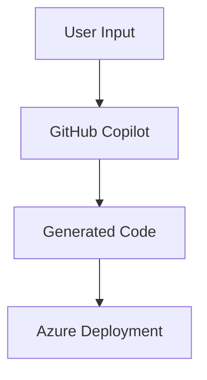

# 📘 Module Structure Template and Guidelines

## Overview

This document provides the standard template and guidelines for creating each of the 22 workshop modules. Each module follows a consistent structure to ensure a coherent learning experience.

## 📋 Module Directory Structure

```
module-XX-title/
├── README.md                    # Module overview and introduction
├── prerequisites.md             # Specific prerequisites for this module
├── learning-objectives.md       # Detailed learning outcomes
├── exercises/
│   ├── exercise1-easy/
│   │   ├── README.md           # Exercise instructions
│   │   ├── starter-code/       # Initial code templates
│   │   ├── solution/           # Complete solution
│   │   ├── tests/             # Automated tests
│   │   └── resources/         # Supporting files
│   ├── exercise2-medium/
│   │   └── [same structure]
│   └── exercise3-hard/
│       └── [same structure]
├── resources/
│   ├── templates/             # IaC templates (Terraform, Bicep)
│   ├── scripts/               # Setup and utility scripts
│   ├── diagrams/              # Architecture diagrams
│   └── sample-data/           # Test data and examples
├── labs/
│   ├── python/                # Python-specific implementations
│   └── dotnet/                # .NET-specific implementations
└── assessment/
    ├── quiz.md                # Knowledge check questions
    └── rubric.md              # Evaluation criteria
```

## 📝 Module README Template

```markdown
# Module [Number]: [Title]

## 🎯 Module Overview

[Brief description of what this module covers and why it's important in the context of AI-powered development]

### Duration
- **Total Time**: 3 hours
- **Lecture/Demo**: 45 minutes
- **Hands-on Exercises**: 2 hours 15 minutes

### Track
- [ ] Fundamentals (Modules 1-5)
- [ ] Intermediate (Modules 6-10)
- [ ] Advanced (Modules 11-15)
- [ ] Enterprise (Modules 16-21)

## 🎓 Learning Objectives

By the end of this module, you will be able to:

1. **[Primary Objective]** - [Specific, measurable outcome]
2. **[Secondary Objective]** - [Specific, measurable outcome]
3. **[Tertiary Objective]** - [Specific, measurable outcome]
4. **[Additional Objectives]** - [As needed]

## 🔧 Prerequisites

- Completed Modules: [List required modules]
- Technical Requirements: [Specific tools, accounts, or setup]
- Knowledge Requirements: [Concepts participant should understand]

See [prerequisites.md](prerequisites.md) for detailed setup instructions.

## 📚 Key Concepts

### Core Technologies
- **GitHub Copilot**: [Specific features used]
- **Azure Services**: [List of Azure services]
- **Additional Tools**: [Any other tools]

### Key Patterns
1. **[Pattern Name]**: [Brief description]
2. **[Pattern Name]**: [Brief description]
3. **[Pattern Name]**: [Brief description]

## 🏋️ Exercises

### Exercise 1: [Title] ⭐ (Easy - 30 minutes)
- **Objective**: [What participants will achieve]
- **Technologies**: [Specific tools used]
- **Key Learning**: [Main takeaway]

### Exercise 2: [Title] ⭐⭐ (Medium - 45 minutes)
- **Objective**: [What participants will achieve]
- **Technologies**: [Specific tools used]
- **Key Learning**: [Main takeaway]

### Exercise 3: [Title] ⭐⭐⭐ (Hard - 60 minutes)
- **Objective**: [What participants will achieve]
- **Technologies**: [Specific tools used]
- **Key Learning**: [Main takeaway]

## 🎯 Module Project

Build a complete [description] that demonstrates:
- [Requirement 1]
- [Requirement 2]
- [Requirement 3]

## 📊 Assessment Criteria

Your work will be evaluated based on:
1. **Functionality** (40%): Does it work as specified?
2. **Code Quality** (30%): Is it well-structured and maintainable?
3. **AI Utilization** (20%): Effective use of GitHub Copilot
4. **Documentation** (10%): Clear comments and documentation

## 🔗 Resources

### Documentation
- [Official Documentation Link]
- [Tutorial Link]
- [Best Practices Guide]

### Videos
- [Video Tutorial 1]
- [Video Tutorial 2]

### Additional Reading
- [Article/Blog Post]
- [Research Paper]

## ⏭️ Next Steps

After completing this module:
1. Review the assessment criteria
2. Complete the module quiz
3. Submit your project for review
4. Proceed to [Module X+1: Title]

## 🤝 Getting Help

- **GitHub Discussions**: [Link to module discussions]
- **Discord Channel**: #module-XX-help
- **Office Hours**: [Schedule]
- **Email Support**: module-XX@workshop.com
```

## 🎯 Exercise Template

```markdown
# Exercise [Number]: [Title]

## 🎯 Objective

[Clear statement of what participants will build/achieve in this exercise]

**Difficulty**: ⭐/⭐⭐/⭐⭐⭐ [Easy/Medium/Hard]
**Duration**: [X] minutes
**Track**: Python / .NET / Both

## 🏗️ What You'll Build

[Description of the final outcome with a visual diagram if applicable]



## 📋 Prerequisites

Before starting this exercise, ensure you have:
- [ ] Completed previous exercises in this module
- [ ] [Specific tool] installed and configured
- [ ] Access to [specific service/API]

## 🔧 Setup

1. **Clone the starter code:**
   ```bash
   git clone [repository-url]
   cd module-XX/exercises/exercise[N]-[difficulty]
   ```

2. **Install dependencies:**
   
   **Python:**
   ```bash
   pip install -r requirements.txt
   ```
   
   **.NET:**
   ```bash
   dotnet restore
   ```

3. **Configure environment:**
   ```bash
   cp .env.example .env
   # Edit .env with your credentials
   ```

## 📝 Instructions

### Part 1: [Section Title] (10 minutes)

1. **Step 1**: [Detailed instruction]
   
   💡 **Copilot Tip**: Use this prompt to get started:
   ```
   # Create a [specific component] that [does something]
   # Requirements:
   # - [Requirement 1]
   # - [Requirement 2]
   ```

2. **Step 2**: [Detailed instruction]
   
   **Expected Output:**
   ```python
   # Example of what should be generated
   def example_function():
       pass
   ```

### Part 2: [Section Title] (15 minutes)

[Continue with numbered steps...]

### Part 3: [Section Title] (20 minutes)

[Continue with numbered steps...]

## ✅ Validation

Run the following tests to ensure your implementation is correct:

```bash
# Python
pytest tests/test_exercise[N].py -v

# .NET
dotnet test
```

Expected output:
```
All tests passed! ✅
```

## 🚀 Deployment (Azure)

1. **Create Azure resources:**
   ```bash
   # Using provided Terraform template
   cd infrastructure
   terraform init
   terraform plan
   terraform apply
   ```

2. **Deploy your application:**
   ```bash
   # Using GitHub Actions
   git add .
   git commit -m "Complete exercise [N]"
   git push origin main
   ```

3. **Verify deployment:**
   - Navigate to Azure Portal
   - Check resource group: `rg-module-XX-exercise-N`
   - Test endpoint: `https://[your-app].azurewebsites.net`

## 🎯 Success Criteria

Your solution is complete when:
- [ ] All unit tests pass
- [ ] Code follows best practices (linting passes)
- [ ] Successfully deployed to Azure
- [ ] Meets performance requirements
- [ ] Documentation is complete

## 💡 Hints

<details>
<summary>Hint 1: Stuck on Part 1?</summary>

Try using this Copilot prompt:
```
# I need help with [specific problem]
# Context: [explain what you're trying to achieve]
```
</details>

<details>
<summary>Hint 2: Azure deployment issues?</summary>

Check these common issues:
1. Ensure your Azure subscription is active
2. Verify resource group permissions
3. Check GitHub Actions secrets
</details>

## 🎨 Bonus Challenges

If you finish early, try these additional challenges:

1. **Performance Optimization**: Improve response time by 50%
2. **Add Monitoring**: Implement Application Insights
3. **Enhanced Security**: Add Azure Key Vault integration
4. **Multi-region**: Deploy to multiple Azure regions

## 📚 Additional Resources

- [Specific Documentation]
- [Video Walkthrough]
- [Community Solutions]

## 🤝 Share Your Solution

1. Push your code to GitHub
2. Share in Discord: #module-XX-showcase
3. Get feedback from peers and instructors

---

**Completed?** Proceed to [Exercise N+1] or return to [Module Overview]
```

## 🧪 Test Structure Template

```python
# tests/test_exercise[N].py
import pytest
from src.main import YourMainClass

class TestExercise[N]:
    """Test suite for Exercise [N]"""
    
    def test_basic_functionality(self):
        """Test that basic requirements are met"""
        # Arrange
        instance = YourMainClass()
        
        # Act
        result = instance.process_data("test")
        
        # Assert
        assert result is not None
        assert result.status == "success"
    
    def test_error_handling(self):
        """Test proper error handling"""
        # Test implementation
        pass
    
    def test_performance(self):
        """Test performance requirements"""
        # Test implementation
        pass
    
    @pytest.mark.integration
    def test_azure_integration(self):
        """Test Azure service integration"""
        # Test implementation
        pass
```

## 🏗️ Infrastructure as Code Template

### Terraform Template (Azure)

```hcl
# infrastructure/main.tf
terraform {
  required_providers {
    azurerm = {
      source  = "hashicorp/azurerm"
      version = "~> 3.0"
    }
  }
}

provider "azurerm" {
  features {}
}

# Resource Group
resource "azurerm_resource_group" "module_rg" {
  name     = "rg-module-${var.module_number}-${var.environment}"
  location = var.location
}

# App Service Plan
resource "azurerm_service_plan" "app_plan" {
  name                = "plan-module-${var.module_number}"
  resource_group_name = azurerm_resource_group.module_rg.name
  location            = azurerm_resource_group.module_rg.location
  os_type             = "Linux"
  sku_name            = "B1"
}

# Web App
resource "azurerm_linux_web_app" "app" {
  name                = "app-module-${var.module_number}-${random_string.suffix.result}"
  resource_group_name = azurerm_resource_group.module_rg.name
  location            = azurerm_service_plan.app_plan.location
  service_plan_id     = azurerm_service_plan.app_plan.id

  site_config {
    application_stack {
      python_version = "3.11"
    }
  }

  app_settings = {
    "GITHUB_COPILOT_ENABLED" = "true"
    "ENVIRONMENT"            = var.environment
  }
}

# Random suffix for unique naming
resource "random_string" "suffix" {
  length  = 8
  special = false
  upper   = false
}

# Outputs
output "app_url" {
  value = azurerm_linux_web_app.app.default_hostname
}
```

### Bicep Template (Azure)

```bicep
// infrastructure/main.bicep
param location string = resourceGroup().location
param moduleNumber string
param environment string = 'dev'

// App Service Plan
resource appServicePlan 'Microsoft.Web/serverfarms@2022-03-01' = {
  name: 'plan-module-${moduleNumber}'
  location: location
  sku: {
    name: 'B1'
    tier: 'Basic'
  }
  kind: 'linux'
  properties: {
    reserved: true
  }
}

// Web App
resource webApp 'Microsoft.Web/sites@2022-03-01' = {
  name: 'app-module-${moduleNumber}-${uniqueString(resourceGroup().id)}'
  location: location
  properties: {
    serverFarmId: appServicePlan.id
    siteConfig: {
      linuxFxVersion: 'PYTHON|3.11'
      appSettings: [
        {
          name: 'GITHUB_COPILOT_ENABLED'
          value: 'true'
        }
        {
          name: 'ENVIRONMENT'
          value: environment
        }
      ]
    }
  }
}

// Output
output appUrl string = webApp.properties.defaultHostName
```

## 📊 Module Completion Checklist

Before considering a module complete, ensure:

### Content
- [ ] Module README follows template
- [ ] Prerequisites clearly documented
- [ ] Learning objectives are measurable
- [ ] All three exercises created (easy, medium, hard)

### Code
- [ ] Starter code provided for each exercise
- [ ] Complete solutions available
- [ ] Unit tests for validation
- [ ] Both Python and .NET implementations

### Infrastructure
- [ ] Terraform templates provided
- [ ] Bicep templates as alternative
- [ ] GitHub Actions workflows
- [ ] Resource cleanup scripts

### Documentation
- [ ] Step-by-step instructions
- [ ] Troubleshooting guide
- [ ] Architecture diagrams
- [ ] Video walkthroughs (optional)

### Quality Assurance
- [ ] Technical review completed
- [ ] Tested on fresh environment
- [ ] Performance benchmarks met
- [ ] Security best practices followed

## 🎨 Visual Elements

Each module should include:

1. **Architecture Diagrams** (Mermaid or draw.io)
2. **Flow Charts** for complex processes
3. **Screenshots** of expected outcomes
4. **GIF Recordings** for UI interactions
5. **Infographics** for concept explanation

